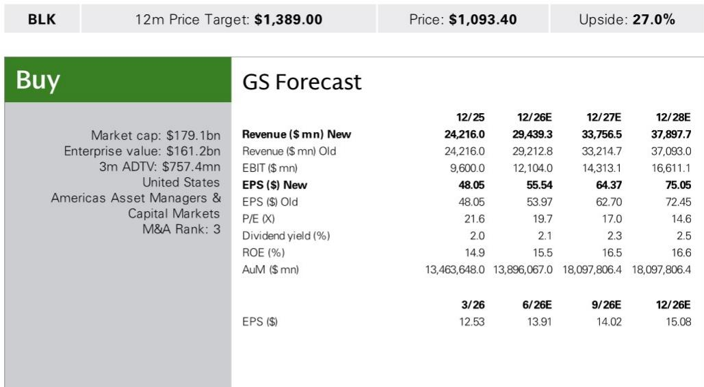
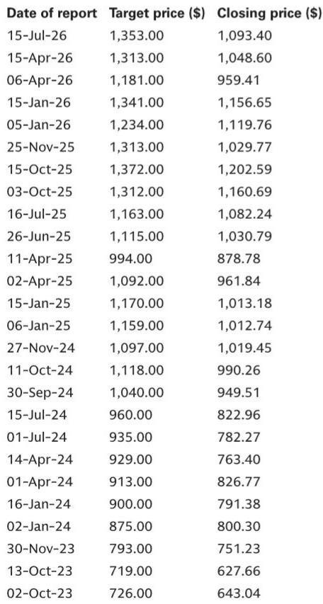
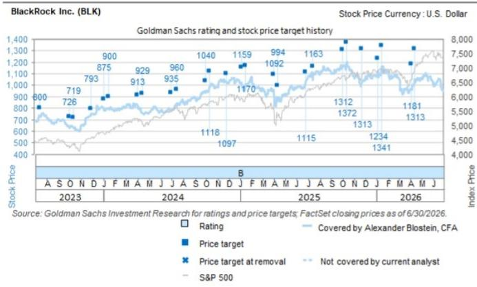

# GS：BlackRock Inc. (BLK.US) Strong Organic

贝莱德二季度业绩释放了一个被市场低估的信号：其运营利润率已回升至2021年以来最高水平，而管理层明确表示，当前约46%的利润率并非上限。GS在最新报告中上调了2026至2028年每股盈利预测，核心逻辑并非市场回暖，而是这家全球最大资管公司的业务结构正在发生实质性转变——更高费率的私募市场、系统化策略和科技业务占比持续提升，正在重塑其盈利能力和估值中枢。

报告认为，贝莱德有望在未来几年实现中双位数的每股盈利增长，而当前约18.5倍的远期市盈率，相较其历史均值仍有约5%的折价。若利润率扩张路径兑现，估值回归至约20倍的历史中枢并非难事。

## 1. 有机增长已超越目标，且管理层认为可持续

贝莱德二季度实现8%的有机基础费率增长，过去12个月累计达10%，均高于公司长期目标。驱动因素并非单一产品，而是ETF、系统化/税务优化策略和私募市场三大板块的同步扩张。

ETF业务依然是最大引擎，二季度净流入1780亿美元，其中主动型ETF贡献200亿美元，精准敞口ETF贡献150亿美元。值得注意的是，欧洲iShares年内净流入已达800亿美元，管理资产规模突破1.5万亿美元，背后是欧洲零售读者从银行存款向资本市场转移的结构性趋势。

GS预计，贝莱德未来几年有机基础费率增长将维持在7%至8%区间，这一判断建立在产品组合向高费率方向持续迁移的基础之上。

> **KC评论：** 市场通常将贝莱德视为低费率的被动管理巨头，但报告揭示的图景恰恰相反——增长最快的恰恰是主动ETF、私募市场和系统化策略这些高费率产品。读者需要重新审视其“规模换费率”的旧有叙事。

## 2. 利润率上限被打破，管理层给出明确信号

自GIP和HPS收购以来，利润率能否持续扩张一直是读者关注的焦点。二季度运营利润率45.9%（剔除业绩报酬后为46.5%），已接近2021年约47%的水平。但管理层传递的关键信息是：当前水平并非天花板。

逻辑在于，2021年贝莱德尚未形成当前规模的私募市场、系统化和SMA（单独管理账户）能力。随着这些高利润率业务占比提升，公司整体利润率结构正在上移。GS测算，到2028年运营利润率有望达到约48%，剔除业绩报酬后甚至接近50%，相当于年均扩张约150个基点。

管理层还给出了一个具体参照：公开市场另类管理人的平均FRE利润率（剔除业绩报酬）约为55%，贝莱德正朝着这个方向靠拢。

## 3. 私募市场与保险渠道形成新的增长闭环

私募市场二季度净流入150亿美元，其中私募信贷部署60亿美元，基础设施活动50亿美元。贝莱德重申了2030年4000亿美元的总募资目标，目前已完成220亿美元。

报告特别强调了保险渠道的潜力。贝莱德目前管理约8000亿美元的保险资产，管理层认为其中5%至10%可以转向私募市场，以换取高于国债150至350个基点的回报表现溢价。为实现这一转化，GIP和HPS正在加深在项目端的整合，尤其是在数字基础设施领域的大型融资项目上协同作业。

基础设施需求正处于一个多年代周期的早期阶段。超大规模数据中心运营商正从轻资产模式转向重资产模式，这意味着大量债务融资需求——贝莱德恰好拥有从项目发起、融资到保险资金对接的完整链条。

## 4. 估值折价有望收敛，但前提是增长叙事兑现

贝莱德当前约18.5倍的远期市盈率，相较标普500指数约有9%的折价，而历史均值仅为约2%的折价。GS认为，只要有机增长势头在未来一年持续，这一估值折价就有望收窄，隐含约27%的上行空间。但这一判断的关键前提是：利润率扩张路径不被打断，且市场环境维持正常水平。

> **KC评论：** 贝莱德估值折价的核心原因，是市场将其视为与市场贝塔高度相关的周期性资管公司。但报告试图证明，随着私募市场和科技收入占比在2030年超过30%，其盈利对市场波动的敏感性正在下降。如果这一逻辑被市场接受，估值体系的重估将不只是均值回归，而是结构性上移。

---

For informational purposes only. Portions may be generated,translated,summarized,or edited with AI assistance based on source materials and may contain omissions or errors. Please verify independently. This is not investment,legal,tax,accounting,or other professional advice.

For informational purposes only. Portions may be generated,translated,summarized,or edited with AI assistance based on source materials and may contain omissions or errors. Please verify independently. This is not investment,legal,tax,accounting,or other professional advice.

