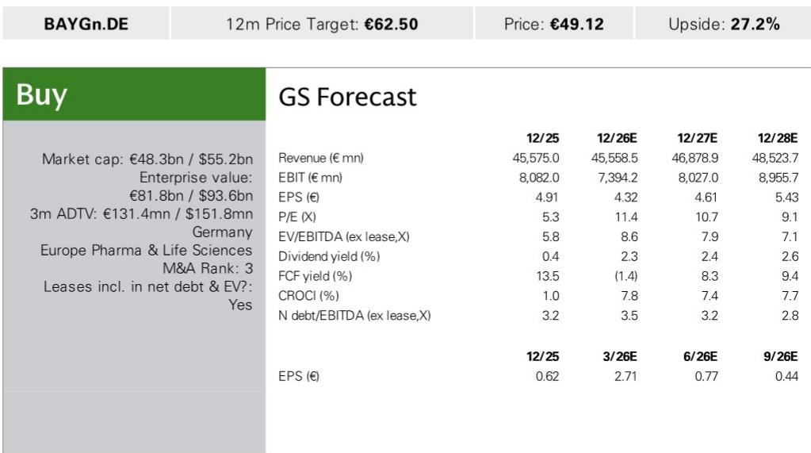
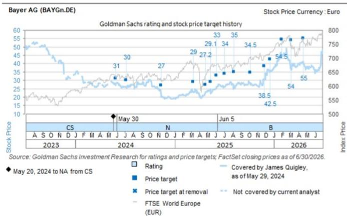

# GS：BayerAGBAYGn.DE

拜耳旗下慢性肾病药物Kerendia正在进入一个关键验证期。GS在近期举办的专题研讨会上，与拜耳产品团队、临床开发负责人及外部权威专家进行了深度交流，得出的核心判断是：市场对Kerendia的峰值销售预期可能过于保守。GS给出的峰值销售预测约为45亿欧元，而Visible Alpha共识预期仅为30亿欧元左右，两者之间存在约50%的差距。这一差异的核心来源，并非市场对现有数据的误读，而是对Kerendia在心力衰竭适应症上的潜在价值、以及竞争格局演变节奏的评估存在系统性偏差。

## 1. 适应症扩展是峰值销售预期差异的核心变量

Kerendia目前已在102个国家获批用于慢性肾病（CKD），并在46个国家获批用于心力衰竭。过去12个月，全球约有250万患者接受了Kerendia治疗。GS认为，基于当前约每患者400欧元年均收入推算，到2032年达到约900至1000万患者、对应45亿欧元峰值销售的目标，在6年半的时间窗口内是可行的。关键增量将来自两个尚未充分释放的领域：非糖尿病性CKD人群，以及射血分数降低的心力衰竭（HFrEF）患者。拜耳管理层对HFrEF试验的阳性结果表达了信心，并暗示可能在适当时机上调Kerendia的峰值销售指引。GS分析师也认为，已有的II期和III期亚组分析数据，为后续两项HFrEF注册试验提供了较强的正面信号。

> **KC评论：** 市场对Kerendia的定价可能主要基于已获批的CKD适应症，而将心衰适应症视为一个远期的、不确定性较高的期权。GS的分析恰恰相反，他们认为心衰适应症是当前预期差最大的部分，且数据读出时间（2027年）并非遥不可及。

## 2. 非糖尿病性CKD数据正在改变临床处方逻辑

外部专家（KOL）对Kerendia的快速渗透持乐观态度，其核心驱动力来自非糖尿病性CKD数据。FIND-CKD试验的结果支持Kerendia在多种CKD亚型中的使用，并可与已成为标准疗法的SGLT2抑制剂联用（CONFIDENCE试验已证实）。KOL特别指出，医生群体已经理解FIND-CKD试验中观察到的急性eGFR下降的机制原因，不认为这会阻碍临床采纳。一个值得借鉴的先例是SGLT2类药物：当其在非糖尿病人群中展现出心血管获益后，在CKD领域的处方量出现了显著加速。Kerendia在FIND-CKD数据公布后，有望复制这一路径。

## 3. 来自Baxfendy的竞争威胁被高估，时间窗口是关键

市场对Kerendia的另一个担忧是来自新一代药物Baxfendy（醛固酮合成酶抑制剂）的潜在竞争。GS的分析认为，这种担心中短期内被夸大了。Baxfendy目前处于III期临床，关键数据预计在2028至2029年读出，获批时间可能要到2029至2030年。这意味着，即使一切顺利，Baxfendy获得与Kerendia当前类似的完整标签，也需要大约四年时间。届时，距离Kerendia的专利到期（约2032年）已不足两年。考虑到心血管药物上市后需要较长时间进行医生教育和处方渗透，Baxfendy对Kerendia峰值销售的实质性冲击将非常有限。此外，两者作用机制重叠，高钾血症等安全性问题使得联合用药的可能性不大，这进一步巩固了Kerendia的先发优势。

## 4. 定价与支付优势构成Kerendia的护城河

在与另一款竞品Vanrafia（用于IgA肾病）的比较中，Kerendia展现出了显著的定价优势。Vanrafia的月标价约为14,291美元，而Kerendia仅为1,100美元。尽管两者在降低尿蛋白（UACR/UPCR）方面的疗效数据看起来相似（约35%对39%的降幅），但巨大的价格差异将使Kerendia在支付方和药品福利管理机构（PBM）面前拥有明显的量价优势。这一因素可能对诺华旗下Vanrafia的峰值销售预测（GS预测为12亿美元）构成节奏变化不确定性。

> **KC评论：** 在创新药定价日益敏感的宏观环境下，Kerendia的定价策略不仅是一个商业选择，更是一种竞争壁垒。它使得Kerendia在疗效相似的情况下，更容易获得医保覆盖和处方集优先地位，从而在真实世界中实现更快的渗透。

对于关注拜耳或慢性肾病治疗领域的决策者而言，GS这份报告提供了一个清晰的观察框架：Kerendia的价值不应仅由已获批的CKD适应症来定义，其心衰适应症的潜在增量、非糖尿病性CKD数据带来的处方加速、以及竞争格局中有利的时间窗口，共同构成了一个被市场低估的叙事。未来两年，FIND-CKD数据的临床转化速度，以及HFrEF试验的数据读出，将是验证这一判断的关键节点。

For informational purposes only. Portions may be generated,translated,summarized,or edited with AI assistance based on source materials and may contain omissions or errors. Please verify independently. This is not investment,legal,tax,accounting,or other professional advice.

For informational purposes only. Portions may be generated,translated,summarized,or edited with AI assistance based on source materials and may contain omissions or errors. Please verify independently. This is not investment,legal,tax,accounting,or other professional advice.

