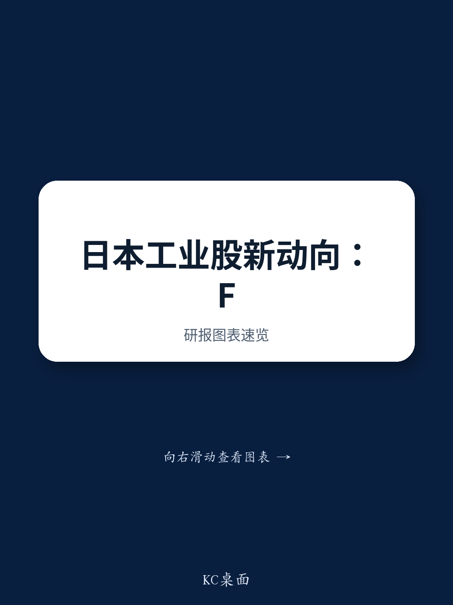

# Japan Industrials Enter a Pivotal Phase: The Cycle Debate Shifts from When Demand Peaks to Whether Companies Can Prove Pricing Power

The most revealing signal from a July 2026 investor roadshow in Hong Kong was not that investors agree the factory automation (FA) cycle remains strong. It was that interest in non-FA stocks, particularly aerospace and defense, has grown far more than anticipated, shifting from what was assumed to be a 90/10 split in favor of FA to a 70/30 ratio. This shift matters because it signals that the market is no longer treating the Japan industrials sector as a monolithic AI proxy. Investors are actively seeking differentiated narratives, and the debate has moved beyond top-down cycle timing into a company-specific scrutiny of execution, pricing, and cost pass-through. The next six months will separate the companies that can demonstrate genuine profit durability from those merely riding a cyclical wave.

The core tension now is straightforward. The supply-demand tightness in semiconductor-adjacent FA is widely acknowledged, with many investors seeing the current capex cycle extending through CY2027-2028 in line with wafer fab equipment (WFE) forecasts. Yet a parallel camp, noting that machine tool and FA cycles historically lead both the upswing and the downswing, expects a peak by end-2026. This disagreement is not academic. It determines whether current valuations are justified by sustainable earnings or are pricing in a temporary peak. The resolution will come not from macro forecasts but from micro evidence: whether companies can raise prices, maintain margins, and execute without operational hiccups.

What has changed most dramatically since mid-2026 is the market's focus on execution risk. Yaskawa Electric's first-quarter earnings miss, attributed to company-specific ERP system issues, has had an outsized impact on investor psychology. The company insisted the problems were not industry-wide, but the damage to confidence was real. Investors now understand that even in a buoyant demand environment, internal constraints—whether from legacy IT systems, lead time delays, or human resource bottlenecks—can derail revenue and margin realization. This quarter's earnings season will therefore be judged on a broader set of criteria than simply whether orders beat consensus. The market will scrutinize production constraints, cost structure changes, speculative demand from advance ordering, lead time extensions, and timelines for capacity expansion.

## The FA Cycle Debate Has Narrowed to a Single Question: Can Companies Demonstrate Pricing Power Before the Cycle Peaks?

The most important strategic question for FA investors is not whether demand is strong—it is. The question is whether companies can translate that tightness into higher unit prices and, critically, whether they can sustain peak-level margins once supply-demand conditions normalize. Many investors now recognize that this capex cycle is entering its peak phase, and the focus has shifted from tracking order volumes to watching pricing behavior. This is a subtle but crucial distinction. Volume-driven growth is inherently cyclical; pricing-driven growth, if structural, can support higher margins even as volumes moderate.

The expectation is that electrical and electronic FA companies are best positioned to demonstrate this pricing power, given their direct exposure to semiconductor and data center capex. Keyence's upcoming earnings, scheduled for release after July 28, will be the first major test of this thesis. The company's ability to show not just revenue growth but margin expansion driven by unit price improvement will set the tone for the entire subsector. If Keyence delivers on pricing, it will validate the bull case that this cycle is different—that structural demand from AI and advanced semiconductors has created genuine pricing leverage. If it does not, the market will likely conclude that even tight supply-demand conditions are insufficient to overcome competitive dynamics or customer resistance to price increases.

The underlying assumption driving the bull case is that the FA cycle driven primarily by semiconductors will remain sustainable through CY2027-2028. However, order trends in areas closer to general industry are expected to peak in CY2026, with machine tool orders turning slightly negative year-on-year by CY2027. This two-speed dynamic means that companies with heavy exposure to general industrial automation face a more challenging outlook than those focused on semiconductor and electronics end markets. Investors who treat all FA exposure as equivalent are likely to be disappointed. The divergence between semiconductor-driven and general-industry-driven FA will widen over the next 12 to 18 months, and stock selection will matter far more than sector allocation.

## Investor Interest in Aerospace and Defense Has Surged as a Non-AI Diversification Play, but the Preference Is for Turnarounds Over Quality

The most surprising finding from the Hong Kong roadshow was the degree of investor interest in aerospace and defense stocks as non-AI plays. The prevailing assumption had been that FA would dominate investor attention, given the market's AI-centric sentiment. Instead, roughly 30% of investor inquiries focused on aerospace and defense, reflecting a search for earnings growth visibility outside the tech-driven cycle. This shift has been accelerated by the sharp multiple contraction in AI-related stocks from their peak at the start of 2026 and the front-loading of capex sentiment into that year.

However, the nature of this interest is telling. Investors are not uniformly gravitating toward the highest-quality names in the subsector. Instead, they are showing stronger interest in turnaround stories and re-rating candidates. IHI, whose multiples have fallen sharply from their peak, attracted attention for its potential earnings recovery. Kawasaki Heavy Industries drew interest following its announcement of a share issuance and convertible bond issuance, suggesting investors see a catalyst in the balance sheet restructuring. This pattern indicates that the market is not simply rotating into defense as a safe haven; it is actively seeking value and idiosyncratic upside within the subsector.

The implication for investors is that a simple "defense" strategy is unlikely to generate alpha. The subsector contains companies with very different earnings trajectories, capital structures, and risk profiles. The highest-quality name, Mitsubishi Heavy Industries, remains the most likely to deliver the highest earnings growth with the greatest certainty through FY2027-2028, but its valuation already reflects that quality. The real upside may lie in smaller or mid-cap names such as Japan Steel Works, AeroEdge, and SKY Perfect JSAT, where investor attention is lower and the potential for earnings surprises is higher. The key is to distinguish between companies that offer genuine earnings growth visibility and those that simply benefit from thematic tailwinds without clear path to margin improvement.

## The Japan Steel Works Medium-Term Plan Update Reveals a Critical Disconnect Between Management Guidance and Investor Expectations on Pricing

Japan Steel Works' update to its medium-term plan, JGP2028, provides a textbook example of how the pricing debate is playing out in practice. The company raised its segment operating profit target for the material and engineering business from ¥8 billion (15% operating margin) to ¥16 billion (20% operating margin) for FY3/29, citing intensified supply-demand tightness for critical components used in gas turbines and nuclear power. At face value, this is a substantial upward revision. Yet the prevailing investor reaction was one of mild disappointment.

The reason for this disconnect is instructive. Bloomberg consensus had already reached a similar profit level based on growing expectations for higher shipment volumes. The company's guidance did not surprise on the upside because the market had already priced in volume-driven growth. What investors wanted to see was evidence of pricing power—specifically, unit price improvement for large components and successful pass-through of fixed cost increases. The company's FY3/27 guidance of ¥9.5 billion (16% operating margin) implied a temporary decline in profitability from the FY3/26 actual of approximately ¥8.9 billion (19% operating margin), which the company attributed to front-loaded increases in fixed costs. While this explanation was understandable, it did not reassure investors that pricing power was materializing.

The critical question going forward is whether the company's 20% operating margin target for FY3/29 is conservative or aggressive. The evidence suggests it is conservative. The target still incorporates cautious assumptions for the pass-through of fixed cost increases and unit price improvement driven by supply-demand tightness. Meaningful upside potential remains if the company can demonstrate that pricing is accelerating. However, the risk is that front-loaded fixed cost increases will continue not only in FY3/27 but through FY3/29 as well, potentially pushing back the timing of a full-fledged profitability recovery. Investors must therefore monitor not just the headline profit numbers but the cadence of margin improvement and the evidence of pricing traction in each quarterly report.

## A Decision Framework for the Next Six Months: Focus on Pricing Evidence, Execution Quality, and Cycle Positioning

For investors navigating the Japan industrials sector through the remainder of 2026, the following decision framework can help separate winners from laggards.

First, assess pricing power as the primary leading indicator. The most important data point in the coming months will not be order volumes but unit price trends. Companies that can demonstrate price increases in response to supply-demand tightness are signaling that their margins are structurally improving, not just cyclically expanding. Focus on companies where pricing is explicit and measurable—through average selling price data, segment margin disclosure, or management commentary on contract terms. Companies that rely solely on volume growth to drive earnings are more vulnerable to a cycle peak.

Second, evaluate execution risk with a new level of granularity. Yaskawa's ERP issue was a reminder that even strong demand cannot compensate for operational failures. For each company, assess the following: Are there any production or procurement constraints that could limit revenue? Has the cost structure changed, including labor and fixed costs? Is there evidence of speculative demand from customers placing advance orders due to lead time extensions? When will supply capacity be expanded, potentially easing the current tightness? Companies that score well on all five dimensions are far more likely to deliver earnings that meet or exceed expectations.

Third, position for the two-speed cycle. Semiconductor-driven FA is likely to remain strong through CY2027-2028, but general-industry FA and machine tools will likely peak earlier. Investors should focus on companies with direct exposure to semiconductor and data center capex and be cautious of those reliant on general industrial demand. Within aerospace and defense, the opportunity lies in turnaround stories and mid-cap names where earnings growth visibility is high but valuation multiples have not yet re-rated.

Fourth, treat management guidance with skepticism when it comes to pricing assumptions. Japan Steel Works' experience shows that even substantial upward revisions can disappoint if the market has already priced in volume-driven growth. The real opportunity lies in companies that beat expectations on pricing, not just on volume. This means looking for companies where management guidance for margins appears conservative relative to the supply-demand backdrop, and where there is evidence that pricing is accelerating faster than the company is willing to forecast.

The next earnings season will be the most consequential for Japan industrials in several years. It will determine whether the sector can sustain its valuation premium by demonstrating that this cycle is different—that pricing power and structural demand from AI and advanced semiconductors have created a more durable earnings profile than in past cycles. Companies that can prove their pricing power and execution capability will emerge as long-term winners. Those that cannot will be exposed as cyclical plays, vulnerable to the inevitable moderation in demand.

*For informational purposes only. Portions may be generated, translated, summarized, or edited with AI assistance based on source materials and may contain omissions or errors. Please verify independently. This is not investment, legal, tax, accounting, or other professional advice.*

For informational purposes only. Portions may be generated, translated, summarized, or edited with AI assistance based on source materials and may contain omissions or errors. Please verify independently. This is not investment, legal, tax, accounting, or other professional advice.

