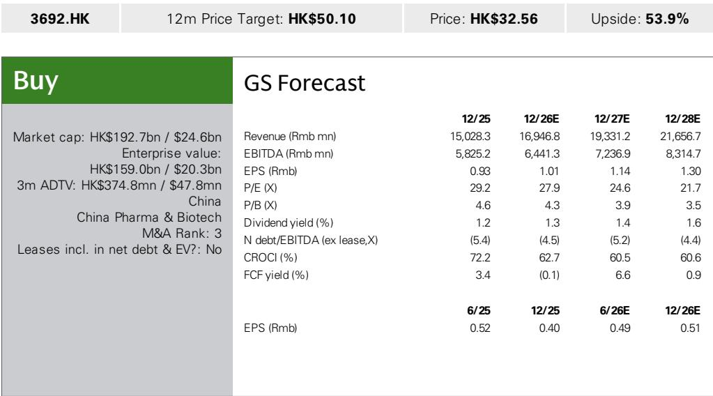
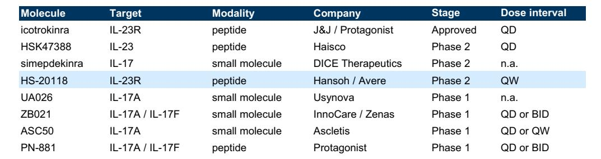

# Hansoh’s NewCo-and-Merger Deal for Oral IL-23 Signals a Structural Shift in How Chinese Biotech Captures Global Value

Hansoh Pharma’s out-licensing of its oral IL-23 receptor antagonist, HS-20118, through a NewCo structure that simultaneously merges with a Nasdaq-listed operating biotech represents more than a single transaction. It is a template for how leading Chinese drug developers can retain material equity upside while accessing U.S. capital markets and clinical infrastructure. The deal, which includes a $120 million upfront payment, up to $2.18 billion in milestones, and mid-single to low-double digit royalties, is notable not for its headline terms but for the architecture that surrounds them. Avere Therapeutics, the NewCo established in 2025 by Hansoh and financial investors, completed a $320 million private financing led by Fairmount and then agreed to merge with NextCure, a Nasdaq-listed biotech with its own oncology pipeline including CDH6 and B7-H4 ADC programs. The result: Hansoh is expected to hold a 30-40% equity stake in the combined company, giving it enduring exposure to the value creation trajectory of HS-20118 rather than a one-time licensing fee.

This transaction structure matters because it addresses a fundamental tension in cross-border biotech licensing. Traditional out-licensing deals cap the originator’s upside at the royalty stream, which is often back-end loaded and subject to development risk that the originator cannot influence. By taking a significant equity position in the vehicle that will develop and commercialize the asset, Hansoh aligns its incentives with the NewCo’s success while retaining the ability to benefit from positive clinical data, regulatory outcomes, and commercial execution. The merger with NextCure further differentiates this approach from the cash-shell NewCo transactions that have become common among Chinese biotechs. NextCure is an operating company with its own pipeline, not a blank-check vehicle. That distinction has implications for regulatory scrutiny, investor perception, and the strategic flexibility of the combined entity.

The timing of this deal is also instructive. Hansoh’s management has publicly stated a target of one to two business development transactions annually, and the company has consistently delivered on that objective since 2023. This is not a one-off opportunistic move. It reflects a deliberate strategy to use the company’s pipeline as a platform for value creation through structured partnerships, not just as a source of near-term licensing income. For those evaluating Hansoh, the question shifts from whether the company can generate BD deals to how effectively it can execute this hybrid model across multiple assets.

## The Oral IL-23 Opportunity Is Real but Requires More Than Convenience to Displace Injectable Biologics

The therapeutic rationale for an oral IL-23 inhibitor is straightforward: patients with psoriasis and other inflammatory conditions prefer oral medications over injectable biologics, and improving convenience could expand the addressable market. HS-20118’s once-weekly dosing, supported by an approximately 100-hour half-life, is a clear differentiator within the oral IL-23 category. The first-generation oral IL-23 inhibitor, icotrokinra from Johnson & Johnson, is dosed once daily. A once-weekly oral option would represent a meaningful step forward in patient compliance and lifestyle integration.

But convenience alone will not determine the commercial trajectory of this drug class. The available Phase 3 data for icotrokinra, which serves as the benchmark for the oral IL-23 category, show PASI90 rates of 50% at Week 16. In cross-trial comparisons, injectable IL-23 and IL-17 biologics have historically reported PASI90 rates of roughly 70-80% in pivotal studies. That gap is substantial. Patients and prescribers will weigh the trade-off between the convenience of an oral pill and the superior efficacy of an injection. For HS-20118 specifically, the once-weekly profile and long half-life may provide differentiation within the oral IL-23 category, but the available clinical data are still early-stage. The asset is in Phase 2, and its competitive positioning will depend on the magnitude of efficacy it can demonstrate relative to icotrokinra and, ultimately, relative to injectable standards.

This dynamic creates a strategic imperative for the NewCo. Avere, through its merger with NextCure, will need to design a clinical development program that does more than replicate icotrokinra’s data. It must generate evidence that HS-20118 can achieve PASI90 rates that narrow the gap with injectable biologics, or that the convenience advantage is so pronounced that a moderate efficacy delta is acceptable to patients and payers. The latter scenario is plausible but unproven. The psoriasis market has historically rewarded drugs that achieve high rates of complete skin clearance, not just adequate control. The bar for oral IL-23 therapies is therefore higher than the bar for first-generation oral drugs in other therapeutic areas.

## The NewCo-and-Merger Structure Creates a Decision Framework for Evaluating Chinese Biotech BD Deals

For observers tracking Chinese biotech, the Hansoh-Avere-NextCure transaction provides a replicable framework for assessing the quality and value of cross-border deals. The framework rests on three dimensions: structural alignment, asset competitiveness, and regulatory pathway.

Structural alignment refers to the degree to which the originator retains upside beyond royalties. In the Hansoh deal, the 30-40% equity stake is the critical variable. A lower equity stake would imply less conviction or less bargaining power. A higher stake would signal that the originator expects the asset to drive substantial value creation. Observers should compare the equity stake against the upfront payment, milestone structure, and royalty rates to assess whether the deal is balanced or skewed toward near-term cash. In this case, the $120 million upfront is meaningful but not outsized relative to comparable transactions. The equity stake is the real prize.

Asset competitiveness requires a clear-eyed assessment of the drug’s clinical profile relative to both the current standard of care and the competitive pipeline. For HS-20118, the key comparison is not just against icotrokinra but against the broader landscape of oral IL-23 and IL-17 drugs in development. The competitive field includes Haisco’s HSK47388 (once-daily oral IL-23 peptide, Phase 2), DICE Therapeutics’ simepdekinra (oral IL-17 small molecule, Phase 2), and InnoCare/Zenas’ ZB021 (oral IL-17A/IL-17F small molecule, Phase 1), among others. HS-20118’s once-weekly dosing is a potential advantage, but it is not a moat. Other assets could adopt similar dosing regimens as they advance. The durability of response, safety profile, and convenience of formulation will all matter.

Regulatory pathway considerations include both the standard FDA and EMA review processes and the additional scrutiny that may arise from the transaction structure itself. Given Hansoh’s expected 30-40% ownership position in the combined company, potential regulatory review under CFIUS or similar frameworks is a real possibility. The scope, timing, and outcome of any such review are unclear, and the transaction documents likely include provisions to address this risk. But observers should not dismiss it as a formality. Cross-border transactions involving Chinese entities and U.S. capital markets have faced increasing scrutiny, and the fact that NextCure is an operating biotech with its own pipeline may complicate or simplify the review depending on the specific assets and technologies involved.

## The Transaction Highlights a Broader Strategic Shift in How Chinese Biotech Captures Global Value

The Hansoh deal is part of a pattern that is reshaping the relationship between Chinese drug developers and global markets. Traditional models—out-licensing for royalties, joint ventures, or direct development through U.S. subsidiaries—each have limitations. Out-licensing caps upside. Joint ventures require ongoing operational commitment. Direct development demands capital and infrastructure that many Chinese biotechs lack. The NewCo-and-merger structure solves for all three constraints. It provides capital, operational infrastructure, and a public listing vehicle while allowing the originator to retain significant equity exposure.

This model is particularly well-suited for assets that have strong preclinical or early clinical data but require substantial investment to complete late-stage development and commercialization. Oral IL-23 is exactly that kind of opportunity. The target is validated. The oral modality has a clear patient preference advantage. But the clinical and commercial path requires a multi-year, multi-hundred-million-dollar investment that a single Chinese biotech may not want to shoulder alone. By structuring the deal as a NewCo with a merger pathway, Hansoh de-risks its balance sheet while maintaining strategic control over the asset’s future.

For other Chinese biotechs evaluating their pipeline, this transaction offers a clear benchmark. The key question is not whether a deal can be done, but whether the asset is differentiated enough to attract the kind of financial and strategic partners that make this structure viable. Hansoh’s track record of consistent BD execution since 2023 suggests that the company has built the internal capabilities to identify, negotiate, and close these complex transactions. That capability is itself a competitive advantage, separate from the quality of any single asset.

The ultimate test will be clinical. HS-20118 must deliver data that justifies the structure that has been built around it. If Phase 2 results confirm a differentiated efficacy and safety profile, the Avere-NextCure combination will have a strong foundation for Phase 3 and commercialization. If the data are merely comparable to icotrokinra, the equity stake will be worth less, and the NewCo structure will have been an elegant solution to a modest problem. Either way, the transaction has already demonstrated that the playbook for Chinese biotech globalization is evolving, and Hansoh is writing the next chapter.

*For informational purposes only. Portions may be generated, translated, summarized, or edited with AI assistance based on source materials and may contain omissions or errors. Please verify independently. This is not investment, legal, tax, accounting, or other professional advice.*

For informational purposes only. Portions may be generated, translated, summarized, or edited with AI assistance based on source materials and may contain omissions or errors. Please verify independently. This is not investment, legal, tax, accounting, or other professional advice.

