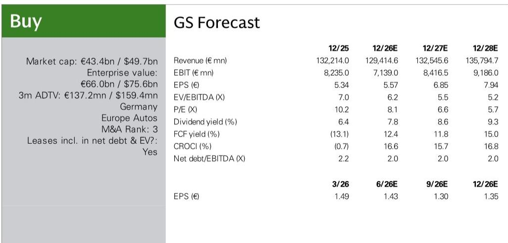
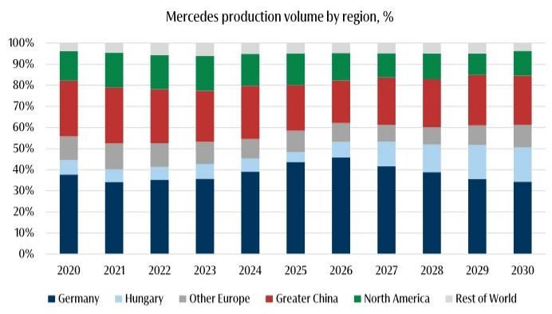
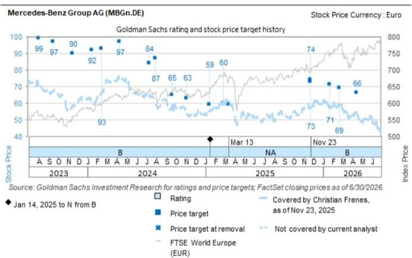

# GS：奔驰集团AG.DE，凯奇凯梅特工厂扩建之行-降本进行时

2026年7月，GS分析师团队参加了梅赛德斯-奔驰匈牙利凯奇凯梅特工厂的扩建开幕仪式。这座工厂经过约10亿欧元投入后，年产能弹性较高至约40万辆，成为奔驰在欧洲最大的生产基地，也是全球最大的之一。匈牙利总理和财政部长亲自出席，足见该工厂对当地汽车产业链的重要性。

但GS这份报告真正值得关注的，不是产能数字本身，而是奔驰管理层在活动上披露的一套降本路线图。它揭示了这家德国豪华车企正在进行的结构性调整：生产重心东移、数字化深度嵌入制造流程，以及人形机器人从概念走向产线的时间表。

## 1. 匈牙利工厂的要素成本比德国低约70%，东移已从整车延伸至动力总成

GS报告明确指出，凯奇凯梅特工厂的要素成本比德国低约70%。这一差距来自更低的薪资、更长的工作时间，以及显著更低的病假率。加上稳定的政策环境、靠近欧盟市场以及成熟的供应商基础，匈牙利成为奔驰东移战略的核心支点。

值得注意的是，这种东移已不再局限于整车组装。报告提到，奔驰正在将动力总成和零部件生产也向东欧转移，罗马尼亚就是一个例子。即便如此，凯奇凯梅特工厂与德国的拉施塔特工厂和不来梅工厂保持着紧密协作，形成一个灵活的生产网络——产能可以根据需求在不同工厂之间调配。

> **KC评论：** 要素成本差异是硬数字，但更关键的是“灵活生产网络”这个设计。它意味着奔驰可以在不关闭德国工厂的前提下，将增量产能和部分存量产能转移到成本更低的地方，同时保留德国工厂在高质量车型和国防业务上的战略价值。

## 2. 全球产能目标已下调至200-220万辆，中国和德国是主要调整区域

GS报告披露了奔驰管理层的产能规划：2026年目标240万辆，中期（约2028年）降至200-220万辆。管理层认为，“世界车”概念可能已不再适应当前环境，生产正变得越来越区域化。奔驰设定了本地化生产目标：欧洲和中国超过85%，美国力争超过50%。

这意味着，在需求波动加剧的背景下，奔驰选择主动调整产能规模，而非维持高产能利用率。中国和德国是调整幅度最大的两个市场。德国虽然保留了高质量车型生产和国防业务等战略功能，但整体产量占比将持续下降。

## 3. 数字孪生和人形机器人是降本的下一个杠杆，但时间表仍偏谨慎

凯奇凯梅特工厂是奔驰首个部署完整数字工厂孪生的生产基地，基于NVIDIA Omniverse平台构建，叠加MO360生态系统和视觉系统，实现实时摄像头质量检测。管理层描述了一个“AI优先”的生产流程，将采购、生产和销售数据打通，以便更早发现需求变化并指导供应商。

更具前瞻性的是人形机器人合作。奔驰与Apptronik合作开发的Apollo机器人，目前处于训练阶段，计划2026年底在辛德芬根工厂进行生产试点，中期实现系列集成。但报告也明确提到，这取决于安全、法规和劳资委员会的协调。Apptronik CEO强调，与奔驰的合作建立在后者“最先进的工业制造能力”之上。

> **KC评论：** 人形机器人的时间表比市场预期更保守——2026年底才试点，而非大规模部署。但奔驰的角色定位值得注意：它不依赖单一硬件或软件供应商，而是保持可选性，同时贡献工业知识和安全监管经验。这更像一个平台化策略，而非简单的采购关系。

## 4. 一个可复用的观察框架：从要素成本、产能弹性到技术杠杆

GS这份报告提供了一个观察传统车企转型的框架：第一层是要素成本套利，即把生产转移到成本更低的地方；第二层是产能弹性管理，即通过灵活网络和区域化布局应对需求波动；第三层是技术杠杆，即通过数字孪生和人形机器人提升自动化率和质量管控能力。

这三个层次并非线性推进，而是并行展开。奔驰在匈牙利工厂同时实现了要素成本优势、产能弹性（与德国工厂联动）和技术升级（数字孪生和AI质检）。对于关注制造业迁移和工业自动化的读者，这个框架可以用于评估其他车企或工业企业的转型进度。

For informational purposes only. Portions may be generated,translated,summarized,or edited with AI assistance based on source materials and may contain omissions or errors. Please verify independently. This is not investment,legal,tax,accounting,or other professional advice.

For informational purposes only. Portions may be generated,translated,summarized,or edited with AI assistance based on source materials and may contain omissions or errors. Please verify independently. This is not investment,legal,tax,accounting,or other professional advice.

