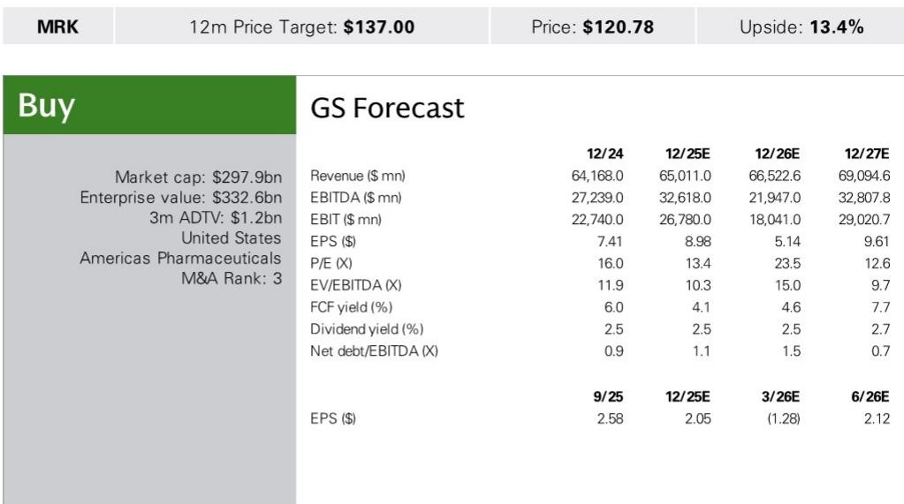
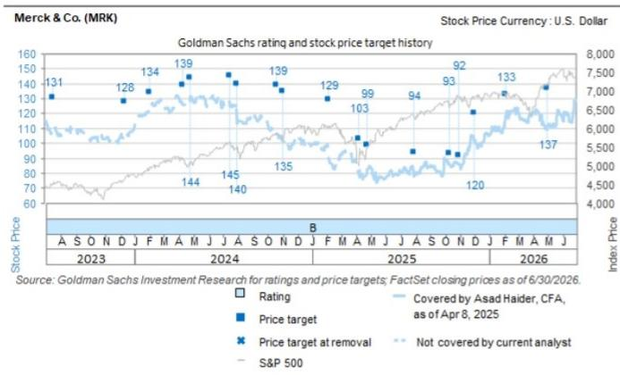

# GS：MRK与US与TMTMerckCo.-.

默沙东的合作伙伴科伦博泰，在 7 月 14 日夜间公布了 OptiTROP-Lung06 的 III 期阳性结果。这项针对一线非鳞状非小细胞肺癌、PD-L1 TPS 小于 1% 人群的研究，在预设中期分析中达到了无进展生存期的主要终点。GS认为，这一结果直接回应了市场对默沙东在 PD-L1 低表达人群策略的核心关注。

与标准疗法（Keytruda 联合化疗）的头对头比较中，sac-TMT 联合 Keytruda 方案不仅显著延长了 PFS，还观察到总生存期的积极趋势。这是继 OptiTROP-Lung05 在 ASCO 2026 公布阳性结果后，sac-TMT 在中国取得的又一次 III 期成功。更关键的是，Lung06 提供了 sac-TMT 联合 Keytruda 优于 Keytruda 联合化疗的直接证据——而 Lung05 的对照组仅是 Keytruda 单药。

## 1. 低表达人群的空白，被一项中国 III 期填补

PD-L1 TPS 小于 50% 的人群，一直是默沙东在肺癌领域需要回答的问题。GS在之前的会议上曾指出，公司对这一人群的策略尚未明确。现在，OptiTROP-Lung06 提供了关键的降不确定性输入。这项试验直接证明，在 PD-L1 表达最低的患者群体中，sac-TMT 联合 Keytruda 能带来临床获益。对于默沙东而言，这意味着其核心产品 Keytruda 在肺癌领域的护城河，有了一个更明确的延伸方向。

> **KC 评论：** 市场此前对 sac-TMT 的担忧，部分集中在它能否在 Keytruda 较强势的领域之外证明自己。Lung06 的结果表明，它可能不是替代 Keytruda，而是帮助 Keytruda 覆盖它自己覆盖不到的人群。

## 2. 头对头设计，让证据层级更高

Lung06 与 Lung05 最本质的区别在于对照组的选择。Lung05 的对照组是 Keytruda 单药，这在 PD-L1 高表达人群中是标准方案。但 Lung06 的对照组是 Keytruda 联合化疗，这是 PD-L1 低表达人群的当前标准治疗。能够在这种头对头设计中胜出，意味着 sac-TMT 方案不仅优于单药，还优于现有的联合化疗方案。GS强调，这为 sac-TMT 在全球注册和临床推广提供了更扎实的证据基础。

## 3. 下一个观察窗口在 ESMO 和外部数据

GS指出，接下来需要关注两个时间点。首先是今年 10 月的 ESMO 会议，科伦博泰将在那里公布 Lung06 的定量数据细节。其次是外部竞争格局的演变，包括 Summit Therapeutics 的 Harmoni-3 试验和 AstraZeneca 的 AVANZAR 试验，它们都在一线非小细胞肺癌领域探索新的联合方案。这些外部数据将帮助市场判断 sac-TMT 在更广泛竞争中的定位。

对于默沙东而言，sac-TMT 的临床不确定性正在逐步解除。但真正的商业化价值，还需要等待全球注册路径和定价策略的明确。

For informational purposes only. Portions may be generated,translated,summarized,or edited with AI assistance based on source materials and may contain omissions or errors. Please verify independently. This is not investment,legal,tax,accounting,or other professional advice.

For informational purposes only. Portions may be generated,translated,summarized,or edited with AI assistance based on source materials and may contain omissions or errors. Please verify independently. This is not investment,legal,tax,accounting,or other professional advice.

