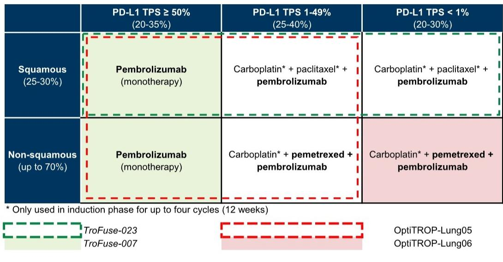

# 科伦博泰 (6990.HK): Lung06 达到主要终点；进一步验证 sac-TMT 作为 1L NSCLC 的基础疗法

**OptiTROP-Lung06 宣布 PFS 优效性**：7月15日，科伦博泰宣布中国 III 期 OptiTROP-Lung06 试验（1L nsq-NSCLC，PD-L1 TPS<1%）的阳性顶线结果，达到主要终点（PFS）。在与标准疗法（帕博利珠单抗联合培美曲塞/铂类）的头对头比较中，sac-TMT/帕博利珠单抗联合疗法显示出显著延长的 PFS 和积极的 OS 趋势，以及可控的安全性特征，未发现新的安全性问题。OptiTROP-Lung06 的阳性顶线结果标志着继 OptiTROP-Lung05（在 ASCO2026 上公布的 PD-L1 TPS≥1% 的 1L NSCLC 中 PFS HR 为 0.35）树立标杆之后，在 1L NSCLC 领域的又一次重要的中国 III 期成功，更重要的是，它提供了 sac-TMT/帕博利珠单抗联合疗法优于帕博利珠单抗/化疗联合疗法的直接证据（与使用帕博利珠单抗单药作为对照组的 Lung05 试验相比）。

**关注 ESMO 数据细节，重申 9-12 个月 PFS 预期**：随着阳性顶线结果的公布，我们预计详细数据将在即将召开的学术会议上分享，注意到管理层正在考虑 ESMO LBA 投稿。我们重申此前对 Lung06 的 9-12 个月 PFS 预期，基于：1) 中国 II 期 OptiTROP-Lung01 试验显示，在 TPS<1% 亚组中，sac-TMT/A167 联合疗法的 PFS 为 12.4 个月；2) 来自 Lung05 试验的增量信息，我们估计 sac-TMT/帕博利珠单抗联合疗法在 PD-L1 TPS 1-49% 亚组中的中位 PFS 为 13-15 个月，但需要注意的是，由于 PD-L1 表达水平较低，TPS<1% 亚组预期的生存获益时间较短。

Ziyi Chen  
+852-2978-0526 | ziyi.chen@gs.com  
GS (Asia) L.L.C.

**人群**：我们认为 OptiTROP-Lung06 是覆盖 sac-TMT 在 1L NSCLC 中应用的关键一环，市场持续讨论 MRK 是否会启动（以及如何启动）针对 KEYNOTE-189 人群（1L NSCLC 中帕博利珠单抗+化疗，无论 TPS 水平，约 40% TPS<1%）的全球 III 期试验，核心争论点在于 sac-TMT/IO 联合疗法相对于帕博利珠单抗/化疗联合疗法在 1L NSCLC 中的优效性程度，以便在全球 III 期头对头试验中确保显著的生存优效性。我们认为 Lung05/06 试验的阳性结果是该讨论的逐步风险降低步骤，具体包括：1) 来自 Lung05 数据的间接启示，特别是 sac-TMT/帕博利珠单抗联合疗法在 PD-L1 TPS 1-49% 亚组中观察到的强劲 PFS（相对于帕博利珠单抗单药的 HR 为 0.28），提示中位 PFS 为 13-15 个月，与帕博利珠单抗/化疗双药联合疗法历史数据的中位 PFS 范围 7-9 个月相比，似乎有利于达到统计学显著性；2) 即将在 ESMO 上公布的 Lung06 详细数据将提供 sac-TMT/帕博利珠单抗联合疗法相对于帕博利珠单抗/化疗的直接头对头优效性证据。

## 针对 KEYNOTE-189 的全球临床计划的另一个关键风险降低步骤

Linhai Zhao, Ph.D. +852-3966-4059 | linhai.zhao@gs.com GS (Asia) L.L.C.

回顾科伦博泰管理层曾分享，针对 PD-L1 1-49% 人群的 sac-TMT 全球 III 期试验是一个关于使用 PD-1 还是 PD-1/VEGF 作为联合伙伴的问题，我们预计随着 Lung06 详细数据的公布，针对 KEYNOTE-189 人群的潜在全球 III 期试验将有更多讨论。

**图表 1：我们预计 OptiTROP-Lung05/06 数据是 1L NSCLC 全球 III 期试验的关键风险降低步骤，重点关注 PD-L1 1-49% 组**
1L NSCLC 当前标准疗法及 sac-TMT III 期试验布局  
  
来源：NCCN 指南

**估值与目标价调整**：我们将 12 个月目标价调整为 582.95 港元（此前为 561.40 港元），基于风险调整后的 DCF 方法。我们将 2027E-28E 每股收益从 7.49/14.32 元人民币调整为 7.51/14.46 元人民币，以反映对 1L NSCLC 的增强观点，具体包括：1) Lung06 的成功概率从 81% 提高至 90%；2) 中国以外地区 1L NSCLC PD-L1 TPS <50% 的成功概率从 54% 提高至 63%。

科伦博泰是一家临床阶段的生物科技公司，专注于为全球患者开发及商业化差异化的抗体药物偶联物。我们认为科伦博泰已做好充分准备，有望成长为一家有影响力的全球性 ADC 企业，凭借：1) 差异化的后期 ADC 管线；2) 深厚的研发专长推动管线扩展；3) 与 MSD（3 个临床阶段和 4 个临床前资产，MSD 为高质量股东）在全球市场准入方面的广泛合作，以及与科伦药业（母公司）在中国商业化方面的合作。我们预计 SKB264 (TROP2 ADC) 将成为科伦博泰未来增长的关键驱动力，原因在于：1) TROP2 过表达的广泛适应症范围；2) SKB264 独特的设计可能带来优于同类 TROP2 ADC 的临床获益，早期数据已显示出积极信号；3) 充分利用 MSD 在全球市场的专业知识和网络推动临床开发和商业化。我们给予报告评级。主要风险：1) 开发新适应症和未来 ADC 的研发风险；2) ADC 领域竞争日益激烈；3) 有限的商业化生产和销售记录；4) 人才竞争挑战；5) 合作中的联盟风险。

我们对科伦博泰给予报告评级。我们的 12 个月目标价 582.95 港元基于风险调整后的 DCF 方法，假设：1) 折现率 11%；2) 终值增长率 3%；3) 基于行业不同阶段平均成功率并根据现有临床数据调整的成功概率。主要风险：1) 开发新适应症和未来 ADC 的研发风险；2) ADC 领域竞争日益激烈；3) 有限的商业化生产和销售记录；4) 人才竞争挑战；5) 合作中的联盟风险。

<table><tr><td>6990.HK</td><td colspan="2">12个月目标价：582.95港元</td><td colspan="2">股价：498.20港元</td><td colspan="2">上行空间：17.0%</td></tr><tr><td colspan="2">买入</td><td colspan="5">GS预测</td></tr><tr><td colspan="2"></td><td></td><td>12/25</td><td>12/26E</td><td>12/27E</td><td>12/28E</td></tr><tr><td rowspan="11" colspan="2">市值：1149亿港元 / 147亿美元 企业价值：1113亿港元 / 142亿美元 3个月日均交易量：4.489亿港元 / 5730万美元 中国 中国医药与生物科技 M&A 排名：3 租赁包含在净债务及企业价值中：是</td><td>收入（百万元人民币）新</td><td>2,057.9</td><td>3,111.1</td><td>5,447.6</td><td>7,907.2</td></tr><tr><td>收入（百万元人民币）旧</td><td>2,057.9</td><td>3,111.1</td><td>5,437.3</td><td>7,855.6</td></tr><tr><td>EBITDA（百万元人民币）</td><td>(435.3)</td><td>356.9</td><td>2,069.6</td><td>3,951.9</td></tr><tr><td>每股收益（港元）新</td><td>(1.66)</td><td>1.39</td><td>7.51</td><td>14.46</td></tr><tr><td>每股收益（港元）旧</td><td>(1.66)</td><td>1.39</td><td>7.49</td><td>14.32</td></tr><tr><td>市盈率（倍）</td><td>NM</td><td>NM</td><td>66.3</td><td>34.5</td></tr><tr><td>市净率（倍）</td><td>15.4</td><td>18.3</td><td>13.4</td><td>9.0</td></tr><tr><td>股息回报表现（%）</td><td>0.0</td><td>0.0</td><td>0.0</td><td>0.0</td></tr><tr><td>CROCI（%）</td><td>(8.5)</td><td>25.4</td><td>94.0</td><td>140.2</td></tr><tr><td></td><td>6/25</td><td>12/25</td><td>6/26E</td><td>12/26E</td></tr><tr><td>每股收益（港元）</td><td>(0.64)</td><td>(1.03)</td><td>0.27</td><td>1.56</td></tr></table>

来源：公司数据，GS预测，FactSet。股价截至2026年7月14日收盘。

## 披露附录

## Reg AC

我们，Ziyi Chen 和 Linhai Zhao, Ph.D.，特此证明本报告中表达的所有观点准确反映了我们个人对相关公司及其证券的看法。我们还证明，我们的报酬中没有任何部分直接或间接地与报告中表达的具体建议或观点相关。

除非另有说明，本报告封面所列的个人是GS全球投资研究部门的分析师。

撰稿作者：Ziyi Chen GS (Asia) L.L.C., Linhai Zhao, Ph.D. GS (Asia) L.L.C.。

除非另有说明，本报告撰稿作者披露中列出的个人是GS全球投资研究部门的分析师。

## GS 因子概况

GS 因子概况通过将股票的关键属性与市场（即我们评级的股票范围）及其行业同行进行比较，为股票提供投资背景。所描绘的四个关键属性是：增长、财务回报、倍数（例如估值）和综合（增长、财务回报和倍数的综合）。增长、财务回报和倍数是使用每只股票特定指标的标准化排名计算得出的。然后将指标的标准化排名进行平均，并转换为相关属性的百分位数。每个指标的具体计算可能因财政年度、行业和地区而异，但标准方法如下：

增长基于股票的前瞻性销售增长、EBITDA 增长和每股收益增长（对于金融股，仅基于每股收益和销售增长），较高的百分位数表示增长较高的公司。财务回报基于股票的前瞻性 ROE、ROCE 和 CROCI（对于金融股，仅基于 ROE），较高的百分位数表示财务回报较高的公司。倍数基于股票的前瞻性市盈率、市净率、价格/股息、EV/EBITDA、EV/FCF 和 EV/债务调整后现金流（对于金融股，仅基于市盈率、市净率和价格/股息），较高的百分位数表示交易倍数较高的股票。综合百分位数计算为增长百分位数、财务回报百分位数和（100% - 倍数百分位数）的平均值。

财务回报和倍数使用GS分析师对未来至少三个季度后的财政年度末的预测。增长使用对未来至少七个季度后的财政年度与未来至少三个季度后的财政年度相比的输入数据（所有指标均基于每股）。

有关我们如何计算 GS 因子概况的更详细说明，请联系您的GS代表。

## M&A 排名

在我们的全球覆盖范围内，我们使用 M&A 框架检查股票，考虑定性因素和定量因素（可能因行业和地区而异），以纳入某些公司可能被收购的潜在可能性。然后，我们分配一个 M&A 排名，作为对我们评级覆盖范围内的公司进行评分的方法，从 1 到 3，其中 1 表示公司成为收购目标的可能性高（30%-50%），2 表示可能性中等（15%-30%），3 表示可能性低（0%-15%）。对于排名为 1 或 2 的公司，根据我们的标准部门指南，我们将 M&A 组成部分纳入我们的目标价。M&A 排名为 3 被视为不重要，因此不计入我们的目标价，并且可能在研究中讨论或不讨论。

## Quantum

Quantum 是GS专有数据库，提供对详细财务报表历史、预测和比率的访问。它可用于对单个公司进行深入分析，或比较不同行业和市场的公司。

## 披露

科伦博泰的评级相对于其覆盖范围内的其他公司：3SBio Inc.、Abbisko Therapeutics、Antengene、Ascletis Pharma Inc.、BeOne Medicines Ltd. (A)、BeOne Medicines Ltd. (ADR)、Betta Pharma、CARsgen Therapeutics、CSPC Pharma、CSstone Pharma、China Medical System Holdings、Everest Medicines、Fosun Pharma (A)、Fosun Pharma (H)、Hansoh Pharma、Hengrui Medicine、Henlius Biotech、Hepalink、Impact Therapeutics、InnoCare Pharma (A)、InnoCare Pharma (H)、Innovent Biologics、Jacobio Pharma、Kelun Biotech、Keymed Biosciences、Legend Biotech Corp.、Livzon Pharmaceutical Group (A)、Livzon Pharmaceutical Group (H)、Luye Pharma Group、Ocumension、Sino Biopharmaceutical、United Laboratories Intl、Zai Lab (ADR)、Zai Lab (H)

## 公司特定监管披露

以下披露涉及GS集团公司（及其关联公司，“GS”）与GS全球投资研究所涵盖的公司之间的关系，并在此研究中提及。

GS在过去 12 个月内因投资银行服务获得报酬：科伦博泰 (498.20 港元)

GS预计在未来 3 个月内将寻求或打算寻求投资银行服务报酬：科伦博泰 (498.20 港元)

GS在过去 12 个月内与以下公司存在投资银行服务客户关系：科伦博泰 (498.20 港元)

GS在过去 12 个月内管理或共同管理过公开发行或 Rule 144A 发行：科伦博泰 (498.20 港元)

## 评级/投资银行关系分布

GS投资研究全球股票覆盖范围

<table><tr><td rowspan="2"></td><td colspan="3">评级分布</td><td colspan="3">投资银行关系</td></tr><tr><td>买入</td><td>持有</td><td>卖出</td><td>买入</td><td>持有</td><td>卖出</td></tr><tr><td>全球</td><td>50%</td><td>34%</td><td>16%</td><td>65%</td><td>59%</td><td>43%</td></tr></table>

截至 2026 年 7 月 1 日，GS全球投资研究对 3,104 只股票有投资评级。GS将股票指定为买入和卖出，纳入各个地区的投资清单；未如此指定的股票被视为中性。此类指定等同于 FINRA 规则要求的上述披露中的买入、持有和卖出。请参阅下面的“评级、覆盖范围和相关定义”。投资银行关系图反映了每个评级类别中GS在过去十二个月内提供过投资银行服务的公司百分比。

目标价和评级历史图表  
  
所示目标价应结合所有先前发布的GS报告（可能包含或不包含目标价）以及公司、其行业和金融市场的发展情况来考虑。

## 目标价历史表格 科伦博泰 (6990.HK)

<table><tr><td>报告日期</td><td>目标价（港元）</td><td>收盘价（港元）</td></tr><tr><td>2026年5月31日</td><td>561.40</td><td>462.00</td></tr><tr><td>2026年3月23日</td><td>526.49</td><td>397.60</td></tr><tr><td>2026年2月5日</td><td>531.69</td><td>420.20</td></tr><tr><td>2026年1月7日</td><td>495.78</td><td>473.80</td></tr><tr><td>2025年10月20日</td><td>492.40</td><td>479.20</td></tr><tr><td>2025年8月18日</td><td>454.04</td><td>446.80</td></tr><tr><td>2025年7月8日</td><td>406.74</td><td>343.00</td></tr><tr><td>2025年5月26日</td><td>284.14</td><td>315.60</td></tr><tr><td>2025年3月24日</td><td>262.91</td><td>260.60</td></tr><tr><td>2025年3月13日</td><td>239.14</td><td>238.00</td></tr><tr><td>2025年1月19日</td><td>226.56</td><td>162.60</td></tr><tr><td>2024年11月27日</td><td>226.32</td><td>196.00</td></tr><tr><td>2024年8月20日</td><td>219.74</td><td>168.30</td></tr><tr><td>2024年3月26日</td><td>209.81</td><td>160.60</td></tr><tr><td>2024年3月13日</td><td>136.66</td><td>135.20</td></tr><tr><td>2024年1月11日</td><td>123.09</td><td>106.50</td></tr><tr><td>2023年8月29日</td><td>116.77</td><td>81.00</td></tr><tr><td>2023年8月13日</td><td>115.00</td><td>77.20</td></tr></table>

表格中显示的目标价未针对公司行动进行调整。

## 监管披露

## 美国法律法规要求的披露

请参阅上述公司特定监管披露，了解本报告中提及的公司所需的任何以下披露：待定交易中的经理或联合经理；1% 或其他所有权；特定服务的报酬；客户关系类型；先前期间管理/共同管理的公开发行；董事职位；对于股票，做市和/或专家角色。GS可能作为本金交易本报告中讨论的发行人的债务证券（或相关衍生品）。

以下是额外要求的披露：所有权和重大利益冲突：GS政策禁止其分析师、向分析师报告的专业人员及其家庭成员持有分析师覆盖范围内任何公司的证券。分析师薪酬：分析师的薪酬部分基于GS的盈利能力，其中包括投资银行收入。分析师作为高管或董事：GS政策通常禁止其分析师、向分析师报告的人员或其家庭成员担任分析师覆盖范围内任何公司的高管、董事或顾问。非美国分析师：非美国分析师可能不是 GS & Co. LLC 的关联人员，因此可能不受 FINRA 规则 2241 或 FINRA 规则 2242 关于与主题公司沟通、公开露面以及交易分析师所覆盖证券的限制。

## 美国以外司法管辖区法律和法规要求的额外披露

以下披露是相关司法管辖区要求的，除非已根据美国法律在上述范围内做出。澳大利亚：GS Australia Pty Ltd 及其关联公司不是澳大利亚的授权存款机构（该术语在 1959 年银行法（联邦）中定义），不提供银行服务，也不在澳大利亚开展银行业务。除非 GS 另有约定，本研究及其任何访问权限仅适用于澳大利亚公司法意义上的“批发客户”。在制作研究报告时，GS Australia 全球投资研究部门的成员可能会参加由研究报告所涉及的公司和其他实体主办或组织的现场访问和其他会议。在某些情况下，如果 GS Australia 认为在特定情况下与现场访问或会议相关的费用是适当且合理的，这些费用可能部分或全部由相关发行人承担。如果本文件内容包含任何金融产品建议，则仅为一般性建议，由 GS 在未考虑客户的目标、财务状况或需求的情况下编制。客户在根据任何此类建议采取行动之前，应考虑该建议是否适合其自身的目标、财务状况和需求。某些 GS Australia 和 New Zealand 利益披露的副本以及 GS 澳大利亚卖方研究独立性政策声明的副本可在以下网址获取：https://www.goldmansachs.com/disclosures/australia-new-zealand/index.html。巴西：与 CVM 第 20 号决议相关的披露信息可在 https://www.gs.com/worldwide/brazil/area/gir/index.html 获取。在适用的情况下，根据 CVM 第 20 号决议第 20 条定义，对本研究报告内容负主要责任的巴西注册分析师是本报告开头指定的第一作者，除非文本末尾另有说明。加拿大：此信息仅供您参考，在任何情况下均不应被解释为 GS & Co. LLC 为在加拿大购买任何加拿大证券而进行的广告、要约或招揽。GS & Co. LLC 未在加拿大任何司法管辖区根据适用的加拿大证券法注册为交易商，通常不被允许交易加拿大证券，并且可能被禁止在加拿大某些司法管辖区销售某些证券和产品。如果您希望在加拿大交易任何加拿大证券或其他产品，请联系 GS Canada Inc.（GS集团公司的关联公司）或其他注册的加拿大交易商。香港：可根据要求从 GS (Asia) L.L.C. 获取本研究中提及的所覆盖公司证券的进一步信息。印度：可从 GS (India) Securities Private Limited 获取本研究中提及的主题公司或公司的进一步信息，研究分析师 - SEBI 注册号 INH000001493，地址：10th Floor, Ascent-Worli, Sudam Kalu Ahire Marg, Worli, Mumbai-400 025, India，企业识别号 U74140MH2006FTC160634，电话 +91 22 6616 9000，传真 +91 22 6616 9001。GS可能实益拥有本研究报告所涉及主题公司证券的 1% 或更多（该术语在 1956 年印度证券合同（监管）法第 2(h) 条中定义）。SEBI 授予的注册和 NISM 的认证不以任何方式保证中介机构的业绩或向读者提供任何回报保证。GS (India) Securities Private Limited 合规官和读者投诉联系详情、年度合规审计报告副本以及其他相关信息和披露可在以下链接找到：https://www.goldmansachs.com/worldwide/india/research-analyst。日本：见下文。韩国：除非 GS 另有约定，本研究及其任何访问权限仅适用于金融服务和资本市场法意义上的“专业读者”。可从 GS (Asia) L.L.C. 首尔分行获取本研究中提及的主题公司或公司的进一步信息。新西兰：GS New Zealand Limited 及其关联公司不是新西兰的“注册银行”或“存款接受者”（定义见 1989 年新西兰储备银行法）。除非 GS 另有约定，本研究及其任何访问权限适用于 2008 年金融顾问法定义的“批发客户”。某些 GS Australia 和 New Zealand 利益披露的副本可在以下网址获取：https://www.goldmansachs.com/disclosures/australia-new-zealand/index.html。俄罗斯：在俄罗斯联邦分发的研究报告不是俄罗斯立法中定义的广告，而是信息和分析，其主要目的不是推广产品，并且不提供俄罗斯评估活动立法意义上的评估。研究报告不构成俄罗斯法律法规定义的个人化研究交流，不针对特定客户，并且在未分析客户的财务状况、投资概况或风险概况的情况下编制。GS不对客户或任何其他人基于本研究报告可能做出的任何投资决策承担责任。新加坡：GS (Singapore) Pte.（公司编号：198602165W），受新加坡金融管理局监管，接受对本研究的法律责任，如有任何与本研究报告相关的事宜，应与其联系。台湾：此材料仅供参考，未经许可不得转载。读者应仔细考虑自身的投资风险。投资结果由个人读者自行负责。英国：在英国被归类为零售客户（定义见金融行为监管局规则）的人士，应结合先前GS关于本研究所涉公司的研究报告阅读本研究，并应参考GS国际已发送给他们的风险警告。这些风险警告的副本以及本报告中使用的某些金融术语的词汇表，可应要求从GS国际获取。

欧盟和英国：关于欧盟委员会授权条例 (EU) (2016/958) 第 6(2) 条（补充欧洲议会和理事会条例 (EU) No 596/2014）的信息披露，涉及研究交流客观呈现的技术安排以及特定利益或利益冲突迹象的披露，可在 https://www.gs.com/disclosures/europeanpolicy.html 获取，该页面说明了与投资研究相关的利益冲突管理的欧洲政策。

日本：GS Japan Co., Ltd. 是在关东财务局注册的金融工具交易商，注册号 Kinsho 69，并且是日本证券业协会、日本金融期货协会、第二类金融工具业协会和日本投资管理协会的成员。股票买卖需支付与客户预先确定的佣金加上消费税。有关日本证券交易所、日本证券业协会或日本证券金融公司要求的任何适用披露，请参阅公司特定披露。

## 评级、覆盖范围和相关定义

买入 (B)、中性 (N)、卖出 (S) 分析师建议将股票作为买入或卖出纳入各个地区的投资清单。被指定为投资清单上的买入或卖出取决于股票相对于其覆盖范围的总回报潜力。任何未被指定为投资清单上的买入或卖出且具有有效评级（即，不是评级暂停、未评级、早期生物科技、覆盖暂停或未覆盖的股票）的股票被视为中性。每个地区管理区域确信清单，这些清单选自相应地区投资清单中评级为买入的股票，代表侧重于总回报潜力大小和/或在其各自覆盖范围内实现回报的可能性的研究交流。此类确信清单中股票的添加或移除由每个相应地区的投资审查委员会或其他指定委员会管理，并不代表分析师对此类股票投资评级的改变。

总回报潜力代表当前股价与目标价之间的上行或下行差异，包括目标价相关时间范围内预期已支付或预期的所有股息。所有覆盖的股票都需要目标价。总回报潜力、目标价和相关时间范围在每份添加或重申投资清单成员资格的报告中有说明。

覆盖范围：每个覆盖范围内的所有股票列表可通过主要分析师、股票和覆盖范围在 https://www.gs.com/research/hedge.html 获取。

未评级 (NR)。当GS在此公司涉及合并或战略交易中担任顾问角色时，当由于GS参与交易而存在法律、监管或政策限制时，以及在某些其他情况下，根据GS政策，投资评级、目标价和盈利预测（如相关）将被移除。早期生物科技 (ES)。当此公司既没有通过 II 期临床试验的药物、治疗或医疗设备，也没有分销后 II 期药物、治疗或医疗设备的许可时，根据GS政策，不分配投资评级和目标价。评级暂停 (RS)。GS已暂停此股票的投资评级和目标价，因为没有足够的基本面基础来确定投资评级或目标价。此股票先前的投资评级和目标价（如有）不再有效，不应依赖。覆盖暂停 (CS)。GS已暂停对此公司的覆盖。未覆盖 (NC)。GS不覆盖此公司。

## 全球产品；分发实体

GS全球投资研究为GS客户制作和分发全球范围内的研究产品。位于全球GS办事处的分析师对行业和公司以及宏观经济、货币、大宗商品和投资组合策略进行研究。本研究由以下机构在澳大利亚分发：GS Australia Pty Ltd (ABN 21 006 797 897)；在巴西：GS do Brasil Corretora de Títulos e Valores Mobiliários S.A.；GS Brazil 公共沟通渠道：0800 727 5764 和/或 contatogoldmanbrasil@gs.com。工作日（节假日除外）上午 9 点至下午 6 点提供服务。在加拿大：GS & Co. LLC；在香港：GS (Asia) L.L.C.；在印度：GS (India) Securities Private Ltd.；在日本：GS Japan Co., Ltd.；在韩国：GS (Asia) L.L.C. 首尔分行；在新西兰：GS New Zealand Limited；在俄罗斯：OOO GS；在新加坡：GS (Singapore) Pte.（公司编号：198602165W）；在美国：GS & Co. LLC。GS国际已批准本研究在英国的分发。

GS国际，由审慎监管局授权并由金融行为监管局和审慎监管局监管，已批准本研究在英国的分发。

欧洲经济区：GS Bank Europe SE 是一家在德国注册的信贷机构，在单一监管机制内，受欧洲中央银行直接审慎监管，并在其他方面受德国联邦金融监管局和德意志联邦银行监管，并在欧洲经济区内分发研究。

## 一般披露

本研究仅供我们的客户使用。除与GS相关的披露外，本研究基于我们认为可靠的当前公开信息，但我们不声明其准确或完整，并且不应依赖于此。本文包含的信息、意见、估计和预测截至本文日期，如有更改，恕不另行通知。我们寻求在适当的时候更新我们的研究，但各种法规可能阻止我们这样做。除某些定期发布的行业报告外，大部分报告根据分析师的判断以不规则的间隔发布。

GS开展全球全方位服务的综合投资银行、投资管理和经纪业务。我们与全球投资研究所覆盖的相当大比例的公司存在投资银行和其他业务关系。GS & Co. LLC，美国经纪交易商，是 SIPC 的成员。

我们的销售人员、交易员和其他专业人员可能向我们的客户和主要交易部门提供口头或书面的市场评论或交易策略，这些评论或策略反映了与本研究中表达的观点相反的观点。我们的资产管理领域、主要交易部门和投资业务可能做出与本研究报告中的建议或观点不一致的投资决策。

本报告中指定的分析师可能不时与我们的客户（包括GS销售人员和交易员）讨论，或在本报告中讨论，涉及可能对本报告中讨论的股票市场价格产生短期影响的催化剂或事件的交易策略，这种影响可能与分析师对此类股票公布的目
