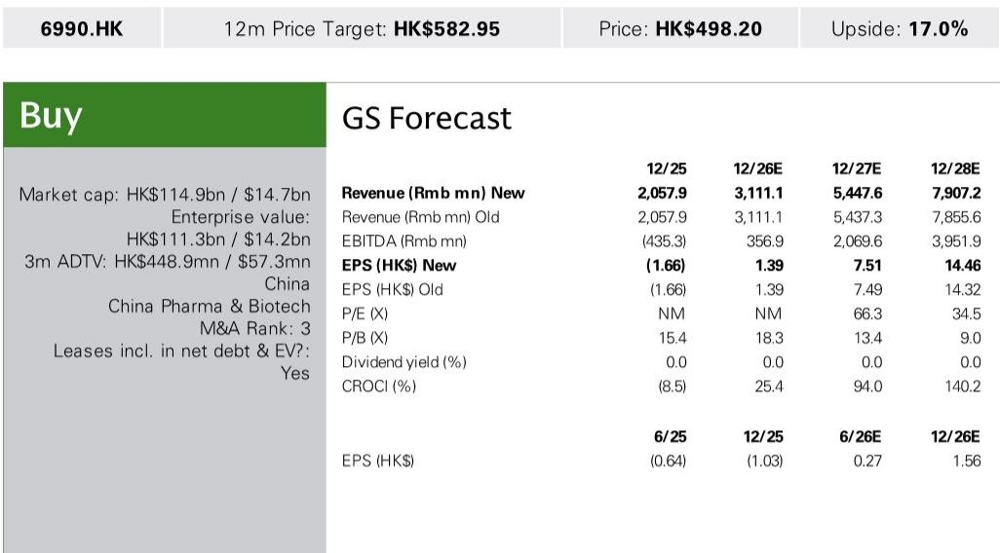
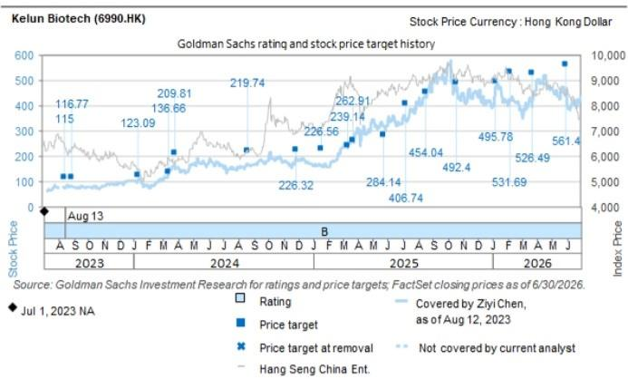

# GS：HK与TMT与NSCLCKelunBiotech6990.

7月15日，科伦博泰宣布其中国III期OptiTROP-Lung06试验达到主要终点。在PD-L1 TPS<1%的非鳞非小细胞肺癌一线治疗中，sac-TMT联合帕博利珠单抗相比标准疗法（帕博利珠单抗联合培美曲塞/铂类）在无进展生存期方面显示出差异，总生存期也呈现积极趋势。这一结果并非孤立事件——就在两个月前，ASCO 2026上公布的Lung05试验已在PD-L1 TPS≥1%人群中展示了0.35的风险比。两份数据合在一起，指向一个更清晰的判断：sac-TMT联合PD-1方案，在覆盖全人群的一线非小细胞肺癌治疗中，可能具备与现有标准疗法比较的潜力。

，并将Lung06试验的成功概率从81%提升至90%。但比估值调整更值得关注的，是这份报告对全球临床策略的推演。

## 1. 直接头对头证据补齐了关键拼图

Lung05试验的对照组是帕博利珠单抗单药，而Lung06的对照组是帕博利珠单抗联合化疗——这正是全球标准疗法KEYNOTE-189方案的核心。GS认为，Lung06提供了“直接的头对头优越性证据”，这是Lung05无法替代的。在PD-L1 TPS<1%这个亚组中取得阳性结果，意味着sac-TMT联合方案不仅在PD-L1高表达人群中有效，在免疫治疗获益相对有限的低表达人群中同样具备竞争力。

## 2. 全球III期试验的讨论焦点正在转移

报告明确指出，围绕sac-TMT全球III期试验的核心讨论，已经从“是否要做”转向“怎么做”。科伦博泰管理层此前透露，针对PD-L1 TPS 1-49%人群的全球III期试验，关键在于选择PD-1还是PD-1/VEGF作为联合搭档。而针对KEYNOTE-189人群（即全人群，约40%为TPS<1%）的全球III期试验，Lung06的详细数据将成为决策依据。GS预计，这些数据将在ESMO大会上公布。

> **KC评论：** GS对Lung06的PFS预期为9-12个月，参考了II期试验中TPS<1%亚组的12.4个月数据，以及Lung05中TPS 1-49%亚组估算的13-15个月。但报告也谨慎指出，PD-L1表达越低，生存获益通常越短。这个区间本身，就是与标准疗法对比时最需要关注的数据锚点。

## 3. 一个可复用的观察框架：从间接证据到直接证据的递进

GS的分析逻辑值得借鉴：先用Lung05的间接数据建立初步预期（TPS 1-49%亚组HR 0.28，估算mPFS 13-15个月），再用Lung06的直接头对头数据验证。这种“间接证据铺垫+直接证据确认”的框架，在评估任何处于临床后期的创新药时都适用。对于读者而言，关键不是单个试验的P值，而是多个试验数据能否形成一致的信号——尤其是当这些试验覆盖了不同亚组、不同对照组时。

科伦博泰的sac-TMT正在从“有潜力的TROP2 ADC”向“可能成为一线非小细胞肺癌治疗基石”的方向演进。Lung06的阳性结果，让这个叙事多了一分确定性，但全球III期试验的设计和结果，才是真正的分水岭。

For informational purposes only. Portions may be generated,translated,summarized,or edited with AI assistance based on source materials and may contain omissions or errors. Please verify independently. This is not investment,legal,tax,accounting,or other professional advice.

For informational purposes only. Portions may be generated,translated,summarized,or edited with AI assistance based on source materials and may contain omissions or errors. Please verify independently. This is not investment,legal,tax,accounting,or other professional advice.

