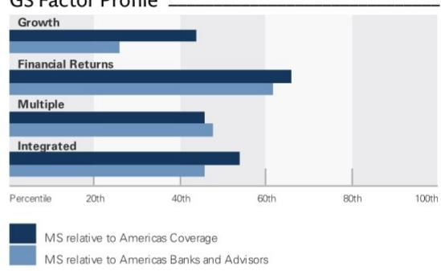
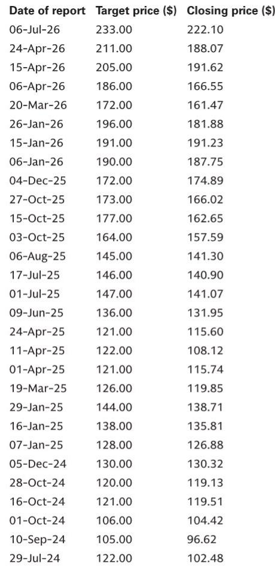
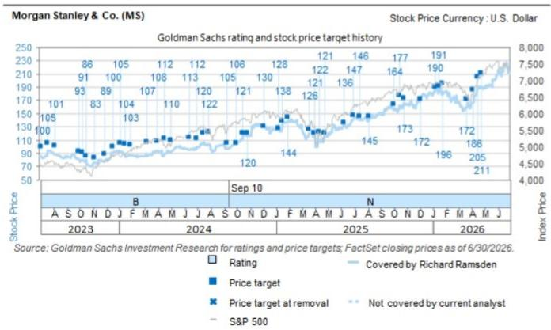

# GS：MS US 2Q26 乘资本市场超级周期 核心ROTCE达27.1

MS交出了一份远超自身目标的季度成绩单。核心财富管理税前利润率达到30.5%，高于30%的目标；核心效率比65.1%，优于70%的目标；核心ROTCE达到27.1%，而目标仅为20%。GS在最新研报中指出，这家华尔街巨头不仅跑赢了自己设定的标杆，更关键的是，它正在通过一个被市场低估的渠道——职场公司计划——持续获取低成本、高粘性的客户资金。

这份报告的核心判断是：MS当前的优势并非周期性的市场回暖所能完全解释，而是其商业模式中结构性变量的兑现。财富管理业务中超过50%的季度净新增资金来自职场渠道，而该渠道中70%的美国前100大独角兽公司已是其客户。这意味着，MS正在将企业员工公司计划转化为一条稳定的高净值客户输送管道。

## 1. 财富管理的利润率扩张有结构性支撑，而非一次性红利

市场通常将财富管理利润率提升归因于市场上涨带来的管理费增长。但GS的分析指向一个更具体的驱动因素：从职场渠道流入的资金，其顾问分成比例低于传统收费资产，因此边际利润率更高。报告测算，2025至2028年，核心财富管理税前利润率有望扩张130个基点。

这一判断的支撑来自资产结构的演变。当员工通过公司计划积累财富后，部分资产会转化为收费型账户，而这类资产的顾问支出更低。换句话说，MS正在用企业端的关系获取零售端的利润空间，且这一过程具有自我强化的特征——更多企业客户意味着更多潜在高净值个人客户。

> **KC评论：** 这里容易被忽略的是“顾问支出更低”这个细节。传统财富管理扩张往往伴随高昂的获客成本，而职场渠道本质上是用企业HR系统替代了部分销售职能，降低了边际成本。这是利润率扩张能否持续的关键变量。

## 2. 资本市场业务正在从“集中爆发”转向“全球拓宽”

报告特别强调了一个容易被市场忽视的信号：国际机构项目管线不仅强劲，而且正在全球范围内拓宽。MS管理层在业绩会上指出，大型企业正在积极推进战略目标，对资本和解决方案的需求持续存在，同时IPO和并购活动也在积累。

交易业务方面，权益衍生品业务的市场份额增长尤为突出。GS认为，这并非偶然，而是过去几年持续研究的结果。当市场关注点集中在国际机构收入能否持续时，MS在交易端的布局正在提供第二支撑。

值得注意的是，GS上调了2026至2028年资本市场收入预测，幅度在2%至3%之间。这不是大幅上调，但结合管理层对管线全球化的描述，它暗示了一个更持久的收入基础，而非单一季度的脉冲。

## 3. 超额资本储备为有机增长和客户融资提供了双重弹药

报告估算，MS目前持有约250个基点的超额CET1资本，折合约150亿美元。这笔资本储备的意义不仅在于回购或分红，更在于它能够支持客户融资需求——尤其是在当前不确定性调整后回报极具吸引力的业务领域。

管理层明确表示，资本优先用于有机研究，包括固定收益、权益和财富管理业务。同时，公司也在评估非有机增长机会，尽管收购门槛较高。这种资本配置策略意味着，MS有能力在竞争对手调整时扩大客户融资规模，从而在周期中巩固市场地位。

GS将目标市盈率从16.5倍上调至17.0倍，目标报价相应从233美元上调至241美元。这一调整幅度不大，但反映了对盈利质量改善的认可——不仅是EPS上调3%和1%，更是利润率结构和收入可持续性的变化。

这份报告揭示了一个更值得关注的观察框架：当一家机构同时拥有结构性利润率改善、全球拓宽的业务管线以及充裕的资本储备时，市场对其的定价逻辑可能从“周期交易”转向“质量溢价”。对于跟踪美国大型机构的读者而言，MS正在提供的，或许是一个检验这一框架是否成立的案例。

For informational purposes only. Portions may be generated,translated,summarized,or edited with AI assistance based on source materials and may contain omissions or errors. Please verify independently. This is not investment,legal,tax,accounting,or other professional advice.

For informational purposes only. Portions may be generated,translated,summarized,or edited with AI assistance based on source materials and may contain omissions or errors. Please verify independently. This is not investment,legal,tax,accounting,or other professional advice.

