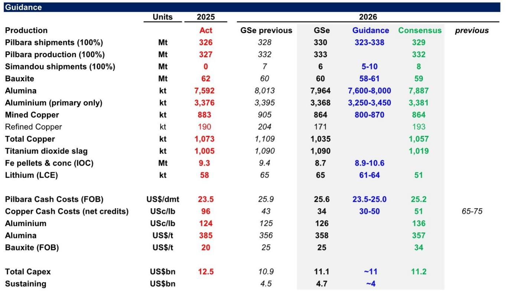
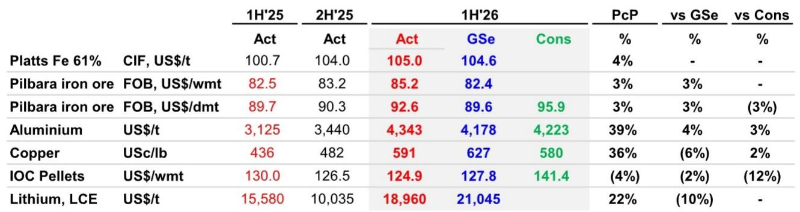
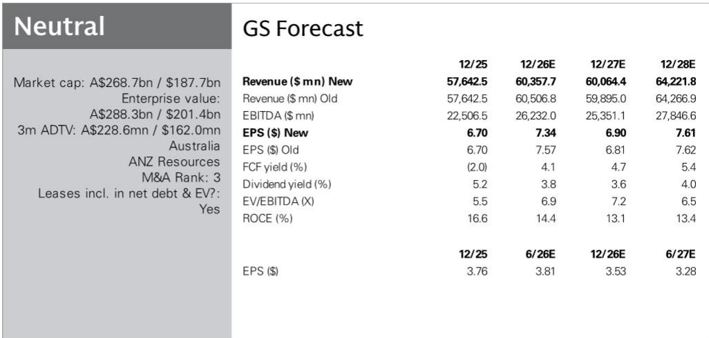

# GS：RIO与AX与USTintoLtd.-.

力拓在2026年第二季度交出了一份整体稳健的成绩单。集团铜当量产量同比增长3%，皮尔巴拉铁矿石产量创下2018年以来最高的上半年记录，埃斯康迪达铜矿表现强劲，奥尤陶勒盖地下矿继续爬坡。但这份报告中最值得关注的信号，并非产量增长本身，而是两个容易被忽略的结构性问题：铜矿生产事故对下半年产量的实质影响，以及上半年12亿美元的营运资本流出。

报告显示，力拓第二季度铜产量为21.3万吨，环比下降7%，低于GS和Visible Alpha共识预期。关键影响来自肯尼科特铜矿——由于精矿供应减少、岩土工程问题，以及6月底闪速吹炼炉破裂（需要约75天重建），该矿精炼铜产量同比下降49%。这意味着下半年精炼铜和黄金产量将受到明显压制。不过，力拓将全年铜产量指引维持在80-87万吨不变，部分未售出的冰铜将在2027年转化为阴极铜并贡献现金流。

与铜的短期扰动形成对比的是，力拓下调了铜C1净单位成本指引，从每磅65-75美分大幅降至30-50美分，主要得益于更高的金价假设（每盎司4026美元）和生产率提升。这一调整与GS此前预测的每磅43美分基本一致，但低于Visible Alpha共识的51美分。

> **KC评论：** 成本指引的大幅下调，本质上是副产品收益（金）对冲了主产品（铜）的生产效率问题。读者在评估力拓铜业务时，需要区分“成本改善”是来自运营效率还是商品价格联动，后者可持续性较弱。

铁矿石方面，皮尔巴拉业务是二季度最大的亮点。第二季度销量为8530万吨（100%基准），同比增长7%，为2020年以来最高。SP10低品位矿占销量的8%，低于市场担忧。力拓上半年实现皮尔巴拉FOB价格为每湿吨85.2美元，高于GS预测的82.4美元。但报告也提示，2026年下半年、2027年和2028年的部分季度，港口装船能力将降至3.6亿吨/年以下，原因是多个大型资本项目正在进行（包括Parker Point堆取料机改造），为Rhodes Ridge项目做准备。

## 1. 奥尤陶勒盖与西芒杜：两个巨型项目的节奏差异

力拓的增长叙事高度依赖两个巨型项目：奥尤陶勒盖地下铜金矿和西芒杜铁矿。二季度数据显示，两者的爬坡节奏存在明显差异。

奥尤陶勒盖精矿产量为9.7万吨，同比增长12%，上半年累计增长31%。项目仍按计划推进，目标是在2028-2036年达到年产约50万吨铜（100%基准）。这是力拓中期铜产量增长的核心引擎。

西芒杜的进展则更为渐进。二季度产量环比增长约16%，但受一季度安全事故影响，重启是分阶段进行的。SimFer矿山（约77%完成）和港口/海运基础设施（85%完成）均在推进，但产量仍受临时破碎设施限制，永久性破碎厂预计2026年下半年交付，首批矿石通过初级破碎机预计在2026年四季度，SimFer港口调试在2027年一季度。二季度销量仅为40万吨（100%基准），品位65.8%。矿山已堆存760万吨未破碎矿石（整个系统堆存960万吨）。全面达产（6000万吨/年）仍预计在2028年下半年。

两个项目的节奏差异，决定了力拓未来两年铜当量产量增长仅为每年约1%，增长主要集中于2028-2030年。

## 2. 铝业务：高利润率与关税成本的拉锯

力拓的铝业务是报告中另一个值得拆解的部分。二季度铝产量环比持平，Kitimat、NZAS和AP60项目正在爬坡，Arvida最后两条电解槽按计划在6月关闭。氧化铝产量环比下降，原因是Yarwun和Vaudreuil出现可靠性事件。

关税成本方面，2026年上半年为7.73亿美元，与GS预测一致，但大部分被更高的美国中西部溢价所抵消（平均MWP含税价格为每吨2406美元）。力拓拥有全球利润率最高的低碳铝业务，超过220万吨铝产量由水电驱动。报告测算，铝价每上涨10%，将带来约11亿美元（约4%）的NTM EBITDA增量。

> **KC评论：** 铝业务的核心矛盾在于，关税成本上升与区域溢价上涨能否持续对冲。力拓的高利润率来自水电成本优势，而非铝价本身。如果关税成本持续但区域溢价回落，铝业务的利润弹性可能不如市场预期。

## 3. 现金流与资产负债表：营运资本扩张的隐忧

报告中最值得关注的财务信号是现金流。2026年上半年，力拓营运资本流出约12亿美元，主要原因是飓风后铁矿石库存增加以及西芒杜爬坡。此外，奥尤陶勒盖在3月支付了约4.43亿美元的有争议蒙古税务评估（保留申诉权利）。GS预测，截至2026年6月30日，力拓净债务约为148亿美元，较半年前增加约5亿美元。

力拓的简化战略（“更强、更精、更简”）仍在推进，包括50-100亿美元的非核心资产剥离和成本削减计划。但报告也指出，力拓的净债务水平（约148亿美元）明显高于必和必拓（约85亿美元），这在一定程度上限制了其财务灵活性。

从估值角度看，力拓目前交易于约0.85倍NAV（每股约196澳元），NTM EBITDA倍数约7倍，与必和必拓相当，但低于纯铜矿公司。GS更新公司观点，认为力拓的FCF和股息回报表现（2026年约5%，按现货价格约6%）具有吸引力，但短期内更偏好必和必拓，后者铜业务敞口更高（EBITDA占比约50% vs 力拓约35%），且资产负债表更强。

力拓将于7月29日发布2026年上半年业绩。GS预测基础EBITDA为149亿美元（Visible Alpha共识为151亿美元），基础盈利约62亿美元，中期股息每股1.90美元（派息率50%，政策区间40%-60%）。市场将重点关注非核心资产剥离和成本削减的最新进展。

For informational purposes only. Portions may be generated,translated,summarized,or edited with AI assistance based on source materials and may contain omissions or errors. Please verify independently. This is not investment,legal,tax,accounting,or other professional advice.

For informational purposes only. Portions may be generated,translated,summarized,or edited with AI assistance based on source materials and may contain omissions or errors. Please verify independently. This is not investment,legal,tax,accounting,or other professional advice.

