# 宏观环境观察

## 关于海湾地区流量变化与中国进口情况的分析

- 实物市场正在趋紧。近期中东局势的变化推动布伦特价格回升至80美元中段区间，并逆转了波斯湾地区流量最初出现的明显恢复。与此同时，对价格较为敏感的中国原油进口——其下降曾在一定程度上缓冲了霍尔木兹海峡的中断影响——在中东产油国下调7-8月官方售价后，可能已触及阶段性低点。我们评估了波斯湾流量恢复和中国进口下降这两方面趋势的持续性，并探讨其对原油价格的影响。

流量恢复失去动力。据估算，在谅解备忘录签署后的头两周，海湾地区出口恢复至战前水平的80%以上，但在海峡油轮再次遭遇袭击后，回落至50%以下（每日1100万桶）（图表1）。这一反复使得市场每日减少约1340万桶的波斯湾流量，若短期内局势未能缓和，可能需要更大规模的需求调整和库存消耗（图表2）。不过，近期对可观测海湾流量的估算可能低估了实际总流量，因为部分油轮据报在穿越海峡时关闭了应答器。大多数“暗渡”油轮在驶出海峡后会重新开启信号，导致流量数据出现显著上修：6月中旬可观测的海湾出口量目前比一个月前的初步估算高出每日110万桶（10%）（图表3）。

## ■ 海湾流量的进一步恢复仍存在不确定性，且可能不均衡：

☐ 地缘局势升级——尤其是对油轮和能源基础设施的潜在进一步袭击——仍是波斯湾流量和生产恢复的主要下行风险。根据4月的封锁情况，我们估算新恢复的对伊朗港口和沿海区域的封锁可能使伊朗出口减少每日150-200万桶。

☐ 即使地缘局势缓和，海湾流量恢复的下一阶段也可能比初期更慢。首先，沙特和阿联酋——拥有最大油轮运力和优质油田的产油国——推动了6月流量的主要反弹（图表5）。阿联酋产量在6月可能已超过战前水平，而其他原油产量损失（与2月水平相比）可能仍总计约每日900万桶（图表6）。其次，使用非伊朗霍尔木兹航线的航运商仍保持风险规避态度，在近期油轮袭击事件后，通过阿曼和国际航线的流量大幅下降（图表7）。即使在最新一轮升级之前，不确定性和持续的区域风险已经对非中东和私人航运商的活动造成了影响（图表8）。

中国原油进口可能已触及低点。6月中国原油净进口同比下降每日500万桶，而同期亚洲邻国的进口已恢复至季节性常态水平（图表9）。我们认为，考虑到中国仍拥有约19亿桶（相当于117天需求）的估算总石油库存，以及其用煤炭和电力替代部分石油需求的能力，中国原油进口未必需要立即反弹。尽管如此，中国原油进口仍可能因三个原因而上升。

a. 进口下降幅度相对于价格上涨而言显得异常之大（图表10）。

b. 历史价格敏感性表明，在中东产油国将7-8月售价下调至地区基准以下后，进口可能出现反弹。

c. 以每日约200万桶的速度持续去库存，可能与中国构建库存缓冲的长期目标不一致。

- 短期价格存在上行风险，中期则面临下行压力。我们继续维持对2026年第四季度布伦特原油价格每桶80美元和2027年每桶75美元的预测，认为风险是双向的，但短期内上行风险更为突出，因为油轮和中东能源基础设施面临进一步袭击的风险有所增加（图表11）。如果海湾出口恢复持续停滞，推迟产量反弹并需要更大规模的需求响应，布伦特原油在2026年第四季度可能突破每桶110美元。相反，6月流量的迅速恢复表明，在地缘局势缓和后，海湾出口能够快速反弹，如果产量超出预期且在高零售燃油价格背景下需求恢复较慢，布伦特原油到年底可能回落至60美元区间。

大规模原油库存使中国进口能够对价格保持敏感，并在原油价格高企时推迟进口
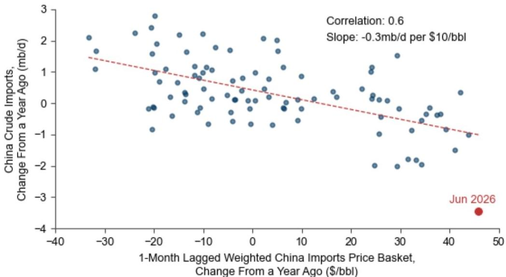
样本区间为2017年1月至2026年6月，不包括2020年3-5月。所包含的原油价格包括：阿拉伯轻质原油（沙特）、伊朗重质原油（伊朗）、巴士拉中质原油（伊拉克）、穆尔班原油（阿联酋）、阿曼原油（阿曼）、ESPO科兹米诺原油（俄罗斯）。
来源：Platts、OPEC、Kpler、GS全球研究

## 关于海湾流量变化与中国进口情况的分析

## 波斯湾流量正在下降

波斯湾流量最初迅速恢复，但近期局势升级后出现逆转

图表1：估算的波斯湾石油流量在谅解备忘录签署后头两周恢复至正常水平的80%以上，但在过去一周因油轮再次遭遇袭击而回落至50%以下

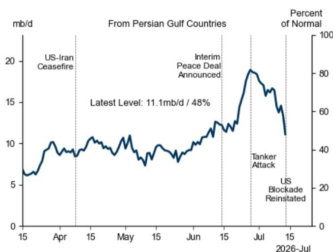
包括通过霍尔木兹海峡、延布、富查伊拉、阿曼湾和博塔斯杰伊汉的流量。

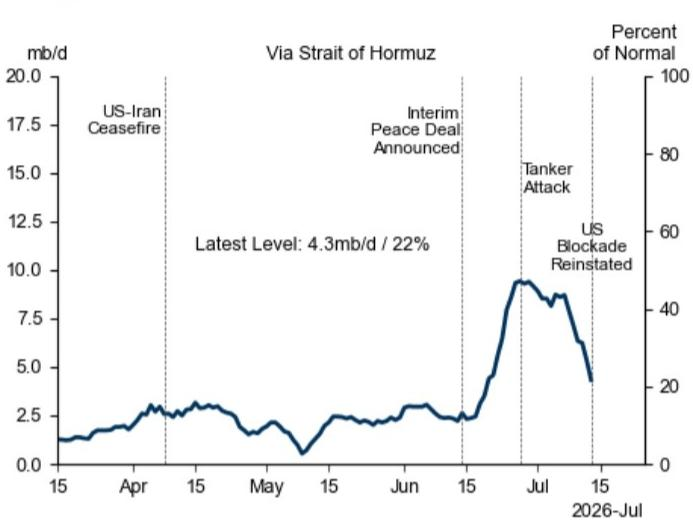
来源：Kpler、S&P Global Commodities at Sea、GS全球研究
图表2：估算的波斯湾流量净损失在过去一周弹性较高至每日1340万桶，表明市场需要更多调整机制来缓冲影响

来源：Kpler、S&P Global Commodities at Sea、GS全球研究

近期估算的可观测波斯湾流量可能只是海湾总流量的下限

## 考虑到“暗渡”通行

图表3：截至6月中旬的波斯湾流量估算已上修每日110万桶，其中阿联酋流量占上修量的三分之二

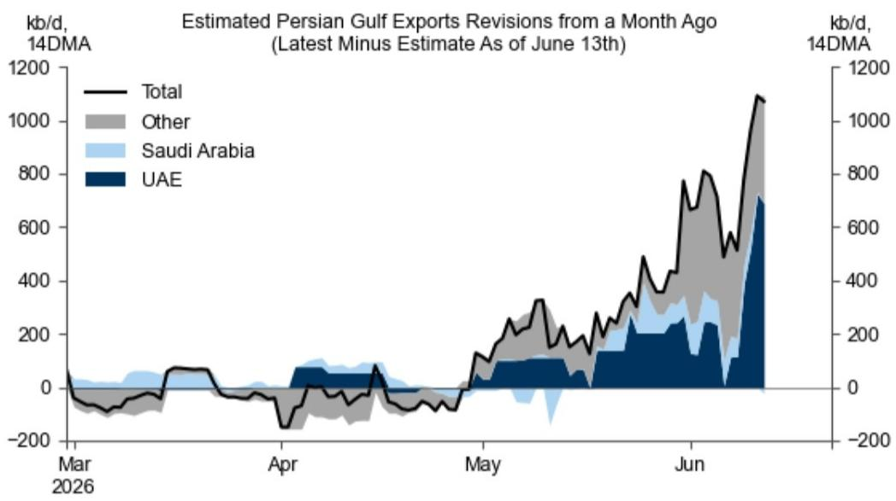
来源：Kpler、GS全球研究

## 流量进一步恢复的下行风险

封锁对伊朗石油流量构成下行风险

图表4：在第一次封锁期间，伊朗石油出口减少每日150-200万桶，而其他波斯湾出口在封锁期间增加了近每日400-500万桶

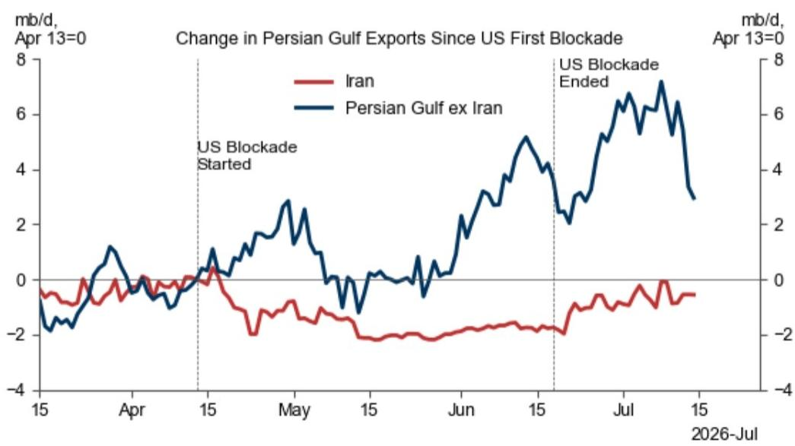
来源：Kpler、GS全球研究

即使在地缘局势缓和后，海湾流量恢复的下一阶段也可能比初期更慢

图表5：沙特和阿联酋——拥有最大油轮运力和优质油田的国家——推动了6月初以来波斯湾流量的初步恢复

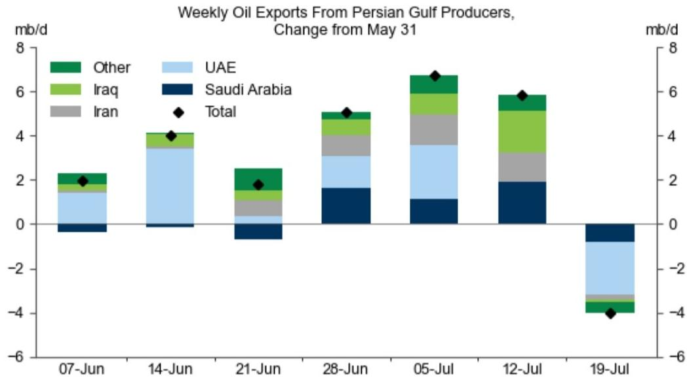
来源：Kpler、GS全球研究

图表6：6月波斯湾产量损失可能小于一个月前的预期，因阿联酋产量超出预期，但仍有约每日900-1000万桶的原油产量损失尚未恢复

<table><tr><td colspan="11">6月波斯湾平均石油产量损失与2月对比（每日百万桶）</td></tr><tr><td rowspan="2"></td><td rowspan="2">液体 
海湾含卡塔尔</td><td colspan="2">原油</td><td rowspan="2">天然气液 
海湾含卡塔尔</td><td colspan="6">原油</td></tr><tr><td>海湾含卡塔尔</td><td>海湾不含卡塔尔</td><td>伊朗</td><td>伊拉克</td><td>科威特</td><td>卡塔尔</td><td>沙特</td><td>阿联酋</td></tr><tr><td>国际能源署 
（截至7月10日）</td><td>11.2</td><td>9.1</td><td>8.1</td><td>2.2</td><td>1.4</td><td>2.6</td><td>1.2</td><td>0.9</td><td>3.4</td><td>-0.4</td></tr><tr><td>OPEC二手资料 
（截至7月13日）</td><td>-</td><td>-</td><td>7.0</td><td>-</td><td>0.8</td><td>2.2</td><td>1.1</td><td>-</td><td>3.3</td><td>-0.4</td></tr><tr><td>Kpler 
（截至6月19日）</td><td>-</td><td>9.5</td><td>8.4</td><td>-</td><td>1.0</td><td>2.6</td><td>1.4</td><td>1.1</td><td>2.9</td><td>0.6</td></tr><tr><td>GS平衡表 
（截至6月15日）</td><td>12.8</td><td>10.5</td><td>9.4</td><td>2.3</td><td>0.8</td><td>2.7</td><td>1.8</td><td>1.1</td><td>3.0</td><td>1.0</td></tr></table>

正数代表损失；负数代表增长。

图表7：近期霍尔木兹海峡通行量的下降，主要是由于使用阿曼和国际海事组织中央航线的油轮在遭遇袭击后，相关流量大幅减少

霍尔木兹海峡油轮通行量

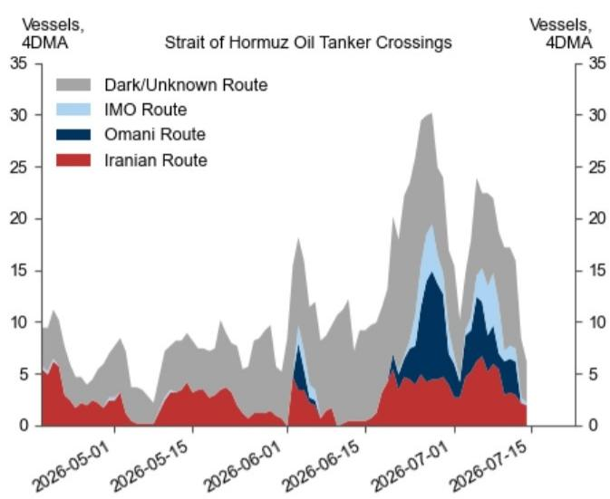
IMO代表国际海事组织。
来源：Kpler、GS全球研究

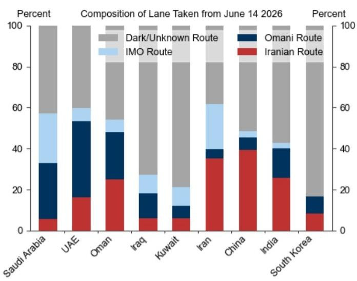
图表8：虽然中东国有租船流量在7月初恢复至正常水平的85%，但安全问题可能一直在拖累私人和非中东航运商的通行

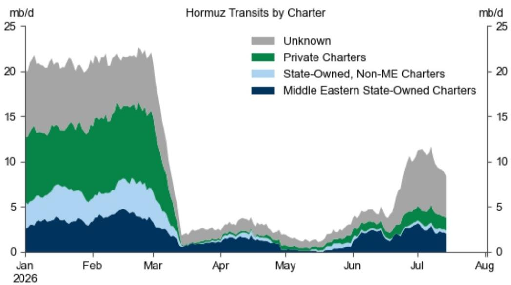
来源：Kpler、GS全球研究

中国原油进口量较低，暂时有助于抑制价格

对价格敏感的原油进口下降，因大规模库存帮助满足需求，但随着中东产油商宣布7月和8月降价，进口可能将恢复

图表9：7月初中国原油净进口同比下降近每日500万桶，尽管除中国外的亚洲进口大幅恢复
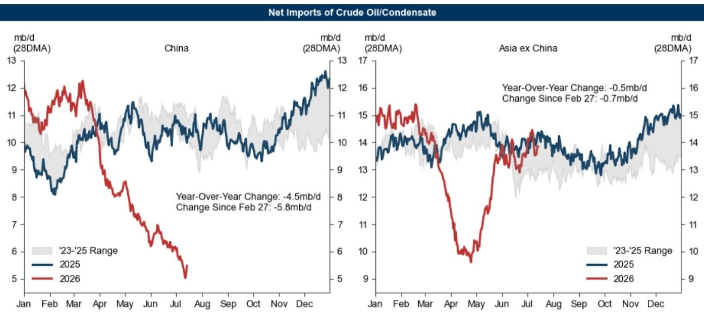
来源：Kpler、GS全球研究

图表10：大规模原油库存使中国进口能够对价格保持敏感，并在原油价格高企时推迟进口
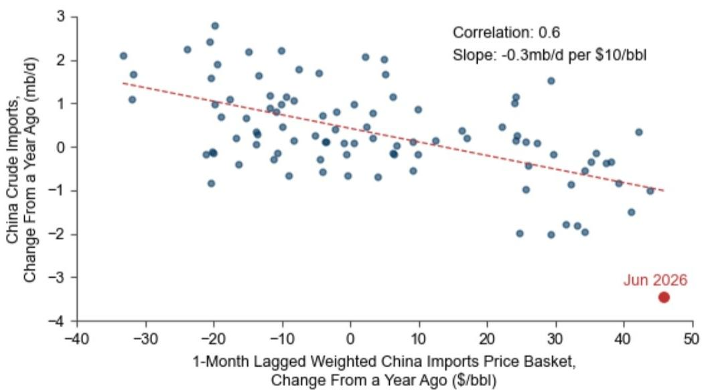

样本区间为2017年1月至2026年6月，不包括2020年3-5月。所包含的原油价格包括：阿拉伯轻质原油（沙特）、伊朗重质原油（伊朗）、巴士拉中质原油（伊拉克）、穆尔班原油（阿联酋）、阿曼原油（阿曼）、ESPO科兹米诺原油（俄罗斯）。

来源：Platts、OPEC、Kpler、GS全球研究

价格面临双向风险，但短期内上行风险更为突出
短期价格面临地缘风险带来的上行风险，但中期因流量在地缘缓和后已被证明能够快速恢复，价格存在下行风险

图表11：如果海湾出口恢复持续停滞，推迟产量反弹并需要更大规模的需求响应，布伦特原油在2026年第四季度可能突破每桶110美元
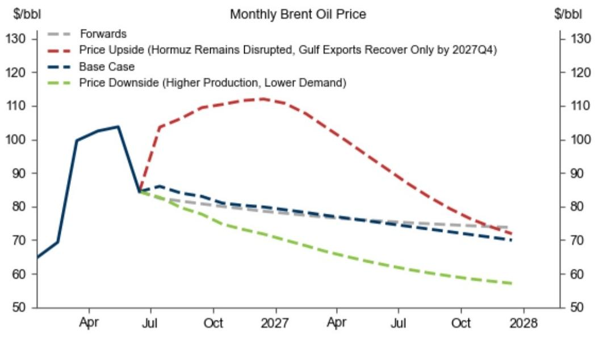
来源：ICE、GS全球研究

## 附录

## 分析师认证

我们，Yulia Zhestkova Grigsby、Alexandra Paulus和Daan Struyven，特此证明本报告中表达的所有观点均准确反映了我们的个人观点，这些观点未受公司业务或客户关系考虑的影响。

除非另有说明，本报告封面所列人员为GS全球研究部门的分析师。

撰稿作者：Yulia Zhestkova Grigsby GS & Co. LLC、Alexandra Paulus GS & Co. LLC、Daan Struyven GS & Co. LLC。

除非另有说明，本报告撰稿作者披露中列出的人员为GS全球研究部门的分析师。

## 披露信息

## 监管披露

## 美国法律法规要求的披露

请参见上述针对具体公司的监管披露，了解本报告中提及的公司所需的以下任何披露：待处理交易中的主承销商或联合主承销商；1%或以上的持股；特定服务的报酬；客户关系类型；前期公开发行的主承销/联合主承销；董事职位；对于股票证券，做市和/或专家角色。GS可能作为本金交易本报告中讨论的发行人的债务证券（或相关衍生品）。

以下是额外的必要披露：持股和重大利益冲突：GS政策禁止其分析师、向分析师汇报的专业人员及其家庭成员持有分析师覆盖范围内任何公司的证券。分析师薪酬：分析师的薪酬部分基于GS的盈利能力，其中包括投资银行业务收入。分析师担任高管或董事：GS政策通常禁止其分析师、向分析师汇报的人员或其家庭成员在分析师覆盖范围内的任何公司担任高管、董事或顾问。非美国分析师：非美国分析师可能不是GS & Co. LLC的关联人员，因此可能不受FINRA规则2241或FINRA规则2242关于与标的公司沟通、公开露面以及交易分析师所覆盖证券的限制。

## 美国以外司法管辖区法律法规要求的额外披露

以下披露是各司法管辖区所要求的，除非已根据美国法律法规在上文作出说明。澳大利亚：GS Australia Pty Ltd及其关联公司不是澳大利亚的授权存款机构（如《1959年银行法》（联邦）所定义），在澳大利亚不提供银行服务，也不从事银行业务。除非GS另有约定，本研究及其访问权限仅面向澳大利亚《公司法》定义的“批发客户”。在编制研究报告时，GS Australia全球研究部门的成员可能会参加由研究报告所涉及的公司和其他实体主办或组织的实地考察和其他会议。在某些情况下，如果GS Australia认为在实地考察或会议的具体情况下适当且合理，此类实地考察或会议的部分或全部费用可能由相关发行人承担。如果本文档内容包含任何金融产品建议，则仅为一般性建议，由GS在未考虑客户目标、财务状况或需求的情况下编制。客户在根据任何此类建议采取行动前，应考虑该建议是否适合其自身目标、财务状况和需求。GS Australia和新西兰的某些利益披露声明以及GS澳大利亚卖方研究独立性政策声明的副本可在以下网址获取：https://www.goldmansachs.com/disclosures/australia-new-zealand/index.html。巴西：有关CVM第20号决议的披露信息可在以下网址获取：https://www.gs.com/worldwide/brazil/area/gir/index.html。在适用的情况下，根据CVM第20号决议第20条定义，对本研究报告内容负主要责任的巴西注册分析师为本报告开头列出的第一作者，除非文末另有说明。加拿大：此信息仅供您参考，在任何情况下均不应被视为GS & Co. LLC为在加拿大购买任何加拿大证券而进行的广告、要约或招揽。GS & Co. LLC未在加拿大任何司法管辖区根据适用的加拿大证券法注册为交易商，通常不被允许交易加拿大证券，并可能被禁止在加拿大某些司法管辖区销售某些证券和产品。如果您希望在加拿大交易任何加拿大证券或其他产品，请联系GS Canada Inc.（GS集团公司的关联公司）或其他注册的加拿大交易商。香港：有关本研究中提及的所覆盖公司证券的更多信息，可向GS（亚洲）有限责任公司索取。印度：有关本研究中提及的标的公司或公司的更多信息，可从GS（印度）证券私人有限公司获取，研究分析师——SEBI注册号INH000001493，地址：10th Floor, Ascent-Worli, Sudam Kalu Ahire Marg, Worli, Mumbai-400 025, India，企业识别号U74140MH2006FTC160634，电话+91 22 6616 9000，传真+91 22 6616 9001。GS可能实益持有本研究报告中所提及的标的公司或公司1%或以上的证券（该术语在1956年《印度证券合约（监管）法》第2(h)条中定义）。SEBI的注册和NISM的认证绝不保证中介机构的业绩，也不向读者提供任何回报保证。GS（印度）证券私人有限公司的合规官和读者投诉联系详情、年度合规审计报告副本以及其他相关信息和披露可在以下链接找到：https://www.goldmansachs.com/worldwide/india/research-analyst。日本：见下文。韩国：除非GS另有约定，本研究及其访问权限仅面向《金融服务和资本市场法》定义的“专业读者”。有关本研究中提及的标的公司或公司的更多信息，可从GS（亚洲）有限责任公司首尔分行获取。新西兰：GS New Zealand Limited及其关联公司不是新西兰的“注册银行”或“存款接受者”（如1989年《新西兰储备银行法》所定义）。除非GS另有约定，本研究及其访问权限面向《2008年金融顾问法》定义的“批发客户”。GS Australia和新西兰的某些利益披露声明副本可在以下网址获取：https://www.goldmansachs.com/disclosures/australia-new-zealand/index.html。俄罗斯：在俄罗斯联邦分发的研究报告不属于俄罗斯法律定义的广告，而是信息和分析材料，其主要目的不是推广产品，也不提供俄罗斯评估活动法律意义上的评估。研究报告不构成俄罗斯法律法规定义的个人化研究交流，不针对特定客户，且未分析客户的财务状况、投资概况或风险概况。GS不对客户或任何其他人基于本研究报告可能做出的任何投资决策承担责任。新加坡：GS（新加坡）私人有限公司（公司编号：198602165W），受新加坡金融管理局监管，对本研究承担法律责任，如有任何与本研究报告相关的事宜，应联系该公司。台湾：此材料仅供参考，未经许可不得转载。读者应仔细考虑自身的投资风险。投资结果由个人读者自行负责。英国：在英国被归类为零售客户（定义见金融行为监管局规则）的人士，应结合GS先前关于本报告所涉公司的研究报告阅读本报告，并应参考GS International已发送给他们的风险警告。这些风险警告的副本以及本报告中使用的某些金融术语的词汇表，可向GS International索取。

欧盟和英国：有关欧盟委员会授权条例（EU）（2016/958）第6(2)条（该条例补充欧洲议会和理事会条例（EU）第596/2014号，包括该授权条例在英国脱离欧盟和欧洲经济区后转化为英国国内法律法规的情况）关于研究交流或其他推荐或暗示投资策略的信息客观呈现的技术安排以及特定利益或利益冲突迹象披露的技术标准的披露信息，可在以下网址获取：https://www.gs.com/disclosures/europeanpolicy.html，其中说明了与投资研究相关的利益冲突管理的欧洲政策。

日本：GS Japan Co., Ltd.是在关东财务局注册的金融工具交易商，注册编号为Kinsho 69，是日本证券业协会、日本金融期货协会、日本第二类金融工具业协会和日本投资管理协会的会员。股票买卖需按与客户预先确定的佣金加上消费税进行。有关日本证券交易所、日本证券业协会或日本证券金融公司要求的任何适用披露，请参见针对具体公司的披露。

## 全球产品；分发实体

GS全球研究为GS的客户在全球范围内制作和分发研究产品。位于GS全球各办事处的分析师对行业和公司进行研究，并对宏观经济、货币、大宗商品和投资组合策略进行研究。本研究由以下机构在澳大利亚分发：GS Australia Pty Ltd（ABN 21 006 797 897）；在巴西：GS do Brasil Corretora de Títulos e Valores Mobiliários S.A.；GS巴西公共沟通渠道：0800 727 5764和/或contatogoldmanbrasil@gs.com。工作日（节假日除外）上午9点至下午6点开放。在加拿大：GS & Co. LLC；在香港：GS（亚洲）有限责任公司；在印度：GS（印度）证券私人有限公司；在日本：GS Japan Co., Ltd.；在韩国：GS（亚洲）有限责任公司首尔分行；在新西兰：GS New Zealand Limited；在俄罗斯：OOO GS；在新加坡：GS（新加坡）私人有限公司（公司编号：198602165W）；在美国：GS & Co. LLC。GS International已批准本研究在英国的分发。

GS International（“GSI”），由审慎监管局（“PRA”）授权，受金融行为监管局（“FCA”）和PRA监管，已批准本研究在英国的分发。

欧洲经济区：GS Bank Europe SE（“GSBE”）是一家在德国注册的信贷机构，在单一监管机制内，受欧洲中央银行直接审慎监管，并在其他方面受德国联邦金融监管局（BaFin）和德国联邦银行监管，并在欧洲经济区内分发研究。

## 一般披露

本研究仅供我们的客户使用。除与GS相关的披露外，本研究基于我们认为可靠的当前公开信息，但我们不保证其准确或完整，也不应依赖于此。本文所含信息、意见、估计和预测截至本文日期，如有变更，恕不另行通知。我们力求在适当的时候更新我们的研究，但各种法规可能阻止我们这样做。除某些定期发布的行业报告外，大多数报告均根据分析师的判断不定期发布。

GS开展全球全方位、综合性的投资银行、投资管理和经纪业务。我们与全球研究部门所覆盖的相当大比例的公司存在投资银行和其他业务关系。GS & Co. LLC，美国经纪交易商，是SIPC的成员（https://www.sipc.org）。

我们的销售人员、交易员和其他专业人员可能会向我们的客户和自营交易部门提供口头或书面的市场评论或交易策略，这些评论或策略反映的观点可能与本研究表达的观点相反。我们的资产管理部、自营交易部门和投资业务可能做出与本研究中建议或观点不一致的投资决策。

我们及我们的关联公司、高级职员、董事和员工可能不时持有本研究提及的证券或衍生品（如有）的多头或空头头寸，作为本金进行交易，以及买入或卖出，除非法规或GS政策另有禁止。

在GS组织的会议上归因于第三方演讲者（包括来自GS其他部门的个人）的观点，不一定反映全球研究部门的观点，也不是GS的官方观点。

本文引用的任何第三方，包括任何销售人员、交易员和其他专业人员或其家庭成员，可能持有与本文指定分析师表达的观点不一致的上述产品的头寸。

本研究侧重于跨市场、行业和板块的投资主题。它不试图区分我们描述的任何行业或板块内单个公司的前景或表现，也不提供对单个公司的分析。

本研究中与股权或信用证券或行业或板块内证券相关的任何交易建议，反映了所讨论的投资主题，并非对任何此类证券的单独建议。

本研究不构成在任何司法管辖区出售或招揽购买任何证券的要约，如果此类要约或招揽在该司法管辖区属于非法行为。它不构成个人推荐，也未考虑个别客户的具体投资目标、财务状况或需求。客户应考虑本研究中的任何建议或推荐是否适合其特定情况，并在适当的情况下寻求专业建议，包括税务建议。本研究中提及的投资的价格和价值以及从中获得的收入可能会波动。过往表现并非未来表现的指引，未来回报不保证，且可能发生原始资本损失。汇率波动可能对某些投资的价值或价格或从中获得的收入产生不利影响。

某些交易，包括涉及期货、期权和其他衍生品的交易，会带来重大风险，并不适合所有读者。读者应查阅当前的期权和期货披露文件，这些文件可从GS销售代表处或以下网址获取：https://www.theocc.com/about/publications/character-risks.jsp 和 https://www.goldmansachs.com/disclosures/cftc_fcm_disclosures。在涉及多次买卖期权的期权策略（如价差策略）中，交易成本可能很高。将应要求提供支持性文件。

全球研究提供的不同服务水平：GS全球研究向您提供的服务水平和类型可能与向GS内部和其他外部客户提供的服务有所不同，具体取决于多种因素，包括您个人对接收沟通频率和方式的偏好、您的风险状况和投资重点及视角（例如，市场范围、特定板块、长期、短期）、您与GS整体客户关系的规模和范围，以及法律和监管限制。例如，某些客户可能要求在特定证券的研究发布时收到通知，某些客户可能要求将分析师基本面分析所依据的特定数据通过数据馈送或其他方式以电子方式从我们的内部客户网站传送给他们。分析师基本面研究观点的任何变化（例如，对股票证券的评级、目标价或盈利预测的重大变化），在通过电子方式向内部客户网站广泛发布研究报告或以其他必要方式向所有有权接收此类报告的客户传达之前，不会向任何客户传达。

所有研究报告均通过电子方式同时向内部客户网站发布，并同时提供给所有客户。并非所有研究内容都会重新分发给我们的客户或提供给第三方聚合商，GS也不对第三方聚合商重新分发我们的研究负责。对于与一个或多个证券、市场或资产类别相关的研究、模型或其他数据（包括相关服务），如有需要，请联系您的GS代表或访问 https://research.gs.com。

披露信息也可在 https://www.gs.com/research/hedge.html 获取，或联系研究合规部，地址：200 West Street, New York, NY 10282。

## © 2026 GS.

您仅可为自己使用而存储、展示、分析、修改、重新格式化及打印通过本服务向您提供的信息。未经GS明确书面同意，您不得转售或逆向工程此信息以计算或开发用于披露和/或营销的任何指数，或创建任何其他衍生作品或商业产品、数据或产品。未经GS明确书面同意，您不得以任何格式向任何第三方发布、传输或以其他方式复制此信息的全部或部分。前述限制包括但不限于使用、提取、下载或检索此信息的全部或部分，用于训练或微调机器学习或人工智能系统，或向任何此类系统提供或复制此信息的全部或部分作为提示或输入。
