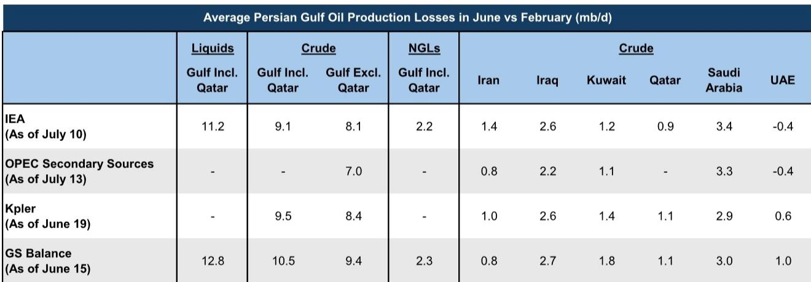
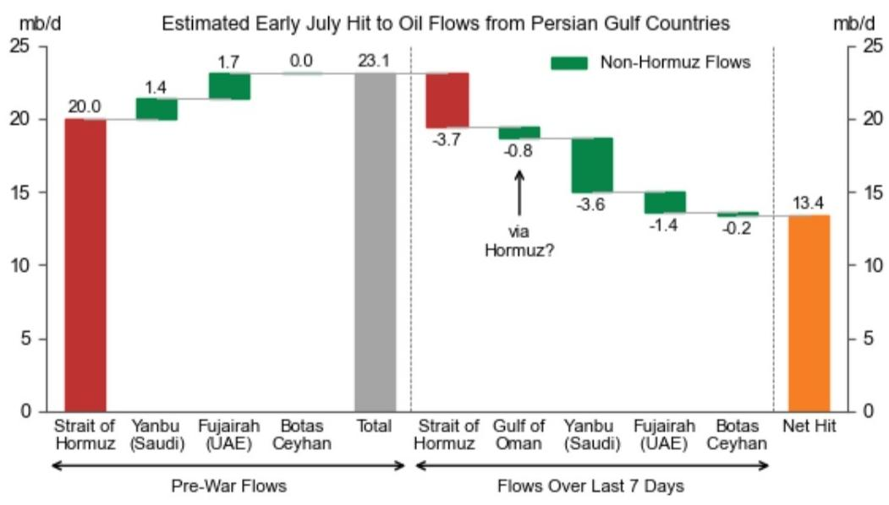

# The Oil Market’s True Tightening Has Not Yet Begun: Why the Lull in Prices Is Deceptive

The global oil market is facing a structural paradox that most price models have not captured. Persian Gulf flows, which initially recovered to over 80% of pre-war levels in the first two weeks following the Memorandum of Understanding, have now fallen back to below 50%—approximately 11 million barrels per day—after renewed attacks on tankers in the Strait of Hormuz. This reversal leaves the market short 13.4 million barrels per day of Persian Gulf flows, a deficit that, absent near-term de-escalation, will require far greater demand destruction and sustained inventory draws than anything observed in the past month. Yet oil prices have not fully reflected this tightening because of one critical mitigating factor: China’s crude imports have collapsed by nearly 5 million barrels per day year-over-year, acting as an accidental buffer that has masked the severity of the supply disruption. This equilibrium is fragile and temporary.

The central argument of this analysis is that the current price environment—Brent in the mid-80s—represents a deceptive calm before a more volatile adjustment. The combination of a stalling Gulf flow recovery and a likely rebound in Chinese imports will compress the market’s adjustment mechanisms into a narrower window than most participants expect. The risk is not symmetric. Near-term upside to prices is substantial, while the downside depends on a sequence of conditions that are currently not aligned.

Three structural forces will determine the trajectory. First, the recovery in Persian Gulf flows is not merely stalled; it is structurally constrained by the composition of the producers who drove the initial rebound and by the risk aversion of non-Middle Eastern shippers. Second, China’s crude imports have likely bottomed, and the combination of price sensitivity, inventory dynamics, and policy objectives points to a meaningful recovery in the coming months. Third, the interplay of these two forces creates a decision framework for market participants that is more about timing and scenario weighting than about directional conviction.

The following sections unpack each of these forces, examine the mechanisms that connect them, and provide a structured framework for navigating the two-sided but asymmetric risk profile that defines the current market.

## The Initial Gulf Flow Recovery Was Driven by a Narrow Set of Producers, and the Next Phase Will Be Slower and More Fragile

The recovery in Persian Gulf flows that occurred in early June was not a broad-based normalization. It was concentrated in Saudi Arabia and the UAE, two producers with the largest tanker capacity and the highest-quality fields. These two countries drove the majority of the rebound, and UAE production likely already exceeded its pre-war level in June. Meanwhile, other crude production losses relative to February levels still total approximately 9 million barrels per day. This asymmetry matters because it means the easy gains have already been captured.

The next phase of recovery faces two structural headwinds that the initial phase did not. First, the remaining production losses are concentrated in countries with more damaged infrastructure, lower spare capacity, or more constrained export routes. Iraq, Kuwait, and Iran account for the bulk of the unreturned barrels, and each faces distinct logistical or political barriers that are unlikely to resolve quickly. Second, and more importantly, shipper behavior has become structurally more risk-averse. Even before the latest escalation, non-Middle Eastern and private shippers had reduced their activity in the region. The recent attacks on tankers using Omani and International Maritime Organization central routes have accelerated this retreat. Flows through these routes declined sharply after the attacks, and the data suggest that private charters have not returned to pre-crisis levels of engagement.

The implication is that even if a geopolitical de-escalation occurs, the recovery trajectory will be slower and more uneven than the initial rebound. The observable flows data may also understate the true picture. A meaningful number of tankers are crossing the Strait with transponders turned off, and these “dark crossings” eventually show up in revisions. Estimates of mid-June Gulf flows have already been revised upward by 1.1 million barrels per day, or 10%, as dark-crossing tankers switched their signals back on outside the Strait. This means current observable flows are a lower bound, not a central estimate, and that the market may be slightly less tight than the headline numbers suggest. But the directional trend is clear: the recovery has lost momentum, and the structural constraints on the next phase are more binding than the first.

## China’s Crude Import Collapse Has Been the Market’s Shock Absorber, but That Role Is Ending

The decline in Chinese crude imports has been the single most important factor preventing a sharper price spike. In early July, China’s net crude imports fell by nearly 5 million barrels per day year-over-year, even as imports by its Asian neighbors recovered to seasonal norms. This divergence is not coincidental. China’s large crude stockpiles—estimated at 1.9 billion barrels, or 117 days of demand—have given Beijing the flexibility to postpone purchases when prices are high. The country has effectively been acting as a swing consumer, using its inventory buffer to smooth the impact of supply disruptions on the global market.

Three mechanisms point to a reversal of this trend. First, the magnitude of the import decline appears unusually large relative to the price increase that triggered it. Historical relationships between Chinese crude imports and crude prices suggest that the current level of import compression is an outlier. Second, Middle Eastern producers have cut their official selling prices for July and August below regional benchmarks, which historically has been a strong predictor of a rebound in Chinese buying. Price-sensitive Chinese refineries, having waited out the high-price period, now face a more favorable pricing environment. Third, sustained crude destocking at an estimated 2 million barrels per day is inconsistent with Beijing’s long-term objective of building inventory buffers. The destocking has been a tactical response to high prices, not a strategic shift in policy.

The risk is not that Chinese imports rebound immediately, but that they rebound at a time when Gulf flows are still constrained. If Chinese buying picks up by even 2 to 3 million barrels per day in the coming months, the market will lose its primary shock absorber. The inventory buffer that allowed China to defer purchases will become a source of demand that competes directly with the supply recovery. This is the mechanism that transforms a manageable supply disruption into a tighter market.

## The Market Faces a Decision Framework Defined by Asymmetric Risks and a Narrow Path to Balanced Prices

For market participants, the current environment requires a framework that weights scenarios rather than forecasts a single price path. The base case from a global investment bank report—Brent at $80 in the fourth quarter of 2026 and $75 in 2027—is a reasonable central estimate, but it is surrounded by wide tails that demand active management.

The upside scenario is triggered by a continued stall in Gulf export recovery. If flows remain below 50% of pre-war levels, the production rebound is delayed, and the market must rely on demand destruction to balance. Under this scenario, Brent could overshoot $110 per barrel in the fourth quarter of 2026. The mechanism is not speculative; it is arithmetic. A 13.4 million barrel per day supply shortfall requires a demand response of similar magnitude, and the only way to achieve that in the short term is through price-induced destruction. The recent escalation in tanker attacks has increased the probability of this outcome, and the risk is now skewed to the upside in the near term.

The downside scenario is equally plausible but requires a specific sequence of events. The June recovery showed that Gulf exports can rebound quickly after de-escalation. If production beats expectations and demand recovers more slowly than anticipated—particularly if high retail fuel prices suppress consumption in key markets—Brent could fall into the $60s by year-end. This scenario depends on both a geopolitical resolution and a demand-side weakness that is not yet visible in the data.

The decision framework that emerges from these scenarios is not about picking a direction but about positioning for the path. The key variables to monitor are not price levels but flow volumes: the rate of Gulf export recovery, the pace of Chinese import normalization, and the behavior of non-Middle Eastern shippers. Each of these variables has a threshold that, if crossed, shifts the probability distribution. For example, if Gulf flows recover above 70% of pre-war levels and Chinese imports remain suppressed, the downside scenario becomes more likely. If Gulf flows stay below 50% and Chinese imports begin to recover, the upside scenario dominates.

The most important insight from this framework is that the two risks are not independent. A recovery in Chinese imports at a time of constrained Gulf flows creates a compounding effect that neither scenario fully captures. The market’s adjustment mechanisms—inventory draws, demand destruction, and production recovery—are not additive; they interact. A simultaneous tightening on both the supply and demand sides would require a larger price response than either factor alone would justify.

The implication for strategy is clear. The current price level embeds a significant discount for the probability that China continues to absorb the supply shock through inventory depletion. As that probability declines, the discount will narrow. The market is not yet pricing in the full cost of a synchronized adjustment, and the window for positioning before that repricing occurs is closing. The next phase of this cycle will not be about whether prices move, but about how quickly they adjust to a reality that the data are already revealing.

For informational purposes only. Portions may be generated, translated, summarized, or edited with AI assistance based on source materials and may contain omissions or errors. Please verify independently. This is not investment, legal, tax, accounting, or other professional advice.

