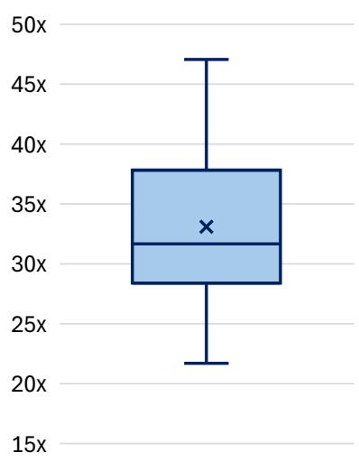
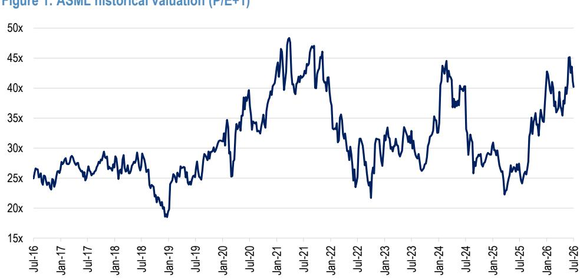
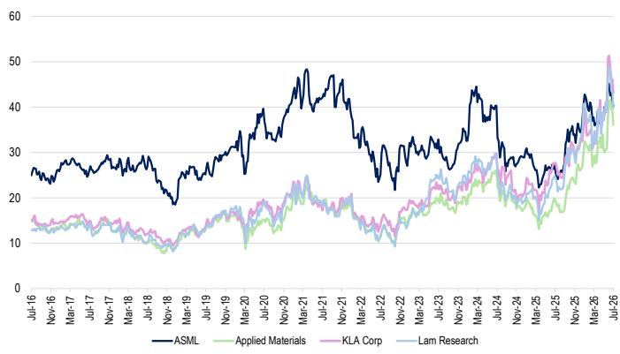
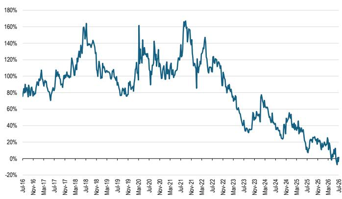

# JPM

## ASML

关于'27、'28年的最终判断尚未明确。公司有可能再次上调预期。维持增持评级。

读者目前对ASML的交易方式，仿佛回到了2025年或更早时期，当时ASML会提供订单指引。过去两个季度公司的指引表明，其给出的指引类型已不同于以往——过去全年指引总能达成而非超越，但动力来自订单。而现在，公司每个季度都在上调指引以提供动力。因此，在当前宏观环境下，有充分理由相信FY27指引将被上调。事实上，公司在电话会议中已表示，'27年的EUV产能指引并非上限。基于需求趋势和公司的产能指引，目前该公司的报价表现似乎暗示行业将进入下行周期，但市场上并无此类迹象。ASML仍是我们覆盖范围内的首选标的，维持增持评级，且该标的在AFL名单上。

- 市场需要认识到ASML的指引方式已经改变。公司很有可能再次上调FY27产能指引：ASML的FY26指引以及FY27、FY28年EUV和浸没式DUV产能指引均表现强劲。相对少见一个不如市场预期的数据点是FY27年EUV产能，公司给出的指引为85台。自ASML停止报告订单以来，他们每个季度都在上调指引。在没有订单数据的情况下，其策略已转向每季度上调指引。在电话会议上，他们实际上表示："现阶段，基于我们进行的沟通，85台很好地反映了客户需求与我们目前在供应链中所能实现之间的平衡。但如果需要更多，就像过去几个季度所做的那样，我们将撸起袖子看看是否还能做得更多。"——因此85台EUV并非上限。我们不认为这一指引是负面信号，并预计此次财报发布后市场共识将出现大幅上调。在此次财报发布前，JPM对'27/'28年的预估已分别领先市场共识26.5%/23.8%，我们预计市场共识将向我们的预估水平靠拢，甚至可能超越（如下所示，JPMe已高于我们报告发布前的预估）。

- ASML的交易表现仿佛终端市场处于下行周期：ASML的Y+2每股收益四分位区间为23倍至29.8倍。目前该标的交易在21.9倍我们的'28年每股收益水平，低于四分位区间下限，而目前并无下行周期迹象。我们预计，即使市场共识未向JPMe的'28年每股收益€70.7靠拢，也将在当前Y+2市场共识€49.9的基础上大幅上升。因此，当未来一周上调预期陆续到来时，该标的将显得相当有吸引力。考虑到半导体板块在第二季度的出色表现，市场对其持谨慎态度可以理解；但我们认为，鉴于此次财报发布后可能出现的盈利上调，ASML在第三季度的表现将优于半导体板块。

- 上调预估和目标价至€2,100。基于公司更高的指引、强劲的产能扩张计划迹象以及毛利率的拐点，我们上调了预估。我们的FY26和FY28营收预估分别比之前高出13%和6%，同时我们将FY27营收预估下调了1%，以符合ASML对EUV和浸没式的产能指引。这使得我们FY26/FY27/FY28的每股收益预估分别上调26%/1%/10%，因此基于29.6倍我们的FY28每股收益预估，我们的Jun-28目标价现为€2,100（此前为€1,900）。

详见第12页分析师认证和重要披露，包括非美国分析师披露。

## 增持

ASML.AS, ASML NA

报价（7月15日26年）：€1,544.00

▲ 目标价（Jun-28）：€2,100.00

此前（Jun-28）：€1,900.00

## 增持

ASML, ASML US
报价（7月15日26年）：\$1,815.27

▲ 目标价（Jun-28）：\$2,400.00
此前（Jun-28）：\$2,200.00

## 欧洲科技硬件与支付

Sandeep Deshpande AC
(44-20) 7134-5276
sandeep.s.deshpande@JPM.com

Craig A McDowell

(44-20) 7742-4576

craig.mcdowell@JPM.com

Anthony Girard

(44-20) 3493-6469

anthony.girard@JPM.com

JPM Securities plc

专业销售联系方式：

Scott Silver - 专业销售 - 欧洲TMT

(44-20) 7134-0412
scott.silver@JPM.com

## 我们的核心观点

## 乐观基调与指引上调源于强劲的布局

ASML表示，领先节点（包括5nm及以下，以及存储领域的1b和1c）的积极产能扩张已推动逻辑和DRAM领域的资本支出上升。客户的长期协议提供了更多可见性，增强了客户进行资本支出和增加产能的信心。除了所需产能外，ASML还提到，随着存储领域浸没式和EUV层数的增加，光刻强度也在提升。据信客户将在FY27和FY28继续增加产能。

## 所示产能并非硬性上限，关注点应在营收产能而非设备数量

ASML表示今年EUV设备产能为65台，2027年为85台，2028年为110台。有趣的是，在电话会议上他们不愿说85台是2027年的峰值产能。ASML表示，在本报告发布时，2027年85台设备很好地代表了客户需求和能力，但这可能会发生变化。公司传递的信息已经改变，愿意就产能增加发表评论，这表明需求强劲。

重要的是，虽然2027年和2028年设备产能数量预计同比增长30%，但由此带来的营收增长潜力要大得多，因为需要考虑更高的生产率和每台设备的平均售价。ASML表示，更高生产率设备在组合中的影响相当于产能再增加10%，因此如果营收捕获与提供给客户的产能成比例，那么理论上EUV营收增长应相当于同比增长45%。

## 更有利的定价环境

公司给出了一个新信息——他们看到了利用当前供应短缺的市场进行定价调整的潜力，这在正常市场环境下是无法做到的。这一变化需要时间，但公司计划继续实施基于价值的定价，这将使其能够提高下一代设备的价格，因为客户在当前环境中获得了显著更多的价值。特别是在F型设备上，我们认为公司改变定价动态的潜力更大。

## 毛利率指引同样积极

对于今年远强于预期的毛利率指引，公司表示这得益于：1）更多的EUV和浸没式设备；2）定价更优的EUV设备（D型设备逐步退出，F型设备随后进入）；3）IBM收入更高且组合更优——包括升级和更高的EUV服务收入；4）更高的产量（固定成本覆盖）。ASML表示这些因素将在FY27及以后持续存在，尽管他们没有具体给出FY27的毛利率指引。因此，2026年下半年ASML毛利率将迎来拐点。

## 调整预估

在2Q26财报发布以及公司对FY26及以后的指引之后，我们正在调整预估。对于3Q26，ASML指引营收中值为€115亿，毛利率中值为56%，运营支出为€16亿。对于FY26，ASML已将营收指引上调至中值€440亿（€430亿至€450亿）。在产能方面，ASML指引FY27和FY28年EUV和浸没式产能将增长30%，这意味着FY27/FY28年EUV产能约为85/110台，浸没式产能约为169/210台。我们强调，已出货的EUV设备整体吞吐量将更高，因此在更高平均售价的支持下，EUV和浸没式的营收增长将超过30%的同比增长。ASML指引DUV+计量与检测在FY26年增长25%，IBM业务在Q3（指引营收约€29亿）和Q4应继续保持强劲。ASML表示EUV在FY27年已接近满订，且FY28年有强劲订单，这就是他们计划在该年布局更高产能的原因。更高的平均售价、IBM业务的强劲以及更高的产量应支持利润率持续扩张。具体而言，我们做出的调整如下：

- 营收方面，我们将FY26预估上调13%，以反映公司中值€440亿的营收指引。对于FY27，我们的营收预估比此前预估低1%，原因是公司给出了明年约85台EUV产能的指引（我们认为这不是上限）和约170台浸没式设备，低于我们此前的数字，但部分被更高的平均售价预估所抵消。对于FY28，我们的营收预估比此前高6%，原因是客户产能扩张计划强劲；

- 毛利润方面，我们的FY26/FY27/FY28预估分别比此前高20%/3%/10%，主要受营收预估上升（FY27除外）以及以下因素带来的盈利能力改善推动：i）更多的EUV和浸没式设备；ii）定价更优的EUV设备，组合中F型设备占比逐步增加；iii）更高的产量（固定成本覆盖）；

- 息税前利润方面，我们的FY26/FY27/FY28预估分别比此前高27%/1%/11%，主要受毛利润预估上升以及由销售管理费用和研发团队效率提升带来的严格运营支出控制推动；

- 总体而言，我们的FY26/FY27/FY28每股收益预估分别比此前高26%/1%/10%。

表1：ASML - 预估变动

<table><tr><td></td><td>3Q26 新</td><td>3Q26 旧</td><td>差异%</td><td>2026 新</td><td>2026 旧</td><td>差异%</td><td>2027 新</td><td>2027 旧</td><td>差异%</td><td>2028 新</td><td>2028 旧</td><td>差异%</td></tr><tr><td>EUV设备出货量，新</td><td>17</td><td>15</td><td>13%</td><td>64</td><td>61</td><td>5%</td><td>86</td><td>90</td><td>-4%</td><td>106</td><td>105</td><td>1%</td></tr><tr><td>浸没式设备出货量，新</td><td>38</td><td>40</td><td>-5%</td><td>131</td><td>127</td><td>3%</td><td>170</td><td>200</td><td>-15%</td><td>211</td><td>210</td><td>0%</td></tr><tr><td>干式设备出货量，新</td><td>71</td><td>50</td><td>42%</td><td>284</td><td>198</td><td>43%</td><td>340</td><td>343</td><td>-1%</td><td>377</td><td>355</td><td>6%</td></tr><tr><td>设备总出货量，台</td><td>127</td><td>106</td><td>20%</td><td>484</td><td>390</td><td>24%</td><td>602</td><td>633</td><td>-5%</td><td>704</td><td>680</td><td>4%</td></tr><tr><td>设备总出货价值</td><td>8,739</td><td>7,810</td><td>12%</td><td>32,874</td><td>29,005</td><td>13%</td><td>42,753</td><td>44,834</td><td>-5%</td><td>54,333</td><td>52,270</td><td>4%</td></tr><tr><td>营收</td><td>11,639</td><td>10,210</td><td>14%</td><td>44,024</td><td>38,793</td><td>13%</td><td>55,018</td><td>55,434</td><td>-1%</td><td>67,824</td><td>63,770</td><td>6%</td></tr><tr><td>毛利润</td><td>6,533</td><td>5,313</td><td>23%</td><td>24,370</td><td>20,253</td><td>20%</td><td>31,814</td><td>31,015</td><td>3%</td><td>39,649</td><td>36,099</td><td>10%</td></tr><tr><td>毛利率</td><td>56.1%</td><td>52.0%</td><td>409bps</td><td>55.4%</td><td>52.2%</td><td>315bps</td><td>57.8%</td><td>56.0%</td><td>187bps</td><td>58.5%</td><td>56.6%</td><td>185bps</td></tr><tr><td>调整后息税前利润</td><td>4,933</td><td>3,803</td><td>30%</td><td>18,054</td><td>14,246</td><td>27%</td><td>24,866</td><td>24,503</td><td>1%</td><td>31,898</td><td>28,832</td><td>11%</td></tr><tr><td>调整后息税前利润率</td><td>42.4%</td><td>37.2%</td><td>513bps</td><td>41.0%</td><td>36.7%</td><td>429bps</td><td>45.2%</td><td>44.2%</td><td>99bps</td><td>47.0%</td><td>45.2%</td><td>182bps</td></tr><tr><td>调整后净利润</td><td>4,167</td><td>3,229</td><td>29%</td><td>15,314</td><td>12,181</td><td>26%</td><td>20,989</td><td>20,721</td><td>1%</td><td>26,844</td><td>24,339</td><td>10%</td></tr><tr><td>调整后每股收益（€）</td><td>10.84</td><td>8.41</td><td>29%</td><td>39.82</td><td>31.68</td><td>26%</td><td>54.93</td><td>54.37</td><td>1%</td><td>70.73</td><td>64.43</td><td>10%</td></tr></table>

来源：JPM预估。

## 估值

表2：ASML 5年交易区间（市盈率+1）  

图1：ASML历史估值（市盈率+1）  
  
来源：Bloomberg Finance L.P.  
来源：Bloomberg Finance L.P.

ASML在过去5年间的交易区间为28倍至38倍，平均倍数为33倍。美国半导体设备同行的估值已大幅上升，目前交易价格比2024年7月的上一个峰值估值高出约40%。然而ASML的估值却有所下降。因此，ASML相对于美国同行的溢价现已消失（目前为1%，而历史平均为84%）。我们基于29.7倍我们的28年每股收益对ASML进行估值，该倍数低于ASML的5年平均倍数（处于交易区间的低端）。因此，新的June '28隐含目标价为€2,100。如果我们使用过去的平均倍数来估值，目标价将达到约€2,333，比当前目标价高出约11%。

图2：ASML与美国同行历史估值对比（市盈率+1）  
  
来源：Bloomberg Finance L.P.

图3：ASML相对于美国同行的溢价倍数  
  
来源：Bloomberg Finance L.P., JPM.

## 财务数据

表3：ASML - 季度自下而上营收模型

<table><tr><td></td><td>1Q24</td><td>2Q24</td><td>3Q24</td><td>4Q24</td><td>1Q25</td><td>2Q25</td><td>3Q25</td><td>4Q25</td><td>1Q26</td><td>2Q26</td><td>3Q26E</td><td>4Q26E</td></tr><tr><td colspan="13">出货量</td></tr><tr><td>EUV，新</td><td>11</td><td>8</td><td>11</td><td>12</td><td>14</td><td>10</td><td>8</td><td>12</td><td>14</td><td>15</td><td>17</td><td>18</td></tr><tr><td>浸没式，新</td><td>20</td><td>32</td><td>38</td><td>39</td><td>25</td><td>31</td><td>38</td><td>37</td><td>17</td><td>23</td><td>38</td><td>53</td></tr><tr><td>ArF干式</td><td>4</td><td>11</td><td>7</td><td>6</td><td>3</td><td>4</td><td>4</td><td>5</td><td>5</td><td>8</td><td>12</td><td>21</td></tr><tr><td>KrF</td><td>25</td><td>33</td><td>42</td><td>52</td><td>22</td><td>16</td><td>11</td><td>29</td><td>30</td><td>35</td><td>47</td><td>74</td></tr><tr><td>DUV</td><td>59</td><td>92</td><td>105</td><td>118</td><td>63</td><td>65</td><td>63</td><td>88</td><td>63</td><td>75</td><td>109</td><td>168</td></tr><tr><td>I-line</td><td>10</td><td>16</td><td>18</td><td>21</td><td>13</td><td>14</td><td>10</td><td>17</td><td>11</td><td>9</td><td>12</td><td>20</td></tr><tr><td>总出货量</td><td>70</td><td>100</td><td>116</td><td>132</td><td>77</td><td>76</td><td>72</td><td>102</td><td>79</td><td>91</td><td>127</td><td>187</td></tr><tr><td colspan="13">出货平均售价</td></tr><tr><td>EUV，新</td><td>165.8</td><td>184.5</td><td>188.6</td><td>200.7</td><td>229.6</td><td>232.1</td><td>218.2</td><td>238.4</td><td>240.3</td><td>223.5</td><td>230.0</td><td>235.0</td></tr><tr><td>浸没式，新</td><td>77.3</td><td>74.4</td><td>74.9</td><td>74.8</td><td>75.8</td><td>77.6</td><td>76.0</td><td>82.0</td><td>85.0</td><td>82.8</td><td>83.0</td><td>84.0</td></tr><tr><td>ArF干式</td><td>29.7</td><td>30.3</td><td>25.4</td><td>23.7</td><td>38.3</td><td>28.0</td><td>27.8</td><td>30.3</td><td>25.1</td><td>32.8</td><td>28.5</td><td>32.0</td></tr><tr><td>KrF</td><td>12.7</td><td>13.0</td><td>14.1</td><td>12.3</td><td>13.0</td><td>14.0</td><td>15.1</td><td>13.1</td><td>12.6</td><td>11.3</td><td>13.5</td><td>15.0</td></tr><tr><td>DUV</td><td>34.3</td><td>35.2</td><td>35.6</td><td>32.6</td><td>37.4</td><td>43.0</td><td>51.1</td><td>41.4</td><td>31.9</td><td>35.0</td><td>38.4</td><td>37.7</td></tr><tr><td>I-line</td><td>4.0</td><td>6.0</td><td>6.6</td><td>6.8</td><td>4.4</td><td>4.0</td><td>5.6</td><td>4.5</td><td>5.7</td><td>7.3</td><td>4.7</td><td>5.0</td></tr><tr><td>平均售价</td><td>55.0</td><td>47.1</td><td>50.1</td><td>51.8</td><td>72.3</td><td>72.2</td><td>74.1</td><td>71.4</td><td>77.9</td><td>70.0</td><td>66.8</td><td>58.6</td></tr><tr><td colspan="13">按类型划分的营收</td></tr><tr><td>EUV，新</td><td>1,824.3</td><td>1,475.9</td><td>2,074.1</td><td>2,408.7</td><td>3,214.6</td><td>2,321.1</td><td>1,745.5</td><td>2,860.3</td><td>3,364.1</td><td>3,351.9</td><td>3,910.0</td><td>4,230.0</td></tr><tr><td>浸没式，新</td><td>1,546.7</td><td>2,380.5</td><td>2,844.5</td><td>2,917.5</td><td>1,894.3</td><td>2,406.3</td><td>2,888.1</td><td>3,033.6</td><td>1,444.2</td><td>1,903.8</td><td>3,154.0</td><td>4,452.0</td></tr><tr><td>ArF干式</td><td>119.0</td><td>333.3</td><td>177.8</td><td>142.3</td><td>114.8</td><td>111.9</td><td>111.1</td><td>151.7</td><td>125.6</td><td>262.6</td><td>342.0</td><td>672.0</td></tr><tr><td>KrF</td><td>317.3</td><td>428.5</td><td>592.6</td><td>640.4</td><td>287.0</td><td>223.8</td><td>166.6</td><td>379.2</td><td>376.7</td><td>393.9</td><td>636.1</td><td>1,110.0</td></tr><tr><td>DUV</td><td>2,022.6</td><td>3,237.4</td><td>3,733.4</td><td>3,842.6</td><td>2,353.6</td><td>2,798.0</td><td>3,221.3</td><td>3,640.3</td><td>2,009.3</td><td>2,625.9</td><td>4,188.5</td><td>6,334.0</td></tr><tr><td>I-line</td><td>39.7</td><td>95.2</td><td>118.5</td><td>142.3</td><td>57.4</td><td>56.0</td><td>55.5</td><td>75.8</td><td>62.8</td><td>65.6</td><td>56.4</td><td>100.0</td></tr><tr><td>计量与检测</td><td>119.0</td><td>47.6</td><td>118.5</td><td>284.6</td><td>172.2</td><td>111.9</td><td>222.2</td><td>303.4</td><td>125.6</td><td>196.9</td><td>250.0</td><td>380.0</td></tr><tr><td>产品营收合计</td><td>3,965.9</td><td>4,760.9</td><td>5,926.0</td><td>7,115.9</td><td>5,740.4</td><td>5,596.0</td><td>5,554.0</td><td>7,584.0</td><td>6,279.0</td><td>6,564.8</td><td>8,738.5</td><td>11,334.0</td></tr><tr><td>服务营收</td><td>1,324.1</td><td>1,481.9</td><td>1,541.3</td><td>2,146.9</td><td>2,001.1</td><td>2,095.6</td><td>1,962.2</td><td>2,134.1</td><td>2,488.0</td><td>2,761.7</td><td>2,900.0</td><td>3,000.0</td></tr><tr><td>总营收</td><td>5,290.0</td><td>6,242.8</td><td>7,467.3</td><td>9,262.8</td><td>7,741.5</td><td>7,691.6</td><td>7,516.2</td><td>9,718.1</td><td>8,767.0</td><td>9,326.5</td><td>11,638.5</td><td>14,334.0</td></tr></table>

来源：公司报告和JPM预估。

表4：ASML - 年度自下而上营收模型

<table><tr><td>自下而上模型（年度）</td><td>2018</td><td>2019</td><td>2020</td><td>2021</td><td>2022</td><td>2023</td><td>2024</td><td>2025</td><td>2026E</td><td>2027E</td><td>2028E</td></tr><tr><td>出货量</td><td></td><td></td><td></td><td></td><td></td><td></td><td></td><td></td><td></td><td></td><td></td></tr><tr><td>高NA EUV，新</td><td>0</td><td>0</td><td>0</td><td>0</td><td>0</td><td>0</td><td>2</td><td>4</td><td>5</td><td>6</td><td>10</td></tr><tr><td>EUV，新</td><td>18</td><td>26</td><td>31</td><td>42</td><td>40</td><td>53</td><td>42</td><td>44</td><td>64</td><td>86</td><td>106</td></tr><tr><td>浸没式，新</td><td>86</td><td>82</td><td>68</td><td>81</td><td>81</td><td>125</td><td>129</td><td>131</td><td>131</td><td>170</td><td>211</td></tr><tr><td>ArF干式</td><td>16</td><td>22</td><td>22</td><td>22</td><td>28</td><td>32</td><td>28</td><td>16</td><td>46</td><td>69</td><td>80</td></tr><tr><td>KrF</td><td>78</td><td>65</td><td>103</td><td>131</td><td>151</td><td>184</td><td>152</td><td>78</td><td>186</td><td>191</td><td>212</td></tr><tr><td>DUV</td><td>206</td><td>203</td><td>227</td><td>267</td><td>305</td><td>396</td><td>374</td><td>279</td><td>415</td><td>510</td><td>588</td></tr><tr><td>I-line</td><td>26</td><td>34</td><td>34</td><td>33</td><td>45</td><td>55</td><td>65</td><td>54</td><td>52</td><td>80</td><td>85</td></tr><tr><td>总出货量</td><td>224</td><td>229</td><td>258</td><td>309</td><td>345</td><td>449</td><td>418</td><td>327</td><td>484</td><td>602</td><td>704</td></tr><tr><td>出货平均售价</td><td></td><td></td><td></td><td></td><td></td><td></td><td></td><td></td><td></td><td></td><td></td></tr><tr><td>高NA EUV，新</td><td>0</td><td>0</td><td>0</td><td>0</td><td>0</td><td>0</td><td>0</td><td>377.5</td><td>390</td><td>400</td><td>410</td></tr><tr><td>EUV，新</td><td>104.8</td><td>107.6</td><td>145.0</td><td>149.2</td><td>177.0</td><td>171.5</td><td>185.3</td><td>230.5</td><td>232.1</td><td>240.0</td><td>250.0</td></tr><tr><td>浸没式，新</td><td>56.0</td><td>57.5</td><td>57.5</td><td>61.7</td><td>64.6</td><td>72.5</td><td>75.1</td><td>78.0</td><td>83.6</td><td>80.0</td><td>80.0</td></tr><tr><td>ArF干式</td><td>17.8</td><td>17.8</td><td>17.8</td><td>19.9</td><td>22.2</td><td>24.0</td><td>27.6</td><td>30.6</td><td>30.5</td><td>29.0</td><td>29.0</td></tr><tr><td>KrF</td><td>11.2</td><td>10.5</td><td>10.2</td><td>9.9</td><td>11.2</td><td>11.9</td><td>13.0</td><td>13.5</td><td>13.5</td><td>13.5</td><td>13.5</td></tr><tr><td>DUV</td><td>29.4</td><td>29.2</td><td>24.2</td><td>25.8</td><td>25.3</td><td>30.9</td><td>34.3</td><td>43.1</td><td>36.5</td><td>36.5</td><td>38.3</td></tr><tr><td>I-line</td><td>3.2</td><td>4.1</td><td>4.0</td><td>4.1</td><td>3.9</td><td>4.0</td><td>6.1</td><td>4.5</td><td>5.5</td><td>5.5</td><td>5.5</td></tr><tr><td>平均售价</td><td>35.4</td><td>38.1</td><td>38.7</td><td>42.5</td><td>42.9</td><td>47.5</td><td>50.7</td><td>72.4</td><td>66.0</td><td>69.2</td><td>75.5</td></tr><tr><
