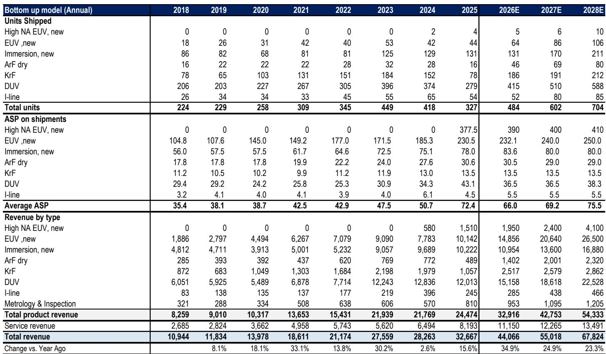
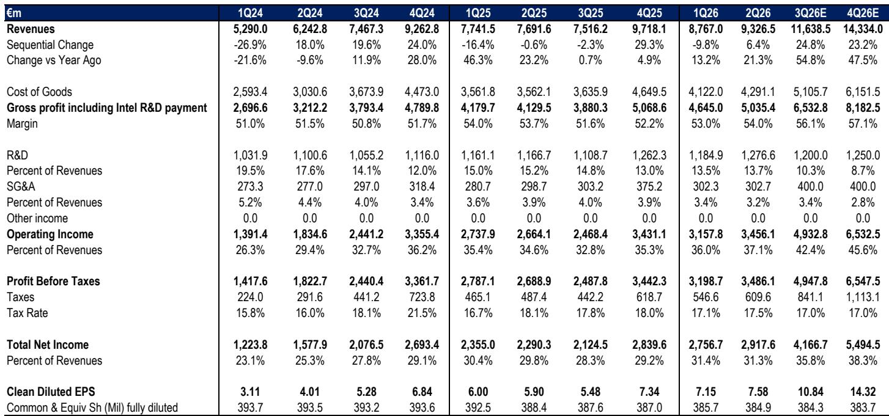
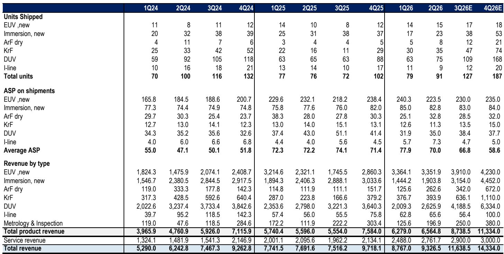

# ASML的指引哲学已发生根本性变化——市场尚未对此充分定价

ASML当前报价约为2028年每股收益的21.9倍，低于其历史市盈率中四分位区间（23至29.8倍）的下限。市场对该公司的估值，仿佛半导体行业正进入下行周期，然而目前并无此类迹象。这种脱节源于未能认识到ASML的指引模式已发生结构性转变——这一转变使其当前估值不仅显得偏低，而且与其业务发展轨迹日益不符。

多年来，观察者依赖ASML的订单簿作为未来收入动能的主要信号。公司会发布年度指引，持续达成目标，并利用订单流入为下一年建立信心。这一体系已被取代。自ASML停止报告订单数量以来，它每个季度都在上调指引。建立动能的机制不再是新增订单，而是对产能和收入目标的上调。公司在最近一次电话会议中明确表示，其2027年EUV产能指标85台并非上限。当被问及85是否代表峰值时，管理层拒绝予以确认。其含义清晰：指引的底部正在抬升，而市场却将其视为天花板。

本文认为，ASML的估值折价是一种暂时的市场定价偏差，随着共识预期赶上公司修订后的指引轨迹，这一偏差将得到修正。机会在于理解三个结构性变化：新的指引机制、供应受限市场中的定价能力，以及已经启动的毛利率转折。

## 市场误将ASML的新指引哲学视为疲软

对ASML近期沟通最普遍的误解，是其产能指标的含义。当公司给出2027年85台EUV工具和2028年110台的指引时，市场将85这一数字解读为约束。实际上，管理层将其描述为“客户对我们的要求与现阶段我们要求供应链所做工作之间的一个良好平衡体现”。关键短语是“现阶段”。公司随后补充道，如果需要更多，它将“卷起袖子，看看能否做得更多”。

这不是一家触及产能天花板的公司所使用的语言。这是一家已从提供固定年度目标转向提供滚动上调指引的公司的语言。在旧机制下，ASML给出一个全年数字，让订单来提供上行空间。在新机制下，公司每个季度上调指引，实际上将上行空间嵌入其自身的前瞻性陈述中。因此，2027年的85台工具数字并非峰值，而是一个可能被上调的基准。

对观察者而言，其结果是直接的：对2027年和2028年的共识预期过低。在最新指引更新前，某主要研究机构对2027年和2028年的预期分别比共识高出26.5%和23.8%。更新后，该机构将其2028年每股收益预期进一步上调至70.73欧元，而共识为49.90欧元。差距巨大，这一差距将会弥合，并非因为该机构错误，而是因为共识将向新的现实靠拢。随着这些上调在未来几周内实现，该股票当前的估值倍数将显得更为压缩。

## 收入产能增长快于工具数量所暗示的速度

市场定价偏差的第二层涉及工具出货量与收入之间的关系。ASML表示，2027年和2028年EUV产能将同比增长30%。但EUV带来的收入增长将显著高于30%，原因有二。

首先，工具组合正转向更高生产率的型号。ASML表示，组合中更高生产率工具的影响相当于产能额外增加10%。这意味着EUV的有效收入产能每年增长约40%，而非30%。其次，平均售价正在上升。公司正从较旧的D型工具配置转向更新的F型工具型号，后者价格更高。在供应受限的市场中，ASML还表示，它看到了实施基于价值的定价调整的机会，这在正常环境中是不可能的。

其含义是，收入增长将远超单位增长。对于浸没式DUV工具，同样的动态适用：2027年和2028年的产能指标分别约为169台和210台，但收入贡献将被更高的平均售价和更好的组合所放大。仅关注单位数量的观察者，正在显著低估收入轨迹。

## 毛利率正在转折，驱动因素是结构性的，而非周期性的

ASML对当前年度的毛利率指引远强于预期。公司将其归因于四个因素：EUV和浸没式工具组合占比提高、随着D型工具退出和F型工具进入组合带来的EUV工具定价改善、更高且组合更优的装机基础维护收入，以及更高产量改善了固定成本覆盖。关键的是，ASML表示这些因素将持续到2027年及以后，尽管它未提供该年度的具体利润率指引。

2026年下半年标志着一个转折点。根据指引更新后的预期，2026年全年毛利率预计达到55.4%，随后在2027年升至57.8%，2028年升至58.5%。每年的改善都由相同的结构性力量驱动：更丰富的产品组合、定价能力和运营杠杆。装机基础也变得更加有利可图，因为服务收入增长且利润率更高。

市场尚未在其盈利模型中反映这一利润率轨迹。随着分析师纳入公司的评论，共识毛利率预期可能会被上调。对于一家固定成本高、生产周期长的公司而言，即使毛利率的温和改善，也会转化为每股收益的更大增长。预计2028年毛利率从56.6%扩大至58.5%的185个基点扩张，在当前收入预期下，将为毛利润增加约150亿欧元。

## 围绕指引修订周期进行定位的决策框架

对于机构观察者而言，当前格局创造了一个清晰的事件序列，可用于校准仓位规模和时机。该框架基于三个可观察的触发点。

第一，指引修订周期。自停止报告订单以来，ASML每个季度都上调了指引。公司自身的措辞表明，2027年的产能数字将被上调。观察者应关注下一次季度报告，看85台EUV数字或169台浸没式数字是否有任何上调。如果公司上调其中任何一个，考虑到平均售价和生产率效应，2027年的隐含收入增幅将超过工具数量所暗示的增幅。

第二，共识预期的迁移。在最新指引之前，最乐观的研究机构预期与共识之间的差距在2027年和2028年均超过25%。随着卖方分析师更新其模型，共识将向更高的数字靠拢。每一次上调都会降低当前股价下的有效远期倍数。基于最乐观的预期，该股票交易在2028年每股收益的21.9倍；基于共识，倍数甚至更高。随着共识上升，即使股价不变，股票也变得更便宜。

第三，估值重估。ASML历史上相对于其美国半导体设备同行享有平均84%的溢价。这一溢价现已缩小至1%。该公司五年平均市盈率为33倍，其中四分位区间为23至29.8倍。在21.9倍时，该股票低于该区间的下限。回归到中四分位区间的下限意味着23倍的倍数，而回归到历史平均倍数则意味着约2333欧元的目标价。

因此，决策框架并非关于ASML是否会增长——增长轨迹已嵌入公司自身的指引中。问题在于市场是否会接受指引哲学已经改变。每一个没有出现下行趋势的季度，以及ASML每次上调目标，当前的估值都变得更难合理化。风险不在于公司令人失望，而在于市场继续对一个已结构性改变其沟通未来方式的公司应用过时的框架。

*仅供参考。部分内容可能基于源材料通过AI辅助生成、翻译、总结或编辑，可能存在遗漏或错误。请独立核实。本文不构成专业建议。*

仅供参考。部分内容可能基于源材料通过AI辅助生成、翻译、总结或编辑，可能存在遗漏或错误。请独立核实。本文不构成专业建议。

