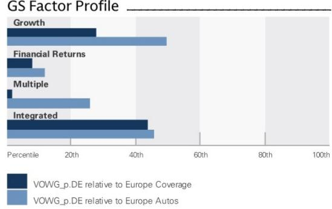
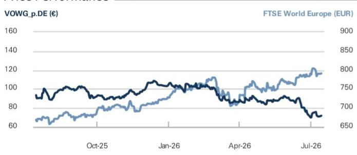

# Volkswagen (VOWG_p.DE)

Thoughts on restructuring news and Everllence transaction; revising estimates ahead of 2Q26

VOWG_p.DE 12m Price Target: €89.00 Price: €71.88 Upside: 23.8%

Remaining cautious on execution of Future Plan: We remain cautious on VW's latest "Future" restructuring plan, given the group's organisational complexity and the internal hurdles to closing capacity. Historical plant closures have been rare, small, and geographically distant, including Audi Brussels and Dresden's Transparent Factory (both 2025), Australia (1977), Pennsylvania (1988), and various LATAM/Argentina sites in the 1990s. Nevertheless, we acknowledge management's restructuring efforts, including four ongoing programmes targeting >€6bn pa. of savings, yet the path to 8-10% RoS remains unclear.

Everllence transaction P&L lift bound on details: Volkswagen (June 24, 2026) announced the sale of a 51% stake in Everllence to Bain Capital for ~€7.4bn, with a retained 49% stake limiting. Our illustrative pro-forma framework implies an EPS uplift of €3.84-€21.42 (at 100% gain accounted) or €0.23-€11.94 (at 51% accounted). We note that key assumptions on leverage, tax treatment, accounting of the retained stake, and timing remain unconfirmed and materially influence both the realized uplift and the timing of it. See our illustrative methodology below.

Revising VW estimates ahead of 2Q26: VW continues to advance its competitive positioning through restructuring and strategic tie-ups, but structural governance layers and organizational complexity lead us to question the company's ability to respond in a timely manner to persistent headwinds. We believe investors will require evidence of sustained underlying earnings' improvement before any re-rating. We revise our reported EPS estimates by -7%/-14%/-13% for FY26E/FY27E/FY28E (we do not incorporate the Everllence transaction), incorporating our latest China views, and updated estimates for Porsche AG and Traton SE. Applying an unchanged 4.0x multiple to our blended FY27E/FY28E EPS, we derive a 12-month price target of €89 (previously €97); we reiterate our Neutral rating.

## NEUTRAL

Christian Frenes  
+44(20)7051-8641 | christian.frenes@gs.com  
GS International

Robert Triulzi
+44(20)7552-2281 | robert.triulzi@gs.com
GS International

Monika Mengting Liu, CFA
+44(20)7051-7601 | monika.liu@gs.com
GS International

Key Data

Market cap: €36.6bn / $41.8bn  
Enterprise value: €53.0bn / $61.2bn  
3m ADTV: €84.5mn / $97.8mn  
Germany  
Europe Autos  
M&A Rank: 3  
Leases incl. in net debt & EV?: Yes

GS Forecast

<table><tr><td></td><td>12/25</td><td>12/26E</td><td>12/27E</td><td>12/28E</td></tr><tr><td>Revenue (€ mn) New</td><td>321,913.5</td><td>326,886.7</td><td>336,154.4</td><td>342,587.7</td></tr><tr><td>Revenue (€ mn) Old</td><td>321,913.5</td><td>330,616.3</td><td>339,151.0</td><td>347,180.7</td></tr><tr><td>EBIT (€ mn)</td><td>8,868.0</td><td>14,493.7</td><td>17,121.6</td><td>19,408.3</td></tr><tr><td>EPS (€) New</td><td>13.35</td><td>17.25</td><td>20.94</td><td>23.62</td></tr><tr><td>EPS (€) Old</td><td>13.35</td><td>18.56</td><td>24.27</td><td>27.15</td></tr><tr><td>P/E (X)</td><td>7.2</td><td>4.2</td><td>3.4</td><td>3.0</td></tr><tr><td>Dividend yield (%)</td><td>5.5</td><td>7.2</td><td>8.6</td><td>9.7</td></tr><tr><td>CROCI (%)</td><td>(0.5)</td><td>3.8</td><td>4.0</td><td>4.0</td></tr><tr><td>Net debt/EBITDA (X)</td><td>(1.0)</td><td>(0.9)</td><td>(1.0)</td><td>(1.1)</td></tr><tr><td></td><td>3/26</td><td>6/26E</td><td>9/26E</td><td>12/26E</td></tr><tr><td>EPS (€)</td><td>2.61</td><td>4.75</td><td>2.78</td><td>7.11</td></tr></table>

GS Factor Profile

  
Source: Company data, GS estimates. See disclosures for details.

## Volkswagen (VOWG_p.DE)

Rating since Nov 23, 2025

Ratios & Valuation

<table><tr><td></td><td>12/25</td><td>12/26E</td><td>12/27E</td><td>12/28E</td></tr><tr><td>EV/sales (X)</td><td>0.5</td><td>0.4</td><td>0.4</td><td>0.4</td></tr><tr><td>EV/EBITDAR (X)</td><td>4.3</td><td>3.7</td><td>3.4</td><td>3.0</td></tr><tr><td>EV/EBITDA (excl. leases) (X)</td><td>4.3</td><td>3.7</td><td>3.4</td><td>3.0</td></tr><tr><td>EV/EBIT (X)</td><td>17.4</td><td>9.5</td><td>7.7</td><td>6.5</td></tr><tr><td>P/E (X)</td><td>7.2</td><td>4.2</td><td>3.4</td><td>3.0</td></tr><tr><td>FCF yield (%)</td><td>(12.1)</td><td>8.5</td><td>13.6</td><td>13.0</td></tr><tr><td>Dividend yield (%)</td><td>5.5</td><td>7.2</td><td>8.6</td><td>9.7</td></tr><tr><td>EV/GCI (X)</td><td>0.1</td><td>0.1</td><td>0.1</td><td>0.0</td></tr><tr><td>CROCI (%)</td><td>(0.5)</td><td>3.8</td><td>4.0</td><td>4.0</td></tr><tr><td>ROIC (%)</td><td>3.9</td><td>6.2</td><td>7.2</td><td>7.9</td></tr><tr><td>ROA (%)</td><td>1.2</td><td>1.7</td><td>2.0</td><td>2.2</td></tr><tr><td>Days inventory outst, sales</td><td>56.3</td><td>55.7</td><td>54.8</td><td>53.8</td></tr><tr><td>Asset turnover (X)</td><td>4.5</td><td>4.6</td><td>4.8</td><td>5.0</td></tr><tr><td>Net debt/equity (excl. leases) (%)</td><td>(17.0)</td><td>(16.6)</td><td>(18.3)</td><td>(19.5)</td></tr><tr><td>Capex/D&A (%)</td><td>90.9</td><td>102.1</td><td>103.4</td><td>101.3</td></tr><tr><td>FCF cover of dividends (X)</td><td>(3.7)</td><td>2.4</td><td>3.0</td><td>2.6</td></tr></table>

Growth & Margins (%)

<table><tr><td colspan="5">Growth &amp; Margins (%)</td></tr><tr><td></td><td>12/25</td><td>12/26E</td><td>12/27E</td><td>12/28E</td></tr><tr><td>Total revenue growth</td><td>(0.8)</td><td>1.5</td><td>2.8</td><td>1.9</td></tr><tr><td>EBITDA growth</td><td>(10.6)</td><td>4.9</td><td>5.1</td><td>4.8</td></tr><tr><td>EBIT growth</td><td>(53.5)</td><td>63.4</td><td>18.1</td><td>13.4</td></tr><tr><td>Net inc. growth</td><td>(37.8)</td><td>29.3</td><td>21.4</td><td>12.8</td></tr><tr><td>EPS growth</td><td>(37.7)</td><td>29.2</td><td>21.4</td><td>12.8</td></tr><tr><td>DPS growth</td><td>(17.3)</td><td>(1.9)</td><td>19.4</td><td>13.0</td></tr></table>

Balance Sheet (€ mn)

<table><tr><td colspan="5">Balance Sheet (€ mn)</td></tr><tr><td></td><td>12/25</td><td>12/26E</td><td>12/27E</td><td>12/28E</td></tr><tr><td>Cash &amp; cash equivalents</td><td>30,546.0</td><td>31,832.9</td><td>36,568.8</td><td>40,419.6</td></tr><tr><td>Accounts receivable</td><td>61,112.0</td><td>61,797.9</td><td>62,392.4</td><td>63,457.7</td></tr><tr><td>Inventory</td><td>48,761.0</td><td>50,932.3</td><td>50,051.0</td><td>50,905.7</td></tr><tr><td>Financial services assets</td><td>224,782.8</td><td>187,262.8</td><td>192,016.8</td><td>196,761.8</td></tr><tr><td>Other current assets</td><td>107,445.9</td><td>125,391.2</td><td>128,468.8</td><td>131,506.7</td></tr><tr><td>Total current assets</td><td>247,864.9</td><td>269,954.3</td><td>277,481.1</td><td>286,289.7</td></tr><tr><td>Net PP&amp;E</td><td>71,112.0</td><td>70,471.3</td><td>69,271.4</td><td>67,712.9</td></tr><tr><td>Net intangibles</td><td>91,026.0</td><td>93,087.7</td><td>95,052.4</td><td>96,899.8</td></tr><tr><td>Total investments</td><td>0.0</td><td>0.0</td><td>0.0</td><td>0.0</td></tr><tr><td>Other long-term assets</td><td>234,463.7</td><td>180,071.1</td><td>183,147.5</td><td>186,254.6</td></tr><tr><td>Total assets</td><td>644,466.6</td><td>613,584.4</td><td>624,952.4</td><td>637,157.0</td></tr><tr><td>Accounts payable</td><td>32,118.0</td><td>33,591.8</td><td>33,287.3</td><td>33,044.6</td></tr><tr><td>Short-term debt</td><td>18,273.0</td><td>18,966.0</td><td>18,966.0</td><td>18,966.0</td></tr><tr><td>Short-term lease liabilities</td><td>-</td><td>-</td><td>-</td><td>-</td></tr><tr><td>Other current liabilities</td><td>176,134.0</td><td>195,247.1</td><td>195,247.1</td><td>195,247.1</td></tr><tr><td>Total current liabilities</td><td>226,525.0</td><td>247,804.9</td><td>247,500.4</td><td>247,257.7</td></tr><tr><td>Long-term debt</td><td>55,767.0</td><td>52,649.0</td><td>52,649.0</td><td>52,649.0</td></tr><tr><td>Long-term lease liabilities</td><td>-</td><td>-</td><td>-</td><td>-</td></tr><tr><td>Other long-term liabilities</td><td>159,120.5</td><td>103,708.1</td><td>106,470.7</td><td>108,833.9</td></tr><tr><td>Total long-term liabilities</td><td>214,887.5</td><td>156,357.1</td><td>159,119.7</td><td>161,482.9</td></tr><tr><td>Total liabilities</td><td>441,412.5</td><td>404,162.0</td><td>406,620.1</td><td>408,740.6</td></tr><tr><td>Preferred shares</td><td>--</td><td>--</td><td>--</td><td>--</td></tr><tr><td>Total common equity</td><td>174,002.0</td><td>182,051.3</td><td>190,961.1</td><td>201,045.2</td></tr><tr><td>Minority interest</td><td>29,052.4</td><td>27,371.0</td><td>27,371.0</td><td>27,371.0</td></tr><tr><td>Total liabilities &amp; equity</td><td>644,466.9</td><td>613,584.2</td><td>624,952.2</td><td>637,156.8</td></tr><tr><td>Financial services adjustment</td><td>45,717.0</td><td>47,720.3</td><td>49,397.9</td><td>51,035.8</td></tr></table>

Price Performance  

<table><tr><td></td><td>3m</td><td>6m</td><td>12m</td></tr><tr><td>Absolute</td><td>(20.6)%</td><td>(30.7)%</td><td>(22.0)%</td></tr><tr><td>Rel. to the FTSE World Europe (EUR)</td><td>(23.5)%</td><td>(34.1)%</td><td>(33.9)%</td></tr></table>

<table><tr><td colspan="5">Cash Flow (€ mn)</td></tr><tr><td></td><td>12/25</td><td>12/26E</td><td>12/27E</td><td>12/28E</td></tr><tr><td>Net income</td><td>6,709.0</td><td>11,537.1</td><td>12,938.8</td><td>15,533.5</td></tr><tr><td>D&amp;A add-back</td><td>26,823.0</td><td>22,933.7</td><td>22,203.3</td><td>21,791.8</td></tr><tr><td>Minority interest add-back</td><td>231.0</td><td>1,111.0</td><td>665.0</td><td>1,177.8</td></tr><tr><td>Net (inc)/dec working capital</td><td>3,094.0</td><td>(1,747.5)</td><td>(17.7)</td><td>(2,162.6)</td></tr><tr><td>Other operating cash flow</td><td>(21,847.9)</td><td>(4,989.5)</td><td>(4,116.3)</td><td>(5,938.9)</td></tr><tr><td>Cash flow from operations</td><td>15,009.1</td><td>28,844.7</td><td>31,673.1</td><td>30,401.7</td></tr><tr><td>Capital expenditures</td><td>(24,394.0)</td><td>(23,404.7)</td><td>(22,968.2)</td><td>(22,080.6)</td></tr><tr><td>Acquisitions</td><td>(1,499.0)</td><td>(1,741.0)</td><td>(1,400.0)</td><td>(1,400.0)</td></tr><tr><td>Divestitures</td><td>-</td><td>-</td><td>-</td><td>-</td></tr><tr><td>Others</td><td>(1,590.0)</td><td>(1,505.0)</td><td>-</td><td>-</td></tr><tr><td>Cash flow from investing</td><td>(27,483.0)</td><td>(26,650.7)</td><td>(24,368.2)</td><td>(23,480.6)</td></tr><tr><td>Repayment of lease liabilities</td><td>-</td><td>-</td><td>-</td><td>-</td></tr><tr><td>Dividends paid (common &amp; pref)</td><td>(2,619.0)</td><td>(2,619.1)</td><td>(2,569.0)</td><td>(3,070.3)</td></tr><tr><td>Inc/(dec) in debt</td><td>-</td><td>-</td><td>-</td><td>-</td></tr><tr><td>Other financing cash flows</td><td>14,536.5</td><td>9,988.0</td><td>0.0</td><td>0.0</td></tr><tr><td>Cash flow from financing</td><td>11,917.5</td><td>7,368.9</td><td>(2,569.0)</td><td>(3,070.3)</td></tr><tr><td>Total cash flow</td><td>(1,494.9)</td><td>9,981.5</td><td>4,735.9</td><td>3,850.8</td></tr><tr><td>Reinvestment rate (%)</td><td>204.7</td><td>76.5</td><td>72.5</td><td>67.8</td></tr></table>

Source: FactSet. Price as of 14 Jul 2026 close.  
Source: Company data, GS estimates.

Income Statement (€ mn)

<table><tr><td colspan="5">Income Statement (€ mn)</td></tr><tr><td></td><td>12/25</td><td>12/26E</td><td>12/27E</td><td>12/28E</td></tr><tr><td>Total revenue</td><td>321,913.5</td><td>326,886.7</td><td>336,154.4</td><td>342,587.7</td></tr><tr><td>Total operating expenses</td><td>(287,581.5)</td><td>(291,224.8)</td><td>(298,056.5)</td><td>(302,219.7)</td></tr><tr><td>R&amp;D</td><td>(18,434.0)</td><td>(18,063.9)</td><td>(17,614.7)</td><td>(17,533.7)</td></tr><tr><td>Other operating inc./(exp.)</td><td>(7,029.0)</td><td>(3,106.3)</td><td>(3,361.5)</td><td>(3,425.9)</td></tr><tr><td>EBITDA</td><td>35,691.0</td><td>37,427.4</td><td>39,324.9</td><td>41,200.1</td></tr><tr><td>Depreciation &amp; amortisation</td><td>(26,823.0)</td><td>(22,933.7)</td><td>(22,203.3)</td><td>(21,791.8)</td></tr><tr><td>EBIT</td><td>8,868.0</td><td>14,493.7</td><td>17,121.6</td><td>19,408.3</td></tr><tr><td>Net interest inc./(exp.)</td><td>(1,421.0)</td><td>(1,639.4)</td><td>(1,673.7)</td><td>(1,484.3)</td></tr><tr><td>Income/(loss) from associates</td><td>930.5</td><td>524.9</td><td>(179.1)</td><td>(115.7)</td></tr><tr><td>Profit/(loss) on disposals</td><td>-</td><td>-</td><td>-</td><td>-</td></tr><tr><td>Total other net</td><td>930.0</td><td>-</td><td>-</td><td>-</td></tr><tr><td>Pre-tax profit</td><td>9,307.5</td><td>13,341.2</td><td>15,268.8</td><td>17,808.4</td></tr><tr><td>Provision for taxes</td><td>(2,403.0)</td><td>(3,599.2)</td><td>(4,122.6)</td><td>(4,808.3)</td></tr><tr><td>Minority interest</td><td>(231.0)</td><td>(1,111.0)</td><td>(665.0)</td><td>(1,177.8)</td></tr><tr><td>Preferred dividends</td><td>-</td><td>-</td><td>-</td><td>-</td></tr><tr><td>Net inc. (pre-exceptionals)</td><td>6,673.5</td><td>8,631.0</td><td>10,481.2</td><td>11,822.3</td></tr><tr><td>Post-tax exceptionals</td><td>-</td><td>-</td><td>-</td><td>-</td></tr><tr><td>Net inc. (post-exceptionals)</td><td>6,673.5</td><td>8,631.0</td><td>10,481.2</td><td>11,822.3</td></tr><tr><td>EPS (basic, pre-except) (€)</td><td>13.31</td><td>17.22</td><td>20.91</td><td>23.58</td></tr><tr><td>EPS (basic, post-except) (€)</td><td>13.31</td><td>17.22</td><td>20.91</td><td>23.58</td></tr><tr><td>Wtd avg shares out. (basic) (mn)</td><td>501.3</td><td>501.3</td><td>501.3</td><td>501.3</td></tr><tr><td>Tax rate (%)</td><td>25.8</td><td>27.0</td><td>27.0</td><td>27.0</td></tr><tr><td>Common dividends declared</td><td>2,636.8</td><td>2,586.7</td><td>3,088.0</td><td>3,489.0</td></tr><tr><td>DPS (€)</td><td>5.26</td><td>5.16</td><td>6.16</td><td>6.96</td></tr></table>

## Restructuring optimism overdone; execution remains the key hurdle

Recent restructuring headlines have driven a rebound in investor sentiment but, in our view, the market is likely mispricing the execution risk inherent to Volkswagen's organizational complexity. Press coverage ahead of the CEO's July 9, 2026 proposal to the Supervisory Board outlined a materially more aggressive restructuring package than that which was ultimately detailed in consecutive company releases on the proposal. The initial press speculation talked to personnel reductions of up to 100k globally, and the potential closure of four German plants, said to be Hanover, Emden, Zwickau, and Audi's Neckarsulm, with phased shutdowns between 2031 and 2034. Per the subsequent company announcements, VW is now targeting a reduction of the model line-up of up to 50%, a cut in its offering complexity of up to 75%, and a resizing of its global production capacity to approximately ~9m units per year (from ~12m pre-COVID). The press release following the presentation of the proposal to the Supervisory Board also reconfirmed Volkswagen Group's commitment to a RoS margin of 8%-10% by 2030.

Exhibit 1: Volkswagen is currently executing four separate restructuring programmes simultaneously and aims to realise a total of >€6bn pa of cost savings
VW restructuring overview

<table><tr><td>Programme</td><td>Targets</td></tr><tr><td>Future Volkswagen (Zukunft Volkswagen)</td><td>€1.5bn p.a. labor savings from the wage settlement by 2029Technical capacity reduction by ~730k units by 2028E&gt;35k employee reduction by 2030Net cost effects &gt;€4bn p.a by 2030</td></tr><tr><td>Audi &quot;Agreement for the Future&quot;</td><td>Workforce reduction ~7,500 positions-25% German site capacity reductionBrussels site closure reduces capacity by ~120k units&gt;€1bn p.a. mid-term savings</td></tr><tr><td>Porsche AG strategic realignment</td><td>15% total workforce reduction by 2029 (~3,900)Rescale China dealerships from 150 to 80 by 2027Near-term double-digit margin recovery; medium-term up to 15%</td></tr><tr><td>CARIAD transformation</td><td>~30% of workforce reduction by end of 2025 equalling ~1,450 positionsRefocus to brand led software supplierEntity level EBIT breakeven in 2027 and CF breakeven in 2028</td></tr></table>

Source: Company filings

We believe that the restructuring announcements have strategic merit, but maintain our cautious stance (held since our initiation in November 2025): scale and organizational complexity make delivering meaningful restructuring outcomes difficult. In Volkswagen's case, complexity is amplified by the Volkswagen Law, which grants the State of Lower Saxony (which controls $11.8\%$ of VW's capital and $20.0\%$ of its voting rights) an effective blocking minority via the $>80\%$ qualified-majority threshold, alongside Porsche SE's $53.3\%$ voting control ( $31.9\%$ of the capital) and Qatar Holding's $17.0\%$ of voting rights. Under Germany's co-determination regime, employee representatives occupy 10 of 20 supervisory board seats, with the Chairman's casting vote ordinarily breaking ties.

Volkswagen's restructuring track record over the past 10 years reinforces our reservations. The group has run consecutive restructuring programs, including the 2016 Zukunftspakt (€3bn annual savings target, 14k job reductions by 2020), the 2023 Accelerate Forward program (€10bn cumulative earnings' contribution by 2026), and

most recently the December 2024 Zukunft Volkswagen agreement, when management took the most dramatic step, demanding a 10% pay cut and openly floating plant closures, ultimately canceling the long-standing employment guarantees. Following labour negotiations and strikes, the guarantees were reinstated, with the final agreement delivering >€15bn pa in medium-term savings, a 734k unit reduction in capacity, and >35k job cuts by 2030 through socially responsible measures rather than compulsory redundancies. Meanwhile, since FY22 we have seen VW's operating margin deteriorate, from 8.1% to 2.8% in FY25. While we believe VW can achieve some of its factored cost-measures, recent history suggests that restructuring announcements alone are not always sufficient meaningful financial performance improvement.

We remain cautious on the latest restructuring plan and emphasize focusing on the follow-up execution. The Supervisory Board's reported rejection of the CEO's latest restructuring proposal by 12 votes to 7 on July 9, 2026 highlights this issue. Opposition from labour and Lower Saxony representatives, coupled with a temporarily vacant shareholder seat following a recent resignation, likely drove the outcome. The CEO will resume negotiations over a revised proposal after the summer break, which we see as a challenging task: the workers' council has already noted that it may escalate to work strikes if proposals continue to consider factory closures. In short, we see the announced actions of the Future Plan as significantly more modest than those previously speculated in the press, and as insufficient, in isolation, to deliver the $8\% - 10\%$ margin target for 2030, as reiterated by management.

## The Everllence transaction

Everllence stake sale to Bain Capital announced: On June 24, 2026, the Volkswagen Group entered into an exclusive arrangement with Bain Capital to sell a $51\%$ majority stake in Everllence, a leading global manufacturer of large engines, turbomachinery and decarbonization solutions, while retaining a $49\%$ stake over the medium term. Structured as a leveraged buy-out, the transaction generates proceeds of approximately €7.4 billion for Volkswagen, per the company, with a decision on the use of proceeds to be taken at a later date. Completion remains subject to the information and consultation processes required by law in France, alongside other customary conditions and regulatory approvals, which are targeted for fulfillment by the end of 2026.

Exhibit 2: Everllence transaction details

<table><tr><td>Element</td><td>Detail</td></tr><tr><td>Seller</td><td>Volkswagen Group</td></tr><tr><td>Buyer</td><td>Bain Capital (private equity)</td></tr><tr><td>Target</td><td>Everllence (formerly MAN Energy Solutions)</td></tr><tr><td>Stake sold</td><td>51% (majority)</td></tr><tr><td>Stake retained by VW</td><td>49% (medium term)</td></tr><tr><td>Structure</td><td>Leveraged buy-out (LBO)</td></tr><tr><td>Proceeds to VW*</td><td>~€7.4 billion</td></tr><tr><td>Target book value (on VW balance sheet, May 31 2026)</td><td>~€3.4 billion</td></tr><tr><td>Everllence revenue</td><td>€4.9 billion</td></tr><tr><td>Employees</td><td>~16,000</td></tr><tr><td>Expected closing</td><td>End of 2026 (subject to regulatory + works council processes)</td></tr><tr><td colspan="2">*Proceeds are derived from the 51% share and expected debt following completion of the leveraged buy-out transaction.</td></tr></table>

Source: Company data

51% stake sale without Porsche Holding: We note that the 51% stake excludes the

Leverage as multiple of Everllence EBITDA (Row); assumed Everllence EBITDA margin in FY25 (Column) - 51% basis

Porsche Holding Family despite prior news flow suggesting an additional 10% participation by Porsche Holding alongside any majority P/E buyer. The announced decision to retain a 49% stake over the medium term, rather than pursue a fuller divestment, limits the immediate portfolio-streamlining impact in our view.

Illustrative calculation implies a meaningful EPS/DPS uplift but missing details complicate assessment of the gain: Our illustrative transaction analysis (based on a range of Everllence EBITDA margins and EBITDA leverage ratios) indicates an EPS uplift from the book gain of €3.84–€21.42 (on a 100% accounted sale basis) or €0.23–€11.94 per share (on a 51% basis). Assuming the low end of VW's payout ratio (30%), this would equate to a DPS uplift of €1.15–€6.43 at 100% and €0.07–€3.58 at 51%. However, we note that several critical details, including leverage, tax treatment and accounting treatment remain unconfirmed, representing key uncertainties in our analysis of the implications of the transaction for EPS and DPS.

Exhibit 3: Leverage and underlying EBITDA margin are the key variables of the Everllence business sale and its impact on EPS at deal closing
Leverage as multiple of Everllence EBITDA (Row); assumed Everllence EBITDA margin in FY25 (Column) - 100% accounted sale basis

<table><tr><td rowspan="2"></td><td colspan="7">Pro-Forma FY26 EPS Accret
