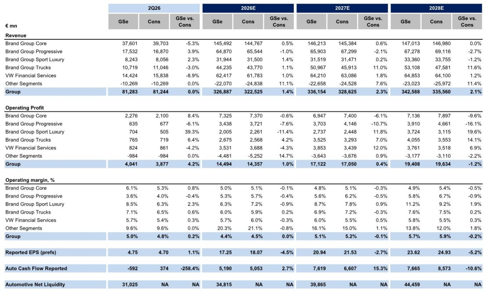
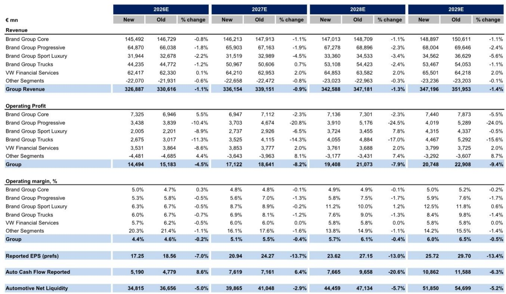
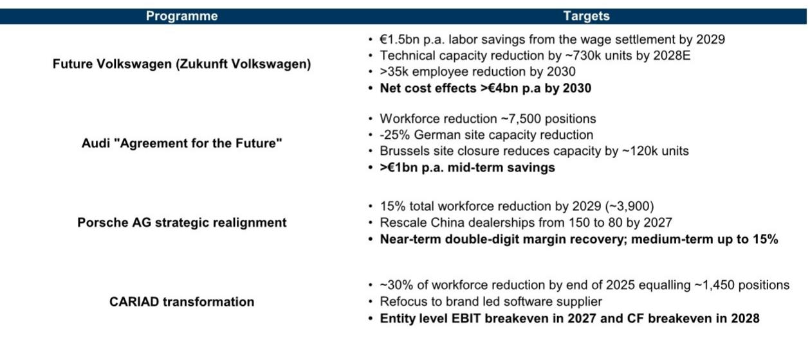

# 大众集团的转型雄心与治理现实：执行而非宣言将决定结果

大众集团的报价约为未来收益的4.2倍，这一估值水平意味着市场正在为其定价两种可能：要么是盈利的显著复苏，要么是品牌价值的长期折损。以当前报价水平计算，其未来财年的股息回报表现约为7.2%，远期市盈率约为3.4倍，这些水平在历史上通常与周期性的深度调整或结构性的价值变化相关。这两种叙事之间的张力，自柴油事件以来从未如此尖锐。管理层已公布了多年来最具雄心的转型蓝图，目标是将车型系列减少50%，产品复杂度降低75%，并将全球产能从疫情前约1200万辆调整至每年约900万辆。然而，就在该计划提交监事会的同一周，它以12票对7票被否决，劳工代表和下萨克森州政府共同阻止了该提案。这一矛盾再明显不过：一个历史性的转型雄心，与一个恰恰旨在阻止此类变革的治理结构发生了碰撞。

对于观察者而言，核心问题并非大众集团是否识别出了正确的问题——它显然已经识别——而是该集团的治理架构、其在转型承诺上执行不足的历史记录，以及Everllence交易中尚未解决的机制问题，是否允许它在竞争窗口关闭前完成执行。我们的分析表明，市场可能低估了执行结果令人失望的概率。我们分别下调了未来三个财年的每股盈利预测7%、14%和13%，这反映了我们更新后的宏观环境展望以及对保时捷和Traton SE的预测修正。应用不变的4.0倍估值倍数于混合远期盈利，我们设定了目标报价。上行空间存在，但它取决于一系列治理和运营结果的实现，而历史表明这些结果远非确定无疑。

## 大众集团的治理架构为其果断转型设置了多数同行所不具备的结构性障碍

该集团的所有权和控制结构并非一个背景条件——它是决定当前转型计划成功或停滞的主要变量。大众集团受《大众法》约束，该法赋予仅持有11.8%资本但拥有20.0%投票权的下萨克森州，通过超过80%的特定多数门槛，形成有效的否决权。保时捷控股以31.9%的资本控制了53.3%的投票权，而卡塔尔控股则持有17.0%的投票权。这种三方控制结构意味着，任何重大转型决策都必须获得三个利益根本不同的参与方的一致同意：一个关注就业和税收的州政府、一个关注长期品牌价值的家族控股公司，以及一个关注投资组合层面回报表现的主权财富基金。

德国的共同决策制度加剧了这种复杂性。员工代表占据了监事会20个席位中的10个，而监事会主席拥有通常可打破平局的表决权。2026年7月9日的监事会投票中，CEO的转型提案以12票对7票被否决，这展示了该设计的实际后果。劳工代表和下萨克森州的任命者反对该计划，而一个因近期辞职而暂时空缺的股东席位则打破了平衡。CEO将在夏季休会后重启谈判，但结构性现实是，任何修订后的提案都必须满足一个包括利益直接与产能削减和裁员相悖的参与方的联盟。读者不应假设修订后的提案会比刚刚被否决的那一个更有实质意义。治理架构并非一个需要克服的摩擦；它是任何转型都必须在其内部运作的系统。

## 大众集团的转型记录显示出一个模式：雄心勃勃的目标之后是温和的交付，当前计划有重蹈覆辙的风险

大众集团在过去十年中连续执行了多项转型计划，每一项都以极大的声势宣布，但每一项的交付都少于最初的承诺。2016年的“未来契约”目标是到2020年实现30亿欧元的年度节省和14,000个岗位的削减。2023年的“加速前进”计划旨在到2026年实现100亿欧元的累计盈利贡献。2024年12月的“未来大众”协议，是在管理层与劳工之间发生该集团现代史上最激烈对抗之后达成的，管理层曾要求减薪10%并公开提出关闭工厂的可能性，最终在罢工和谈判后恢复了就业保障。最终协议实现了超过150亿欧元的中期年度节省、73.4万辆的产能削减以及到2030年超过35,000个岗位的裁减——但这是通过社会责任措施而非强制裁员实现的。

财务结果清晰地说明了问题。自2022财年以来，大众集团的运营利润率已从8.1%下降至2025财年的2.8%，三年内下降了530个基点。仅2025财年，息税前利润就下降了53.5%。该集团目前的目标是到2030年实现8%至10%的销售回报率，这需要将当前利润率提高两倍。这并非不可能，但历史模式表明，转型公告并不足以阻止利润率的下滑。四项正在进行的计划——未来大众、奥迪的未来协议、保时捷的战略调整以及CARIAD的转型——共同目标是每年节省超过60亿欧元。然而，从这些逐项节省到8-10%的集团层面销售回报率之间的路径仍不清晰，尤其是在未来财年收入增长预测仅为1.5%和2.8%的情况下。如果收入基础几乎没有增长，仅靠成本节省无法弥合500个基点的利润率差距。

## Everllence交易提供了可观的每股盈利提升，但结果范围如此之广，以至于无法可靠地纳入预测

大众集团于2026年6月24日宣布，将其在Everllence的51%股权以约74亿欧元出售给贝恩资本。这引入了第二个可能显著改变盈利轨迹的变量——但前提是会计和结构细节能够以有利的方式解决。我们的示意性框架显示，如果确认全部收益，每股盈利提升范围在3.84欧元至21.42欧元之间；如果仅对51%进行会计处理，则范围为0.23欧元至11.94欧元。这个范围如此之广，以至于对估值目的而言实际上没有信息量。提升幅度取决于杠杆假设、税务处理、对保留的49%股权的会计方法以及确认时间——所有这些都尚未确认。

对观察者而言，关键洞察并非这个范围的中间值，而是不确定性本身。如果该交易的结构旨在最大化已确认收益，它可能为利润表提供多年的缓冲，同时转型计划得以推进。如果其结构保守，对每股盈利的影响可能微乎其微。管理层尚未提供足够细节，使分析师能够有信心地将该交易纳入已发布的预测。我们选择不将其纳入我们修订后的预测。观察者应将Everllence交易视为上行潜力的一个潜在来源，而非基础情景下的盈利驱动因素。风险在于，市场在细节确认之前就已将有利结果计入价格，从而在实际结构证明增值效果较弱时产生下行风险。

## 观察者的决策框架：重新定价合理化的三个前提条件

当前的估值意味着市场已经在为显著的转型溢价定价。以未来财年每股盈利的4.2倍和远期每股盈利的3.4倍计算，大众集团的报价相对于欧洲汽车同行存在折价，这反映了市场对盈利轨迹的深度怀疑。若要重新定价至5-6倍区间——这与成功的转型情景相符——则需要依次满足三个条件。

首先，治理僵局必须得到解决。7月9日监事会的否决并非一个暂时的挫折；它是一个信号，表明批准产能削减所需的联盟目前并不存在。观察者应关注一份能够获得劳工代表和下萨克森州支持的修订提案。这可能需要做出一些权衡，从而稀释转型的财务影响——更长的时限、更小的产能削减幅度或更高的遣散成本。市场应以审慎态度对待任何修订提案：一份能通过监事会的计划，可能是一份已被削弱至无效程度的计划。

其次，转型必须转化为已报告财务数据中可见的利润率改善。我们预测未来三个财年的息税前利润分别为145亿欧元、171亿欧元和194亿欧元，对应的息税前利润率分别为4.4%、5.1%和5.7%。这些数字远低于8-10%的目标，仅代表从2025财年2.8%的低谷逐步复苏。观察者应要求看到成本节省传导至利润表的证据，然后才赋予更高的估值倍数。自由现金流回报表现——我们预测未来两个财年分别为8.5%和13.6%——可能是比息税前利润率更可靠的基础进展指标，因为后者受到转型费用和一次性项目的干扰。

第三，中国业务必须稳定。我们修订后的预测纳入了更新后的中国展望，大众集团在该市场的合资企业盈利轨迹将是一个关键的摇摆因素。中国市场的持续变化将抵消在欧洲实现的任何节省。观察者应关注大众集团在该地区的市场份额轨迹、本地生产成本以及向电池电动汽车转型的步伐。

在这三个条件得到满足之前，报价可能仍将维持区间波动，Everllence交易带来的上行空间将提供一个底部而非催化剂。重新定价的可能性是存在的，但治理、执行和竞争方面的风险同样重大。

*仅供参考。部分内容可能基于源材料通过AI辅助生成、翻译、总结或编辑，可能存在遗漏或错误。请独立核实。本文不构成专业建议。*

仅供参考。部分内容可能基于源材料通过AI辅助生成、翻译、总结或编辑，可能存在遗漏或错误。请独立核实。本文不构成专业建议。

