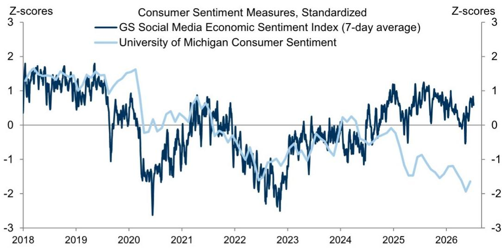
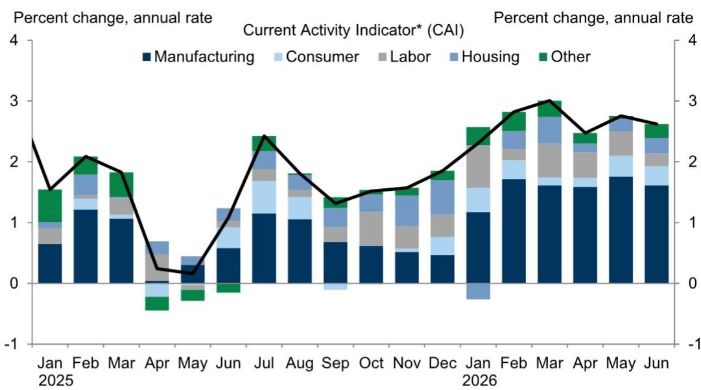
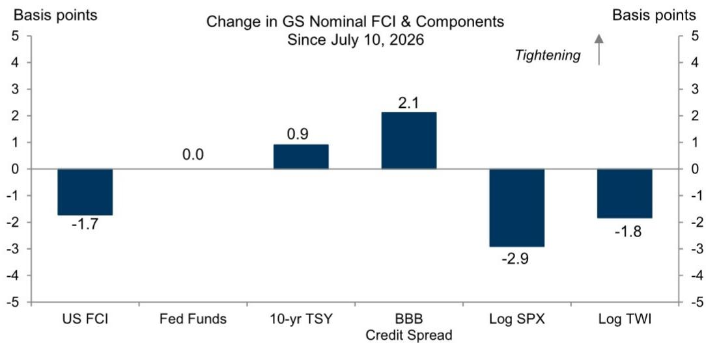

# 美国经济既未加速也未减速——正进入可控巡航阶段

美国经济正在传递一个连贯的信号，而许多市场参与者误读为混乱。某全球研究机构的专属经济指标更新显示，实际资金状况指数在过去一周仅下降0.4个基点至98.29，而名义指数下降1.7个基点至98.46，这几乎完全由权益类资产价格上涨驱动。这种金融市场乐观情绪与实际经济动能之间的分化，是定义当前周期的核心张力。

该机构的当前活动指标6月为+2.6%，低于5月的+2.8%。这种减速既不是即将衰退的信号，也不是重新加速的前兆。它标志着经济在经历疫情后波动后，已找到其巡航高度。继续以二元叙事（软着陆与硬着陆）进行判断的观察者，正在错过更微妙的现实：经济正进入一个可控巡航阶段，增长稳定在较低但可持续的水平，通胀保持粘性，而资金状况正在完成利率单独无法完成的工作。

对于企业领导者和资源配置者而言，核心战略问题并非经济是否会出问题，而是他们的投资组合和运营是否已校准到一个容错空间收窄、资金状况与实际活动之间的差距创造不对称风险、数据流更多是关于降噪而非信号检测的环境。

## 资金状况指数揭示市场情绪与实际经济动能之间的危险分化

名义资金状况指数下降1.7个基点，但实际指数仅下降0.4个基点。这一差距之所以重要，是因为它讲述了两套不同经济的故事。名义指数受权益类资产价格影响较大，后者因降息预期和人工智能热潮而上涨。实际指数剔除通胀影响，捕捉企业和家庭面临的实际资金成本。

其含义是明确的：金融市场正在定价一个比实际经济所经历的更为宽松的环境。这创造了一个脆弱点。如果实际状况未能跟随名义状况走低——如果美联储更长时间维持高利率，或者如果通胀被证明比预期更具粘性——那么由权益类资产驱动的名义状况宽松可能急剧逆转。如果实际指数不配合，名义状况下降1.7个基点就是一种幻象。

对于企业战略制定者而言，这意味着他们正在规划的资金成本可能低于实际实现的水平。基于持续资金宽松假设做出的资本支出决策可能被错误定价。报告中的资本支出追踪器应在此背景下解读：任何投资计划的上升可能为时过早，如果它建立在已经比实际经济所证明的更宽松的资金状况之上。

## GDP增长+2.2%是新常态，而非过渡点

该机构对第二季度GDP的预测为季调年化+2.2%。这低于过去两年的高增长率，但并非警示信号。这是经济进入后正常化增长路径的稳定过程。

关键洞察在于，2.2%并非介于更高和更低增长之间的中途点。它是目的地。疫情后的反弹、财政刺激和库存重建已成为过去。经济目前正在其潜在水平附近运行，增长率反映了这一点。当前活动指标从5月的+2.8%降至6月的+2.6%强化了这一观点：经济并未快速失去动能；它正在滑翔至可持续水平。

对于观察者而言，这意味着传统的轮动策略——增长加速时转向周期性板块，或增长减速时转向防御性板块——已不那么有效。信号不是方向性的，而是水平性的。问题不在于下季度增长会更高还是更低，而在于2.2%的增长环境是否支持当前的资产估值。在大多数历史背景下，答案是肯定的。但问题在于，估值已经不仅定价了这一增长水平，还定价了未来的降息和利润率扩张。2.2%的增长率是基础；建立在其上的一切——权益类资产倍数、信用利差、房地产资本化率——必须针对这一基础进行压力测试，而非针对重新加速的幻想。

## MAP指数归零标志着惊喜驱动型市场的终结

该机构的经济惊喜MAP指数降至恰好0.0。这是一个极为重要的数据点，多数市场评论会关注。读数为零意味着近期经济数据完全符合预期。既没有正面惊喜，也没有负面惊喜。

这是惊喜交易的终结。过去两年，市场一直由实际数据与共识预期之间的差距驱动。当数据超出预期时，利率下跌，周期性板块上涨。当数据低于预期时，利率上涨，防御性板块表现更好。这一模式现已结束。MAP指数为零意味着对经济的共识看法已与现实趋同。通过押注方向性惊喜来获取优势已不再可能。

战略含义在于，超额收益必须来自结构性定位，而非战术性时机把握。如果没有人感到意外，那么每个人都为相同的结果做好了准备。机会在于识别共识在哪些方面是错误的——不是关于下一个数据点，而是关于结构性模式。例如，共识可能正确认为增长为2.2%且通胀具有粘性，但共识可能错误判断美联储将维持利率稳定多久，或在无惊喜环境中企业利润率有多强韧。MAP指数为零不是被动的信号。它是进行结构性布局的信号。

## 薪资和通胀追踪指标表明美联储没有理由很快降息

薪资追踪指标和核心通胀追踪指标均指向持续压力。薪资追踪指标整合了多个地区联储调查和全美独立企业联盟数据，即使在调整劳动力人口结构变化后仍显示读数偏高。基于商务部数据的核心通胀追踪指标仍高于美联储目标。

这正是可控巡航叙事在操作层面变得重要的地方。增长正在放缓，但通胀并未崩溃。美联储无法在未看到核心通胀持续下降的情况下降息，而薪资数据表明劳动力成本压力缓解速度不足以给予他们信心。社交媒体经济情绪指数和密歇根大学情绪数据显示，消费者对经济仍持悲观态度，但这种悲观并未转化为会迫使美联储采取行动的需求破坏。

对于固定收益观察者而言，这意味着回报表现曲线前端被错误定价。市场正在定价数据并不支持的降息。MAP指数为零意味着数据不太可能以验证这些降息的方式带来惊喜。美联储陷入困境：增长放缓足以让市场担忧，但通胀和薪资的粘性足以阻止行动。这导致利率在更长时间内高于共识预期，回报表现曲线在更长时间内保持倒挂或平坦。

## 可控巡航阶段的决策框架

以下框架将报告中的指标转化为机构资源配置者和企业财务主管的可操作决策。

**第一步：评估你对权益类资产驱动的资金状况的敞口。** 如果你的投资组合或资产负债表受益于名义资金状况的宽松，你正在承担实际指数不会跟随的隐藏风险。对你的头寸进行压力测试，模拟权益类资产价格回调且名义指数收紧10-20个基点的情景。名义与实际状况之间的差距是脆弱点，而非顺风。

**第二步：为水平性增长而非方向性增长布局。** 不要为了预期加速而轮动至周期性板块，也不要为了预期减速而轮动至防御性板块。相反，关注与2.2%增长、粘性通胀和更长时间高利率结构性一致的板块。这些包括能源基础设施、具有定价能力的精选工业股以及受益于回报表现曲线陡峭化的金融股。避免需要增长奇迹或降息盛宴的板块。

**第三步：减少对惊喜驱动型超额收益的依赖。** 随着MAP指数归零，围绕数据发布进行战术性交易的预期价值为负。将资金转向从结构性错位中获利的策略：在利差未反映可控巡航的板块进行信用选择，考虑美联储无法降息的久期定位，以及向质量和低波动性倾斜的权益类因子。

**第四步：在可能的情况下锁定融资成本。** 薪资和通胀数据表明美联储今年不会降息。如果你是公司财务主管或杠杆读者，锁定当前利率的窗口正在关闭。可控巡航意味着利率将保持高位，但不会进一步上升。最优策略是现在延长负债久期，在市场完全重新定价无降息情景之前。

**第五步：监控闲置和就业增长追踪指标以判断模式变化。** 该机构的闲置追踪指标和就业增长追踪指标是退出可控巡航的早期预警系统。如果就业增长加速超过当前趋势，美联储将被迫进一步收紧，打破巡航进入下行。如果就业增长崩溃，美联储将降息，巡航变为衰退。可控巡航只有在劳动力市场保持当前狭窄区间时才能持续。为巡航布局，但关注劳动力数据以判断退出时机。

可控巡航不是一个舒适的模式，但它是一个可预测的模式。经济不会让任何人感到意外。问题在于，你的投资组合是为这一现实而构建，还是为数据不再支持的幻想而构建。

*仅供参考。部分内容可能基于源材料通过AI辅助生成、翻译、总结或编辑，可能存在遗漏或错误。请独立核实。这不构成专业建议。*

仅供参考。部分内容可能基于源材料通过AI辅助生成、翻译、总结或编辑，可能存在遗漏或错误。请独立核实。这不构成专业建议。

