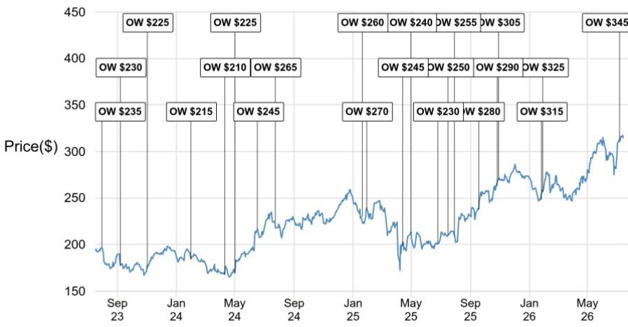

# 关于苹果与通义千问AI合作的市场观察

## 苹果

## 在中国市场获批使用通义千问AI，为Apple Intelligence提供支持

据彭博社报道，阿里巴巴的通义千问AI已获得当地监管机构批准，将被苹果用于其Apple Intelligence服务，覆盖包括iPhone在内的所有设备。这一进展为苹果在今年晚些时候推出iPhone 18系列产品提供了积极背景。随着该批准解决了苹果在中国这一重要区域市场推出Apple Intelligence的上市问题，我们认为这一进展在多个方面具有积极意义：

1. 进一步提升苹果相对于安卓厂商在中国市场的竞争地位。AI功能与定价策略的结合（我们预计今年晚些时候iPhone的价格调整幅度将比安卓厂商更为温和）有助于苹果继续扩大市场份额。

2. AI功能（即Apple Intelligence）在中国的推出将为消费者提供升级旧款iPhone的动力。考虑到iPhone 18发布时可能伴随的价格调整，这一点尤为重要。正如我们在7月7日的报告中所述，从较长周期来看，iPhone的出货量与定价的相关性有限，而更多受到设备功能和差异化的影响。我们认为Apple Intelligence在中国的推出是一个关键功能，有助于提升消费者在价格调整情况下的升级意愿，从而缓解价格弹性对出货量前景的影响。

## 研究观点

AAPL, AAPL US
价格（2026年7月14日）：314.86美元

软件 - 大型股 / 中型及小型股

Samik Chatterjee, CFA AC
(1-212) 622-0798
samik.x.chatterjee@JPM.com

Jaiden R Patel
(1-212) 270-6953
jaiden.patel@jpmchase.com

Arti Vula, CFA
(1-415) 315-5919
arti.vula@jpmchase.com

Brian Hyska
(1-212) 622-2883
brian.hyska@jpmchase.com

Mashu Nishi
(1-212) 622-0078
mashu.nishi@JPM.com
JPM Securities LLC

分析师认证：本报告封面标注"AC"的研究分析师（或当多位研究分析师主要负责本报告时，封面或文档内标注"AC"的研究分析师）就本研究中涵盖的每个证券或发行人分别证明：(1) 本报告中表达的所有观点准确反映了研究分析师对任何及所有相关证券或发行人的个人观点；(2) 研究分析师薪酬的任何部分从未、现在也不会直接或间接与本研究报告中研究分析师表达的具体建议或观点相关。对于封面列出的所有韩国研究分析师（如适用），他们同时根据KOFIA要求证明，研究分析师的分析是善意进行的，观点反映研究分析师自身意见，未受到不当影响或干预。

除非另有说明，本报告列出的所有作者均为独立进行研究的研究分析师。在欧洲，行业专家（销售与交易）可能作为联系人出现在本报告中，但并非报告作者或研究部门成员。

## 重要披露

• 做市商：JPM Securities LLC 在苹果或相关实体的证券中担任做市商。

• 做市商/流动性提供者：JPM 在苹果或相关实体的金融工具中担任做市商和/或流动性提供者。

- 董事：JPM 员工或 JPM Chase & Co. 的高级管理人员或董事担任苹果或相关实体的高级管理人员、董事或顾问委员会成员。

- 分析师持仓：股票或信用覆盖团队的分析师、可能产生交易建议的非基本面分析师或其各自家庭成员对苹果或相关实体的债务或股权证券拥有经济利益。

- 客户：JPM 目前拥有，或在过去12个月内曾拥有以下实体作为客户：苹果或相关实体。

- 客户/投资银行：JPM 目前拥有，或在过去12个月内曾拥有以下实体作为投资银行客户：苹果或相关实体。

- 客户/非投资银行、证券相关：JPM 目前拥有，或在过去12个月内曾拥有以下实体作为客户，且提供的服务为非投资银行、证券相关服务：苹果或相关实体。

- 客户/非证券相关：JPM 目前拥有，或在过去12个月内曾拥有以下实体作为客户，且提供的服务为非证券相关服务：苹果或相关实体。

- 已收投资银行报酬：JPM 在过去12个月内已从苹果或相关实体获得投资银行服务报酬。

- 潜在投资银行报酬：JPM 预计在未来三个月内将从苹果或相关实体获得或寻求获得投资银行服务报酬。

• 非投资银行报酬：JPM 在过去12个月内已从苹果或相关实体获得除投资银行以外的产品或服务报酬。

- 债务持仓：JPM 可能持有苹果或相关实体的债务证券（如有）。

公司特定披露：JPM 确实且寻求与其研究报告覆盖的公司开展业务。因此，读者应注意，该公司可能存在利益冲突，可能影响本报告的客观性。读者应将本报告视为做出投资决策的单一因素。重要披露，包括价格图表和信用意见历史表格（如适用），可通过访问 https://www.jpmm.com/research/disclosures、致电 1-800-477-0406 或发送邮件至 research.disclosure.inquiries@JPM.com 获取，适用于汇编报告及所有JPM覆盖的公司及某些未覆盖的公司。

苹果（AAPL, AAPL US）价格图表

来源：Bloomberg Finance L.P. 和 JPM；价格数据已根据股票分割和股息进行调整。首次覆盖日期：1999年5月1日。所有股价均为前一个交易日收盘价。

<table><tr><td>日期</td><td>评级</td><td>价格（美元）</td><td>目标价（美元）</td></tr><tr><td>2023年8月1日</td><td>OW</td><td>196.45</td><td>235</td></tr><tr><td>2023年9月8日</td><td>OW</td><td>177.56</td><td>230</td></tr><tr><td>2023年11月2日</td><td>OW</td><td>173.97</td><td>225</td></tr><tr><td>2024年2月1日</td><td>OW</td><td>184.40</td><td>215</td></tr><tr><td>2024年4月11日</td><td>OW</td><td>167.78</td><td>210</td></tr><tr><td>2024年5月2日</td><td>OW</td><td>169.30</td><td>225</td></tr><tr><td>2024年6月18日</td><td>OW</td><td>216.67</td><td>245</td></tr><tr><td>2024年7月24日</td><td>OW</td><td>225.01</td><td>265</td></tr><tr><td>2025年1月21日</td><td>OW</td><td>229.98</td><td>260</td></tr><tr><td>2025年1月30日</td><td>OW</td><td>239.36</td><td>270</td></tr><tr><td>2025年4月14日</td><td>OW</td><td>198.15</td><td>245</td></tr><tr><td>2025年5月1日</td><td>OW</td><td>212.50</td><td>240</td></tr><tr><td>2025年6月26日</td><td>OW</td><td>201.56</td><td>230</td></tr><tr><td>2025年7月17日</td><td>OW</td><td>210.16</td><td>250</td></tr><tr><td>2025年7月31日</td><td>OW</td><td>209.05</td><td>255</td></tr><tr><td>2025年9月19日</td><td>OW</td><td>237.88</td><td>280</td></tr><tr><td>2025年10月27日</td><td>OW</td><td>262.82</td><td>290</td></tr><tr><td>2025年10月30日</td><td>OW</td><td>269.70</td><td>305</td></tr><tr><td>2026年1月26日</td><td>OW</td><td>248.04</td><td>315</td></tr><tr><td>2026年1月29日</td><td>OW</td><td>256.44</td><td>325</td></tr><tr><td>2026年7月7日</td><td>OW</td><td>312.66</td><td>345</td></tr></table>

图表显示JPM对这些股票的持续覆盖；当前分析师可能并非在整个期间内都覆盖该股票。JPM评级或标识：OW = 增持，N = 中性，UW = 减持，NR = 未评级

## 股票研究评级、标识及分析师覆盖范围说明：

JPM采用以下评级体系：增持（在本报告所示目标价有效期内，我们预期该股票的表现将优于研究分析师或其团队覆盖范围内股票的平均总回报）；中性（在本报告所示目标价有效期内，我们预期该股票的表现将与研究分析师或其团队覆盖范围内股票的平均总回报一致）；减持（在本报告所示目标价有效期内，我们预期该股票的表现将逊于研究分析师或其团队覆盖范围内股票的平均总回报）。NR为未评级。在此情况下，JPM已移除该股票的评级及（如适用）目标价，原因可能是缺乏足够的基本面依据，或出于法律、监管或政策原因。先前的评级及（如适用）目标价不应再被依赖。NR标识并非建议或评级。部分覆盖股票有评级但无目标价；在此情况下，我们预期该股票的表现将优于/一致/逊于研究分析师或其团队覆盖范围内股票在相关区域相应期限内的平均总回报。在我们的亚洲（除澳大利亚和印度外）及英国中小盘股票研究中，每只股票的预期总回报与基准国家市场指数的预期总回报进行比较，而非与研究分析师的覆盖范围进行比较。如果本报告的重要披露部分未显示，认证研究分析师的覆盖范围可在JPM研究网站 https://www.JPMmarkets.com 上找到。

覆盖范围：Chatterjee, Samik：Adobe Inc (ADBE)、Akamai Technologies, Inc. (AKAM)、苹果 (AAPL)、Cloudflare (NET)、CoreWeave (CRWV)、Datadog (DDOG)、Dynatrace (DT)、Figma (FIG)、HubSpot (HUBS)、Intuit (INTU)、微软 (MSFT)、甲骨文 (ORCL)、Salesforce Inc (CRM)、ServiceNow (NOW)、Snowflake (SNOW)、Twilio (TWLO)、Workday (WDAY)、Zoom Communications (ZM)

JPM股票研究评级分布，截至2026年7月4日

<table><tr><td></td><td>增持（买入）</td><td>中性（持有）</td><td>减持（卖出）</td></tr><tr><td>JPM全球股票研究覆盖*</td><td>53%</td><td>36%</td><td>12%</td></tr><tr><td>投行客户**</td><td>83%</td><td>80%</td><td>73%</td></tr><tr><td>JPMS股票研究覆盖*</td><td>51%</td><td>37%</td><td>12%</td></tr><tr><td>投行客户**</td><td>95%</td><td>92%</td><td>87%</td></tr></table>

\*请注意，由于四舍五入，百分比可能未加总至100%。
\*\*在过去12个月内，JPM为其提供投资银行服务的各"买入"、"持有"和"卖出"类别中标的公司的百分比。

仅就FINRA评级分布规则而言，我们的增持评级属于报告评级类别；中性评级属于持有评级类别；减持评级属于报告评级类别。请注意，标有NR的股票未包含在上述表格中。此信息截至最近一个日历季度末。

股票估值与风险：有关覆盖公司或目标公司的估值方法和风险，请参阅最新的公司特定研究报告，访问 http://www.JPMmarkets.com，联系首席分析师或您的JPM代表，或发送邮件至 research.disclosure.inquiries@JPM.com。有关所用专有模型的实质性信息，请参阅公司特定研究报告中的财务摘要和公司概况表，这些文件可在我们的客户网站 http://www.JPMmarkets.com 的公司页面下载。本报告还阐述了其中使用的重要基础假设。

## 研究交流历史：

过去12个月内JPM研究交流的历史记录可在 http://www.JPMmarkets.com 的研究与评论页面获取，您也可以按分析师姓名、行业或金融工具进行搜索。

分析师薪酬：负责编制本报告的研究分析师的薪酬基于多种因素，包括研究的质量和准确性、客户反馈、竞争因素以及公司整体收入。

## 其他披露

JPM是JPM Chase & Co.及其全球子公司和关联公司投资银行业务的营销名称。

英国MiFID FICC研究豁免：英国客户应参阅英国MiFID研究豁免，了解JPM实施FICC研究豁免的详细信息以及相关FICC研究分类的指导。

除非相关法律特别允许，所有向客户提供的研究材料均同时在我们的客户网站JPM Markets上提供。并非所有研究内容都会重新分发、通过电子邮件发送或提供给第三方聚合商。如需获取特定股票的所有研究材料，请联系您的销售代表。

本研究材料中对中国的任何长格式名称指代；香港；台湾；澳门分别为中国大陆；香港特别行政区（中国）；台湾（中国）；澳门特别行政区（中国）。

JPM可能不时撰写关于受美国、欧盟、英国或其他相关司法管辖区政府当局实施或管理的经济或金融制裁所针对的发行人或证券（受制裁证券）的文章。本报告中的任何内容均无意被解读为鼓励、促进、推动或以其他方式批准对受制裁证券的投资或交易。客户在做出投资决策时应了解自身的法律和合规义务。

本研究报告中讨论的任何数字或加密资产均受快速变化的监管环境影响。有关加密资产（包括比特币和以太坊）的相关监管建议，请参阅 https://www.JPM.com/disclosures/cryptoasset-disclosure。

本研究报告的作者可能未获授权在您的司法管辖区开展受监管活动，如果未获授权，则不会声称能够这样做。

交易所交易基金（ETF）：JPM Securities LLC（"JPMS"）作为几乎所有美国上市ETF的授权参与者。如果本报告中提及任何ETF，JPMS可能因分销这些ETF份额而赚取佣金和基于交易的报酬，并可能因执行其他交易相关服务（如向ETF份额卖空者提供证券借贷）而赚取费用。JPMS还可能为ETF本身提供服务，包括担任ETF的经纪商或交易商。此外，JPMS的关联公司可能为ETF提供服务，包括信托、托管、管理、借贷、指数计算和/或维护及其他服务。

期权和期货相关研究：如果此处包含的信息涉及期权或期货相关研究，则该信息仅提供给已收到适当期权或期货风险披露文件的人士。请联系您的JPM代表或访问 https://www.theocc.com/components/docs/riskstoc.pdf 获取期权清算公司的标准化期权的特征和风险，或访问 https://www.finra.org/sites/default/files/2020-08/Security_Futures_Risk_Disclosure_Statement_2020.pdf 获取证券期货风险披露声明。

银行间同业拆借利率（IBOR）及其他基准利率的变更：某些利率基准正在或可能在未来受到持续的国际、国内及其他监管指导、改革和改革提案的影响。更多信息请参阅：https://www.JPM.com/global/disclosures/interbank_offered_rates

私人银行客户：如果您作为JPM Chase & Co.及其子公司（"JPM私人银行"）私人银行业务的客户接收研究，则研究由JPM私人银行提供，而非JPM的任何其他部门，包括但不限于JPM企业与投资银行及其全球研究部门。

负责研究和分发研究的法律实体：编写本材料的Reg AC研究分析师姓名下方标识的法律实体是负责编写本研究的法律实体。如果多位Reg AC研究分析师编写本材料，且其姓名下方标识了不同的法律实体，则这些法律实体共同负责编写本研究。如果分析师姓名下列出多个法律实体，则除非另有说明，第一个法律实体负责编写。来自不同JPM关联公司的研究分析师可能为本材料的编写做出了贡献，但可能未获授权在您的司法管辖区开展受监管活动（并且不会声称能够这样做）。除非下文法律实体披露中另有说明，本材料已由负责编写的法律实体分发，或者如果分析师姓名下列出多个法律实体，则第一个法律实体负责分发。如有任何疑问，请联系您所在司法管辖区的相关研究分析师或您所在司法管辖区分发本研究材料的实体。

## 法律实体披露及国家/地区特定披露：

阿根廷：JPM Chase Bank N.A Sucursal Buenos Aires 受阿根廷共和国中央银行（"BCRA"）和阿根廷国家证券委员会（"CNV"）监管。

澳大利亚：JPM Securities Australia Limited（"JPMSAL"）（ABN 61 003 245 234/AFS Licence No: 238066）受澳大利亚证券和投资委员会监管，是ASX Limited的市场参与者、ASX Clear Pty Limited的清算和结算参与者以及ASX Clear (Futures) Pty Limited的清算参与者。本材料由JPMSAL或其代表在澳大利亚仅向"批发客户"（定义见2001年公司法第761G条）发行和分发。所有涵盖的金融产品列表可在 https://www.jpmm.com/research/disclosures 找到。JPM力求覆盖所有全球行业分类标准（GICS）行业以及各种市值规模中与国内外读者基础相关的公司。如适用，在对标的公司进行公开尽职调查过程中，研究分析师团队可能通过公司接触（如实地考察、与公司代表讨论、管理层演示等）进行此类尽职调查。JPMSAL发布的研究已按照JPM澳大利亚研究独立性政策编制，该政策可在以下链接找到：JPM Australia - Research Independence Policy。

巴西：Banco JPM S.A. 受巴西证券委员会（CVM）和巴西中央银行监管。JPM监察员：0800-7700847 / 0800-7700810（听障人士专线）/ ouvidoria.jp.morgan@jpmchase.com。

加拿大：JPM Securities Canada Inc. 是一家注册投资交易商，受加拿大投资监管组织和安大略省证券委员会监管，是加拿大交易所的参与会员。本材料由JPM Securities Canada Inc.或其代表在加拿大分发。

智利：Inversiones JPM Limitada 是一家在智利注册的非监管实体。

中国：JPM Securities (China) Company Limited 已获中国证监会批准开展证券投资咨询业务。

哥伦比亚：Banco JPM Colombia S.A. 受哥伦比亚金融监管局（SFC）监管。本材料中对哥伦比亚境外实体提供的产品或服务的任何引用仅用于描述目的。此类引用不构成也不应被解释为在哥伦比亚领土内的促销活动或金融产品或服务的提供（根据适用的哥伦比亚法规定义）。

迪拜国际金融中心（DIFC）：JPM Chase Bank, N.A., Dubai Branch 受迪拜金融服务管理局（DFSA）监管，注册地址为迪拜国际金融中心 - The Gate, West Wing, Level 3 and 9 PO Box 506551, Dubai, UAE。本材料由JPM Chase Bank, N.A., Dubai Branch 向根据DFSA规则被视为专业客户或市场对手方的人士分发。

欧洲经济区（EEA）：除非另有说明，研究在EEA由JPM SE（"JPM SE"）分发，JPM SE是一家由联邦金融监管局（BaFin）授权作为信贷机构的公司，并受BaFin、德国中央银行（Deutsche Bundesbank）和欧洲中央银行（ECB）共同监管。JPM SE总部位于法兰克福，注册地址为TaunusTurm, Taunustor 1, Frankfurt am Main, 60310, Germany。本材料在EEA已向根据MiFID II第4条第1款第10项及附件二及其在各自母国的实施被视为专业读者（或同等资格）的人士（"EEA专业读者"）分发。非EEA专业读者不得依据或依赖本材料行事。本材料相关的任何投资或投资活动仅面向EEA相关人士，且仅与EEA相关人士进行。

香港：JPM Securities (Asia Pacific) Limited（CE编号AAJ321）受香港金融管理局和香港证券及期货事务监察委员会监管，JPM Broking (Hong Kong) Limited（CE编号AAB027）受香港证券及期货事务监察委员会监管。JPM Chase Bank, N.A., Hong Kong Branch（CE编号AAL996）受香港金融管理局和证券及期货事务监察委员会监管，根据美国法律组织，承担有限责任。如果本材料的分发在香港属于受监管活动，则本材料在香港由JPM Securities (Asia Pacific) Limited和/或JPM Broking (Hong Kong) Limited分发。

印度：JPM India Private Limited（公司识别号 - U67120MH1992FTC068724），注册地址为JPM Tower, Off. C.S.T. Road, Kalina, Santacruz - East, Mumbai – 400098，在印度证券交易委员会（SEBI）注册为"研究分析师"，注册号INH000001873。JPM India Private Limited 还在SEBI注册为印度国家证券交易所和孟买证券交易所的会员（SEBI注册号 – INZ000239730）以及商人银行（SEBI注册号 - MB/INM000002970）。电话：91-22-6157 3000，传真：91-22-6157 3990，网站：http://www.jpmipl.com。JPM Chase Bank, N.A. - Mumbai Branch 获得印度储备银行（RBI）许可（许可证号53/Licence No. BY.4/94；SEBI - IN/CUS/014/ CDSL : IN-DP-CDSL-444-2008/ IN-DP-NSDL-285-2008/ INBI00000984/ INE231311239）作为印度境内商业银行，这是其主要许可证，允许其在印度开展银行业务以及印度银行分行允许从事的其他活动。对于非本地研究材料，本材料不在印度由JPM India Private Limited分发。合规官：Ashutosh Sharma；ashutosh.j.sharma@jpmchase.com；+912261575002。申诉官：Ramprasadh K，jpmipl.research.feedback@JPM.com；+912261573000。SEBI的注册和NISM的认证绝不保证中介机构的业绩或向读者提供任何回报保证。请访问条款和条件以及最重要的条款和条件（MITC）。年度合规审计报告可在 http://www.jpmipl.com/#research 获取。

印度尼西亚：PT JPM Sekuritas Indonesia 是印度尼西亚证券交易所的会员，并在金融服务管理局（OJK）注册和监管。

韩国：JPM Securities (Far East) Limited, Seoul Branch 是韩国交易所（KRX）的会员。JPM Chase Bank, N.A., Seoul Branch 在韩国注册为外国银行分行（JPM Chase Bank, N.A.）。两个实体均受金融服务委员会（FSC）和金融监督院（FSS）监管。对于非宏观研究材料，本材料在韩国由JPM Securities (Far East) Limited, Seoul Branch 分发。

日本：JPM Securities Japan Co., Ltd. 和 JPM Chase Bank, N.A., Tokyo Branch 受日本金融厅监管。

马来西亚：本材料由JPM Securities (Malaysia) Sdn Bhd（18146-X）在马来西亚发行和分发，该公司是马来西亚交易所的参与组织，并持有马来西亚证券委员会颁发的资本市场服务许可证。

墨西哥：JPM Casa de Bolsa, S.A. de C.V., JPM Grupo Financiero 是墨西哥证券交易所（"Bolsa Mexicana de Valores"）和机构证券交易所（"Bolsa Institucional de Valores"）的会员，并获国家银行和证券委员会（"Comisión Nacional Bancaria y de Valores"）授权作为经纪交易商。

新西兰：本材料由JPMSAL在新西兰仅向"批发客户"（定义见2013年金融市场行为法）发行和分发。JPMSAL根据2008年金融服务提供商（注册和争议解决）法注册为金融服务提供商。

菲律宾：JPM Securities Philippines Inc. 是菲律宾证券交易所的交易参与者，也是菲律宾证券清算公司和证券读者保护基金的会员。受证券交易委员会监管。

新加坡：本材料由JPM Securities Singapore Private Limited（JPMSS）[MDDI (P) 057/08/2025 和公司注册号：199405335R] 和/或 JPM Chase Bank, N.A., Singapore branch（JPMCB Singapore）在新加坡发行和分发，两者均受新加坡金融管理局监管。JPMSS是新加坡交易所证券交易有限公司的会员。本材料在新加坡仅向根据证券与期货法第289章第4A条定义的认可读者、专家读者和机构读者发行和分发。本材料无意向任何零售读者或不属于"认可读者"、"专家读者"或"机构读者"类别的任何其他读者发行或分发。新加坡的本材料接收者应就材料引起或与之相关的任何事宜联系JPMSS或JPMCB Singapore。

南非：JPM Equities South Africa Proprietary Limited 和 JPM Chase Bank, N.A., Johannesburg Branch 是约翰内斯堡证券交易所的会员，并受金融服务行为监管局（FSCA）监管。

台湾：JPM Securities (Taiwan) Limited 是台湾证券交易所的参与者（公司型），并受台湾证券期货局监管。与股权证券相关的材料由JPM Securities (Taiwan) Limited 在台湾发行和分发，受限于台湾的许可证范围和适用法律法规。如果JPM Securities (Taiwan) Limited 制作关于非台湾证券交易所或台北交易所上市证券（"非台湾上市证券"）的研究材料，这些材料不构成适用台湾法规下的证券建议，并且为免生疑问，JPM Securities (Taiwan) Limited 不就非台湾上市证券担任经纪商。根据《证券商受托买卖有价证券管理规则》第7-1条第2项（及其修订或补充）和/或其他适用法律法规，请注意，本材料的接收者不得从事与本材料相关的可能产生利益冲突的任何活动，除非本材料的"重要披露"中另有披露。

泰国：本材料由JPM Securities (Thailand) Ltd. 在泰国发行和分发，该公司是泰国证券交易所的会员，并受财政部和证券交易委员会监管。注册地址为548 One City Center Building, 50th Floor, Ploenchit Road, Lymphini, Pathum Wan, Bangkok 10330。

英国：研究由JPM Securities plc（"JPMS plc"）在英国编写，该公司是伦敦证券交易所的会员，并受审慎监管局授权及受金融行为监管局和审慎监管局监管；或由JPM Markets Limited（"JPMML Ltd"）编写，该公司受金融行为监管局授权和监管。除非另有说明，本材料在英国由JPMS plc分发，并在英国仅面向：(a) 具有投资相关事务专业经验的人士，属于2005年金融服务和市场法（金融促销）令第19(5)条范围内；(b) 该法令第49条所述人士（高净值公司、非法人协会或合伙企业、高价值信托的受托人等）；或(c) 可以合法接收此通讯的任何其他人士；所有此类人士均称为"英国相关人士"。非英国相关人士不得依据或依赖本材料行事。本材料相关的任何投资或投资活动仅面向英国相关人士，且仅与英国相关人士进行。

JPM EMEA关于预防和避免研究制作相关利益冲突的政策说明可在以下链接找到：JPM EMEA - Research Independence Policy。

美国：JPM Securities LLC（"JPMS"）是NYSE、FINRA、SIPC和NFA的会员。JPM Chase Bank, N.A. 是FDIC的会员。非美国关联公司发布的材料由JPMS在美国分发，JPMS对其内容承担责任。

一般信息：可根据要求提供更多信息。本材料中的信息来自被认为可靠的来源。虽然已采取一切合理谨慎措施确风险自担材料中陈述的事实准确，且其中包含的预测、意见和预期公平合理，但JPM Chase & Co.或其关联公司和/或子公司（统称JPM）对所提供的材料的完整性或准确性不作任何陈述或保证，除非涉及JPM和研究分析师与作为材料主题的发行人的参与相关的披露。因此，不应依赖本材料所含信息的准确性、公平性或完整性。由于计算、调整、翻译成不同语言和/或当地监管限制（如适用），本材料中可能存在某些数据差异和/或有限内容。这些差异不应影响本材料中可能讨论的标的公司的整体研究分析、观点和/或建议。人工智能工具可能已用于本材料的准备，包括协助数据分析、模式识别和研究材料的内容起草。JPM对因使用本材料或其内容而产生的任何损失不承担任何责任，JPM或其任何董事、高级管理人员或员工均不对本内容负责，除非相关司法管辖区的相关监管机构或该监管制度可能对其施加的责任和义务。本材料中包含的意见、预测或预测仅代表JPM截至材料日期的当前意见或判断，因此如有变更，恕不另行通知。可能会根据公司特定发展或公告、市场状况或任何其他公开信息对公司/行业进行定期更新。无法保证未来结果或事件将与任何此类意见、预测或预测一致，这些意见、预测或预测仅代表一种可能的结果。此外，此类意见、预测或预测受某些尚未验证的风险、不确定性和假设的影响，未来的实际结果或事件可能存在重大差异。本材料中提及的任何投资的价值或收入可能会波动和/或受汇率变化的影响。除非另有说明，所有定价均为所讨论证券的市场收盘价指示性价格。过往表现并不预示未来结果。因此，读者可能收回少于最初投资的金额。本材料不构成购买或出售任何金融工具的要约或招揽。本文中的意见和建议未考虑个别客户的情况、目标或需求，不构成对特定客户推荐特定证券、金融工具或策略的建议。本材料可能包含关于结构性证券、期权、期货和其他衍生品的观点。这些是复杂工具，可能涉及高风险，仅适合能够理解和承担相关风险的成熟读者。本材料的接收者必须就本文提及的任何证券或金融工具做出独立决定，并应寻求其认为必要的独立财务、法律、税务或其他顾问的建议。JPM可能基于研究分析师的观点和研究进行自营交易，也可能以与本材料所持观点不一致的方式为其自身账户或客户账户进行交易，JPM无义务确保此类其他沟通引起本材料任何接收者的注意。JPM内部的其他人员，包括策略师、销售人员和其他研究分析师，可能持有与本材料所持观点不一致的观点。未参与本材料编制的JPM员工可能持有本材料中提及的证券（或此类证券的衍生品）并可能以与本材料讨论的方式不同的方式进行交易。本材料在任何司法管辖区均不构成对任何发行人、其产品或服务或其证券的广告或营销。

保密与安全通知：此传输可能包含根据适用法律享有特权、保密、法律特权且/或免于披露的信息。如果您不是预期的接收者，特此通知您，披露、复制、分发或使用本文所含信息（包括依赖该信息）是严格禁止的。尽管此传输及其任何附件被认为不含任何可能影响接收和打开它的任何计算机系统的病毒或其他缺陷，但接收者有责任确保其无病毒，JPM Chase & Co.及其子公司和关联公司（如适用）对因使用该信息而产生的任何损失或损害不承担任何责任。如果您错误地收到此传输，请立即联系发件人并完全销毁该材料，无论是电子版还是硬拷贝格式。此消息受电子监控：https://www.JPM.com/disclosures/email

MSCI：本文中的某些信息（"信息"）经MSCI Inc.、其关联公司和信息提供商（"MSCI"）许可复制 ©2026。未经适当许可，不得复制或传播该信息。MSCI不对信息作任何明示或暗示的保证（包括适销性或适用性），并在法律允许的范围内免除所有责任。任何信息均不构成研究交流，除非是来自MSCI ESG Research的任何适用信息。另请参阅 msci.com/disclaimer

Sustainalytics：本文中包含的某些信息、数据、分析和意见经Sustainalytics许可复制，并且：(1) 包含Sustainalytics的专有信息；(2) 除非特别授权，不得复制或重新分发；(3) 不构成研究交流或对任何产品或项目的认可；(4) 仅用于信息目的；以及(5) 不保证完整、准确或及时。Sustainalytics不对任何交易决策、损害或与其或其使用相关的其他损失负责。数据的使用受限于 https://www.sustainalytics.com/legal-disclaimers 上的条件。©2026 Sustainalytics。保留所有权利。

完成于2026年7月15日美国东部时间上午09:08
