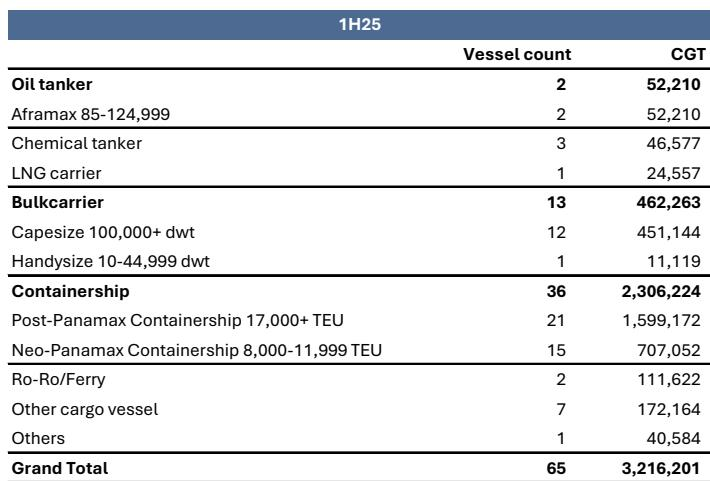
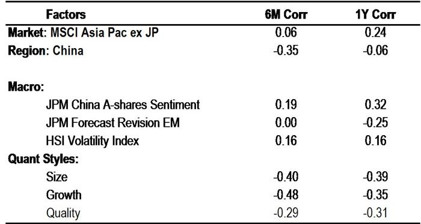
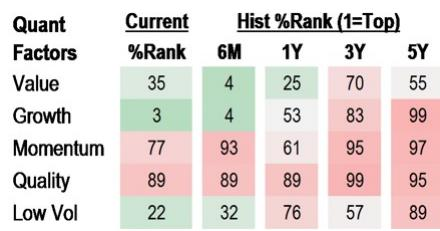

# JPM：中国船舶CSSC利润预告强化盈利论点-回调提供观察窗口

中国船舶工业集团（CSSC）在7月14日发布了一份积极的利润预告，而同期其报价却回调了9%。JPM在最新报告中指出，这一背离并非基本面出现变化，而是获利了结和板块轮动所致。报告的核心判断是：公司正处于盈利周期较强阶段，而市场尚未充分定价这一转变。

利润预告给出了明确的数字区间：2026年第二季度净利润预计在44亿至66亿元人民币之间，上半年净利润在92亿至110亿元之间。按合并后口径计算，二季度同比增长82%至176%，上半年增长144%至191%。JPM的预测恰好落在这个区间内——二季度预测49亿元，上半年预测97亿元——预告的低端比其预测低约11%，高端则高出35%。

> **KC评论：** 利润预告的区间宽度（二季度低端44亿、高端66亿）本身就是一个信号：公司管理层对盈利的可预见性仍有保留，但即便按最保守的估算，同比增速也接近弹性较高。报告真正想强调的是，这个区间已经足够支撑其盈利周期判断，而非依赖某一个精确数字。

## 1. 交付组合正在从量变转向质变：高附加值船型占比显著提升

中国船舶的收入确认以船舶交付为节点，因此交付结构直接决定当期利润。2026年上半年，公司交付量按修正总吨（CGT）计算同比增长22%，但更关键的是结构变化：上半年交付了4艘LNG运输船、9艘LPG运输船和4艘VLCC，而2025年同期仅交付了4艘LNG/LPG运输船。这些船型是行业内单价最高、利润率最高的品类，它们的交付将直接拉动平均售价和毛利率。

## 2. 新订单质量持续改善，客户结构进一步优化

2026年上半年新接订单量按CGT计算同比弹性较高，主要来自12艘超巴拿马型集装箱船（中远海运）、15艘LNG运输船、16艘LPG运输船和23艘VLCC。订单持续向高端船型倾斜，意味着未来几年的交付排期将延续当前的高附加值趋势。

客户名单同样值得关注：ADNOC向江南造船厂授予了4艘17.5万立方米LNG运输船订单，招商轮船向大连造船厂订购了5艘阿芙拉型油轮，延续了此前VLCC订单的合作关系。这些来自国际和国内头部船东的重复订单，是公司订单质量和客户粘性的直接证据。

## 3. 当前估值尚未反映盈利周期的强度

报告给出的估值框架显示，公司2026至2028年预测市盈率分别为13倍、11倍和8倍，市净率仅为0.5倍。相比之下，全球上市船企的平均市盈率约为16.3倍。公司还持有约1290亿元人民币的净现金头寸，相当于市值的48%。

JPM认为，当前报价回调提供了一个有吸引力的观察窗口。其核心逻辑是：2023至2025年签订的高价合同正在逐步进入交付阶段，而收入确认的延迟只是时间问题，不会改变盈利增长的最终结果。叠加生产效率提升、国企整合效应和强劲的现金流生成能力，公司正进入盈利周期的较强阶段。

对于关注造船行业的读者而言，这份报告提供了一个可追踪的观察框架：交付组合中高附加值船型的占比变化，比季度利润数字本身更能反映盈利趋势的持续性。

For informational purposes only. Portions may be generated,translated,summarized,or edited with AI assistance based on source materials and may contain omissions or errors. Please verify independently. This is not investment,legal,tax,accounting,or other professional advice.

