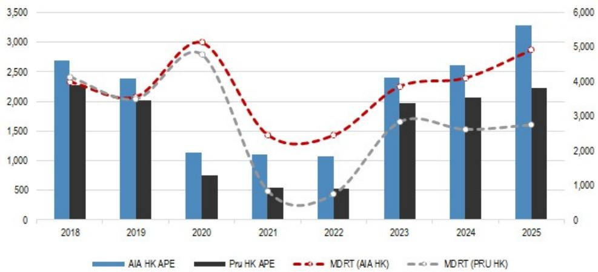
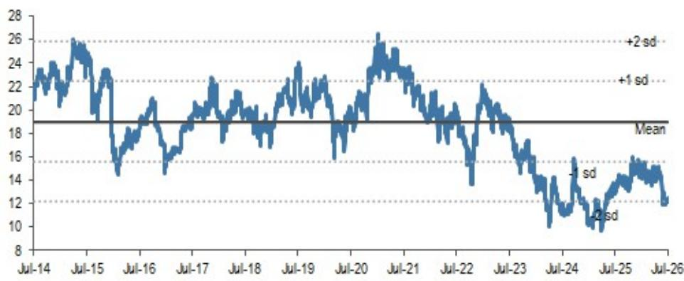
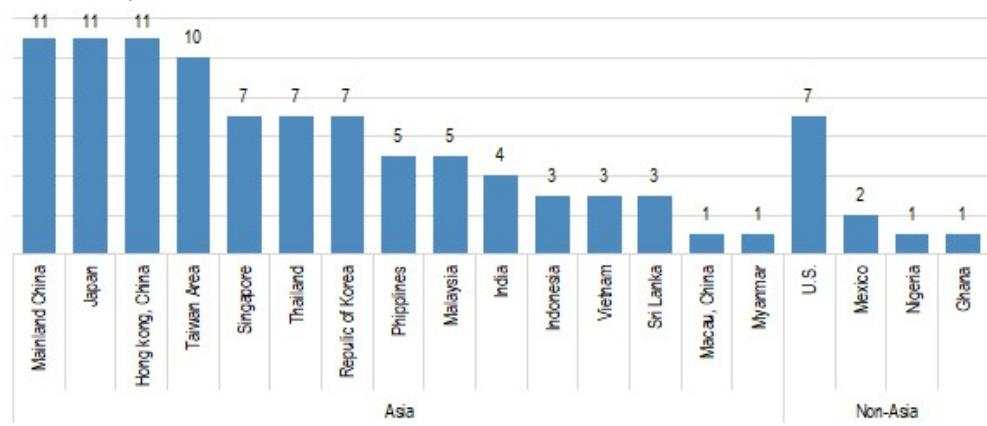

# 行业观察：MDRT数据调整背后的生产力筛选机制

友邦集团在中国内地的MDRT人数在2026年统计中同比下降73%。在印度，其合资公司Tata AIA Life下降51%。表面上看，这些数字像是代理人留存和销售动能的危机。但事实并非如此。2026年的MDRT数据更适合被解读为一次正常化调整——疫情后的资格门槛收紧、中国监管机构不鼓励MDRT认可、以及保险公司越来越多地转向银保渠道。对于观察者而言，真正的问题不在于人数是否下降，而在于留下来的代理人是否创造了更多人均价值。

对于领先的跨国保险公司来说，答案是肯定的。友邦的代理人新业务价值同比增长15%，即使其MDRT人数有所下降。这种分化——更少的持证代理人创造更多价值——是本周期核心的战略洞察。市场尚未完全定价这一转变。友邦目前交易在1.1倍FY27E预期内含价值、12倍FY27E预期营运利润，总股东回报率约4.7%，而年初至今因香港MCV市场的不确定性表现相对平淡。8月的中期业绩将提供更多信息，但潜在的生产力故事已从MDRT数据中显现。

亚洲保险公司仍主导全球MDRT排名，占前100名的89%。但这种主导的构成正在变化。那些能够在维持或扩大MDRT基础的同时提升人均利润率的公司，将与那些在疫情宽松时期依赖数量驱动、低生产力代理队伍的公司区分开来。这是一个重新审视寿险分销评估方式的时刻——从关注人数指标转向关注每个分销单元的生产力和价值创造。

## 友邦中国MDRT人数下降73%反映三重因素叠加，而非业务恶化

三重力量共同导致了这一显著下降。首先，MDRT资格门槛在疫情放松后恢复正常化。对于中国内地，2026年基本会员的保费要求从2025年的737,100元升至847,800元——增长15%。佣金门槛实际上从245,700元降至197,800元，但保费门槛对许多代理人而言是更严格的约束。其次，中国监管机构发布指引，不鼓励保险公司推广MDRT认可，这降低了参与度。第三，友邦中国一直在将其分销组合转向银保渠道，这自然减少了追求MDRT级别业绩的代理人数量。

关键点在于，这些力量在很大程度上是友邦竞争地位之外的因素。它们适用于在中国运营的每一家保险公司。然而，友邦的代理人新业务价值同比增长15%。这意味着留下来的代理人——那些在更高门槛下仍能获得MDRT资格的代理人——正在承保更大、利润更高的保单。人数的下降是一种构成效应，而非业绩问题。将2026年与疫情宽松年份进行比较具有误导性；更相关的比较是与2019年。以此为基础，友邦中国的MDRT人数为1,063人，低于2019年的2,577人，但代理人NBV的趋势表明生产力差距已经得到弥补。

## 友邦仍以显著优势领先跨国同行，且头部差距在扩大

友邦集团在2026年报告了16,228名MDRT成员。这超过了英国保诚（7,472人）、宏利和美国保诚的总和，这三家合计为14,856人。没有其他跨国保险公司能接近这一数字。从2025年的19,358人下降值得注意，但结构性领先地位依然稳固。更重要的是，下降的分布情况。友邦香港的MDRT人数实际上同比增长20%至4,918人。友邦新加坡增长10%至2,104人。友邦泰国稳定在3,498人。损失集中在中国和印度——这两个市场受到监管和门槛效应的影响最为显著。

这一模式揭示了一项战略优势。友邦的地域多元化意味着，在一个大市场的人数压缩不会动摇整体代理业务。香港和新加坡的业务服务于高净值客户和MCV渠道，其持证代理人基础正在扩大。这正是最高利润业务所在。香港MDRT成员增长20%，加上下半年MCV需求预期复苏，使友邦有望在即使中国数据调整的情况下，实现强劲的代理人主导的业绩表现。

对于英国保诚而言，情况更为复杂。其MDRT总数为7,472人，同比基本持平，但构成不均衡。香港增长5%至2,751人，日本增长4%至1,702人，新加坡增长9%至1,424人。但越南下降58%至229人，中信保诚人寿在中国下降40%至461人。保诚仍是强劲的第二名，但在最高生产力市场缺乏友邦的规模，且更容易受到越南和中国市场的影响。

## MDRT是新业务价值和IFRS 17下CSM增长的领先指标

该报告提出了一个关键分析点：MDRT成员倾向于产生更高利润率和/或更大额度的新寿险销售。保险公司并未专门披露MDRT代理人的生产力，但这种相关性是可观察的。友邦的代理人NBV同比增长15%，而MDRT人数下降16%。这意味着每位MDRT代理人的NBV提升了37%——这是一个显著的生产力提升，如果持续下去，将有意义地提升IFRS 17下的新业务CSM增加和资产负债表增长。

这是重要的机制。在IFRS 17下，新业务CSM是未来盈利出现的关键驱动因素。高生产力代理人承保的高利润率保单，比数量驱动、低利润率的银保销售产生更多的每单CSM。因此，MDRT的调整不仅仅是一个分销指标——它是新业务质量正在改善的信号。仅关注人数的观察者正在错过关于每位代理人价值的更重要的故事。

对于富卫集团而言，MDRT数据强化了一个不同的叙事。富卫历来被定位为多渠道分销保险公司，但其代理人渠道的执行力日益令人印象深刻。2026年拥有1,702名MDRT成员，富卫在领先群体中占有一席之地，尽管其整体代理人队伍规模较小。其香港业务增长17%至706名成员，菲律宾业务稳定在398名。富卫从相对较低的基础建立高质量代理人渠道的能力，表明其强大的执行能力以及一种可以在生产力而非规模上与现有公司竞争的分销模式。

## 决策框架：如何利用MDRT数据评估寿险公司

MDRT数据并非独立的估值工具，但它是对已报告财务数据的有用交叉验证。在分析任何亚洲寿险公司时，可以应用一个三步框架。

首先，计算每位MDRT代理人的NBV趋势。比较代理人NBV的同比变化与MDRT人数的同比变化。出现分化——NBV上升而人数下降——表明生产力在改善。出现趋同——两者同步下降——表明存在更广泛的分销问题。友邦呈现分化。英国保诚呈现混合情况：整体NBV趋势积极，但越南和中国的人数下降需要与新加坡和日本的生产力提升进行权衡。

其次，按地域进行分解。香港、新加坡和泰国的MDRT趋势比中国的趋势更能预测高利润率业务，因为在中国，监管和门槛效应占主导。一家在中国失去MDRT成员但在香港获得成员的公司，正在向更高质量的业务重新定位。一家在两个市场都失去成员的公司，则面临结构性挑战。

第三，将MDRT趋势与IFRS 17下报告的新业务CSM增加进行交叉验证。CSM是新业务未来利润出现的最直接衡量指标。如果MDRT生产力在改善，CSM增加应该会加速。如果MDRT人数下降且CSM持平或下降，那么生产力故事并未实现。

友邦在所有三个维度上表现良好。该股票当前的估值——1.1倍P/EV和12倍P/OPAT——并未反映2026年MDRT数据中蕴含的生产力改善。年初至今的相对表现平淡，很大程度上是由香港MCV市场的不确定性驱动，但8月的中期业绩应能提供更多信息。如果友邦在关键财务指标上实现两位数增长，同时MDRT人数趋于稳定，估值差距很可能会收窄。

## 正常化周期为关注质量而非数量的观察者创造了窗口

2026年的MDRT统计数据最好被理解为一个重置。疫情时期资格门槛的放松人为地抬高了整个行业的人数。那个阶段已经结束。那些在疫情期间建立了真正代理人生产力的公司——通过更好的培训、更高质量的招聘以及对保障型产品的专注——将变得更加强大。那些依赖数量和宽松资格标准的公司，其MDRT人数将会压缩，而不会伴随NBV的补偿性改善。

友邦属于第一类。其中国区73%的下降在数字上令人担忧，但15%的代理人NBV增长揭示了真实情况。市场目前因一个回顾性且被一次性因素扭曲的人数指标而对友邦进行折价。生产力指标是前瞻性的且正在改善。这种不对称性构成了观察的基础。

对于富卫和泰寿而言，MDRT数据确认了其代理人渠道正在获得动力。富卫在领先MDRT群体中的排名与其整体规模不成比例，而泰寿在竞争激烈的市场中稳定的MDRT基础支持其作为高质量本土保险公司的定位。如果它们能够在扩大持证代理人基础的同时维持生产力提升，两者都具备上行潜力。

对亚洲寿险行业更广泛的影响是，代理人模式并未消亡——它正在集中化。领先的跨国公司正在利用MDRT调整来淘汰低生产力代理人，并加倍投入高绩效者。结果将是一个更精简、更有利可图的分销基础，每单位运营费用产生更高的新业务价值。市场应奖励这一转变，而非惩罚它。

*仅供参考。部分内容可能基于源材料通过AI辅助生成、翻译、总结或编辑，可能存在遗漏或错误。请独立核实。本文不构成专业建议。*
