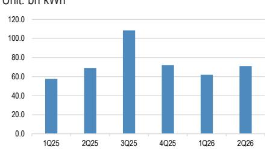
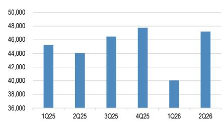

# 中国可再生能源企业业绩分化：并非行业信号，而是选股依据

2026年第二季度财报季，中国可再生能源行业将出现本轮周期以来最大的公司层面业绩分化。德业股份预披露净利润同比增长85%，而阳光电源预计将出现中高个位数下滑。龙源电力面临约30%的利润收缩，但长江电力应能实现稳定的低个位数增长。这并非行业同步波动，而是行业正沿着三条结构性断层线分化：成本传导的时机、收入确认的地域分布以及终端市场需求结构的成熟度。

若将即将发布的财报视为对整个可再生能源主题的投票，将误读其中的信号。这种分化并非噪音，而是值得关注的模式。压低部分公司短期业绩的相同力量——关税压力、发货延迟和高成本库存——同时为那些基本面轨迹保持完好的企业创造了入场机会。问题不在于中国可再生能源行业是否值得研究，而在于哪些公司拥有独立于宏观环境的盈利能力，哪些公司则面临结构性挑战。

本次财报季揭示了一个关键的战略洞察：中国可再生能源价值链已不再是一个单一周期，而是三个以不同速度运行的独立周期——海上风电加速、分布式储能渗透和太阳能制造产能过剩——每个周期都奖励不同的商业模式。2026年下半年表现突出的公司，将是那些盈利驱动因素与最快子周期保持一致，且成本结构能够吸收较慢周期残余冲击的企业。

## 海上风电与分布式储能加速，公用事业规模太阳能与陆上风电放缓

第二季度预览中最关键的结构性区别，在于海上风电和分布式储能一侧与公用事业规模太阳能和陆上风电另一侧之间的分化。为海上风电场供应海底电缆的东方电缆，受益于海上风电加速发展和去年同期的低基数，有望在第二季度实现同比增长。专注于分布式应用的光伏和储能逆变器的德业股份，预披露第二季度净利润在14.8亿至15.4亿元人民币之间，同比增长85%，环比增长27%。增长动力来自光伏逆变器出货量环比增长30%、储能系统逆变器出货量增长50%以及储能电池包出货量增长60%。

这两家公司共享一个共同的需求驱动因素：它们服务的终端市场安装决策分散，对电网电价谈判或政策时机不那么敏感。中国的海上风电发展由省级目标和沿海能源安全目标驱动。新兴市场的分布式储能则由不断上涨的电力成本、不可靠的电网供应和下降的电池价格驱动。这两个市场都不依赖于单一的大规模采购周期。这种结构性特征使这些业务免受困扰公用事业规模领域的季度波动影响。

相反，公用事业规模的太阳能和陆上风电领域正面临多重压力。作为大型项目领先的逆变器和储能系统供应商，阳光电源预计第二季度净利润将出现中高个位数下滑。原因在于订单确认与收入确认之间的时间差。第二季度收入主要基于第一季度出货量，而这些出货量的定价基于2025年第三季度的协议。在成本方面，电池价格在2026年第一季度仍处于高位。从订单到交付的较长周期意味着第二季度的利润率正在吸收一个不再反映当前市场条件的成本结构。电子元器件价格上涨进一步增加了利润率压力。出货量在增长，但利润率挤压压倒了数量增长带来的好处。

主要陆上风机制造商金风科技面临一个不同但同样结构性的挑战。由于项目时间安排，2025年第二季度是风机出货量的高基数。仅比较基数就会对同比增长构成压力，但根本问题在于中国的陆上风电正进入一个电价压缩和弃风限电风险增加的阶段，这降低了新装机的经济激励。金风科技的净利润同比变动范围在-10%至+5%之间，反映了关于数量增长能否抵消价格压力的真正不确定性。

结论很明确：增长最快的子领域是那些终端客户要么是有任务目标的省级政府，要么是有直接经济激励的商业或工业用户。增长最慢的子领域是那些终端客户是在价格下降环境中谈判电价的公用事业公司或独立发电商。

## 太阳能硅价值链仍处于未完成的行业调整中

太阳能制造价值链——多晶硅、硅片、电池片和组件——继续在一个任何单一公司都无法单方面打破的亏损均衡中运行。报告明确指出，该领域的大多数参与者预计在第二季度将继续报告亏损，因为反内卷政策尚未扭转行业周期。这并非暂时的低谷，而是2022年和2023年需求繁荣期间建立的产能过剩尚未完全出清的结果。

“反内卷政策”指的是政府和行业为减少破坏性竞争——即损害行业盈利能力但不消除产能的价格战——所做的努力。这些政策迄今未能奏效，因为产能过剩规模过大，退出壁垒过高。许多制造商由地方政府或国有资本支持，这些资本优先考虑就业和产出而非盈利能力。结果是，在当前价格下没有生产商能获得正利润，但也没有生产商愿意停产。

这种动态对报告确定为关键低配的两家公司——隆基绿能和通威股份——有直接影响。隆基作为历史上占主导地位的单晶硅片制造商，其成本优势已因竞争对手在技术和规模上与之匹敌而被侵蚀。通威作为领先的多晶硅和电池片生产商，同样面临产能过剩的动态。这两家公司面临的盈利轨迹并非传统意义上的周期性，而是结构性的。该领域的复苏需要足够大的需求冲击来吸收过剩产能，或供给侧整合迫使边际生产商退出。当前数据中尚未看到任何催化剂。

对于研究者而言，关键洞察是太阳能制造价值链不应被视为价值型机会。该领域的低估值反映的不是市场悲观情绪，而是对盈利可能长期低迷这一概率的正确评估。报告的框架表明，机会不在于押注该周期的逆转，而在于完全规避它。

## 可再生能源运营商面临电价与弃电双重压力，受监管与市场化运营商分化

可再生能源发电领域——向电网售电的风电和太阳能电站——通常被研究者视为单一资产类别。第二季度预览表明这是一个错误。以水电为主的长江电力预计将实现低个位数净利润增长，与发电量增长一致。拥有核电和可再生能源资产组合的中国广核预计净利润持平，发电量增长被电价走软所抵消。纯风电和太阳能运营商龙源电力预计净利润下降约30%，原因是风电和太阳能电价承压以及弃电率上升。

区分因素在于收入模式中监管保护的程度。中国的水电和核电受益于优先调度和受监管的定价，这使它们免受影响风电和太阳能的市场动态影响。当风电和太阳能渗透率上升时，额外可再生能源发电的边际价值下降，因为电网在高峰生产时段变得饱和。弃电——因电网无法吸收而被迫减少出力——直接减少收入。电价压缩进一步降低了每单位售电的收入。

龙源电力30%的净利润下降并非运营失败，而是市场结构的自然结果：可再生能源装机容量的增长超过了电网消纳能力的增长。该公司发电量在增加，但每单位电量的收入在减少。这种动态将持续，直到电网基础设施投资赶上装机容量增长，或监管框架转向补偿可再生能源运营商所降低的系统成本。

对于研究者而言，这意味着“可再生能源生产商”类别包含两种不同的风险特征。拥有受监管或合同化收入流的运营商——水电、核电以及一些拥有固定电价购电协议的海上风电——提供了市场化可再生能源运营商无法比拟的盈利可见性。报告对长江电力和中国广核的评估反映了这一区别。对龙源电力的评估则反映了认识到电价和弃电压力并非短期异常，而是中国可再生能源转型当前阶段的结构性特征。

## 跨可再生能源价值链配置资金的分析框架

财报预览为构建结构化的分析框架提供了素材。该框架包含三个维度：终端市场增长轨迹、成本传导能力和资产负债表韧性。每个维度决定了公司不仅在第二季度，而且在2026年下半年的表现。

终端市场增长轨迹是最重要的维度。服务于海上风电和分布式储能的公司，其所在市场的复合增长率不依赖于政策变化或电价谈判。中国的海上风电项目储备由已获资金的省级五年规划驱动。新兴经济体的分布式储能市场则由替代柴油发电机和管理电网不稳定性的简单经济逻辑驱动。像东方电缆和德业股份这样的公司受益于既增长又结构多元化的需求。

成本传导能力决定了数量增长能否转化为利润增长，而不仅仅是收入增长。阳光电源第二季度的利润率压缩是一个教科书式的案例，说明当公司无法在同一季度内转嫁更高的投入成本时会发生什么。订单与交付之间的较长周期创造了一个窗口期，在此期间成本增加被吸收而非转嫁。订单到交付周期较短的公司，或具有根据投入成本调整的定价机制的公司，在保护利润率方面处于更有利的位置。

资产负债表韧性决定了公司能否在终端市场的长期低迷中生存。太阳能制造价值链是最清晰的例子。如果当前亏损环境持续，高债务水平和负自由现金流的公司面临股权稀释或资产减值的风险。拥有净现金头寸和低资本支出需求的公司可以等待周期过去，并以更强的市场地位出现。

将该框架应用于报告的具体评级，会产生一致的模式。被给予积极评价的公司——东方电缆、金风科技-H、德业股份和阳光电源——都在高增长的终端市场中拥有强势地位，即使短期利润面临压力。被给予谨慎评价的公司——隆基和通威——所在的终端市场面临结构性挑战，且缺乏可见的复苏催化剂。

报告中最引人注目的观点是，尽管阳光电源预计利润下降，但其提供了有利的风险回报，因为其股价尚未计入来自人工智能数据中心储能系统和固态变压器技术的潜在机会。这是一个值得关注的二阶影响。如果阳光电源的技术组合使其接触到独立于公用事业规模太阳能周期增长的需求来源——AI数据中心——那么当前的利润疲软只是对长期结构性机会的暂时抵消。因地缘政治风险担忧导致的股价回调可能创造了估值落差，第二季度财报不会解决这一落差，但后续季度可能会修正。

中国的可再生能源行业并非单一的研究主题。它是一个包含不同增长率、不同利润率结构和不同风险特征的子主题集合。第二季度财报季不会回答中国可再生能源转型是否在正轨上的问题。这个答案已知且是肯定的。财报季将回答更重要的问题：随着转型的推进，哪些公司能够为股东创造回报。业绩的分化是信号，而非噪音。

*仅供参考。部分内容可能基于源材料通过AI辅助生成、翻译、总结或编辑，可能存在遗漏或错误。请独立核实。本文不构成任何专业建议。*
