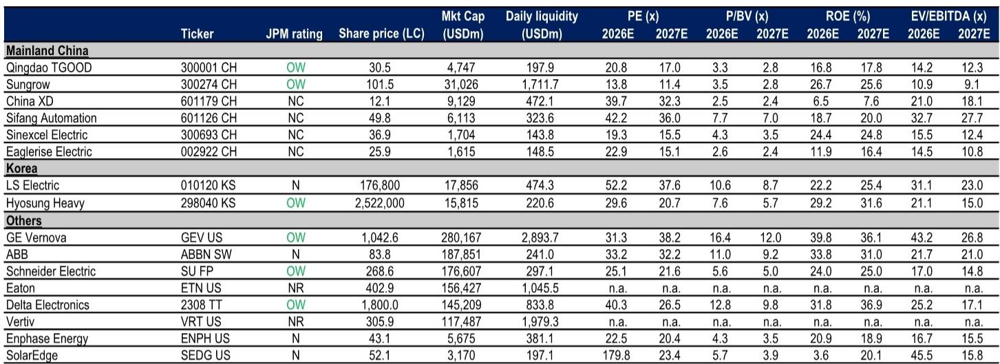
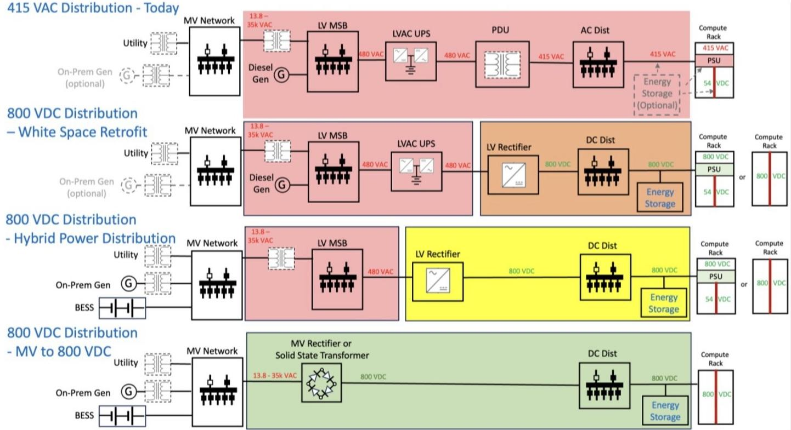
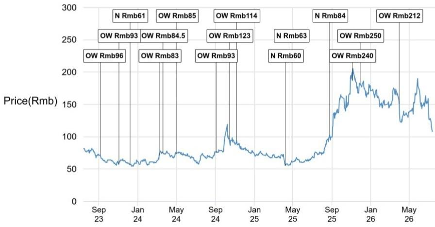

# The Path to Solid-State Transformers in Data Centers Is Real but Not Imminent—and the Real Opportunity Lies Elsewhere Before 2028

A single unit of a solid-state transformer can lift end-to-end data center power efficiency by more than five percentage points above the roughly 90% ceiling of a conventional line-frequency transformer plus uninterruptible power supply chain. It can shrink power equipment volume to one-fifth or even one-tenth of traditional setups. And it enables software-defined, bidirectional energy dispatch that coordinates power supply with compute loads. These are transformative numbers. Yet the expert call from a global research institution reveals a stark counterpoint: one electrical equipment company has secured roughly 100-200 units in North America, and China XD has won four units of overseas orders. For an industry that spends tens of billions on data center infrastructure annually, these figures are negligible. The tension between the technology's theoretical potential and its commercial reality is the central fact that observers must reconcile.

The argument of this article is straightforward: solid-state transformers represent a genuine long-term architectural upgrade for data centers, but the timing of adoption is being systematically overestimated by market enthusiasm. The technology faces four binding constraints—immature standards, insufficient reliability validation, the existence of "good enough" alternatives in 800V HVDC, and a lack of proven use cases at scale. These constraints will delay meaningful data center deployment until at least 2028. In the interim, the near-term commercial opportunity for SST is concentrated in four non-data-center verticals: EV charging, high-energy industrial applications, renewables-plus-storage systems, and microgrids. Observers should position accordingly, distinguishing between companies that have real deployment data and those that merely have product announcements.

The second-order implication is more strategic. The coexistence of traditional UPS-based architectures, 800V HVDC solutions, and SST-based approaches for the next five to ten years means that the market is not a winner-take-all race. The eventual winner will be determined by the trajectory of chip power consumption and rack power density. If AI workloads push chip power beyond a threshold where 800V HVDC becomes insufficient, SST adoption will accelerate. If efficiency targets remain moderate, the incumbent architectures will persist. The decision framework for observers is therefore not about which technology is best in absolute terms, but about which technology is best for a specific, evolving set of constraints.

---

## The Efficiency and Footprint Advantages of SST Are Real, but They Do Not Yet Overcome the Reliability and Standards Gaps That Data Center Owners Require

The value proposition of solid-state transformers is quantitatively compelling. A conventional data center power chain built around a line-frequency transformer plus UPS typically delivers end-to-end efficiency below 90%. An SST-based approach can lift total system efficiency by more than five percentage points. In a facility drawing 100 megawatts, that five-point gain translates into roughly 5 megawatts of reduced losses, lower heat rejection requirements, and a direct operating cost saving. The footprint advantage is equally dramatic: SST solutions can cut power equipment volume to roughly one-fifth to one-tenth of traditional setups, freeing valuable floor area for compute racks and supporting higher power density. In AI data centers where transformers and power distribution equipment are taking up increasingly contested space, this is not a marginal benefit.

But data center owners do not make decisions on efficiency and footprint alone. They make decisions on availability. A data center requires power availability measured in "nines"—99.999% or higher. The expert call explicitly notes that operating data and long-duration field proof for SSTs are still limited. Without years of field data demonstrating reliability under load, owners are reluctant to approve large-scale deployments. The standards gap compounds this problem: the broader data center supply chain still lacks unified product specifications for SSTs, which delays both vendor roadmaps and owner investment decisions. A technology that cannot be specified, tested, and insured against a known standard is a technology that cannot be deployed at scale, regardless of its theoretical efficiency.

The implication is that SST vendors must first accumulate operating data in less demanding environments before they can credibly pitch to hyperscale data center operators. This is precisely why the near-term opportunity lies elsewhere.

---

## Near-Term SST Adoption Will Be Driven by EV Charging, High-Energy Industrial, Renewables-Storage, and Microgrids, Not by Data Centers

The expert call identifies four verticals where SST adoption is more likely before 2028: EV charging, high-energy industrial applications, renewables-plus-storage systems, and microgrids. Each of these verticals shares a common characteristic: they place a higher premium on the SST's unique capabilities—bidirectional power flow, software-defined dispatch, and integration of multiple energy sources—and a lower premium on the kind of "five-nines" reliability that data centers demand.

Consider EV charging. A fast-charging station that must handle bidirectional vehicle-to-grid flows, manage variable renewable supply, and coordinate with local storage is a natural application for an energy router. The SST's ability to act as a bidirectional power converter with software-defined control aligns directly with the operational requirements of a smart charging hub. The reliability tolerance is also lower: a charging station that goes down for maintenance is an inconvenience, not a catastrophe. The same logic applies to microgrids and industrial facilities, where the SST can integrate solar, wind, and storage while providing voltage regulation and power quality management.

The strategic insight is that these verticals function as proving grounds. Each deployment generates operating data, validates reliability under field conditions, and builds the reference base that data center owners will eventually require. The expert call's estimate of 100-200 units in North America for one electrical equipment company, while small in absolute terms, represents exactly this kind of operational learning. Observers should track deployment counts in these verticals as leading indicators of SST readiness for data centers, not as direct revenue drivers.

---

## 800V HVDC Is the Interim Architecture That Will Coexist with SST and UPS for Five to Ten Years, Creating a Fragmented Market

The 800V HVDC architecture is best understood as a transitional pathway, not a final destination. It typically retains the conventional line-frequency transformer on the front end while shifting the downstream distribution to 800V DC. This reduces conversion losses and current-related inefficiencies compared to traditional AC distribution, without requiring the full replacement of the front-end transformer. It is, in effect, a half-step that captures some of the efficiency gains of SST without the risk of adopting an unproven technology.

The expert call characterizes 800V HVDC as "good enough" for current needs. This is a critical phrase. It means that for many data center operators, the incremental efficiency gain of moving from 800V HVDC to full SST does not justify the incremental risk. The SST, in this context, can appear over-engineered. The coexistence of traditional UPS-based architecture, 800V HVDC solutions, and SST-based approaches for the next five to ten years is therefore not a sign of market confusion. It is a rational response to different owner risk tolerances, different chip power trajectories, and different efficiency targets.

The implication for observers is that the market will not consolidate around a single architecture quickly. Companies that can serve all three pathways—UPS, HVDC, and SST—are better positioned than pure-play SST vendors that bet everything on a single outcome. The ultimate winner will depend on how quickly chip power consumption and rack power density escalate. If AI workloads push rack power density beyond 100 kilowatts, the efficiency and thermal advantages of SST may become compelling enough to overcome the reliability and standards gaps. If chip power growth moderates, the "good enough" HVDC solution may persist for a decade or more.

---

## The Vendor Landscape Reveals a Clear First-Tier Player and a Broader Field of Chinese Vendors Whose Advantage Is Hardware, Not Deployment Data

Among SST vendors, the expert call identifies Delta Electronics as a first-tier player. Delta started R&D earliest, has the strongest industry recognition, and—critically—has accumulated operating data from early deployments. This last point is the key differentiator. In a market where reliability validation is the binding constraint, a vendor with real field data has an asymmetric advantage. Delta's edge is not in hardware design, where Chinese vendors are not clearly disadvantaged. It is in the years of operational experience that cannot be replicated quickly.

Chinese vendors such as Sungrow and Sifang Automation are positioned to compete on hardware, but face a larger gap in access to real deployments and operating data. Sifang Automation, for example, has a utility-grid background and practical experience in PV-storage-DC architectures, and is exploring cooperation with a leading US data center electrical equipment supplier to leverage the partner's North American channel presence while working toward necessary certifications. This is a sensible strategy, but it underscores the central challenge: without access to North American or European data center deployments, Chinese vendors cannot generate the reliability data that owners require.

The broader vendor landscape includes more than 20 companies in China that have announced SST products, and over 30 more in pre-release. Most remain in development and lack true mass-production capability. Overseas players such as Eaton have announced products, but the expert call notes that widely referenced commercialization cases are scarce. The pattern is clear: announcements are abundant, but deployments are not. Observers should treat product announcements as noise and deployment data as signal.

---

## Decision Framework: Four Questions to Evaluate SST Exposure in Any Portfolio

The following framework translates the expert call's analysis into a structured decision tool for observers evaluating companies with SST exposure.

First, what is the company's deployment count and operating data history? A vendor with 100-200 units in the field and years of operating data has a fundamentally different risk profile than a vendor with a product announcement and no deployments. Deployment count is the single most important metric because it directly addresses the reliability validation constraint.

Second, what is the company's exposure to the four near-term verticals—EV charging, high-energy industrial, renewables-storage, and microgrids? Companies that are generating revenue and data from these verticals are building the foundation for eventual data center adoption. Companies that are exclusively targeting data centers are betting on a timeline that the expert call suggests is unlikely before 2028.

Third, does the company serve multiple power architectures or is it a pure-play SST vendor? Companies that can supply UPS, HVDC, and SST solutions are hedged against the five-to-ten-year coexistence period. Pure-play SST vendors face binary risk: if data center adoption accelerates, they win; if it stagnates, they have no fallback.

Fourth, what is the company's certification and standards engagement status? The lack of unified product standards is a systemic constraint that no single vendor can solve alone. But vendors that are actively engaged in standards development and have achieved relevant certifications in North America or Europe are better positioned than those that have not.

This framework is not a substitute for fundamental financial analysis. But it provides a structured way to separate the signal of real commercial traction from the noise of market enthusiasm.

---

## The Real Constraint Is Not Technology or Cost—It Is the Limited Willingness of Owners to Pilot SSTs at Scale

The expert call makes a critical distinction: rising silicon carbide device prices are putting upward pressure on system costs, but cost is not viewed as the primary blocker. The more fundamental issue is the limited willingness among owners to pilot SSTs at scale, given uncertain standards, incomplete reliability evidence, and an unclear set of near-term applications where SSTs deliver uniquely compelling benefits.

This is a subtle but important point. In many technology adoption cycles, cost is the binding constraint, and the narrative is about the learning curve driving costs down. In the case of SSTs, the constraint is not cost but confidence. Owners do not need SSTs to be cheaper than the alternatives. They need SSTs to be proven at scale, with documented reliability, under a unified standard. Until those conditions are met, even a zero-cost SST would not be deployed in a hyperscale data center.

The implication is that the SST adoption timeline is not a function of manufacturing scale or component prices. It is a function of the pace at which the industry can generate field data, finalize standards, and build owner confidence. That pace is inherently slow, because reliability validation requires time. The expert call's estimate of meaningful large-scale SST adoption after 2028, with a small-batch scaled commercial phase beginning then, is consistent with the historical pattern of power infrastructure technology adoption in data centers. Observers who expect a faster timeline are likely to be disappointed.

*For informational purposes only. Portions may be generated, translated, summarized, or edited with AI assistance based on source materials and may contain omissions or errors. Please verify independently. This is not professional advice.*

For informational purposes only. Portions may be generated, translated, summarized, or edited with AI assistance based on source materials and may contain omissions or errors. Please verify independently. This is not professional advice.

