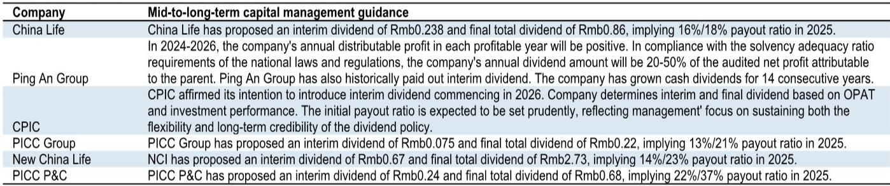
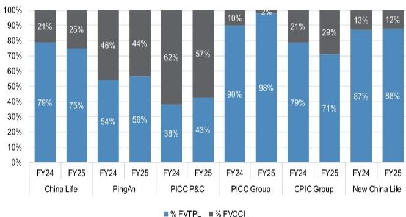
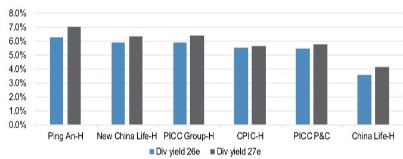

# 中国保险：利润预喜提振EPS预期，但分红决定市场反应，关注平安H

新华保险一份半年度利润预喜公告，将中国保险板块推入市场视野。该公司预计2026年上半年净利润在207亿至237亿元人民币之间，同比增长40%至60%，而市场此前对全年的净利润预期仅为307亿元。这份公告直接拉动了市场对保险股盈利上修的期待。但JPM在最新研报中给出的判断更为审慎：在IFRS-17/9新会计准则下，利润数字的弹性已经不再是核心变量，真正决定报价反应的，是这些利润能否转化为中期分红。

报告的核心逻辑建立在两个事实之上。其一，宏观环境确实在改善——沪深300指数2026年上半年上涨7.6%，10年期国债回报表现从3月末的1.81%回落至6月末的1.73%，这意味着保险公司研究端的浮盈将集中释放。其二，新会计准则下，大量权益研究被分类为FVTPL（以公允价值计量且其变动计入当期损益），使得利润对市场波动的敏感度大幅上升。JPM测算，上证综指每变动10%，将对保险行业2026年一致预期净利润产生约46%的平均影响。

但问题在于，这些账面浮盈并不直接构成分红来源。报告明确指出，资产和负债两端的未实现收益通常不是分红的直接基础。因此，中期分红是否上调，才是市场真正会定价的催化剂。

> **KC评论：** 市场往往把利润预喜等同于报价催化剂，但JPM这张敏感度图表揭示了一个容易被忽略的关系——利润弹性越大，分红的可预测性反而越低。读者需要区分“会计利润”和“可分配利润”之间的鸿沟。

## 1. 分红政策正在成为保险股估值的新锚点

JPM梳理了主要保险公司的股东回报政策，发现分化已经非常明显。中国平安已连续14年增加现金分红，且历史上一直支付中期股息；中国人寿则设定了20%至50%的年度分红比例区间。而太保在2026年首次引入中期分红，但管理层强调初始派息率会保持审慎，以维持政策的灵活性和长期可信度。

从估值角度看，H股保险公司的吸引力正在上升。当前H股保险板块交易在5至7倍2026年预期市盈率，股息率在4%至6%之间。其中，平安H股的2026年一致预期股息率已升至6.4%，JPM的预测为6.3%。在利润预喜窗口期，报告认为这是关注平安H股的时机。

## 2. 基本面质量比利润增速更值得关注

进入半年报季，JPM认为读者应聚焦三个维度：寿险的双位数新单销售增速能否持续到下半年；销售质量和利润率是否保持健康；合同服务边际（CSM）增长是否在加速——这是未来核心盈利的先行指标。

报告对寿险板块的基本面改善持乐观态度，尤其看好平安集团和中国人寿。对于非寿险公司，JPM预期上半年综合成本率维持在96%左右，超预期的空间主要来自非车险承保利润。整体而言，报告更偏好寿险公司，而人保财险和人保集团H股则被列为板块中关注度较低的标的。

## 3. 一个可复用的观察框架：利润预喜不等于买入信号

这份报告提供了一个清晰的决策框架：第一步，看利润预喜是否伴随中期分红上调；第二步，看分红上调是否有资本充足率支撑；第三步，看寿险新业务价值和CSM增长是否同步改善。只有三个条件同时满足，利润预喜才可能转化为可持续的报价动能。

平安H股之所以被报告列为首选，正是因为它在三个维度上都有相对清晰的叙事：稳定的分红增长前景、扎实的寿险业务基础、以及36%的新业务价值增长预期和11%的营运利润增长预期。中国人寿H股也可能受益于利润预喜带来的动量，但前提是同样伴随分红上调。太保H股则以5.5%的股息率提供了可比选择。

For informational purposes only. Portions may be generated,translated,summarized,or edited with AI assistance based on source materials and may contain omissions or errors. Please verify independently. This is not investment,legal,tax,accounting,or other professional advice.

For informational purposes only. Portions may be generated,translated,summarized,or edited with AI assistance based on source materials and may contain omissions or errors. Please verify independently. This is not investment,legal,tax,accounting,or other professional advice.

