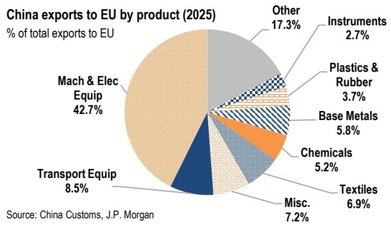
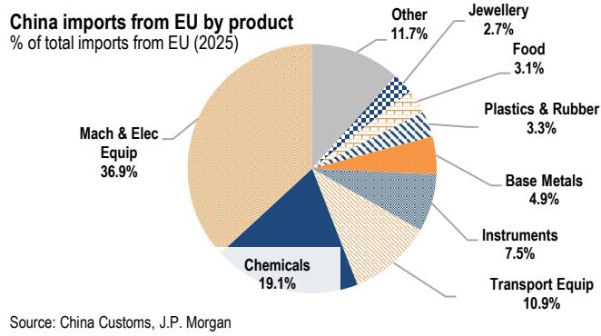
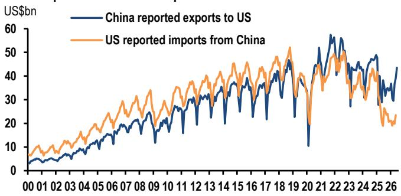

# JPM：中国-贸易韧性-但难以独自支撑增长

6月进出口数字双双超预期，顺差扩至1256亿美元，出口同比27%、进口同比36%，看起来是份亮眼的成绩单。但JPM在最新研报中给出了一个克制且关键的判断：贸易正在支撑宏观环境企稳，但它无法独自推动再通胀。

这份报告的核心洞察不在于数据本身，而在于数据背后的结构。出口的反弹集中在高技术产品、汽车和部分消费品，手机和电脑反而走弱。进口的增长则更多指向生产和供应链需求，而非终端消费的广泛回暖。换句话说，贸易的韧性是真实的，但它的驱动力是外需、AI周期、贸易转口和政策支持的生产端，而不是国内需求的自我强化。

报告同时提醒，外部不确定性正在变得更加集中。美国、欧洲和东盟围绕电动车、电池、光伏、成熟制程半导体的贸易摩擦可能进一步升级，而霍尔木兹海峡的地缘不确定性——美国对伊朗军事行动重启后，商业航运面临更高的保险费和能源成本——正在成为另一个不可忽视的变量。这些因素叠加，使得贸易在下半年作为增长缓冲垫的可靠性正在下降。

## 1. 出口的韧性有边界：集中在少数产品和目的地

6月出口环比增长5.6%，同比27%，高于JPM和市场的一致预期。但这份韧性并不均匀。按目的地看，对欧盟出口环比增5.9%，对新兴亚洲增5.8%（其中对台湾增8.2%），对美仅增0.9%。按产品看，低端消费品环比增5.8%，高技术出口连续第八个月增长，其中集成电路增3%，汽车增13.1%（同比69.6%）。但手机出口环比下降5.5%，自动数据处理设备下降4.1%。

> **KC评论：** 出口的韧性更多来自结构性优势产品——汽车和集成电路——以及部分低端消费品的补库，而非全面的外需回暖。手机和电脑的走弱可能反映了近期存储芯片价格变化对下游出货的影响，这一点在报告中没有完全展开，但值得持续跟踪。

这份出口数据确认了生产端的稳定，但没有给出需求端加速的信号。JPM认为，6月工业增加值可能因此获得支撑，但零售、研究和房地产等内需指标仍然偏弱。

## 2. 进口的结构暗示：生产补库，而非需求回暖

进口环比增2.1%，同比36%，同样超预期。但细看结构，信号更加复杂。按来源地看，从澳大利亚进口环比增20.4%，欧盟增5.8%，美国增4.2%，但从新兴亚洲进口下降1.1%，其中从东盟下降3.1%。这暗示了部分采购来源的分散化，但并非区域供应链的全面回升。

按产品看，高技术进口增2.3%，与AI和电子元件的投入需求一致。大宗商品则出现分化：煤炭、天然气、大豆和铜的进口量上升，成品油反弹，但原油和钢材下降。报告认为，这种进口组合指向供应链重建和选择性补库，而非广泛的需求复苏。

连续第七个月的进口增长，意味着净贸易对GDP的贡献将被部分抵消。JPM预计二季度实际GDP同比增速将从一季度的6.7%节奏变化至4.7%，环比年化增速从6.7%降至3.3%。

## 3. 外部不确定性正在从单一摩擦变成多重冲击

报告专门用一个章节讨论了外部不确定性的聚集。贸易摩擦方面，美国、欧洲和东盟围绕电动车、电池、光伏、成熟制程半导体和绿色产品的关税、本地化要求和反补贴行动，虽然不会立即导致出口断崖，但正在提高依赖外需的成本。

霍尔木兹海峡的不确定性则是另一个变量。美国对伊朗军事行动在7月7日重启后，特朗普于7月10日依据《战争权力法》通知国会，开启了新的60天军事行动窗口。商业航运在阿曼水域附近再次遭到攻击，有提议对通过海峡的货物征收20%的“保护费”。海峡并未关闭，但中断不确定性仍然很高。对中国而言，这意味着更高的原油、LNG和航运成本，以及能源价格持续高企对全球商品需求的潜在压制。

报告没有给出一个明确的结论，但逻辑链条是清晰的：贸易可以缓冲宏观环境节奏变化，但它无法独自创造再通胀。一个可持续的复苏仍然需要更快的财政执行和更强的需求侧政策支持。

## 4. 一个可复用的观察框架：区分生产信号和需求信号

这份报告最有价值的地方，不是数据本身，而是它提供了一个区分“生产信号”和“需求信号”的分析框架。出口和进口都在增长，但驱动逻辑不同。出口增长来自外需、AI周期和贸易转口，进口增长来自生产投入和供应链补库。两者都指向生产端的稳定，但都没有给出终端需求加速的证据。

对于关注宏观环境的读者来说，这个框架意味着：在看到零售、研究和房地产等内需指标出现同步改善之前，贸易数据的亮眼表现不应被过度解读为宏观环境加速的信号。相反，它更像是一个“生产稳定、需求待验证”的中间状态。在这个状态下，政策节奏和外部不确定性的变化，可能比月度贸易数字本身更具决定意义。

For informational purposes only. Portions may be generated,translated,summarized,or edited with AI assistance based on source materials and may contain omissions or errors. Please verify independently. This is not investment,legal,tax,accounting,or other professional advice.

For informational purposes only. Portions may be generated,translated,summarized,or edited with AI assistance based on source materials and may contain omissions or errors. Please verify independently. This is not investment,legal,tax,accounting,or other professional advice.

