# 资金流动与市场观察

## 去杠杆进程

- 自6月开始的读者去杠杆阶段似乎仍在持续，我们看到杠杆类ETF、期权和保证金账户仍有进一步去杠杆的空间，这将在未来一段时间内对市场形成一定影响。

- 杠杆类ETF的过度增长具有自我修正的特性：如果过度杠杆导致风险价值冲击频率增加，市场的区间震荡将随时间推移缩小杠杆类ETF的资产管理规模。

- 话虽如此，可能需要大约三个月的区间震荡，才能使杠杆类ETF的资产管理规模与标的公司市值之比（无论是针对存储类公司还是所有ETF）回到4月前的水平。

- 一旦这一去杠杆过程缓和，长期的市场供需动态有望提供一定支撑。

• 比特币期货方面出现了一些积极信号。

## 跨资产资金流动监测

当前水平显示每周资金流的最新百分位；最小值记为0，最大值记为1。数据截至2026年7月8日。

<table><tr><td>共同基金与ETF资金流</td><td>最小值</td><td>最大值</td><td>4周均值（十亿美元）</td><td>2025年均值（十亿美元）</td></tr><tr><td>全球权益类</td><td></td><td></td><td>29.6</td><td>8.1</td></tr><tr><td>全球债券类</td><td></td><td></td><td>16.8</td><td>11.3</td></tr><tr><td>美国权益类</td><td></td><td></td><td>20.3</td><td>3.5</td></tr><tr><td>美国债券类</td><td></td><td></td><td>10.1</td><td>4.3</td></tr><tr><td>非美国权益类</td><td></td><td></td><td>9.3</td><td>4.6</td></tr><tr><td>非美国债券类</td><td></td><td></td><td>6.7</td><td>7.0</td></tr><tr><td>美国投资级债券</td><td></td><td></td><td>10.1</td><td>3.4</td></tr><tr><td>美国高收益债券</td><td></td><td></td><td>0.7</td><td>0.4</td></tr><tr><td>美国杠杆贷款 *</td><td></td><td></td><td>0.3</td><td>0.0</td></tr><tr><td>美国货币市场基金</td><td></td><td></td><td>-0.3</td><td>4.0</td></tr><tr><td>新兴市场权益类</td><td></td><td></td><td>-1.3</td><td>0.9</td></tr><tr><td>新兴市场债券类</td><td></td><td></td><td>0.74</td><td>0.50</td></tr><tr><td>日本权益类</td><td></td><td></td><td>0.8</td><td>-0.1</td></tr><tr><td>中国权益类</td><td></td><td></td><td>-0.91</td><td>-0.15</td></tr><tr><td colspan="5">欧洲</td></tr><tr><td>欧洲权益类</td><td></td><td></td><td>-0.6</td><td>0.9</td></tr><tr><td>欧洲债券类</td><td></td><td></td><td>4.2</td><td>4.3</td></tr><tr><td>欧洲投资级债券</td><td></td><td></td><td>0.7</td><td>0.9</td></tr><tr><td>欧洲高收益债券</td><td></td><td></td><td>0.59</td><td>0.17</td></tr><tr><td>欧洲货币市场基金</td><td></td><td></td><td>6.9</td><td>3.8</td></tr><tr><td>其他权益类</td><td></td><td></td><td>10.72</td><td>3.00</td></tr></table>

来源：Lipper, ICI, Bloomberg Finance L.P. 及 JPM 资金流动与流动性研究。
\* 美国杠杆贷款历史数据为月度均值，已转换为周度数据以作比较。中国A股ETF已排除在外。

## 全球市场策略

Nikolaos Panigirtzoglou AC
(44-20) 7134-7815
nikolaos.panigirtzoglou@JPM.com
JPM Securities plc

## Mika Inkinen

Mika Inkinen
(44-20) 7742 6565
mika.j.inkinen@JPM.com
JPM Securities plc

Mayur Yeole
(91 22) 6157 3872
mayur.yeole@jpmchase.com
JPM India Private Limited

## Krutik P Mehta

(91-22) 6157-5016
krutik.mehta@jpmchase.com
JPM India Private Limited

跨资产持仓监测 当前水平显示最新百分位，最小值记为0，最大值记为1。

<table><tr><td>截至2026年7月14日</td><td>最小值</td><td>最大值</td><td>当前百分位</td></tr><tr><td>权益类</td><td></td><td></td><td>0.64</td></tr><tr><td>政府债券</td><td></td><td></td><td>0.64</td></tr><tr><td>信用类</td><td></td><td></td><td>0.29</td></tr><tr><td>美元</td><td></td><td></td><td>0.79</td></tr><tr><td>除黄金外大宗商品</td><td></td><td></td><td>0.51</td></tr><tr><td>黄金</td><td></td><td></td><td>0.49</td></tr><tr><td>比特币</td><td></td><td></td><td>0.56</td></tr><tr><td>新兴市场权益类</td><td></td><td></td><td>0.81</td></tr><tr><td>新兴市场债券/外汇</td><td></td><td></td><td>0.22</td></tr><tr><td>日本权益类</td><td></td><td></td><td>0.72</td></tr><tr><td>欧洲权益类</td><td></td><td></td><td>0.87</td></tr><tr><td colspan="4">美国权益板块：</td></tr><tr><td>能源</td><td></td><td></td><td>0.74</td></tr><tr><td>原材料</td><td></td><td></td><td>0.51</td></tr><tr><td>工业</td><td></td><td></td><td>0.42</td></tr><tr><td>可选消费</td><td></td><td></td><td>0.54</td></tr><tr><td>必需消费</td><td></td><td></td><td>0.14</td></tr><tr><td>医疗保健</td><td></td><td></td><td>0.43</td></tr><tr><td>金融</td><td></td><td></td><td>0.22</td></tr><tr><td>科技</td><td></td><td></td><td>0.65</td></tr><tr><td>通信服务</td><td></td><td></td><td>0.35</td></tr><tr><td>公用事业</td><td></td><td></td><td>0.47</td></tr></table>

跨资产持仓监测综合了附录中各项持仓指标，涵盖各类期货合约的持仓代理指标、作为趋势跟踪基金/CTA持仓代理的动量信号、作为共同基金经理持仓代理的共同基金贝塔、风险平价基金持仓与杠杆代理指标、作为对冲基金经理持仓代理的对冲基金贝塔、客户调查、全球非银行私人读者的资产配置估算、空头持仓指标等。

- 尽管6月份标普500和纳斯达克指数有所回落，但权益类对冲基金（如股票多空和TMT板块基金）的表现仍为正收益，分别为1.2%和3.7%。其表现可能受到半导体板块的提振，SMH半导体ETF在6月上涨9.5%，而美国超大规模公司当月下跌14.5%。换言之，上月对冲基金的表现与权益类对冲基金在6月维持半导体超配的持仓情况相符。

- 我们目前尚未获得月度报告对冲基金的7月完整数据，但每日报告的股票多空基金（规模较小）显示与半导体公司的关联度有所降低（图1），表明权益类对冲基金可能在7月已降低了对半导体的敞口。

图1：HFRX权益对冲指数 vs SMH半导体权益ETF  
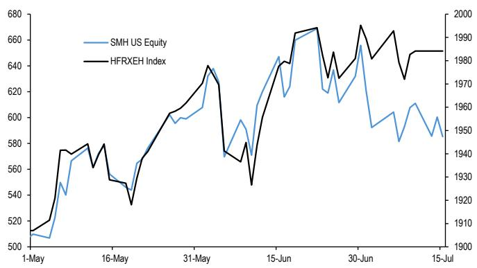  
来源：HFR, Bloomberg Finance L.P., JPM 资金流动与流动性研究。

- 这与我们对股票多空对冲基金的高频杠杆代理指标一致，如图2所示，该指标在6月达到2017年以来最高水平后，7月有所回落。

图2：股票多空对冲基金的高频杠杆代理指标  
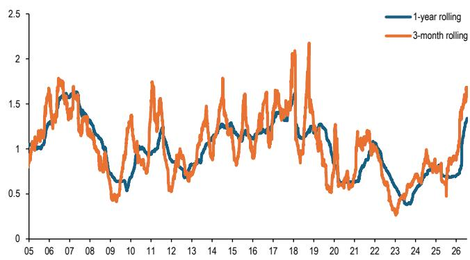  
来源：HFR, Bloomberg Finance L.P., JPM 资金流动与流动性研究。

- 我们认为，除了权益类对冲基金之外，更广泛的读者群体也存在杠杆正常化的需求。事实上，我们看到在图2所示的对冲基金杠杆指标之外，一系列更广泛指标均显示出杠杆正常化的迹象。

- 对于杠杆类权益ETF而言，区间震荡因其凸性特征而自然降低其资产管理规模。例如，如果标的指数某日下跌10%，次日上涨11.1%回到前值，那么3倍杠杆ETF首日将下跌30%，次日上涨33.3%，最终较前值下跌7%。换言之，杠杆类权益ETF的过度增长因其凸性而具有自我修正特性：如果过度杠杆导致风险价值冲击频率增加，市场的区间震荡将随时间推移缩小其资产管理规模。

- 事实上，在6月达到峰值后，杠杆类存储公司ETF的资产管理规模已缩减34%，而所有杠杆类权益ETF的资产管理规模缩减了13%（图3）。尽管如此，相对于标的公司的市值，如图4所示，无论是杠杆类存储公司ETF还是所有权益ETF的资产管理规模占比，其下降幅度看起来更为温和。我们认为，可能需要大约三个月的区间震荡，才能使杠杆类权益ETF的资产管理规模与标的公司市值之比（无论是针对存储类公司还是所有ETF）回到4月前的水平。

图3：杠杆类权益ETF资产管理规模（十亿美元）  
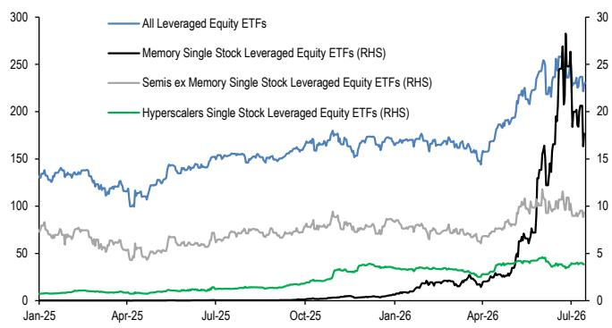  
来源：Bloomberg Finance L.P., JPM 资金流动与流动性研究。

图4：杠杆类权益ETF资产管理规模占标的公司市值百分比  
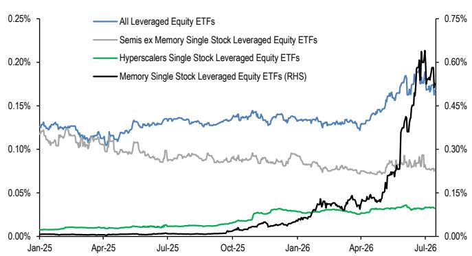  
来源：Bloomberg Finance L.P., JPM 资金流动与流动性研究。

- 这还因为如图5和图6中的橙色柱所示，这些杠杆类权益ETF在7月继续获得资金流入，从而延长了通过区间震荡来缩减/正常化其资产管理规模所需的时间。

- 最后，虽然图4说明了杠杆ETF为何成为存储类公司波动的一个更大来源（其资产管理规模与标的公司市值之比是全部权益ETF的三倍），但图4中深蓝色线相对于其自身历史水平的上升表明，杠杆ETF作为波动来源的问题不仅限于存储类公司，由于杠杆类权益指数ETF的普及，这也是整个市场面临的一个更广泛问题。

图5：全球权益基金资金流（十亿美元/月，7月至今）  
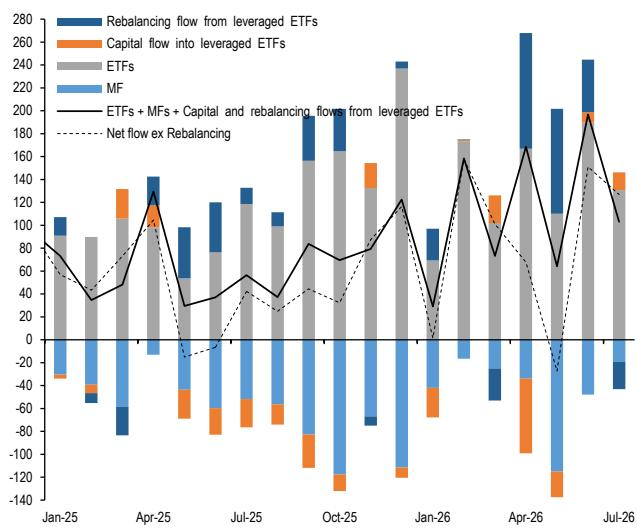  
来源：LSEG Lipper, Bloomberg Finance L.P., JPM 资金流动与流动性研究。

图6：投资韩国的权益基金资金流（十亿美元/月，7月至今）  
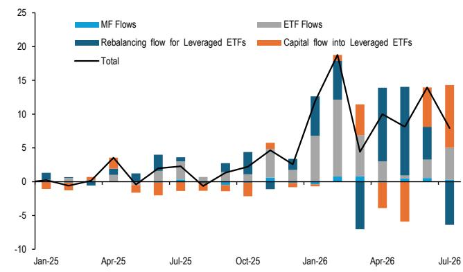  
来源：LSEG Lipper, Bloomberg Finance L.P., JPM 资金流动与流动性研究。

- 在风险平价基金领域，如图7所示，我们的杠杆代理指标已经正常化，因此风险平价基金的过度杠杆应不再对未来市场构成显著影响。

图7：风险平价基金的隐含杠杆率  
风险平价基金收益的3个月滚动波动率与我们的风险平价策略基准波动率之比。  
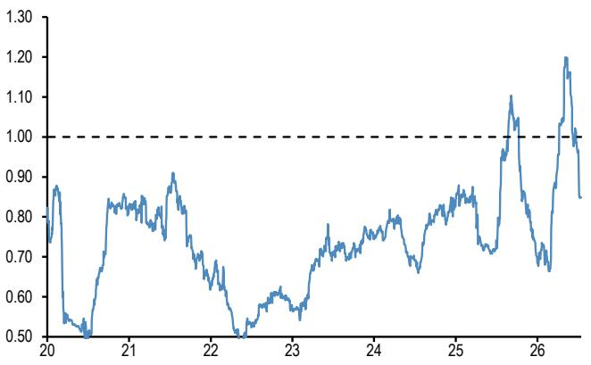  
来源：Bloomberg Finance L.P., JPM 资金流动与流动性研究。  
图8：个股期权客户（少于10张合约）的交易所看涨期权买入开仓减去卖出开仓

- 在期权领域，此前散户读者极端的看涨期权买入行为已显著回落（图8）。作为参考，我们基于OCC数据（客户交易少于10张合约的交易所看涨期权买入）的散户期权买入代理指标，在6月5日达到峰值后大幅回落。6月5日接近1400万张合约的峰值，与2025年10月和2021年11月的前期峰值相当。在这些前期峰值之后，科技股经历了数月的调整，而科技股的底部/投降点恰好与该指标的低位读数（200-400万张合约）重合。换言之，该指标自6月5日高点以来的回落表明，期权领域的散户冲动目前正在消退，如果最终达到200-400万张合约的投降水平，未来可能继续对科技股（散户读者的偏好领域）产生影响。

单位为百万张合约。最新观察为截至2026年7月10日当周。

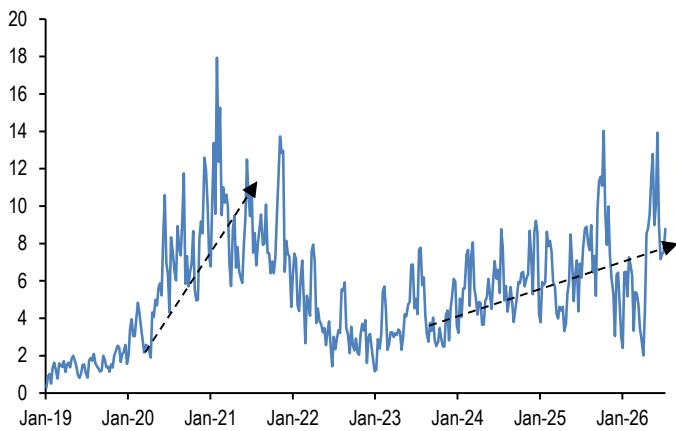  
来源：OCC, Bloomberg Finance L.P., JPM 资金流动与流动性研究。

- 保证金账户中的杠杆水平仍然较高，因此该领域需要更大幅度的去杠杆，才能使保证金账户不再对市场构成显著影响。作为参考，对于保证金账户，我们使用纽交所净借方余额作为美国个人读者杠杆的代理指标。虽然原则上它同时包含散户和机构读者，但我们认为其中大部分可能来自散户。与对冲基金（可以通过期权和期货更轻松或更便宜地获得杠杆）不同，个人读者更多地依赖美联储T条例。该条例规定了客户现金账户以及经纪公司和交易商可向客户提供的用于购买证券的信贷额度，规定个人最多可以借入可融资买入证券购买价格的50%。纽交所净借方余额的计算方式为保证金借方余额减去总贷方余额（现金账户贷方 + 保证金账户贷方）的差额。这一杠杆代理指标表明，按历史标准衡量，美国个人读者通过保证金账户的杠杆水平处于极端水平，近几个月有初步回落迹象（图9）。今年的峰值与2021年底或更早的2018年中期所见水平相当，这两次前期事件之后都出现了市场的数月调整。

图9：纽交所保证金账户净借方余额  
纽交所保证金账户净借方余额等于保证金借方余额减去总贷方余额（现金账户贷方 + 保证金账户贷方）。蓝线由净借方余额（十亿美元）除以标普500指数市值构建。  
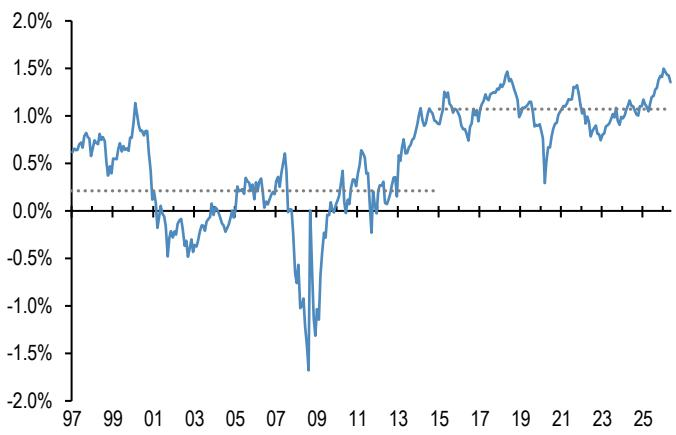  
来源：FINRA, NYSE, JPM 资金流动与流动性研究。

- 总体而言，自6月开始的读者去杠杆阶段似乎仍在持续，我们看到杠杆类ETF、期权和保证金账户仍有进一步去杠杆的空间，这将在未来一段时间内对市场形成一定影响。杠杆类ETF的过度增长具有自我修正的特性：如果过度杠杆导致风险价值冲击频率增加，市场的区间震荡将随时间推移缩小其资产管理规模。话虽如此，可能需要大约三个月的区间震荡，才能使杠杆类ETF的资产管理规模与标的公司市值之比（无论是针对存储类公司还是所有ETF）回到4月前的水平。

## 一旦去杠杆过程缓和，长期的市场供需动态有望提供一定支撑

- 尽管近期市场有所波动，但全球权益类资产仍实现了约10%的回报，由此引发了一个问题：下半年哪些资金流可能为市场提供支撑？

- 从股票多空对冲基金（最大的权益类对冲基金领域，资产管理规模约1.4万亿美元）开始，我们通常通过观察资产管理公司和杠杆基金的期货持仓来代理其权益贝塔，因为股票多空基金使用期货作为实现其目标贝塔的叠加工具。资产管理公司和杠杆基金的这些期货持仓又由图10所示的CFTC净持仓占未平仓合约百分比的z-score来代理。假设中性z-score为零对应于股票多空对冲基金的历史平均权益贝塔0.5。我们还假设CFTC期货持仓z-score的3个标准差极端变动对应于权益贝塔0.5的极端变动。基于这些假设，我们估计贝塔已从去年年底的约0.65（F&L，12月3日）有所下降，目前处于类似水平。这意味着2026年至今的权益需求约为200亿美元，较为温和。如上文所述，杠杆水平仍然较高，我们预计到2026年底贝塔不会进一步显著上升。

图10：来自美国权益期货的资产管理公司和杠杆基金的股票多空持仓代理指标

CFTC美国权益期货（资产管理公司和杠杆基金）持仓（占未平仓合约百分比）。按文中所述重新调整。为标普500、道琼斯、纳斯达克及其迷你期货合约的汇总。

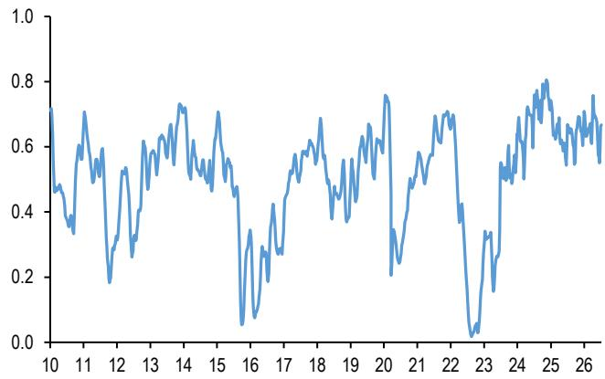  
来源：CFTC, Bloomberg Finance L.P., JPM 资金流动与流动性研究。  
- 对于动量型读者（如CTA），图11显示了标普500、日经225、欧洲斯托克50、富时100和MSCI新兴市场指数短期和长期动量信号的平均z-score。该z-score在年初约为0.9，目前约为1.0，意味着年初至今净买入约200亿美元。对于今年剩余时间，我们继续预计到2026年底z-score约为1.0，这反过来意味着2026年下半年净买入量较小。

## 图11：权益指数动量信号z-score的加权平均值

我们趋势跟踪策略框架中动量信号的z-score（见附录表A3和A4）。该线显示了标普500、日经225、欧洲斯托克50、富时100和MSCI新兴市场指数短期和长期动量信号的平均z-score。我们对标普500动量信号赋予50%权重，对剩余四个指数综合动量信号赋予50%权重。

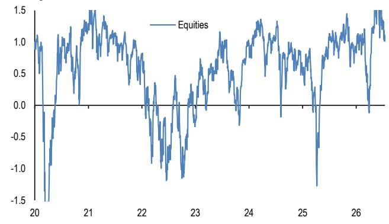  
来源：CFTC, Bloomberg Finance L.P., JPM 资金流动与流动性研究。  
图12：美国平衡型共同基金和风险平价基金的权益贝塔

- 风险平价基金领域的情况如何？对其规模的估计各不相同，但保守估计其资产管理规模约为1500亿美元。我们的计算（图12）表明，风险平价基金对权益的贝塔目前升至约0.4，与我们此前对2026年权益供需平衡展望时的水平相差不远。假设其均值回归至长期平均水平，这将意味着2026年下半年净需求约为-200亿美元，较为温和。对于美国平衡型共同基金，其对权益的贝塔已显著下降至约0.49，而年初约为0.54，意味着年初至今净需求为负。虽然这与5月底从权益向投资级债券的再平衡一致，但大部分变动发生在6月，恰逢债券-权益相关性急剧下降。因此，我们部分地看待这一变动，认为平衡型共同基金年初至今已卖出约2100亿美元的权益。此外，鉴于图12表明近年来权益贝塔相对于其长期区间已出现结构性下移，我们预计到2026年底它将基本保持不变。

基于平衡型共同基金和风险平价基金收益指数日回报表现对标普500和BarCap美国综合指数日回报表现的双变量回归的滚动42天权益贝塔。更多详情请参见附录图A21。虚线为2015年以来的均值。

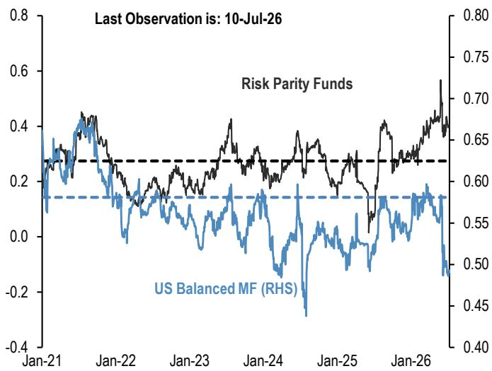  
来源：Bloomberg Finance L.P., JPM 资金流动与流动性研究。

- 养老基金和保险公司的情况如何？G4国家的保险公司和养老基金（包括固定收益和固定缴款计划）由于结构性从权益转向固定收益，通常是权益的稳定卖出方。2025年，更新的资金流量数据以及对先前数据的修正表明，它们在2025年卖出了约2400亿美元的权益，2024年卖出了5700亿美元。去年年底，我们曾预计今年的净权益卖出量将达到与2024年相似的水平，预期会有一些待实现的再平衡需求，但与我们年中全球债券供需平衡更新（F&L，6月24日）类似，鉴于2025年下半年债券购买的强劲势头，我们现在假设待实现的再平衡需求有所减少，并预计2026年净卖出量约为4700亿美元。鉴于我们大致处于年中，这意味着2026年下半年净卖出量约为2350亿美元。

- 对于主权财富基金和央行，正如我们之前指出的（F&L，5月27日），关于中东冲突将如何影响经常账户盈余的再循环存在一些疑问。实际上，影响并不统一，一些国家能够通过替代路线继续出口，而在谅解备忘录签署后的一段时间内，交通已有所恢复。该地区以外的生产商则受益于更高的收入。2025年底，我们曾预计2026年权益需求约为850亿美元。随着我们的商品策略师现在预计平均油价更高，且许多石油生产国的经常账户盈余更大，我们现在预计2026年权益需求约为1100亿美元，其中约一半应发生在2026年下半年。

- 散户读者需求如何？在我们2026年权益供需展望中，我们使用一个预测模型预计散户读者的净需求约为8900亿美元，该模型将当年的权益资金流（占资产管理规模百分比）作为前一年权益回报率以及前一年债券回报率和资金流（占资产管理规模百分比）的函数。年初至今的资金流入仍然非常强劲（图13），并且按年化计算，其速度略高于1.0万亿美元。鉴于截至7月中旬权益基金净流入约为5500亿美元，这意味着今年剩余时间将继续有约4800亿美元的流入。

图13：整体权益基金资金流（包括共同基金、ETF和杠杆权益基金的资金流）
十亿美元。7月26日观察截至7月14日。  
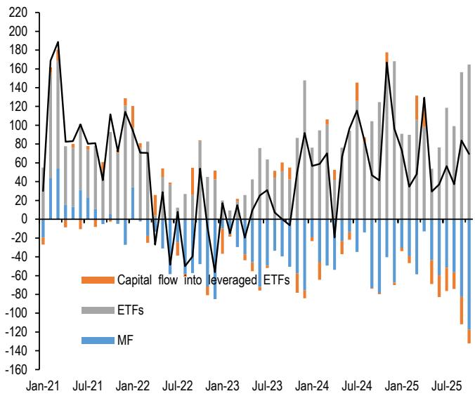  
来源：LSEG Lipper, Bloomberg Finance L.P., JPM 资金流动与流动性研究。  
图14：全球净权益供给
基于MSCI AC World指数扩张的年度十亿美元。已根据价格和汇率变动进行调整。

- 在净供给方面，我们在2026年底曾预计2026年净权益供给将基本持平，与2025年类似。然而，随着三大AI相关IPO以及近期宣布的权益融资计划，2026年净供给转向温和正值，约为2000亿美元（图14），其中约1100亿美元可能已经发生。这意味着今年剩余时间还有约900亿美元的进一步供给。

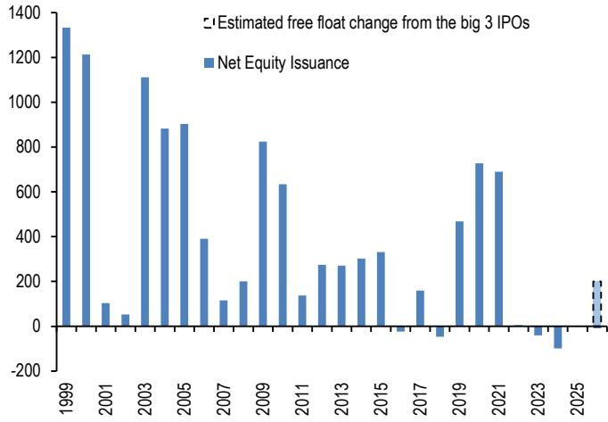  
来源：MSCI, JPM 资金流动与流动性研究。

- 总体而言，这意味着2026年权益需求约为4750亿美元，略低于我们在2025年底预估的7000亿美元，主要原因是平衡型共同基金的再平衡，而供给现在看起来高于此前预期，使得净需求约为2750亿美元。我们预计其中约2000亿美元的净需求发生在2026年下半年。

图15：年度全球权益供需平衡（年度十亿美元）

<table><tr><td>年份</td><td>2022</td><td>2023</td><td>2024</td><td>2025</td><td>2026</td><td>2026上半年</td><td>2026下半年</td></tr><tr><td colspan="8">需求</td></tr><tr><td>散户读者</td><td>11</td><td>228</td><td>913</td><td>757</td><td>1030</td><td>548</td><td>482</td></tr><tr><td>CTA</td><td>-84</td><td>100</td><td>10</td><td>32</td><td>18</td><td>18</td><td>0</td></tr><tr><td>股票多空</td><td>-1191</td><td>835</td><td>489</td><td>-340</td><td>24</td><td>18</td><td>6</td></tr><tr><td>风险平价基金</td><td>-26</td><td>47</td><td>-16</td><td>46</td><td>-27</td><td>-6</td><td>-21</td></tr><tr><td>平衡型共同基金</td><td>-386</td><td>189</td><td>-399</td><td>140</td><td>-210</td><td>-210</td><td>0</td></tr><tr><td>养老与保险基金</td><td>-179</td><td>-611</td><td>-570</td><td>-237</td><td>-470</td><td>-235</td><td>-235</td></tr><tr><td>主权财富基金/央行</td><td>514</td><td>180</td><td>115</td><td>50</td><td>110</td><td>55</td><td>55</td></tr><tr><td>总需求</td><td>-1340</td><td>969</td><td>542</td><td>447</td><td>475</td><td>188</td><td>287</td></tr><tr><td>供给</td><td>6</td><td>-41</td><td>-99</td><td>-9</td><td>200</td><td>110</td><td>90</td></tr><tr><td>需求-供给</td><td>-1346</td><td>1011</td><td>641</td><td>456</td><td>275</td><td>78</td><td>197</td></tr></table>

来源：JPM 资金流动与流动性研究。

- 从表面上看，下半年正的权益供需平衡似乎与我们第一部分得出的结论相矛盾。然而，我们注意到去杠杆过程可能在未来几个月占据主导地位，导致价格出现显著波动，而权益供需平衡更多是一种背景/长期力量，一旦去杠杆缓和，应能提供一定支撑。

## 比特币期货方面出现了一些积极信号

- 尽管比特币ETF的资金流近几周相当不稳定（上周流入，本周流出），但杠杆MicroStrategy ETF的资金流入在过去七周更为稳定且积极（图16）。

图16：现货比特币ETF、现货以太坊ETF和杠杆MicroStrategy ETF的周度资金流
十亿美元，x轴显示周五截止日期

  
来源：Bloomberg Finance L.P., JPM 资金流动与流动性研究。

- 散户读者的这种买入行为可能近几周支撑了MicroStrategy的股价，并防止其普通股相对于资产净值出现折价交易。与此同时，MicroStrategy（未覆盖）继续增加其美元储备，从上周的25.5亿美元增至本周的30亿美元，相当于20个月的股息。

- 在我们看来，这对比特币的前景是一个积极信号。我们此前曾指出，为了减轻市场对其未来可能不得不出售比特币储备以支付股息的担忧，MicroStrategy可以选择重建其美元储备以覆盖2-3年的股息。

- MicroStrategy美元储备的积累是否改善了比特币读者的情绪，这很难说。尽管如此，我们发现积极的是，本周与比特币ETF的资金流出相反，比特币期货（包括CME期货（图17）和永续期货（图18））出现了正向的资金流冲动，而这两者往往更多由机构读者而非散户读者驱动。

图17：基于CME比特币期货未平仓合约的比特币持仓代理指标
单位为合约数量。最新观察为2026年7月14日。  
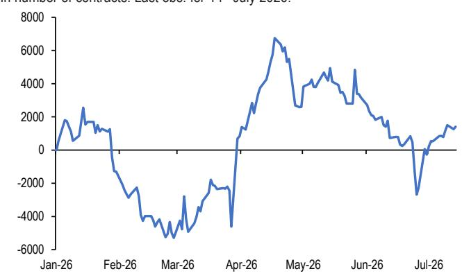  
来源：Bloomberg Finance L.P., JPM 资金流动与流动性研究。

图18：比特币永续合约未平仓合约与比特币市值之比  
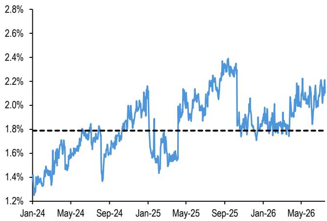  
来源：Messari, Coin Metrics, JPM 资金流动与流动性研究。

Mayur Yeole (91 22) 6157 3872  
mayur.yeole@jpmchase.com  
JPM India Private Limited  
Krutik P Mehta (91-22) 6157-5016  
krutik.mehta@jpmchase.com  
JPM India Private Limited

## 附录

## 图A1a：全球权益与债券基金资金流

年度净销售额十亿美元，即包括全球共同基金和ETF（无论注册地在美国境内还是境外）的净新销售额加再投资股息。资金流数据来自ICI（截至2026年第一季度的全球数据）。此后数据为来自Lipper和Bloomberg的月度与周度数据组合。

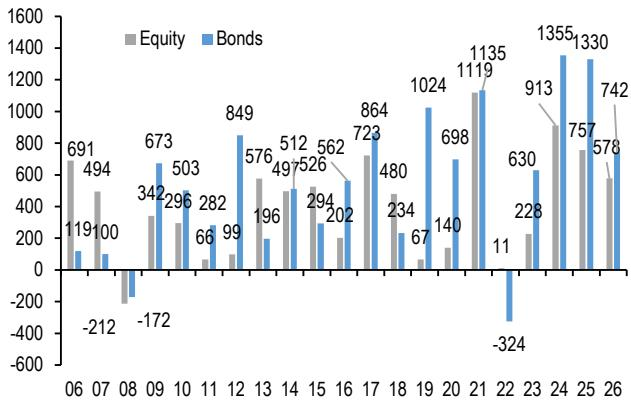  
来源：ICI, LSEG Lipper, Bloomberg Finance L.P., JPM 资金流动与流动性研究。

图A1b：全球季度平衡型/混合基金及货币市场基金资金流 每季度净销售额十亿美元，即包括全球共同基金和ETF（无论注册地在美国境内还是境外）的净新销售额加再投资股息。数据来自ICI（全球数据），截至2026年第一季度。

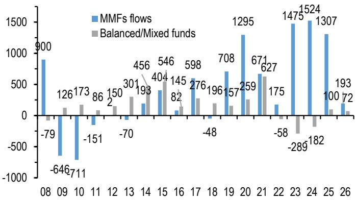

## 图A2：基金资金流指标

权益与债券基金资金流之差：每周十亿美元。权益与债券基金资金流之差（每周十亿美元）。资金流包括全球共同基金和ETF资金流，即注册地在美国境内和境外的基金（来源：Lipper）。细蓝线显示权益与债券基金资金流之差的4周均值。虚线表示自2009年以来蓝线的±1个标准差。粗黑线显示同一序列的平滑版本。平滑处理使用Hodrick-Prescott滤波器，Lambda参数为100。中国A股ETF已排除在外。

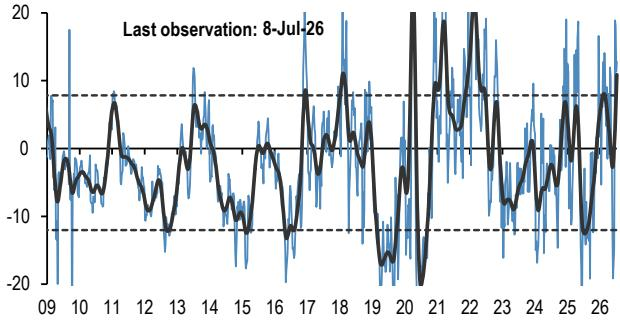

来源：LSEG Lipper, JPM 资金流动与流动性研究。

## 表A2：交易量监测

交易量为月度数据，换手率为年化值（月度交易量年化除以流通量）。美国国债现货为一级交易商在所有美国政府证券中的交易量。美国国债期货来自Bloomberg Finance L.P.。日本国债为所有日本政府证券的场外交易量。德国国债、黄金、石油和铜为期货。黄金包括黄金ETF。最小-最大图表基于换手率。对于德国国债和大宗商品，使用期货交易量，而流通量由未平仓合约代理。菱形标记为最新换手率观察值。细蓝线标记自2005年1月以来完整时间序列的最小值与最大值之间的距离。同比变化为年初至今名义交易量较去年同期的变化。

<table><tr><td>截至2026年4月</td><td>最小值</td><td>最大值</td><td>换手率</td><td>交易量（万亿）</td><td>同比变化</td></tr><tr><td colspan="6">权益类</td></tr><tr><td>新兴市场权益</td><td></td><td></td><td>1.1</td><td>$1.7</td><td>118%</td></tr><tr><td>发达市场权益</td><td></td><td></td><td>1.4</td><td>$11.4</td><td>38%</td></tr><tr><td colspan="6">政府债券</td></tr><tr><td>美国国债现货</td><td></td><td></td><td>12.9</td><td>$20.3</td><td>1%</td></tr><tr><td>美国国债期货</td><td></td><td></td><td>0.9</td><td>$13.8</td><td>3%</td></tr><tr><td>日本国债</td><td></td><td></td><td>47.2</td><td>¥4,982</td><td>8%</td></tr><tr><td>德国国债期货</td><td></td><td></td><td>1.7</td><td>€7.5</td><td>12%</td></tr><tr><td colspan="6">信用类</td></tr><tr><td>美国投资级</td><td></td><td></td><td>1.2</td><td>$0.8</td><td>11%</td></tr><tr><td>美国高收益</td><td></td><td></td><td>0.6</td><td>$0.1</td><td>2%</td></tr><tr><td>美国可转债</td><td></td><td></td><td>3.4</td><td>$0.04</td><td>13%</td></tr><tr><td colspan="6">大宗商品</td></tr><tr><td>黄金</td><td></td><td></td><td>65.4</td><td>$1.5</td><td>67%</td></tr><tr><td>石油</td><td></td><td></td><td>95.4</td><td>$3.4</td><td>-5%</td></tr><tr><td>铜</td><td></td><td></td><td>2.4</td><td>$0.7</td><td>80%</td></tr><tr><td colspan="6">数字资产</td></tr><tr><td>CME比特币</td><td></td><td></td><td>116.0</td><td>$0.075</td><td>-34%</td></tr><tr><td>CME以太坊</td><td></td><td></td><td>122.4</td><td>$0.036</td><td>61%</td></tr></table>

\* 数据
