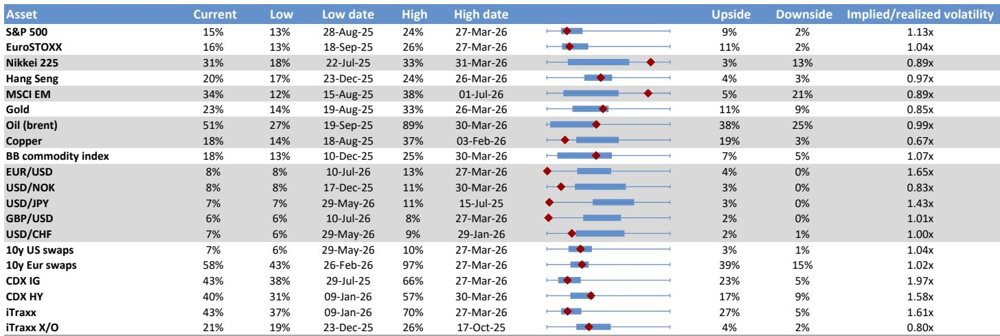
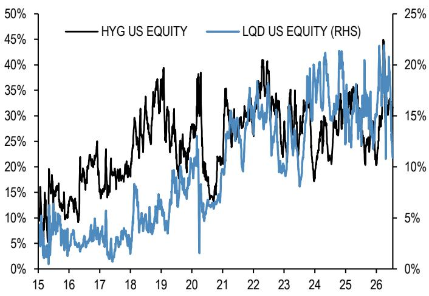
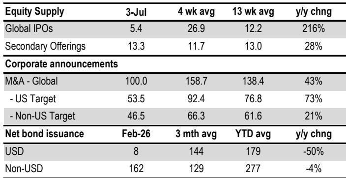

# 自6月开始的去杠杆周期远未结束，至少将在第三季度持续压制权益类资产回报

6月启动的读者去杠杆阶段尚未结束。从杠杆权益类ETF、零售期权和保证金账户的数据来看，过剩杠杆仍远高于历史正常水平，而能够降低杠杆的机制——波动区间交易、凸性损失和头寸平仓——仍处于早期阶段。对于权益类资产持有者而言，这并非周期中段的回调，而是杠杆如何嵌入市场结构的一次结构性调整，并将成为贯穿第三季度余下时间的持续阻力。

最具指示性的信号来自杠杆权益类ETF。其中，杠杆存储类ETF的管理资产规模已从6月峰值缩减34%，所有杠杆权益类ETF的管理资产规模下降13%。但如果孤立看待，这些跌幅可能具有误导性。若以其所跟踪标的股票市值的百分比来衡量，缩减幅度要温和得多。对于存储类股票，该比率仍约为所有权益类ETF平均水平的3倍。对于更广泛的市场，该比率相对于其自身历史仍处于高位。问题并非局限于单一板块，而是系统性的。

杠杆ETF的自我修正特性在数学上已得到充分理解。如果某标的指数一日下跌10%，次日上涨11.1%回到起始水平，那么3倍杠杆ETF首日将下跌30%，次日上涨33.3%，最终较起始点低7%。这种凸性惩罚是市场自然缩减杠杆的机制。但它只有在标的指数经历足够波动时才有效。数据显示，在杠杆ETF管理资产规模比率恢复到4月前水平之前，大约还需要三个月的波动区间交易。这一时间线将正常化窗口至少推迟到10月下旬。

## 杠杆ETF的凸性惩罚正在缩减管理资产规模，但7月的资金流入延长了调整期

杠杆权益类ETF并非市场波动的被动受害者。即使其现有头寸遭受凸性衰减，它们仍在接收新的资金流入。7月数据显示，这些产品持续获得资金流入，这在全球权益基金和韩国权益基金的月度资金流向图中以橙色柱状图表示。这是一个关键细节。去杠杆机制正被新的需求所抵消。读者正在增加对在区间震荡市场中结构性贬值头寸的配置。结果是调整过程更慢、更持久。

其含义很直接。只要这些资金流入持续，杠杆ETF管理资产规模与标的股票市值的比率下降速度将比管理资产规模原始数据所显示的要慢。市场将需要更多波动性或更长的区间交易时间，才能完成在急剧下跌中本可快速完成的事情。对于组合管理者而言，这意味着来自杠杆ETF凸性的阻力并非一次性冲击，而是数周乃至数月内不断累积的持续拖累。

## 零售看涨期权买入已见顶并正在逆转，为科技股带来持续数月的阻力

零售期权市场提供了另一个杠杆减少的明确信号。基于OCC数据的代理指标——持有少于10张合约的客户的交易所看涨期权买入减去卖出——于6月5日达到近1400万张合约的峰值。这一水平与2025年10月和2021年11月的高点相当。在这两次先例中，峰值之后都出现了科技股持续数月的调整，最终投降发生在该指标降至200万至400万张合约之间时。

截至7月中旬，该指标已从6月高点显著回落，但仍远高于投降区域。此前周期的模式表明，当前的下降仍有空间。如果历史可作参考，零售期权冲动将继续消退，最终低点将与科技股的底部同时出现。在达到该投降水平之前，期权市场仍将是科技板块表现的净拖累。

这不是对崩盘的预测，而是对零售杠杆机制的陈述。当零售读者净买入看涨期权时，交易商通过买入标的股票进行对冲，放大上涨走势。当资金流向逆转时，交易商解除这些对冲，放大下跌走势。这个过程是对称的，且正在发生。阻力并非假设性的，它已嵌入持仓数据中。

## 保证金账户杠杆仍处于历史极端水平，需要显著更多去杠杆才能使阻力消散

纽约证券交易所净借方余额衡量美国个人读者在保证金账户中使用的杠杆，其水平在近期历史上仅出现过两次：2021年底和2018年中。这两次先例之后都出现了持续数月的权益市场调整。当前的读数，即使近几个月有初步回落迹象，按历史标准仍处于极端水平。

这里的机制与杠杆ETF或零售期权不同，但效果相同。保证金债务放大收益和损失。当市场下跌时，追加保证金通知迫使卖出，压低价格，进而触发更多追加保证金通知。这一反馈循环已得到充分理解，但其时机难以预测。数据显示，本轮周期的起点处于高位。相对于恢复到正常水平所需，已经发生的去杠杆幅度仍然较小。

与可以通过衍生品获取杠杆的对冲基金不同，个人读者受T条例限制，借款上限为购买价格的50%。这使得保证金账户成为一种钝器。当它们平仓时，卖出是集中且机械的。数据显示，这一过程已经开始但远未完成。对于权益市场，保证金账户渠道仍是一个重要的下行风险来源。

## 对冲基金杠杆已开始正常化，但权益贝塔的下降意味着年内最多只能带来温和的净需求

专注于权益的对冲基金，特别是权益多空和权益板块TMT基金，尽管标普500和纳斯达克指数下跌，6月仍实现了正回报。SMH半导体ETF在6月上涨9.5%，而美国超大规模企业下跌14.5%，表明这些基金维持了对半导体的配置。但7月的日度数据则不同。对冲基金回报与半导体股票之间的相关性已经减弱，暗示基金可能在7月减少了对该板块的敞口。

这与权益多空对冲基金的高频杠杆代理指标一致，该指标在6月达到2017年以来最高水平后，于7月有所回落。该指标基于基金回报与市场波动之间的关系，表明对冲基金杠杆正在下降。但下降幅度温和，且起点处于极端水平。几乎没有证据表明对冲基金将在下半年成为净买入的来源。

根据资产管理公司和杠杆基金的CFTC期货头寸估算，多空对冲基金的权益贝塔已从去年年底的约0.65降至目前的约0.5。这意味着年初至今的权益需求约为200亿美元，较为温和。但轨迹是平坦的。模型预测年底前贝塔值不会有进一步显著上升，这意味着对冲基金需求不会提供有意义的支撑。

## 组合管理者的决策框架：三个需监测的渠道和一个需关注的触发点

对于试图在当前环境中导航的组合管理者，去杠杆周期可分为三个不同的渠道，每个渠道都有其自身的时间线和触发点。

第一个渠道是杠杆权益类ETF。需监测的关键指标是杠杆ETF管理资产规模与标的股票市值的比率。时间线约为三个月的波动区间交易，之后该比率才能恢复到4月前的水平。需关注的触发点是该比率持续下降而标的指数没有相应下跌，这将表明凸性惩罚正在发挥作用，而没有引发更广泛的抛售。

第二个渠道是零售期权。关键指标是OCC看涨期权买入代理指标。触发点是该指标降至200万至400万张合约的范围，这在历史上标志着投降点。在达到该水平之前，期权渠道仍将是科技股的阻力。

第三个渠道是保证金账户。关键指标是纽约证券交易所净借方余额占标普500市值的百分比。触发点是该指标降至与先前周期低点一致的水平。根据2021年和2018年的模式，这一过程可能需要数月时间。

贯穿所有三个渠道的一个触发点是持续的低波动期。如果市场进入平静、上行的趋势阶段，杠杆ETF中的凸性惩罚将减弱，零售期权活动可能稳定，追加保证金通知将变得不那么频繁。但这一结果需要宏观环境发生根本性转变。截至7月中旬的数据并不支持这一情景。

## 风险平价基金已正常化，消除了一个系统性风险来源，但其他风险依然存在

在杠杆格局中有一个亮点。风险平价基金的隐含杠杆——以风险平价基金回报的3个月滚动波动率与风险平价策略基准波动率之比衡量——已经正常化。这意味着这些基金在年初积累的过度杠杆已被平仓。风险平价基金不再是权益类资产的重大系统性风险来源。

但这种正常化有一个附带条件。风险平价基金的权益贝塔曾升至高位，现已降至约0.4。假设其均值回归至长期平均水平，这意味着下半年净需求约为负200亿美元，幅度温和。对于美国平衡型共同基金，权益贝塔已从年初的0.54降至0.49，意味着年初至今的净需求为负。在50万亿美元的权益市场中，这些数字并不大，但它们与去杠杆的总体主题一致。

积极的方面是，风险平价渠道不再放大下行走势。消极的方面是，它也没有提供支撑。对于组合管理者而言，这意味着权益市场将需要依赖其他需求来源——公司回购、养老基金再平衡或外资流入——来抵消来自杠杆ETF、零售期权和保证金账户的阻力。

## 一旦去杠杆阶段结束，长期供需动态应能提供支撑

去杠杆周期并非永久性的。数据显示，它很可能在未来三到六个月内结束。一旦结束，长期权益供需动态应能提供支撑。问题在于这种支撑是什么样的。

对于CTA等动量型读者，主要权益指数动量信号的平均z得分约为1.0，意味着年初至今净买入约200亿美元，幅度温和。年底的预测是类似的z得分，意味着下半年几乎没有净买入。CTA不是增量需求的来源，但也不是卖出的来源。

对于多空对冲基金，贝塔已降至约0.5，意味着年初至今需求温和为正。预测是年底前不会有进一步显著增加。同样，贡献是中性偏正。

最有趣的动态在债券市场。美国高等级债券基金资金流入强劲，四周平均为101亿美元，而2025年平均为34亿美元。这表明读者正在从权益类资产转向债券，这与去杠杆主题一致。但这也意味着，当去杠杆结束时，将有一大笔债券市场流动性可能重新流入权益类资产。这一轮动的时机不确定，但潜力是显著的。

*仅供参考。部分内容可能基于源材料通过AI辅助生成、翻译、总结或编辑，可能存在遗漏或错误。请独立核实。本文不构成研究、法律、税务、会计或其他专业建议。*

仅供参考。部分内容可能基于源材料通过AI辅助生成、翻译、总结或编辑，可能存在遗漏或错误。请独立核实。本文不构成研究、法律、税务、会计或其他专业建议。

