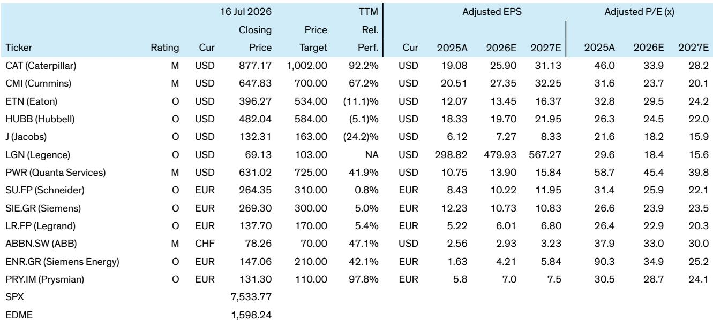

# Data Center Construction Is Becoming Unbuildable at Scale, and the Equipment Supply Chain Is Rewiring Faster Than Most Observers Recognize

Building a data center today is harder than it was a year ago. According to a senior procurement executive at a leading data center developer who recently worked at one of the top five U.S. electrical contractors, the first four to five months of this year have already seen more project delays and cancellations than the entirety of 2025. The bottleneck is no longer just power. It is a compound challenge of public opposition, skilled labor shortages, and a supply chain that remains stretched despite moderating price growth. The gap between announced capacity and deliverable megawatts is widening, and the companies that navigate this gap will separate themselves from those that merely report backlog growth.

The conventional narrative that data center demand is a straight-line growth story is breaking down. Developers are now multi-tracking the same build across different geographic locations as a hedge against permitting and political risk. The expert estimates that only 60 to 65 percent of projects in the current pipeline will proceed as scheduled. That means roughly one in three announced projects will not materialize. For observers, the critical question is not whether demand exists, but which companies are positioned to capture the projects that actually get built, and how the supply chain is adapting to a slower, more selective build-out.

This report argues that three structural shifts are redefining the data center construction landscape. First, original equipment manufacturers are becoming de facto gatekeepers of project viability, using contract terms and buyback clauses to filter out speculative builds. Second, the power generation equipment market is bifurcating between long-lead-time turbines and shorter-cycle reciprocating engines, with pricing power shifting as new capacity comes online. Third, Chinese electrical equipment manufacturers are entering the U.S. market through offshore partnerships with tier-one Western brands, a development that could reshape competitive dynamics and supply security in ways the market has not priced in.

## OEMs Are Tightening Project Viability Standards, and This Will Separate Real Demand from Speculative Pipeline

The most underappreciated dynamic in the data center supply chain is the shift in how original equipment manufacturers manage their backlog quality. It is no longer enough for a developer to have a site and a purchase order. OEMs in the power generation space, particularly Caterpillar and Cummins, are raising the bar on what qualifies as a viable project. The expert reports that OEMs are now requiring evidence of permits, financing, and offtake agreements before accepting orders. More significantly, they are adding first-right-of-refusal clauses that allow them to repossess equipment if a project is delayed, effectively protecting their production slots from being tied up by speculative developers.

This is a rational response to an environment where project cancellation rates have spiked. But it also means that reported backlogs may overstate real demand. Observers who treat backlog growth as a proxy for revenue visibility are missing the filtering mechanism now embedded in the order book. The implication is that companies with direct exposure to projects that clear this higher viability bar will outperform those that rely on volume-driven order intake. The equipment that does get delivered will go to projects with stronger fundamentals, which in turn means lower execution risk for the contractors and component suppliers involved.

The tightening also creates a second-order effect: developers who cannot meet OEM viability standards will turn to the grey market, where they are willing to pay premiums to bypass lead times. This grey market activity is a tell. It signals that real demand exists underneath the speculative froth, but it also means that pricing power in the official channel is moderating as OEMs prioritize backlog quality over volume. The companies that benefit most are those that can enforce discipline without losing market share, a balancing act that favors incumbents with strong brand equity and aftermarket service networks.

## Power Generation Lead Times Remain the Critical Constraint, but the Technology Mix Is Shifting as Data Center Scale Increases

Power generation equipment remains the longest pole in the data center construction tent, but the nature of the constraint is evolving. The expert reports lead times out to 2030 for turbines, 2029 to 2030 for large reciprocating engines in the 10 to 20 megawatt range, and roughly two years for Tier 4 diesel standby units. Smaller diesel standby units under two megawatts are available in less than a year. The headline takeaway is that lead times are not improving meaningfully, but the composition of demand is shifting.

The expert increasingly prefers turbines over reciprocating engines as data center size increases. Turbines offer better scalability and efficiency for large-scale facilities, while reciprocating engines remain attractive when time to power is the priority or when the data center scale falls in the 20 to 80 megawatt range. This is a meaningful distinction for observers because it implies that the addressable market for each technology is diverging. Companies with turbine exposure are betting on the mega-data-center trend, while those focused on reciprocating engines are serving a faster-cycle, smaller-scale segment that may face more competition from alternative power sources.

Pricing growth is moderating across the board. The expert cites modest inflation compared to the 30 to 50 percent increases seen previously, driven by expanding capacity, new competitors entering the market, and equipment becoming available from canceled or delayed projects. That last factor is significant. It suggests that the secondary market for power generation equipment is growing, which could cap pricing power in the new equipment channel even if lead times remain long. The grey market premium that developers are willing to pay is a signal of desperation, but it is also a signal that the official channel is losing pricing leverage as alternative sources of supply emerge.

Contract terms are also shifting. OEMs are now requiring down payments of 20 percent, up from the traditional 10 percent. This is a direct reflection of the risk that projects will be canceled or delayed. For observers, it means that cash flow patterns for power generation companies will be more front-loaded, but also that revenue recognition is more contingent on project completion. The companies that manage this transition best will be those with strong balance sheets and the ability to enforce contract terms without alienating customers.

## Chinese Electrical Equipment Manufacturers Are Entering the U.S. Market Through Tier-One Partnerships, and the Competitive Landscape Is Shifting Under the Radar

The most strategically significant development in the electrical infrastructure supply chain is the quiet entry of Chinese manufacturers into the U.S. market through partnerships with established Western brands. The expert reports that Siemens is now directing China-manufactured transformers into the United States, a recent development that marks a departure from previous sourcing patterns. GEV is working with XD for high-voltage breakers sourced from China, and Eaton has taken a stake in a transformer manufacturer in China.

This is not a direct entry. It is a back-door strategy that gives customers the comfort of a tier-one design and brand while accessing offshore manufacturing capacity. For Western OEMs, the calculus is straightforward: domestic production capacity is insufficient to meet demand, and building new factories in the United States takes years. Partnering with Chinese manufacturers allows them to capture revenue today while maintaining brand control and quality standards. For Chinese manufacturers, it provides a channel into a market that would otherwise be difficult to access due to regulatory and procurement barriers.

The implications for the competitive landscape are profound. If this model scales, it could compress pricing for electrical equipment in the U.S. market, particularly for transformers and switchgear, where lead times have been extended and pricing has been elevated. It also creates a geopolitical risk layer. Any escalation in trade tensions or technology transfer restrictions could disrupt these partnerships, leaving Western OEMs exposed to capacity gaps they cannot quickly fill. Observers need to assess which companies have genuine, scalable partnerships and which are relying on one-off sourcing arrangements that could be disrupted.

The expert does not quantify the volume of Chinese-sourced equipment entering the U.S. market, but the fact that multiple tier-one brands are pursuing this strategy simultaneously suggests it is not a niche development. It is a structural shift in sourcing strategy that reflects the reality that the U.S. electrical supply chain cannot meet current demand without offshore support. The companies that manage these partnerships effectively will gain a competitive advantage in delivery times and cost structure, while those that rely solely on domestic capacity will face margin pressure and longer lead times.

## A Decision Framework for Observers: How to Distinguish Between Structural Winners and Cyclical Beneficiaries

The data center construction cycle is entering a phase where the winners will be defined not by the size of their backlog, but by the quality of their project selection, the resilience of their supply chain, and their ability to adapt to a more fragmented and politicized build-out environment. The following framework translates the expert insights into actionable criteria for evaluating companies across the electrical infrastructure value chain.

First, assess project viability filtering. Companies that have tightened their order acceptance criteria, such as requiring permits, financing, and offtake agreements, are likely to have higher quality backlogs and lower cancellation risk. Companies that continue to book orders without such filters may report strong backlog growth, but their revenue conversion rates will be lower. The key metric to monitor is not backlog size but the ratio of backlog to completed projects over a rolling twelve-month period.

Second, evaluate technology positioning within power generation. Companies with exposure to turbines for large-scale data centers are betting on a different demand profile than those focused on reciprocating engines. The expert's preference for turbines as data center size increases suggests that the turbine market will grow faster in terms of megawatts delivered, but the reciprocating engine market may offer faster cycle times and lower customer concentration risk. Observers should align their exposure with their view on the scale distribution of future data center builds.

Third, analyze supply chain diversification and China partnership strategy. Companies that have established offshore manufacturing partnerships, particularly with Chinese manufacturers, are gaining cost and capacity advantages that will be difficult for purely domestic producers to match. However, these partnerships carry geopolitical risk. The companies with the most resilient positions are those that have multiple sourcing options and the ability to shift production quickly if trade conditions change. Single-source partnerships are a liability, not an asset.

Fourth, track labor market exposure. The expert highlights that the skilled labor shortage is getting worse, particularly among high-voltage electricians, commissioning specialists, and substation construction crews. The shortage of immigrants, who typically represent one-third of the total labor force in these trades, is a massive hindrance. Companies that are investing in modular construction methods, such as e-houses and data center in a box concepts, are reducing their labor dependency and gaining a structural advantage. Eaton, Hubbell, Legence, Quanta Services, and Fluence are cited as beneficiaries of this trend, either through in-house fabrication capacity or through equipment that enables modularization.

Finally, monitor contract term evolution. The shift to 20 percent down payments and first-right-of-refusal buyback clauses is a signal that OEMs are transferring risk back to developers. Companies that can enforce these terms without losing market share are demonstrating pricing power and balance sheet strength. Companies that offer more favorable terms to win orders may be taking on disproportionate risk.

*For informational purposes only. Portions may be generated, translated, summarized, or edited with AI assistance based on source materials and may contain omissions or errors. Please verify independently. This is not professional advice.*

For informational purposes only. Portions may be generated, translated, summarized, or edited with AI assistance based on source materials and may contain omissions or errors. Please verify independently. This is not professional advice.

