## 宏观环境观察

## 需求与供给的观察

二季度数据显示，国内需求增长有所放缓，固定资产投资收缩，零售销售增长趋缓，房地产市场处于调整阶段。我们预计年内将呈现典型的季节性特征：一季度表现较强，二至三季度随着财政效应减弱而趋于温和，四季度在政策支持下有所回升，以实现全年目标。

感谢您在2026年Extel全球固定收益研究调查（除日本外亚洲经济类别）中的支持。

2026年EXTEL调查现已开放，欢迎为本行业领先的分析师投出支持票。

## K型增长格局延续

随着财政刺激效应减弱、信贷脉冲下降以及国内需求增长放缓，中国GDP增速从一季度的5%降至二季度的4.3%。该数据低于市场共识和我们的预测（彭博共识：4.5%，BARC：4.7%）。鉴于4-5月经济活动数据和国内需求的明显放缓，我们此前已提示GDP增长预测面临下行风险。按季调后年化环比计算，增长动能从一季度的6.8%放缓至二季度的1.8%。考虑到二季度实际GDP增长低于预期，我们将2026年全年GDP增长预测从4.6%小幅下调至4.5%。尽管有所下调，我们仍预计中国能够实现官方4.5-5%增长目标的下限。

我们认为，6月经济活动数据继续描绘出K型复苏的图景。首先，需求仍明显落后于供给，基础设施投资出现两位数下降，多数房地产指标处于调整阶段，零售销售仅小幅增长，而工业产出因出口强劲增长达到三个月高点。其次，传统行业（建筑、低技术和劳动密集型制造业）落后于新能源、工业机器人、半导体、人工智能和先进制造等新兴和高技术行业。第三，国内需求落后于外部需求，出口仍是GDP增长的关键引擎。

周英科
+852 2903 2653
yingke.zhou@BARC.com
BARC Bank, 香港

张颖
+852 2903 2652
ying.zhang3@BARC.com
BARC Bank, 香港

常健
+852 2903 2654
jian.chang@BARC.com
BARC Bank, 香港

我们注意到，与仍高于4%的GDP增长相比，我们估算的需求指标（零售销售、固定资产投资和出口）的加权平均值（经CPI和PPI简单平均值平减）在二季度同比下降3.6%，而一季度为增长3.4%（图6）。我们认为，GDP与需求指标之间的较大差距反映了：1）中国GDP增长是基于生产的；2）工业和服务业生产的放缓幅度远小于需求指标的放缓幅度。我们认为，国内需求的明显变化反映了前期财政刺激的透支效应、信贷脉冲减弱，以及与K型增长模式相关的结构性制约。

## 下半年增长展望：三季度动能偏弱，四季度有望回升

我们预计年内将呈现典型的季节性特征：年初强劲反弹，二至三季度随着财政效应减弱而趋于温和，四季度在政策支持下有所回升，以实现全年目标（三季度预测：季调后年化环比4.1%，四季度预测：4.9%）。我们注意到，此前宣布的政策的积极效应仍在释放中。特别是，8000亿元人民币的新融资工具（2025年为5000亿元）在上半年尚未部署。我们预计相关资金将在下半年开始投放，为增长提供增量支持。从季度来看，增长动能可能在三季度保持偏弱，随后在四季度随着额外刺激措施生效而回升。我们对2026年全年GDP增长4.5%的预测基于三个关键逻辑。

- 首先，今年以来中国出口持续超出市场预期，部分抵消了国内需求的减弱。我们预计出口将继续受益于全球人工智能资本支出投资周期和持续的全球能源转型，为增长提供重要缓冲。鉴于高技术出口企业（绿色技术和人工智能相关）手头出口订单充足，我们预计下半年出口增长将保持两位数，为GDP增长提供支撑。

- 其次，我们注意到此前宣布的政策的积极效应仍在释放中。特别是，8000亿元人民币的新融资工具在上半年尚未部署。我们预计相关资金将在下半年开始投放，为增长提供增量支持。据报道，8000亿元新融资工具将投向与2025年类似的领域，包括数字经济、人工智能、低空经济、基础设施和绿色转型，并更加侧重于服务业。

- 第三，除了已宣布但尚未部署的8000亿元新融资工具外，我们认为当局仍有空间推出额外的（准）财政刺激措施，以支持国内需求并实现增长目标。由于2026年是“十五五”规划的开局之年，政策制定者可能保留灵活性，如果2026年GDP增长面临低于全国人大4.5-5%目标的风险，可以提前推进基础设施项目并加大支持力度。

## 关注7月下旬和10月政治局会议

从时间点来看，我们预计政府将在10月19日三季度GDP数据发布时，对是否存在低于增长目标的风险有更清晰的评估。这可能会影响是否加大额外刺激力度的决策。因此，10月下旬的政治局会议（或届时召开的全国人大常委会会议）将是评估潜在新刺激措施的关键事件，7月下旬的政治局会议同样值得关注。作为背景，中国在2025年下半年（9月下旬）以新的金融政策工具形式宣布了5000亿元的额外准财政刺激，此前在2024年11月的全国人大常委会会议上公布了10万亿元的地方政府债务化解方案。

## 6月经济活动数据要点

- 6月零售销售同比增长1%，扭转了5月下降0.6%的态势。然而，增速仍远低于一季度平均2.4%的增幅（图1），反映出劳动力市场面临挑战、私营部门信贷需求偏弱，以及房地产市场调整带来的持续负财富效应。尽管4-6月失业率略有下降，但国家统计局的就业和收入预期指数在6月仅温和反弹，仍低于一季度水平。以旧换新相关品类表现分化。汽车销售额同比下降16%，连续第四个月出现两位数下降。剔除汽车销售和以旧换新相关商品后，6月零售销售增速从5月的4.5%加快至5.5%（图2）。

- 固定资产投资（FAI）年初至今同比下降5.7%，较前五个月4.1%的降幅明显扩大。6月同比降幅连续第二个月保持在两位数，制造业、基础设施和房地产三大类均出现下降（图3）。基础设施投资的持续偏弱可能反映了项目在一季度的前置效应。此外，在3月和4月初房地产销售短暂企稳后，多数房地产指标再次走弱，投资和销售均出现较大幅度下降（图4）。房地产市场领先指标仍处于深度调整区间，新开工面积下降26%（5月：-24.6%），施工面积下降29.3%（5月：-34.5%）。竣工面积也保持偏弱，下降25%。

- 相比之下，6月工业产出增速从5月的4.5%加快至5.3%（图5），其中半导体、工业机器人、电池和新能源汽车等新兴和高技术领域表现尤为强劲，而传统行业（如钢铁、煤炭和水泥）继续收缩且表现偏弱。尽管如此，6月工业产出增速仍低于一季度平均的6.1%，尽管6月出口增长超出预期并超过一季度和5月读数。我们认为，这种分化——与4-5月类似——表明国内需求的减弱正越来越多地传导至生产端。

图1. 零售销售增长保持相对温和
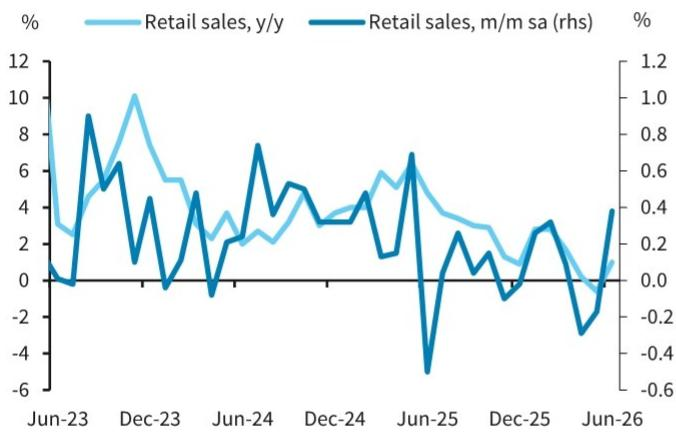
来源：Wind, BARC

图2. 以旧换新商品和汽车销售保持偏弱
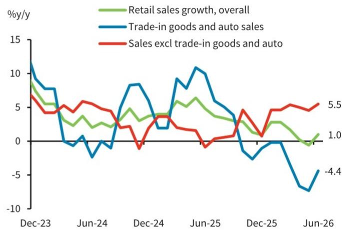
来源：Wind, BARC

图3. 固定资产投资继续以两位数速度下降
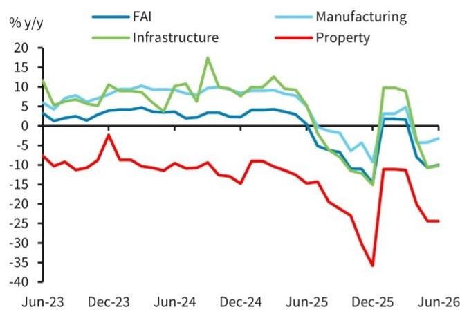
来源：Wind, BARC

图4. 房地产销售走弱
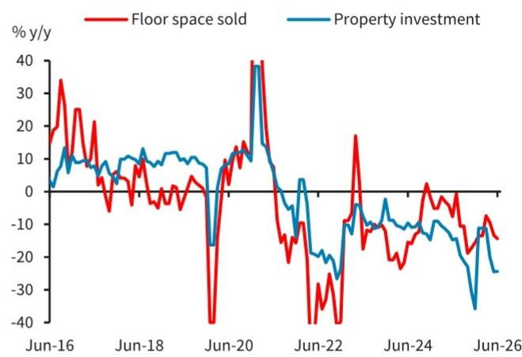
来源：Wind, BARC

图5. 工业产出增速加快，高技术生产表现稳健
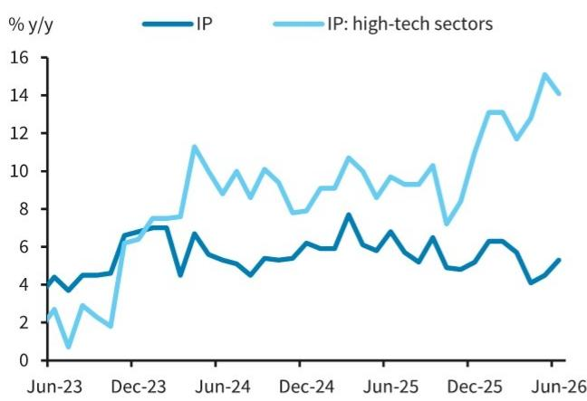
来源：Wind, BARC

图6. GDP增速放缓，需求侧与生产侧走势分化
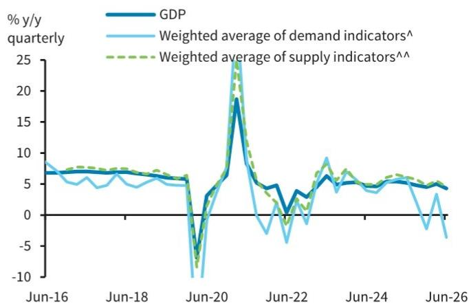
来源：Wind, BARC

## 6月经济活动数据详情

- 上半年固定资产投资年初至今同比下降5.7%，较前五个月4.1%的降幅明显扩大，且快于市场预期的下降5%。6月当月，固定资产投资同比连续第二个月出现两位数下降（-10%），这一速度上次出现在2025年四季度，尽管降幅较5月的-10.7%略有收窄。制造业、基础设施和房地产三大类均出现下降。按所有制分，6月国有企业投资同比下降7%（5月：-8.9%），而民间固定资产投资仍处于深度收缩区间，为-12.4%（5月：-11.8%）。

制造业投资连续第三个月收缩，6月同比下降3.2%，5月为下降4.2%。高技术产业的韧性投资可能部分抵消了传统和劳动密集型行业的支出减弱。上半年高技术投资同比增长4.6%，受到航空航天及相关设备制造（+23.3%）、信息服务（+15.5%）以及计算机和办公设备制造（+8.1%）强劲增长的支撑。相比之下，化学原料及化学制品投资继续走弱，上半年同比下降6.5%（前五个月：-5.9%）。

基础设施投资6月同比下降10.2%，与5月10.8%的降幅大致相当。三大基础设施子类别均出现下降。交通运输投资连续第二个月收缩，下降7.7%（5月：-5.7%）。电力、热力、燃气及水的生产和供应业投资继续下降（6月：-8.9%，5月：-11.7%），水利、环境和公共设施管理业投资也继续下降（6月：-13.4%，5月：-13.7%）。

房地产投资6月同比下降24.4%，与5月持平，仍接近2025年下半年的水平。主要房地产指标普遍偏弱。商品房销售面积同比下降14.3%（5月：-13.2%），为今年最大降幅。领先指标仍处于深度调整区间，新开工面积下降26%（5月：-24.6%），施工面积下降29.3%（5月：-34.5%）。竣工面积也保持偏弱，下降25%。价格方面，新房价格环比连续第四个月下降0.2%，一线城市的小幅上涨被三线城市的价格下降所抵消。二手房价格环比下降0.3%，与5月持平。月度房价上涨的城市数量继续小幅下降，从3月2023年5月以来的高点13个降至70个城市中的9个。

- 6月零售销售同比增长1%，这是自2023年中国解除疫情限制以来首次出现下降（5月：-0.6%）后的回升，并超出市场预期的继续收缩0.1%。商品和餐饮服务均有所改善。商品销售企稳，在连续两个月收缩后增速回升至同比持平，而餐饮服务增速从5月的0.6%加快至1.2%，5月曾是2023年以来的最低读数。

6月商品销售在连续两个月下降后同比增长0.9%。主要以旧换新品类表现分化。通讯器材销售额同比飙升16.5%，高于5月0.7%的温和增长，部分反映了更有利的基数效应。家用电器销售额连续第四个月下降，但降幅从5月的15.6%收窄至8.7%，而文化办公用品销售额增速回升至同比增长12.7%（5月：-1.5%）。汽车销售额连续第四个月出现两位数下降，当月降幅保持在16%。房地产相关消费继续偏弱，家具销售额同比下降6.6%（5月：-8.7%），建筑及装潢材料销售额下降10.5%（5月：-13.6%）。可选消费表现分化，珠宝首饰销售额同比下降3.4%，而化妆品销售额增速从5月的2.5%加快至12.6%。

- 6月工业产出增速从5月的4.5%加快至5.3%，超出市场共识，与当月27%的强劲出口增长相吻合。高技术制造业继续跑赢整体读数，产出同比增长14%，5月为增长15%。其中，绿色产品产出保持强劲，新能源汽车增速从5月的17.8%加快至29.4%，而半导体产量6月同比增长19%（5月：23%）。工业机器人产量保持高位，同比增长28%，与5月持平。

图7. 基础设施投资细分
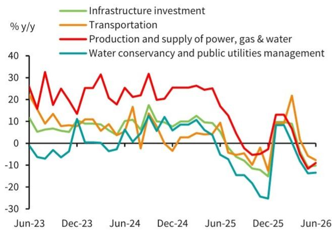
来源：Wind, BARC

图8. 地方政府专项债券发行趋势
地方政府专项债券发行跟踪（占额度百分比）
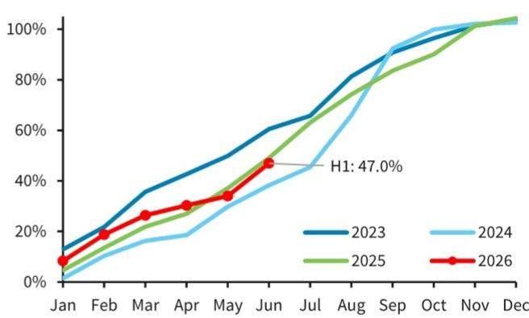
来源：Wind, BARC

图9. 主要房地产指标仍处于深度调整区间
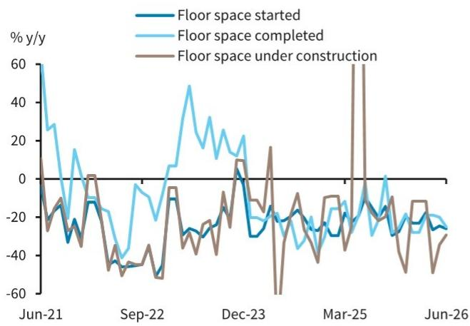
来源：Wind, BARC

图10. 二手房价格上涨城市数量减少
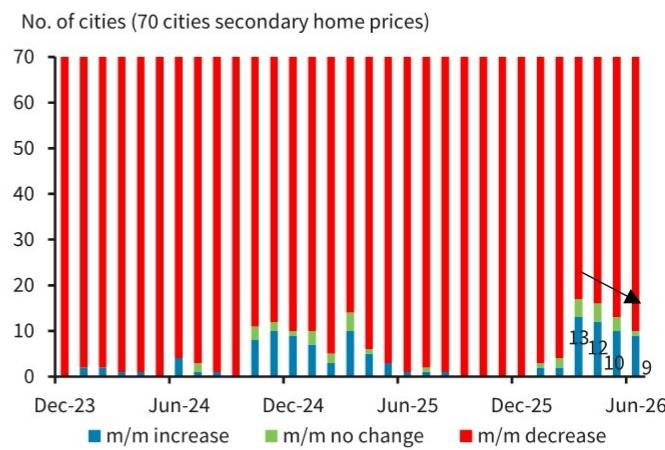
来源：Wind, BARC

图11. 零售销售细分
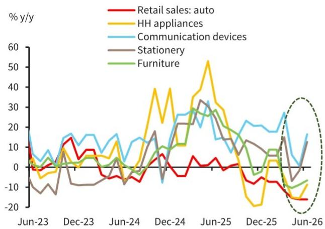
来源：Wind, BARC

图12. 工业产出细分
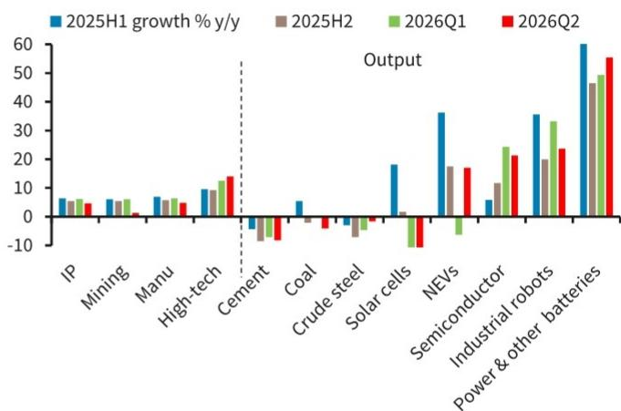
来源：Wind, BARC

## 分析师声明：

我们，周英科、常健和张颖，特此声明（1）本研究报告中所表达的观点准确反映了我们个人对相关证券或发行人的看法；（2）我们的薪酬中没有任何部分直接或间接与本研究报告中提出的具体建议或观点相关。

## 重要披露：

BARC由BARC Bank PLC及其附属公司（统称及各自单独称为“BARC”）的投资银行部门编制。

除非另有说明，所有为本研究报告撰稿的作者均为研究分析师。报告顶部的发布日期反映了报告制作地的当地时间，可能与GMT提供的发布日期不同。

## 披露信息的获取：

如需获取有关本研究报告所涉及发行人的当前重要披露信息，请访问 https://publicresearch.BARC.com，或发送书面请求至：BARC Compliance, 745 Seventh Avenue, 13th Floor, New York, NY 10019，或致电+1-212-526-1072。

BARC Capital Inc.和/或其一家附属公司确实并寻求与其研究报告所覆盖的公司开展业务。因此，读者应注意BARC可能存在影响本报告客观性的利益冲突。BARC Capital Inc.和/或其一家附属公司定期交易、通常作为自营交易商并提供流动性（作为做市商或其他方式）于本研究报告所涉及的债务证券（及相关衍生品）。BARC交易台可能持有此类证券、其他金融工具和/或衍生品的多头和/或空头头寸，这可能与投资客户的利益产生冲突。在允许且受适当信息隔离限制的情况下，BARC固定收益研究分析师定期与其交易台人员就当前市场状况和价格进行交流。BARC固定收益研究分析师的薪酬基于多种因素，包括但不限于其工作质量、公司整体业绩（包括投资银行部门的盈利能力）、市场业务的盈利能力和收入，以及公司投资客户对分析师所覆盖资产类别研究的潜在兴趣。如果任何历史定价信息来自BARC交易台，公司不保证其准确性或完整性。所有水平、价格和价差均为历史数据，不一定代表当前市场水平、价格或价差，其中部分或全部可能自本文件发布以来已发生变化。BARC部门制作多种类型的研究，包括但不限于基本面分析、股权挂钩分析、定量分析和交易思路。一种BARC类型中包含的建议和交易思路可能与其他BARC类型中的不同，无论是由于不同的时间范围、方法论或其他原因。

如需获取BARC关于研究传播政策和程序的声明，请访问 https://publicresearch.BARC.com/S/RD.htm。如需获取BARC冲突管理政策声明，请访问：https://publicresearch.BARC.com/S/CM.htm。

## 关于信息来源的披露

Bloomberg®是Bloomberg Finance L.P.及其附属公司（统称“Bloomberg”）的商标和服务标志，Bloomberg指数是Bloomberg的商标。Bloomberg或其许可方拥有Bloomberg指数的所有专有权利。Bloomberg不批准或认可本材料，也不保证其中任何信息的准确性或完整性，也不对由此获得的结果作出任何明示或暗示的保证，并且在法律允许的最大范围内，Bloomberg不对与此相关的任何伤害或损害承担责任。

所有定价信息仅供参考。除非另有说明，价格来源于LSEG Data & Analytics，并反映相关交易市场的收盘价，这可能不是发布时的最新可用价格。

## BARC FICC研究制作的研究交流类型：

除了根据BARC正式评级系统分配的任何评级外，本出版物可能包含由FICC研究分析师以交易思路、主题筛选、评分卡或投资组合建议形式制作的研究交流。由非信用研究团队（包括可持续投资）制作的任何此类研究交流将保持开放，直至在未来的研究报告中修订、再平衡或关闭。信用因子观点保持开放，直至在未来的研究报告中定期修订或随后关闭。由信用研究团队制作的任何其他研究交流在当前市场条件下有效，不得以其他方式依赖。

## 关于BARC FICC研究制作的其他研究交流的披露：

BARC FICC研究可能在过去12个月内就本研究报告推荐的相同证券/工具发布过其他研究交流。如需查看BARC FICC研究在过去12个月内发布的所有研究交流，请访问 https://live.barcap.com/go/research/Recommendations。

BARC不对资产支持证券分配评级。BARC Capital Inc.和/或其一家附属公司可能曾担任任何资产支持证券公开发行的承销商，这些证券在其证券化研究报告中以交易思路形式被推荐。

## 制作BARC的法律实体：

BARC Bank PLC (BARC, 英国)

BARC Capital Inc. (BCI, 美国)

BARC Bank Ireland PLC, 法兰克福分行 (BBI, 法兰克福)

BARC Bank Ireland PLC, 巴黎分行 (BBI, 巴黎)

BARC Bank Ireland PLC, 米兰分行 (BBI, 米兰)

BARC Securities Japan Limited (BSJL, 日本)

BARC | 中国

BARC Bank PLC, 香港分行 (BARC Bank, 香港)

BARC Bank Mexico, S.A. (BBMX, 墨西哥)

BARC Capital Casa de Bolsa, S.A. de C.V. (BCCB, 墨西哥)

BARC Securities (India) Private Limited (BSIPL, 印度)

BARC Bank PLC, 新加坡分行 (BARC Bank, 新加坡)

BARC Bank PLC, DIFC分行 (BARC Bank, DIFC)

## 免责声明：

本出版物由BARC Bank PLC和/或其一家或多家附属公司（统称及各自单独称为“BARC”）投资银行部门的BARC部门制作。

本出版物是为机构读者而非零售读者准备的。已由下述一家或多家BARC附属法律实体或由独立且非关联的第三方实体（可能由该第三方实体在与您的沟通中告知您）分发。本出版物仅供参考，BARC不对其中包含的任何数据作出明示或暗示的保证，并明确否认对适销性或特定用途适用性的所有保证。BARC可向某些不将其用于投资目的的接收者提供研究，包括所覆盖行业的公共和私营公司、媒体机构、监管机构和学术机构，这些机构将此类研究用于其内部信息、新闻收集、监管或学术目的。如果本出版物在首页声明其面向机构读者且不受美国FINRA规则2242下为零售读者准备的债务研究报告的独立性和披露标准约束，则其为“机构债务研究报告”，严禁向零售读者分发。媒体机构不得重新发布任何BARC机构债务研究报告中关于债务发行人或债务证券的意见或建议。不希望继续接收BARC机构债务研究报告的接收者应联系debtresearch@BARC.com。除非客户已同意按照美国FINRA规则2242的要求接收“机构债务研究报告”，否则他们将不会收到任何可能由非债务研究分析师合著的此类报告。符合条件的客户可通过联系debtresearch@BARC.com获取此类跨资产报告。BARC不会将本报告的非授权接收者视为其客户，并且不对其使用可能不适合其个人用途的内容承担任何责任。所示价格为指示性价格，BARC不提供买卖任何金融工具的报价，也不征求买卖任何金融工具的报价。

在不限制前述规定并在法律允许的范围内，BARC、任何附属公司或其各自的高级职员、董事、合伙人或员工均不对以下情况承担任何责任：(a) 任何特殊、惩罚性、间接或后果性损害；或 (b) 任何利润损失、收入损失、预期储蓄损失或机会损失或其他财务损失，即使已被告知此类损害的可能性，因使用本出版物或其内容而产生。

除与BARC相关的披露外，本出版物中包含的信息（包括第三方数据）来自BARC认为可靠的来源，但BARC不声明或保证其准确或完整。第三方数据，包括第三方预测和预测，仅供参考，未经BARC采纳或认可，不代表BARC的观点或意见。第三方演讲者演示：第三方演讲者在BARC主办的活动上表达的任何观点或意见仅代表演讲者本人，不代表BARC的观点或意见。BARC不对任何第三方演讲者的任何书面、电子、音频或视频演示中包含的信息或意见负责，也不作任何保证，此类演示未经BARC采纳或认可，不代表BARC的观点或意见。第三方演示的内容仅供参考，未经BARC独立验证其准确性或完整性。

本出版物中的观点仅为作者分析师的观点，如有变更，BARC没有义务更新其意见或本出版物中的信息。除非另有披露，撰写本报告的分析师在过去12个月内未从主题公司获得任何报酬。如果本出版物包含建议，这些建议是独立于任何其他利益（包括BARC和/或其附属公司以及/或主题公司的利益）而准备的一般性建议。本出版物不包含个人研究交流或投资意见，也未考虑接收客户的个人财务状况或投资目标。BARC不是本出版物任何接收者的受托人。本文讨论的证券和其他投资可能不适合所有读者，并且可能并非在所有司法管辖区均可购买。美国对某些中国公司实施了制裁（https://ofac.treasury.gov/sanctions-programs-and-country-information/chinese-military-companies-sanctions），这可能限制美国人购买这些公司发行的证券。读者必须独立评估本文讨论的投资的优点和风险，包括可能适用的任何制裁限制，咨询其认为必要的任何独立顾问，并对任何投资决策行使独立判断。任何投资的价值和收入可能因相关经济市场（包括市场流动性变化）的变化而逐日波动。本文信息不旨在预测实际结果，实际结果可能与所反映的结果存在重大差异。过往表现并不一定预示未来结果。所提供的信息不构成金融基准，不应作为确定金融基准的提交或输入数据贡献。

本出版物不属于1940年美国投资公司法第270.24(b)条定义的 Investment company sales literature，也不旨在构成对作为本报告主题的证券、产品或发行的要约、推广或推荐，也不应被视为营销（包括但不限于2013年英国另类投资基金管理人条例（SI 2013/1773）或AIFMD（指令2011/61）的目的）或预营销（包括但不限于指令(EU) 2019/1160的目的）。

第三方分发：本通讯中表达的任何观点仅为BARC的观点，未经任何第三方分发者采纳或认可。

英国：本文件仅由授权人员（BARC Bank PLC）分发，或面向并针对 (a) 在投资相关事务方面具有专业经验且符合《2000年金融服务与市场法（金融促进）令2005》（“该令”）第19(5)条定义的“投资专业人士”的英国人士；或 (b) 该令第49(2)条所述的高净值公司、非法人协会和合伙企业以及高价值信托的受托人；或 (c) 其他可以合法接收本通讯的人士（所有此类人士均为“相关人士”）。本通讯所涉及的任何投资或投资活动仅面向相关人士，并仅与相关人士进行。任何其他收到本通讯的人士不应依赖或依据本通讯行事。BARC Bank PLC由审慎监管局授权，受金融行为监管局和审慎监管局监管，是伦敦证券交易所成员。

欧洲经济区（“EEA”）：本材料由BARC Bank Ireland PLC分发给位于受限EEA国家的任何“授权用户”。受限EEA国家包括奥地利、保加利亚、爱沙尼亚、芬兰、匈牙利、冰岛、列支敦士登、立陶宛、卢森堡、马耳他、葡萄牙、罗马尼亚、斯洛伐克和斯洛文尼亚。对于位于欧洲经济区其他国家的任何“授权用户”，本材料由BARC Bank PLC分发。BARC Bank Ireland PLC是一家由爱尔兰中央银行授权的银行，注册地址为1 Molesworth Street, Dublin 2, Ireland。BARC Bank PLC未在法国金融市场管理局或审慎监管局注册。授权用户指客户通知BARC并授权使用研究服务的与客户相关的每个个人。受限EEA国家将根据需要进行修订。

芬兰：尽管芬兰是受限EEA国家，但在其跨境许可证条款允许的情况下，研究服务也可由BARC Bank PLC提供。

美洲：BARC Bank PLC的投资银行以其全资子公司BARC Capital Inc.（FINRA和SIPC成员）的名义在美国开展证券业务。BARC Capital Inc.是一家在美国注册的经纪/交易商，在美国分发本材料，并就此承担其内容的责任。任何希望就本文讨论的任何证券进行交易的美国人士应仅通过联系BARC Capital Inc.在纽约的代表进行，地址为745 Seventh Avenue, New York, New York 10019。

非美国人士应联系并通过其所在司法管辖区的BARC Bank PLC分行或附属公司进行交易，除非当地法规另有规定。

本材料在加拿大由BARC Capital Canada Inc.分发，该公司是一家注册投资交易商，是加拿大投资监管组织（www.ciro.ca）的交易商成员，也是加拿大读者保护基金（CIPF）的成员。

本材料在墨西哥由BARC Bank Mexico, S.A.和/或BARC Capital Casa de Bolsa, S.A. de C.V.分发。本材料在开曼群岛和巴哈马由BARC Capital Inc.分发，该公司未在这些司法管辖区注册或获得许可从事业务，也未在这些司法管辖区从事业务，并且未向这些司法管辖区的任何监管机构提交本材料。

日本：本材料由BARC Securities Japan Limited分发给日本的机构读者。BARC Securities Japan Limited是一家在日本注册的股份公司，注册地址为6-10-1 Roppongi, Minato-ku, Tokyo 106-6131, Japan。它是BARC Bank PLC的子公司，是一家由日本金融厅监管的注册金融工具公司。注册号：Kanto Zaimukyokucho (kinsho) No. 143。

亚太地区（日本除外）：BARC Bank PLC香港分行作为受香港金融管理局监管的授权机构在香港分发本材料。注册地址：41/F, Cheung Kong Center, 2 Queen's Road Central, Hong Kong。

所有印度证券相关研究和其他由BARC投资银行制作的股权研究由BARC Securities (India) Private Limited (BSIPL)在印度分发。BSIPL是一家根据1956年公司法注册的公司，CIN为U67120MH2006PTC161063。BSIPL在印度证券交易委员会（SEBI）注册并受其监管，注册号为：研究分析师：INH000001519；投资组合经理：INP000002585；股票经纪人：INZ000269539（NSE和BSE成员）；与国家证券存管有限公司（NSDL）合作的存管参与者：DP ID: IN-DP-NSDL-478-2020；投资顾问：INA000000391。BSIPL还注册为共同基金顾问，AMFI ARN号为53308。BSIPL的注册地址为Nirlon Knowledge Park, 9th floor, Block B-6, Off. Western Express Highway, Goregaon (East), Mumbai – 400063, India。电话：+91 22 61754000 传真：+91 22 61754099。由BARC投资银行制作的任何其他报告由BARC Bank PLC印度分行在印度分发，该分行是BSIPL在印度的关联公司，在印度储备银行（RBI）注册为根据1949年银行监管法规定的银行公司（注册号BOM43），并在SEBI注册为商人银行家（注册号INM000002129）和发行银行家（注册号INBI00000950）。BARC Investments and Loans (India) Limited，在RBI注册为非银行金融公司（注册号RBI CoR-07-00258），以及BARC Wealth Trustees (India) Private Limited，在公司注册处注册（CIN U93000MH2008PTC188438），是BSIPL在印度的关联公司，未被授权分发由BARC投资银行制作的任何报告。

本材料由BARC Bank PLC新加坡分行分发，该分行是新加坡金融管理局许可的银行。关于本材料的事项，新加坡的接收者可联系BARC Bank PLC新加坡分行，其注册地址为10 Marina Boulevard, #23-01 Marina Bay Financial Centre Tower 2, Singapore 018983。

本材料在分发给澳大利亚人士时，由BARC Bank PLC制作或提供。

本通讯面向符合2001年澳大利亚公司法定义的“批发客户”的人士。

请注意，澳大利亚证券和投资委员会（ASIC）已根据2001年公司法第911A(2)(I)条向BARC Bank PLC (BBPLC) 提供了某些豁免，使其无需持有澳大利亚金融服务许可证（AFSL）即可向澳大利亚批发客户提供金融服务，前提是BBPLC由英国审慎监管局（PRA）授权，并受英国金融行为监管局（FCA）和PRA根据英国法律监管。英国的法律与澳大利亚法律不同。如果本通讯涉及BBPLC向澳大利亚批发客户提供金融服务，BBPLC依赖相关豁免而无需持有AFSL。因此，BBPLC不持有AFSL。

本通讯可能由以下方向您分发：(i) BARC Bank PLC直接分发，(ii) Barrenjoey Markets Pty Limited (ACN 636 976 059, "Barrenjoey")，持有澳大利亚金融服务许可证（AFSL）521800，是一家非关联第三方分发者，在Barrenjoey明确向您说明的情况下，或(iii) 其他可能向您明确说明的非关联第三方分发者。此类非关联第三方分发者不是BARC Bank PLC的代理人。

本材料在新西兰分发时，由BARC Bank PLC制作或提供。BARC Bank PLC未在新西兰任何监管机构注册、备案或获得批准。本材料并非根据2013年金融市场行为法（“FMCA”）提供或依据该法提供，也不是FMCA下的披露文件或“财务建议”。本材料由以下方向您分发：(i) BARC Bank PLC直接分发，或(ii) Barrenjoey Markets Pty Limited（“Barrenjoey”），一家非关联第三方分发者，在Barrenjoey明确向您说明的情况下。Barrenjoey不是BARC Bank PLC的代理人。本材料仅可分发给符合FMCA附表1中规定的“投资业务”、“投资活动”、“大型”或“政府机构”标准的“批发读者”。

中东：本文中的任何内容均不应被视为以色列《投资咨询、投资营销和投资组合管理法》（1995年）（“咨询法”）中定义的研究交流。本文件仅面向符合条件的客户（根据咨询法定义）。BARC以色列分行此前持有以色列证券管理局的投资营销许可证，但于2014年11月30日取消了该许可证，因为它仅根据咨询法下的可用豁免向其符合条件的客户提供服务，因此无需持有以色列证券管理局的许可证。因此，BARC不维持根据咨询法的保险覆盖。

本材料由BARC Bank PLC在阿拉伯联合酋长国（包括迪拜国际金融中心）和卡塔尔分发。BARC Bank PLC在迪拜国际金融中心（注册号0060）受迪拜金融服务管理局（DFSA）监管。在迪拜国际金融中心的主要营业地址：The Gate Village, Building 4, Level 4, PO Box 506504, Dubai, United Arab Emirates。BARC Bank PLC-DIFC分行仅可从事其现有DFSA许可证范围内的金融服务活动。相关金融产品或服务仅面向迪拜金融服务管理局定义的“专业客户”。BARC Bank PLC在阿联酋受阿联酋中央银行监管，并获准在迪拜（许可证号：13/1844/2008，注册地址：Building No. 6, Burj Dubai Business Hub, Sheikh Zayed Road, Dubai City）和阿布扎比（许可证号：13/952/2008，注册地址：Al Jazira Towers, Hamdan Street, PO Box 2734, Abu Dhabi）作为在阿联酋境外注册的商业银行分行开展业务活动。本材料不构成也不构成在阿联酋（包括迪拜国际金融中心）发行或出售任何证券或投资产品的要约，或征求认购或购买任何证券或投资产品的要约，因此不应被解释为如此。此外，提供此信息的前提是接收者承认并理解，其所涉及的实体和证券尚未获得阿联酋中央银行、迪拜金融服务管理局或阿联酋任何其他相关许可机构或政府机构的批准、许可或注册。本报告的内容未经阿联酋中央银行或迪拜金融服务管理局批准或备案。BARC Bank PLC在卡塔尔金融中心（注册号00018）受卡塔尔金融中心监管局（QFCRA）授权。BARC Bank PLC-QFC分行仅可从事其现有QFCRA许可证范围内的受监管活动。在卡塔尔的主要营业地址：Qatar Financial Centre, Office 1002, 10th Floor, QFC Tower, Diplomatic Area, West Bay, PO Box 15891, Doha, Qatar。相关金融产品或服务仅面向卡塔尔金融中心监管局定义的“商业客户”。

俄罗斯：本材料不适用于根据俄罗斯联邦法律不属于合格读者的读者，因为它可能包含有关未获准在俄罗斯联邦公开发行和/或流通的金融工具的信息或特征描述，因此非合格读者不得获取。如果您根据俄罗斯联邦法律不是合格读者，请处理掉您手中的本材料副本。

可持续投资相关研究：目前，对于什么是“可持续”、“ESG”、“绿色”、“气候友好”或同等的公司、投资、策略或考虑因素，或者需要哪些精确属性才能被归类为此类术语，没有全球公认的框架或定义（法律、监管或其他方面），也没有市场共识。这意味着评估公司或投资有不同的方式，因此对某些可持续性资质以及公司的不良ESG相关影响和ESG争议可能会有不同的价值判断。可持续投资考虑因素、模型和方法论的不断演变意味着，很难明确和普遍地将公司或投资归类于可持续投资标签下，并且此类公司和投资可能存在改进空间，或者存在不良ESG相关影响或ESG争议。可持续金融相关法规的不断演变以及特定司法管辖区监管标准的发展也意味着，市场上对此类术语的解释可能存在一定程度的分歧。我们预计该领域的行业指导、市场实践和法规将继续演变。

任何信息、数据、图像或其他内容，包括来自第三方来源的、在本文件中包含、引用或由BARC或第三方出于任何目的使用的（“信息”），涉及任何实际或潜在的“ESG”、“可持续”或同等目标、问题、因素或考虑因素，除非另有说明，否则不应被依赖用于ESG或可持续性分类、监管制度或行业倡议目的（“ESG制度”）。本材料中的任何内容，包括其中包含的任何图像，均不旨在传达、暗示或表明BARC认为或表示本材料中提及的任何产品、服务、个人或机构符合或具备ESG制度下可能存在的任何ESG或可持续性分类、标签或类似标准的资格。BARC未对ESG制度的合规性进行任何评估。各方应自行对此进行评估。

IRS Circular 230 准备材料免责声明：BARC不提供税务建议，本文中的任何内容均不应被解释为税务建议。请注意，本文中（包括任何附件）对美国税务事项的任何讨论 (i) 并非旨在或书面用于，也不能被您用于避免美国税务相关处罚；以及 (ii) 是为支持本文所述交易或其他事项的推广或营销而编写的。因此，您应根据您的具体情况寻求独立税务顾问的建议。

© 版权所有 BARC Bank PLC (2026)。保留所有权利。未经BARC事先书面许可，不得以任何方式复制或重新分发本出版物的任何部分。BARC Bank PLC在英格兰注册，注册号1026167。注册地址：1 Churchill Place, London, E14 5HP。如需获取有关本出版物的更多信息，请提出要求。
