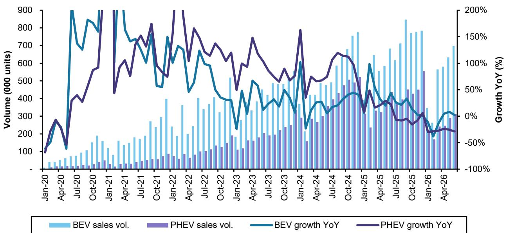
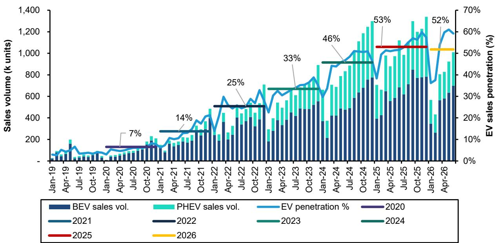
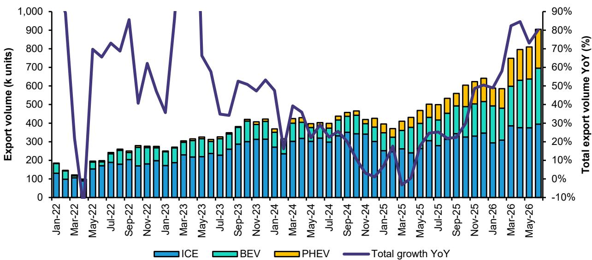

# 中国汽车市场仍在寻找平衡点：出口掩盖了国内需求的恢复周期

6月中国乘用车国内零售销量同比下降21.4%至171万辆，数据来自强制首次交强险统计，该口径能较准确反映实际终端情况。这并非单月异常。经季节性调整后的年化运行率为2070万辆，虽较5月的1920万辆有所回升，但仍低于约2200万辆的估计正常年度需求水平。核心问题在于结构性而非周期性：2024至2025年期间的补贴政策提前释放了约500万辆需求，市场目前正处于消化期。6月出口同比增长80%，是行业生产未出现大幅收缩的相对少见支撑因素。但仅靠出口无法解决根本性的供需失衡，需注意生产稳定并不等同于需求复苏。

期待新一轮大规模政策刺激的想法可以理解，但可能并不现实。在当前环境下，出台能显著提振国内汽车需求的大规模新支持政策的可能性较低。即便出现增量措施——如为以旧换新项目追加资金或在低线城市及农村市场开展定向活动——其力度也难以与过去两年相提并论。更重要的是，相当一部分潜在购车需求已被提前释放。在2024或2025年购车的消费者短期内不会重返市场。行业需要时间让需求自然恢复。这一过程至少将持续到11月或12月，届时基数效应将开始减弱。

不过，这并非全行业的警示信号。市场结构正在发生变化，并由此产生明确的受益方与承压方。6月新能源汽车渗透率达到59.2%，其中纯电动汽车为40.9%，插电式混合动力汽车为18.3%。但在这一整体数据之下，一个关键的分化正在发生：纯电动汽车正在直接蚕食插电式混合动力汽车的市场份额，且这一趋势可能加速。对于观察者而言，战略问题已不再是电动化是否会发生，而是哪种动力架构将占据主导，以及哪些公司有能力抓住这一转型机遇。

## 插电式混合动力的逻辑正在比预期更快地瓦解

6月插电式混合动力汽车销量同比下降28.7%，而同期新能源汽车整体渗透率仍在上升。这并非偶然。四种结构性力量正在共同削弱插电式混合动力汽车在中国市场的价值主张。首先，近期推出的纯电动车型在续航里程和快充能力上均有显著提升，直接缓解了消费者选择插电式混合动力而非纯电动的首要顾虑——里程焦虑。其次，纯电动汽车的定价现已与同级别插电式混合动力车型相当，缩小了后者作为折中选择的成本优势。第三，政策支持方向已发生转变：纯电续航里程低于100公里的插电式混合动力车型不再享受5%的购置税减免，需按10%的全额税率缴纳。此前约有40%的插电式混合动力车型受益于该税收优惠，现已不再适用。第四，从2027年起，插电式混合动力汽车将失去车船税减免资格，而纯电动汽车将继续享受全额豁免。年度成本影响虽不大——每年数百元——但在车辆全生命周期内累计可达数千元，进一步改变了总拥有成本的平衡。

结论是明确的：插电式混合动力始终是一种过渡技术，但这一过渡期结束的时间比许多人预期的要早。对于插电式混合动力车型占比较高的汽车制造商而言，转型窗口正在收窄。对于观察者而言，那些已确立纯电动优先战略或具备灵活调整研发与资本支出、减少混合动力平台投入的公司，将处于更有利的位置。比亚迪6月交付22.5万辆，保持22.3%的稳定市场份额，似乎正在有效管理这一转型，其最新快充车型需求保持强劲，随着电池供应限制缓解，预计交付量将从第三季度开始加速增长。

## 国内燃油车需求处于结构性下降，豪华品牌亦未能幸免

6月燃油车需求同比下降33.8%，且下滑范围广泛。豪华品牌销量下降16.8%，大众市场品牌下降22.3%。在传统豪华品牌中，表现最弱的品牌下降30.6%，另一品牌下降30%，第三个品牌下降19.6%。某豪华跑车品牌销量骤降45.8%。这些并非周期性数据。它们反映了消费者偏好向电动汽车的永久性转变，加之补贴政策在2024和2025年对燃油车购买者的需求提前释放效应。

对于在中国有业务布局的全球汽车制造商的观察者而言，一个令人不安但无法回避的战略结论是：中国燃油车市场不会恢复到以往水平。即使宏观环境改善，随着充电基础设施的扩展和纯电动汽车价格的下降，燃油车的潜在购买群体正在萎缩。曾被视为不受颠覆影响的豪华车细分市场，如今正受到来自两方面的侵蚀——一方面是国内电动汽车制造商以更低价格提供同等豪华体验，另一方面是同样的补贴后遗症影响着市场其他部分。对于那些长期依赖中国贡献全球利润的合资伙伴和外资品牌而言，加速在华电动汽车产品规划已不是可选项，而是生存所需。

## 出口是安全阀，但也带来新的战略风险

6月出口同比增长80%，其中燃油车出口增长29%，电动汽车出口增长159%。出口目前占乘用车总批发量的38%，部分抵消了国内市场的疲软。纯电动汽车和插电式混合动力汽车合计约占出口总量的56%。奇瑞以18.8万辆领跑，比亚迪以17.1万辆紧随其后，吉利为10.2万辆。出口激增为产量和产能利用率提供了有力的短期缓冲，也为正在饱和的国内市场中寻求规模扩张的中国电动汽车制造商提供了一条路径。

但出口导向型增长也伴随着自身风险。中国汽车出口的快速增长，尤其是电动汽车，正引起欧洲、北美及其他关键市场的监管关注。关税壁垒、本地化含量要求以及报复性贸易措施是真实存在且不断增长的。问题不在于这些阻力是否会显现，而在于它们将以多快的速度、多严重的程度产生影响。出口布局最多元化且拥有本地生产计划的公司将更具抵御能力。那些仅依赖从中国出口的公司，随着贸易摩擦升级，将面临利润率压缩和销量风险。对行业整体而言，出口可在短期内维持生产，但无法永久替代健康的国内需求基础。

## 未来12个月的观察框架

从6月数据来看，可以梳理出几个清晰的观察重点。首先是区分那些正在获得或保持电动汽车市场份额的公司与那些正在失去份额的公司。市场份额集中度正在提高：比亚迪占22.3%，吉利占11.2%，零跑占7.0%。其余参与者正在争夺日益缩小的国内需求池。其次是评估每家公司对插电式混合动力与纯电动的敞口。政策和技术的趋势均不利于插电式混合动力，任何插电式混合动力车型占比较高的汽车制造商都将在2026年下半年面临利润率压力和库存风险。第三是评估出口战略，不仅要看销量增长，还要看地域多元化和本地生产能力。能够通过本地组装或合资企业服务中国以外市场的公司，将比出口整车的公司面临更低的关税风险。

第四是密切关注政策动态，但需保持审慎。将在11月和12月使国内需求正常化的基数效应是算术层面的，而非政策依赖性的。任何可能出台的刺激措施，其规模和针对性都可能不及2024-2025年的项目。不应基于对政策救助的预期来做出判断。第五是认识到，批发量预测约为2900万辆，同比下降3-5%，这意味着即使出口增长40-50%，生产仍将面临压力。国内零售需求为2000-2100万辆，同比下降10-12%，是更具参考意义的数字。市场并非在增长，而是在重新平衡。这一再平衡过程需要时间，并将清晰地区分出那些在结构上已为纯电动驱动、出口增强的未来做好准备的公司，与那些尚未做好准备的公司。

*仅供参考。部分内容可能基于原始材料通过AI辅助生成、翻译、总结或编辑，可能存在遗漏或错误。请独立核实。本文不构成任何专业建议。*

仅供参考。部分内容可能基于原始材料通过AI辅助生成、翻译、总结或编辑，可能存在遗漏或错误。请独立核实。本文不构成任何专业建议。

