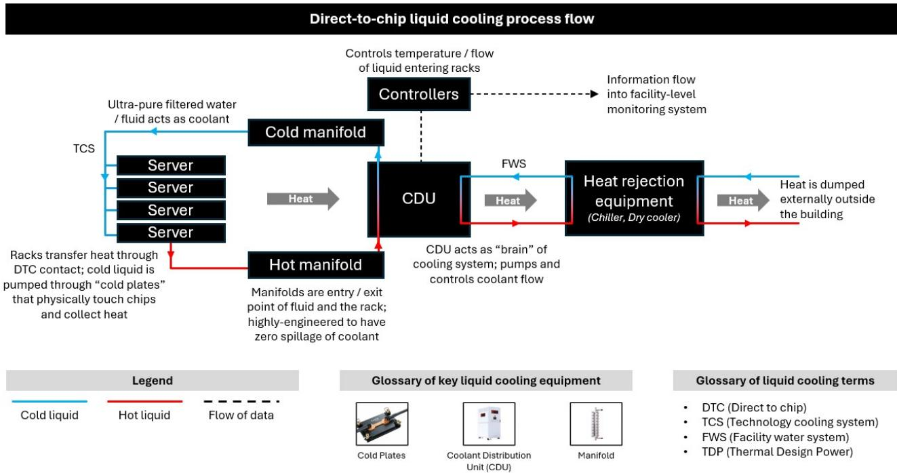
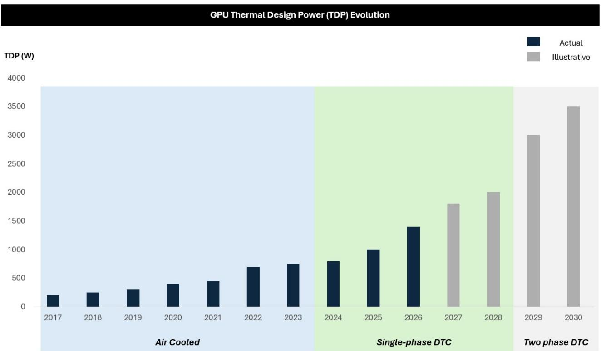
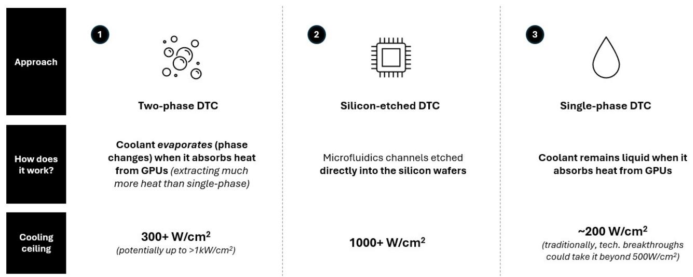
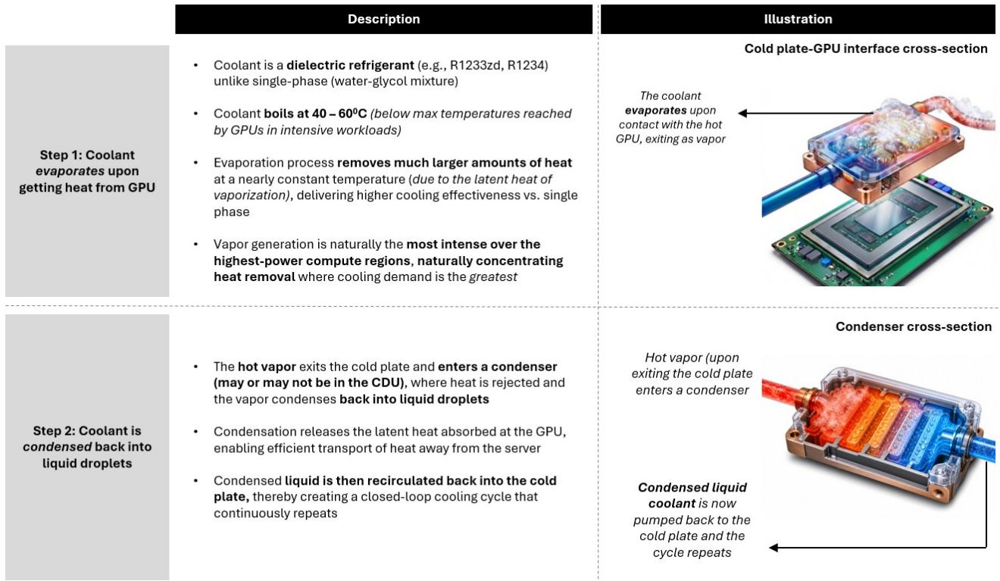
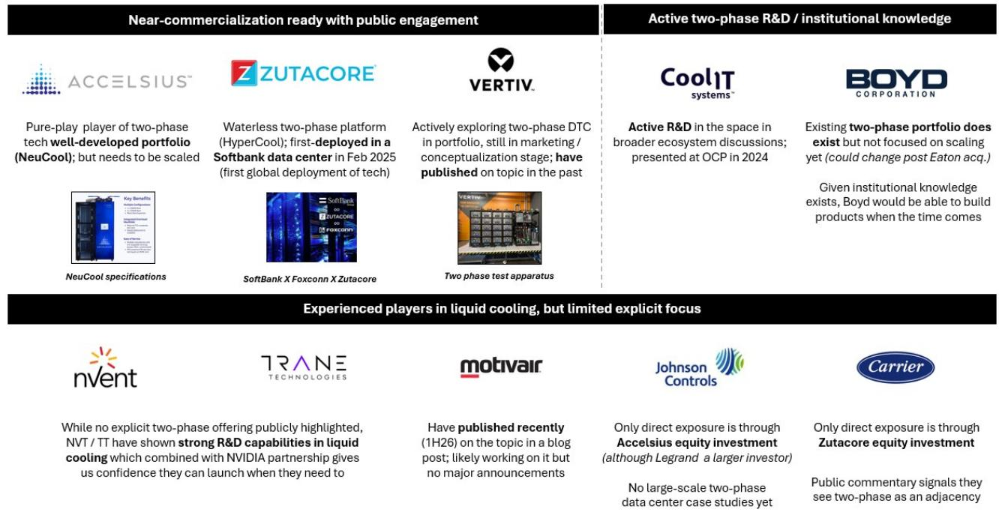
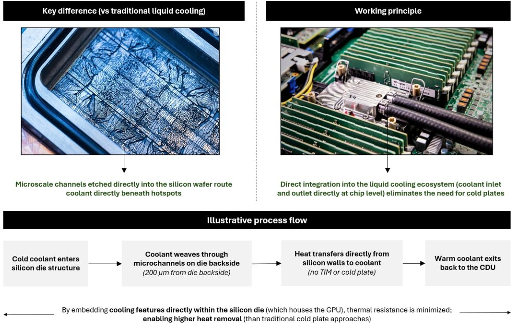
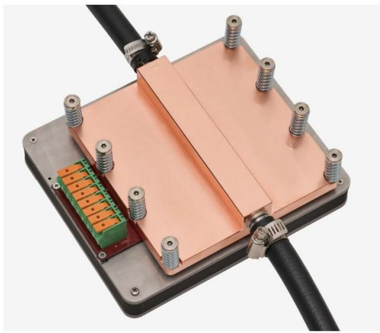
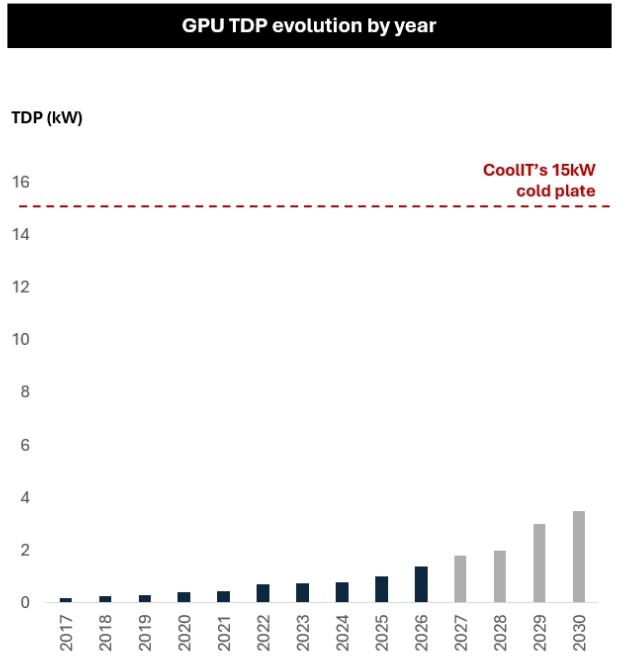

# U.S. Multi Industry & Electrical Equipment

# Liquid Cooling in Data Centers: What comes after single phase DTC? With CoolIT's 15kW cold plate, does anything even need to?

Varun Govindaraj
+1 917 344 8543
varun.govindaraj@bernsteinsg.com

Chad Dillard
+1 917 344 8469
chad.dillard@bernsteinsg.com

Alasdair Leslie
+44 20 7762 4952
alasdair.leslie@bernsteinsg.com

Miguel Marques, CFA
+1 917 344 8432
miguel.marques@bernsteinsg.com

Om Kela
+44 20 7550 2192
om.kela@bernsteinsg.com

Specialist Sales

Steve Song
+1 917 344 8401
steve.song@bernsteinsg.com

When you hear the term "liquid cooling" today, most people are referring to single phase direct to chip (DTC). It's called single phase because the coolant stays in a liquid state (and doesn't undergo a phase change to vapor). The broader market seems to believe we are coming up on a theoretical limit on future generations of GPUs being cooled with single phase (especially as you start to reach TDPs around Rubin Ultra which are above ~2.5kW). Two technologies are seen as successors to single-phase DTC; (i) two-phase DTC and (ii) direct to die. These have been explained in more detail below.

Two-phase DTC: The more likely to see commercial viability in the next ~12-18 months around the same time as Rubin Ultra. Undergoes a phase change (evaporation) of the coolant in a cold plate enabling it to capture more heat vs. single phase DTC operating at similar conditions. Most major players are likely investing in the space, either directly (e.g., VRT, CoolIT) or through partnerships (e.g., JCI with Accelsius, Carrier with ZutaCore, etc.). Still has real engineering challenges to solve for (backward flow, refrigerant choice, etc.) so it is by no means a done deal.

Direct-to-die: Eliminates the need for cold plates entirely by cooling through the silicon die itself. Far more technically complex and R&D is extremely early stage but could theoretically offer materially better heat flux vs. DTC. We do not expect to see anything happen at scale before 2030. Microsoft and TSMC are both making investments and have signalled activity (potentially manufacturing in 2026) but we're yet to hear anything about widespread adoption because of more practical challenges (e.g., deionized water causing corrosion to silicon).

The wildcard, CoolIT's 15kW single phase cold plate: About a month ago, CoolIt also announced that they've proven single-phase DTC could work with a cold plate rated at 15kW under relatively standard operating conditions (1.2 lpm, 45°C inlet temperatures, thermal paste, PG25 coolant, etc.). This is counter to the narrative that single phase won't work at GPU TDPs >2.5kW (CoolIT's number is 6x that). While the technology was tested in a lab scale setup as per their white paper, we do think this is a credible product. If it can be commercialized at scale, it essentially pushes out the need for two-phase DTC well beyond 2030. Most technological evolution on power and cooling in a data center is driven by necessity, and if we don't NEED two-phase or direct-to-die anymore, it's easier for data center operators to continue using single-phase cooling setups. If the 15kW cold plate can be commercialized, we think it has mixed implications on white space cooling equipment (CDUs and cold plates). On one side, there's less of a structural shift to new technologies that could create pricing pressure on these components (because the innovation premium starts to dry up) and commoditization may be accelerated. To be clear, it is unlikely to materially impact revenues or margins in the next couple of years since demand far outstrips supply, but it is a risk beyond that. It depends on how quickly competitors can replicate CoolIT's approach (which may not be immediate since they do have a patent on the underlying technology). On the positive side (for cold plates in particular), it does eliminate the obsolescence risk (since there's no real need for direct-to-die) for the foreseeable future.

## BERNSTEIN TICKER TABLE

<table><tr><td rowspan="2"></td><td colspan="4">15 Jul 2026</td><td rowspan="2">TTMRel.</td><td colspan="4">Adjusted EPS</td><td colspan="3">Adjusted P/E (x)</td></tr><tr><td>Rating</td><td>Cur</td><td>Closing Price</td><td>Price Target</td><td>Cur</td><td>2025A</td><td>2026E</td><td>2027E</td><td>2025A</td><td>2026E</td><td>2027E</td></tr><tr><td>VRT (Vertiv)</td><td>O</td><td>USD</td><td>304.57</td><td>416.00</td><td>117.8%</td><td>USD</td><td>4.20</td><td>6.52</td><td>9.21</td><td>72.6</td><td>46.7</td><td>33.1</td></tr><tr><td>NVT (nVent)</td><td>O</td><td>USD</td><td>159.46</td><td>220.00</td><td>92.6%</td><td>USD</td><td>3.34</td><td>4.84</td><td>6.26</td><td>47.7</td><td>33.0</td><td>25.5</td></tr><tr><td>TT (Trane)</td><td>O</td><td>USD</td><td>480.20</td><td>555.00</td><td>(11.2)%</td><td>USD</td><td>13.06</td><td>14.98</td><td>17.82</td><td>36.8</td><td>32.0</td><td>26.9</td></tr><tr><td>CARR (Carrier)</td><td>M</td><td>USD</td><td>68.74</td><td>75.00</td><td>(30.1)%</td><td>USD</td><td>2.57</td><td>2.79</td><td>3.20</td><td>26.7</td><td>24.6</td><td>21.5</td></tr><tr><td>JCI (Johnson Controls)</td><td>O</td><td>USD</td><td>142.76</td><td>173.00</td><td>13.4%</td><td>USD</td><td>3.78</td><td>4.97</td><td>5.93</td><td>37.8</td><td>28.7</td><td>24.1</td></tr><tr><td>ETN (Eaton)</td><td>O</td><td>USD</td><td>412.86</td><td>534.00</td><td>(7.3)%</td><td>USD</td><td>12.07</td><td>13.45</td><td>16.37</td><td>34.2</td><td>30.7</td><td>25.2</td></tr><tr><td>SPX</td><td></td><td></td><td>7,572.40</td><td></td><td></td><td></td><td></td><td></td><td></td><td></td><td></td><td></td></tr></table>

O - Outperform, M - Market-Perform, U - Underperform, NR - Not Rated, CS - Coverage Suspended

Source: Bloomberg, Bernstein estimates and analysis.

## INVESTMENT IMPLICATIONS

We rate VRT Outperform with a TP of $416

We rate NVT Outperform with a TP of $220

We rate TT Outperform with a TP of $555

We rate JCI Outperform with a TP of $173

We rate CARR Market-Perform with a TP of $75

We rate ETN Outperform with a TP of $534

## RECAP: OVERVIEW OF SINGLE-PHASE DTC COOLING

The predominant format of liquid cooling today is single-phase DTC. DTC stands for Direct-To-Chip. It involves cold plates (which are aptly named slabs of metal that have reduced temperature due to refrigerant that circulates inside them) coming into contact with GPUs to extract heat. Inside the cold plates, liquid flows through arrays and flow loops with the intent of maximizing the amount of heat they are able to extract from the GPU. Coolant Distribution Units (CDUs) pump low temperature coolant (usually a water - propylene glycol mix in single-phase setups) through the cold plates and recollect the spent liquid once they have extracted heat from the server.

The heat is then extracted from the coolant (making it cold again) and the process repeats. It is called single phase because the coolant stays in a single phase (liquid) and does not change phases from to gas via evaporation. This loop (i.e., circulating from the CDU through cold plates in the server) is called the TCS or technology cooling system. Once spent coolant reaches the CDU, it passes through a heat exchanger where it transfers heat to another cooling loop called the FWS or Facility Water System. The FWS connects to a chiller or dry cooler to reject this heat outside a data center. However, as rack power densities continue to increase, single phase DTC is seemingly reaching the theoretical limit of how much heat it can extract.

EXHIBIT 1: Direct-to-chip process overview  
  
Source: Bernstein Analysis

Generally, at current surface areas of GPUs, single-phase DTC has been expected to hit its thermal limit at GPU TDPs of between 2 - 2.5kW. Rubin GPUs start to push against this 2 - 2.5kW limit, and Rubin Ultra is expected to surpass it. After this point, the technological consensus has been that more aggressive forms of heat transfer (e.g., two-phase or direct to die) would be needed instead.

There is also the alternative of just reducing the temperature of the coolant flowing through the cold plate, but in the interest of managing energy consumption, this has not been preferred. Immersion cooling is also not considered a viable alternative since it involves submerging the server in coolant which is unweildy and much harder to maintain than current tray based approaches. So the two real options are either two-phase DTC or "direct to die" which are explained below.

EXHIBIT 2: Liquid cooling format by GPU TDP  
  
Source: Bernstein Analysis and Estimates

EXHIBIT 3: Multiple formats of liquid cooling delivery  

Coolant evaporates (phase changes) when it absorbs heat from GPUs (extracting much more heat than single-phase)

Microfluidics channels etched directly into the silicon wafers

Source: Bernstein Analysis and Estimates

<table><tr><td colspan="2">Mechanics of heat transfer</td></tr><tr><td colspan="2">Q = m * c * ΔT + m * L</td></tr><tr><td>Sensible Heat(normal heating)</td><td>Latent Heat(Heat needed to change phase from liquid to vapor)</td></tr><tr><td>Q = Total heat energy absorbed by the liquid (measured in kilo-Joules)</td><td></td></tr><tr><td>m = Mass of the liquid (measured in kg)</td><td></td></tr><tr><td>C = Specific heat capacity (amount of heat required to raise temperature of 1kg of liquid by 1°C, measured in kilo-Joules/kg-0C)</td><td></td></tr><tr><td>ΔT = Temperature change (measured in °C)</td><td></td></tr><tr><td>L = Specific latent heat (amount of heat required to boil the liquid, measured in Joules/0C)</td><td></td></tr></table>

EXHIBIT 4: Sensible vs. latent heat; what's the difference?  
Illustration (consider water as an example)  
1 kg of water heats up by 1° C

## TWO PHASE DTC

## Overview

As the name suggests, two-phase DTC cooling involves two phases of matter in the cooling process. In single-phase DTC, the TCS coolant (a water glycol mix) remains in a liquid state through the entire heat transfer process as it passes through the cold plate. However, in two-phase DTC, the coolant (another compound, not water-based) evaporates into a gaseous state in the cold plate before being cooled again into a liquid and repeating the cycle. The process of evaporation is able to capture a large amount of heat without a significant change in the underlying temperature of a refrigerant.

To understand how this works, we need to define a few scientific terms; sensible heat and latent heat. Sensible heat refers to the amount of heat needed to increase the temperature of a substance without a phase change. Latent heat refers to the amount of heat needed to cause a phase change (e.g., liquid to gas via evaporation) while maintaining the temperature of the matter undergoing a phase change.

$Q_{sensible heat} = m * c * \Delta T$ where m is the mass of the substance, c is it's specific heat (i.e., the amount of heat needed to increase temperature of 1 kilogram of material by 1°C), and $\Delta T$ is the change in temperature.

$Q_{latent heat} = m * L$ where m is still the mass of the substance while L is the specific "latent" heat (i.e., the amount of heat needed to cause a phase change of 1 kg of material). Notice how the temperature change doesn't matter like with sensible heat; this is because when a phase change takes place, it happens at constant temperatures. If a coolant or refrigerant has a large enough latent heat, it can essentially capture a lot more thermal load while maintaining relatively constant temperatures vs. sensible heat transfer. This is the same principle applied in a refrigerant compression cycle, where refrigerant evaporates when it captures heat and condenses before cycling back into the system.

$$
Q = (1) \times (4. 1 8) \times (1) = 4. 1 8 \mathrm{kJ}
$$

Core principle of single-

phase DTC (coolant just

"heats" up) - amount of

heat taken out is 4.18 kJ

1 kg of water boils up (constant temperature process)

$$
\mathrm{Q} = (1) \times (2 2 6 0) = 2 2 6 0 \mathrm{kJ}
$$

Core principle of two-phase

DTC (coolant "boils") – amount

of heat taken out is 2260 kJ

Source: Bernstein Analysis and Estimates

EXHIBIT 5: Two-phase cooling mechanism (illustrative)  
  
Source: Bernstein Analysis; images generated using AI to showcase representative process

## Advantages of Two Phase DTC

The key advantage of two-phase DTC is the higher heat flux vs. single phase operations; you can just capture a lot more heat under the same conditions when the coolant can evaporate (often >3x). This allows you to develop GPUs with much higher TDPs while maintaining the same footprint. Since evaporation also maintains the coolant at the same temperature, you have an even, uniform thermal profile through the cold plate which helps manage hotspots better. Depending on the coolant used and the chip TDP, you can also use smaller pumps, less volume of coolant, and spend less energy pumping it through the system compared to similar thermal loads with single phase. Since these refirgerants / coolants are not likely to be water-based, they are also less likely to see corrosion or bacterial growth. It also enables the coolant to be dielectric (not electrically conducting), so in case of a liquid leak it does not fry the GPU. And by nature, two phase coolants evaporate when spilt, vs. pool on the tray.

## Disadvantages of Two Phase DTC

The biggest engineering problem to solve relates to flow in a two phase system. Most matter flows from regions of high pressure to regions of low pressure. With liquids this is simple, even in a complex microchannel array within a cold plate. However, when evaporation takes place, gas could create high pressure pockets, which push it in the opposite direction vs. where it should be flowing. This has still not been resolved at scale. Another disadvantage is complexity; a two-phase system has significantly more variables than a single phase CDU / cold plate setup. Refrigerants / coolants that meet required properties are often PFAS (forever chemicals) which are not ideal for deployment. So there is still research that needs to happen to develop and then produce these compounds at scale.

## Who's leading the pack on R&D?

It's hard to say because companies offer differing levels of visibility. From what we've publicly seen, Vertiv and Accelsius are the closest to having commercially ready products. Accelsius in fact advertises CDUs on their website. Zutcore focuses heavily on the topic but we've not seen specific products on their website (although they do have demos). We know CoolIT is also doing work in the space; they also presented on the topic at the OCP forum a couple of years ago. Boyd has a history of two-phase expertise, even if not for CDUs specifically while Schneider recently put out a blog post on the topic. JCI and Carrier have invested in Accelsius and Zutacore respectively. We've not seen announcements from nVent and Trane yet, although as NVIDIA reference design partners we believe they'll have the products when they need to.

## EXHIBIT 6: Two-phase R&D status by liquid cooling players

## Source: Bernstein Analysis, Company Reports

## EXHIBIT 7: Key challenges preventing two-phase commercialization

  
Source: Bernstein Analysis

## 1 Concurrent management of fluid and vapor is a fundamental challenge

\- Two-phase cooling requires dual-path channel array on the cold plates (larger diameter for low-density vapor and smaller diameters for liquid)

\- This leads to flow maldistribution – where some channels predominantly carry vapor and some liquid on the plate, which can lead to localized hotspots (which can then lead to non-uniform cooling)

## 2 High degree of control complexity

• Active management of multiple variables is required: refrigerator temperature, avoidance of vapor superheating, condensate cooling, and overall system pressure

\- Modern GPU workloads are non-steady: inference batching creates rapid power transients (0 ->100% in milliseconds) which requires constant monitoring

\- This requires finely calibrated sensors and control algorithms than single-phase; control software complexity can be a significant burden

## 3 Polyfluoroalkyl substances (PFAS) regulations

\- Industry currently relies on PFAS refrigerants, which face increasing regulatory scrutiny due to environmental considerations

\- This could create potential compliance, reporting, and long-term supply chain risks for data center operators

## 4 Technology remains in the early stages of commercialization

\- Two-phase DTC remains in early pilot phase currently, with Zutacore ($100M Series C with Carrier as one investor) and Accelsius ($65M Series B with JCI as one investor)

\- If GPU power envelopes (Feynman / Kyber) rise beyond 6kW+ (Blackwell Ultra is 1.4kW), then two-phase would become a necessity

## DIRECT-TO-DIE LIQUID COOLING Overview

Direct-to-die (D2D) is a new age evolution of traditional liquid cooling ecosystem where coolant is brought significantly closer to the heat-generation chip transistors. Instead of transferring heat through a thermal interface material (TIM) and thus a cold plate, microchannels are etched directly into the silicon wafer (on which the chip is housed). Coolant then flows through this channel array, and removes heat almost at the source.

D2D cooling thus also simplifies the thermal stack. As the cooling structure becomes physically integrated with the chip package, the need for traditional cold plates (as used currently) can be reduced or even fundamentally eliminated. As GPU thermal design power (TDP) continues to rise, the architecture offers a potential pathway to support future generations of TDP that may be difficult to manage using conventional cold plate based single and two-phase DTC alone.

EXHIBIT 8: Direct-to-die cooling | What it means and why it matters?  
  
By embedding cooling features directly within the silicon die (which houses the GPU), thermal resistance is minimized; enabling higher heat removal (than traditional cold plate approaches)  
Source: Bernstein Analysis

## Advantages of Direct-to-Die

The primary advantage of direct-to-die cooling is the reduction in thermal resistance. By bringing the coolant within micrometer-scale distances of the active transistors, heat is removed before it spreads across the package, thereby enabling significantly higher heat removal compared to traditional cold plate designs. This makes the technology particularly attractive for next-generation GPU architectures where thermal design power (TDP) is increasing at a rapid pace.

Another major benefit is hotspot management - traditional liquid cooling can lead to localized (non-uniform) temperature peaks across the chip surface (due to non-uniform heating). D2D systems route coolant directly beneath high-power regions, allowing targeted heat removal and improving temperature uniformity across the GPU surface.

Additionally, the use of finely etched microchannels creates substantial surface area for heat transfer, improving cooling efficiency without increasing package footprint. The approach also eliminates thermal interface material (TIM) and its associated thermal resistance. From a facility perspective, direct-to-die cooling can enable higher coolant inlet temperatures (upto 45 °C) compared to traditional liquid cooling approaches. This may reduce chiller dependence, improve Power Usage Effectiveness (a measure of data center operational efficiency), and support more energy-efficient data center operations overall.

## Challenges of Direct-to-Die

The biggest challenge is manufacturing complexity. Creating a precise microchannel array within the silicon wafer requires advanced semiconductor fabrication techniques such as deep reactive ion etching (DRIE), adding process steps, yield considerations, and costs to the overall process. Unlike a conventional cold plate, the cooling structure becomes tightly integrated with the semiconductor package, increasing both design and manufacturing complexity right from the start.

Coolant quality requirements are also significantly more stringent. Since coolant flows extremely close to active silicon, contamination and particulate buildup could potentially damage the chip surface or compromise long-term reliability. This often requires semiconductor-grade loop cleanliness, tighter filtration standards, and more rigorous fluid management than conventional liquid cooling systems.

Another challenge relates to pressure management and mechanical reliability. Finely-etched microchannels generate higher flow resistance than larger cold plate structures, potentially increasing pumping requirements and leading to wardage. Integrity of package seals and long-term reliability become more critical because the cooling system is integrated directly within the package architecture.

## Who's leading the pack on R&D?

D2D is still in the very early stages of formulation, let alone commercialization. Among publicly disclosed efforts, Microsoft and Corintis have provided some of the strongest proofs of concept, demonstrated by bio-inspired (leaf vein architecture) etched into the backside of GPU dies. The prototype has yielded thermal capacity performance of >1000 W/cm² while utilizing deionized water and eliminating the need for a TIM. TSMC is the other major player who has announced developments in the space. Through its CoWoS ecosystem, the company has demonstrated a structure with microchannels etched directly into silicon surface.

At present, the industry appears to be treating D2D as a long-term scaling solution rather than an immediate replacement for conventional cold plate cooling. As GPU TDPs continue to climb, commercialization (and then adoption) is likely to accelerate, particularly in environments where thermal constraints become the primary bottleneck to future performance gains. Deployment today seems to be theoretical, with most solutions currently in prototyping, validation, or early-pilot stages.

EXHIBIT 9: Thermal advantages of direct-to-die are partially offset by manufacturing and operational complexity

<table><tr><td></td><td>Theme</td><td>Benefits</td><td>Practical challenges</td></tr><tr><td>1</td><td>Manufacturing complexity</td><td>Finely etched channels (50 – 200 μm) create far greater surface area for heat absorption</td><td>Deep-reactive ion etching (DRIE) fabrication process adds process steps and tool time – raising production costs</td></tr><tr><td>2</td><td>Coolant purity</td><td>Deionized water's (could evolve to dielectric refrigerant in future) high conductivity and low viscosity maximizes heat removal per unit of flow</td><td>Requires semiconductor-grade loop cleanliness and sub-5 μm particulate filtration else silicon erodes</td></tr><tr><td>3</td><td>Thermal resistance</td><td>Eliminates TIM entirely; coolant reaches within ~200 μm of active transistors; cuts thermal resistance by ~25%+</td><td>Can lead to warping of setup during assembly; seals need to be able to withstand this level of pressure</td></tr><tr><td>4</td><td>Hotspot uniformity</td><td>Automatic routing of coolant to high-density hotspot zones (designs inspired by biology)</td><td>Flow maldistribution due to unnoticed manufacturing defects can create non-uniformity and leakage</td></tr><tr><td>5</td><td>Biogrowth elimination</td><td>Deionized water's lack of nutrients prevents algae / bacteria colonization</td><td>The same deionized water is corrosive to metal manifolds; any leak near live silicon risks immediate galvanic corrosion</td></tr><tr><td>6</td><td>Higher inlet temperature</td><td>45 °C coolant inlet temperatures reduce chiller load and improve data center power effectiveness</td><td>Narrower thermal margin implies any flow disruption or workload spike has less headroom before breaching system limits</td></tr></table>

Source: Bernstein Analysis

EXHIBIT 10: Direct-to-die is slowly but steadily moving from a conceptual stage to manufacturable

<table><tr><td colspan="2">Company</td><td>Microsoft + ✱CORINTIS</td><td>tsmc</td></tr><tr><td rowspan="3">Details</td><td>Year</td><td>Sep 2025</td><td>May 2024 / 2025</td></tr><tr><td>Place</td><td>OCP Summit 2025</td><td>IEEE ECTC 2024 (base paper), ECTC 2025 (full design)</td></tr><tr><td>Description</td><td>Bio-inspired channel array (leaf veins / arterial topology) etched into the back of GPU die; routes more coolant through hotspots</td><td>Proprietary elliptical micropillar array architecture (CoWoS); MEMS-fabricated into back of GPU die</td></tr><tr><td rowspan="4">Technical performance</td><td>Heat flux</td><td>>1000 W/cm2</td><td>>250 W/cm2</td></tr><tr><td>Pressure drop</td><td>55% lower (vs. traditional microchannel arrays)</td><td>Undisclosed; but minimized via compartmentalized layout</td></tr><tr><td>Coolant</td><td>Standard de-ionized water(no new facility infrastructure needed)</td><td>40 °C de-ionized water(enables chiller-free facility operation)</td></tr><tr><td>TIM elimination</td><td>Full(no need of TIM)</td><td>Full(no need of TIM)</td></tr><tr><td rowspan="2">Testing & future</td><td>Validation stage</td><td>Live MS Teams workload on a production server; passed</td><td>Full-scale vehicle with simulated AI workload heaters;NASA helium leak test passed</td></tr><tr><td>Commercialization timeline</td><td>Currently manufacture 100k units;plans to scale to 1M+ units by 2026/27</td><td>To begin production from 2027 onwards</td></tr></table>

Source: Bernstein Analysis

EXHIBIT 11: Rounding up | Is direct-to-die cooling better technology?

<table><tr><td></td><td>Claim</td><td>Evidence</td><td>Verdict</td></tr><tr><td>1</td><td>Can potentially replace cold plates as primary heat exchanger</td><td>Confirmed in tests (Microsoft / Corintis, TSMC)</td><td>Yes!</td></tr><tr><td>2</td><td>Eliminates Thermal Interface Material (TIM) resistance</td><td>Confirmed in tests (Microsoft / Corintis, TSMC); no TIM is needed</td><td>Yes!</td></tr><tr><td>3</td><td>Achieves higher thermal capacity than traditional liquid cooling</td><td>Confirmed in tests (Microsoft / Corintis, TSMC); upto 3x cooling than single-phase DTC</td><td>Yes!</td></tr><tr><td>4</td><td>Acceptance amongst large-scale hyperscaler deployments</td><td>Not yet (Corintis expects to produce 100k units; TSMC slated to commence production in 2027)</td><td>Maybe</td></tr><tr><td>5</td><td>Eliminates CDUs, manifolds, cooling loop components</td><td>Incorrect (the entire liquid cooling system remains as-is, except the cooling interface between the coolant and the GPU)</td><td>No!</td></tr></table>

Source: Bernstein Analysis

## SINGLE PHASE - IS THE THEORETICAL LIMIT REAL?

CoolIT has recently (early June 2026) published a white paper on a 15kW single-phase cold plate. Now to put that into context, consensus seems to believe that you'd need to switch over to two-phase DTC somewhere between Rubin and Rubin Ultra (whenever TDP's per GPU start to go beyond ~2.5kW). If you believe CoolIT's technology, however, we actually don't need to switch over for the good part of another decade (assuming chips TDP's continue to go up). From our research, the only proprietary piece of engineering here is CoolIT's "split flow" technology. This seems to be a design solution that allows coolant to reach hotter parts of the GPU more rapidly (translating to better thermal efficiency and lower resistance). The results were published on the basis of 1.2 lpm flow rates and "industryleading internal geometries, proven massmanufacturing techniques and standard thermal interface materials, in this case, thermal paste" as per the white paper so we do not think there's anything particularly differentiated beyond this technology. This is also based on 45°C inlet cooling temperatures (so in line with where NVIDIA expects operating conditions to be). If this is the case, we believe it reduces the existential risk of cold plates going away from direct-to-die. Most technology innovation on the power / cooling side in data centers happens because it needs to, not because it leads to marginal improvements (e.g., liquid cooling and 800V DC) so if cold plates can handle 15kW per GPU, we don't really see the need for continued innovation in both two-phase (so some private, two-phase players like Accelsius or Zutacore may customer interests decline) or direct to die (which is still largely at a conceptual stage). R&D dollars would be better spent elsewhere. The question we're struggling with is why other players are unable to match CoolIT's products. Is Split-Flow so unique (it is patented) that other names in liquid cooling are not able to replicate a similar version of it? CoolIT is clearly operating under standard operating conditions in their test ecosystem. We have heard the 15kW cold plate has a marginally larger surface area compared to the previously announced 4kW unit and that explains some of the improved performance but it certainly doesn't explain a 4x improvement so there's definitely more in there. We'd be curious to see how this materializes in terms of orders for CoolIT (and Ecolab if and when the deal goes through). The 15kW cold plate is still tested as a concept (so there isn't at scale manufacturing happening yet) and we'd be curious to understand how the economics and pricing of this unit compare to other cold plate manufacturers (which the market lacks visibility on). We're not saying two-phase or Direct-to-Die won't ever happen, but if this product proves to be commercially feasible to produce (we're comfortable with technical feasibility) it will likely push out other technologies because continuing with single phase cooling is the path of least resistance.

EXHIBIT 12: Overview of CoolIT 15kW cold plate (1/2)

## A potential breakthrough for single-phase DTC | CoolIT's 15kW cold plate

  
Showcased in early June 2026 at Computex, CoolIT announced development of a 15kW single-phase cold plate design (~4x thermal capacity of existing cold plates)

Source: Bernstein Analysis, Company Reports

A proprietary "Split-Flow" microchannel architecture creates two counter-flowing coolant streams: improving temperature uniformity across the GPU die and increasing efficiency of heat transfer (from the GPU to the coolant)

Complementing this is a "variable fin pitch skived" cold plate design, featuring greater fin density over hotspot regions and lower flow resistance elsewhere

The platform supports coolant inlet temperatures as high as 45°C and has standard flow and thermal paste specs.

The result is a thermally optimized architecture that simultaneously increases cooling capacity and reduces pressure-drop penalties

Although currently validated on a thermal test vehicle, scaling deployment could materially increase the viable heat-flux of single-phase DTC, extending relevance for next-gen. GPU platforms through the 2030s

## EXHIBIT 13: Overview of CoolIT 15kW cold plate (2/2)

  
Source: Bernstein Analysis and Estimates, Company Reports

## Commentary

## 1 Demonstrated in a controlled laboratory environment

• Commercial-scale manufacturability and deployment economics to be validated

## 2 Enabled on a larger die footprint

\- Die used in the demo was larger than that of a conventional GPU, enabling a greater surface area for heat absorption

## 3 Performance achieved under industry-standard operational parameters

\- Standard coolant flow rates (~1.2 L/min per kW)

• Standard coolant (PG25)

\- Split Flow architecture (coolant flow split into two paths when it enters the cold plate)

## 4 Greatly reduced the need for 2-phase DTC and direct-to-die for the next decade

\- By achieving 15kW thermal capacity within single-phase, the demo materially extends the feasibility of
