# India Emerging Consumer

# India Quick Commerce: From the gold rush to the long harvest...

Jignanshu Gor

+91 226 842 1494

jignanshu.gor@bernsteinsg.com

Dhruv Luthra

+91 226 842 1493

dhruv.luthra@bernsteinsg.com

Our 2026 Outlook had forecast a dynamic 2026 with high competitive intensity, which we have seen in 1H. We expect network density to increase in 2H26 but discounting intensity may moderate faster than observers expect.

100% QC industry growth is decisively over. India's QC industry NOV has risen to a ~$14 Bn annualized NOV (4Q26). Our supply side, bottom-up, proprietary model suggests a $35 Bn Profitable SAM for QC by F30. While the $14 Bn QC NOV has an industry EBITDA of (-10-12%), Blinkit's $6 Bn NOV is at break-even. We retain our 2026 forecast of ~80% NOV industry growth, which would decelerate further in 2027/2028. Future growth may need to come from wallet-share expansion and not customer acquisition, especially in top-50 cities.

E-comm and Q-comm lines are blurring. Blinkit sells 80K+ SKUs in NCR and 50K+ in next-7 Metros. Instamart also offers ~50K SKUs. Q-comm players have clearly encroached on E-comm territory. Q-comm is also deploying the festive playbook of E-comm to boost adoption. A part of future Q-comm growth could be channel shift away from EC - a prospect which may have contributed to Flipkart and Amazon increasing their QC efforts.

Network build-out is still accelerating, leading to an over-crowded market. QC players added ~900 dark stores in last 3-4 months. We estimate ~7,000 dark stores as of 1Q27 covering ~2,700 pincodes and ~250+ Mn consumers. 50%+ of new dark stores were added in Top-8 Metros with 44% of Metro pincodes now being served by all Top-5 QC players. Flipkart and Amazon Now have led the build-out with ~500 stores added. Amazon is also available in ~35 cities vs. ~10 earlier. Blinkit has seen a shift in its expansion to Tier 2/3 cities, with 55% of new stores going there.

Same city. Same customer. Slightly different strategies. (a) Product - In metros, assortment of Top-3 is similar at ~50K SKUs in same sub-categories. Focus is to expand wallet share by promoting event-days (read Mother's Day, Valentine's Day etc.). (b) Pricing - Zepto, Amazon and Flipkart continue deep-discounting to acquire customers. Blinkit and Instamart are striving for better economics. (c) Dark Stores - Here is where the strategy differs today. Blinkit splits its non-grocery SKUs across multiple, near-by stores whereas Swiggy consolidates them into Megastores. Amazon and Flipkart may decide to go wide (lower stores/city). These divergent approaches suggest operators are optimizing for different combinations of market share, capital efficiency, and profitability.

Tough unit economics may force moderation of customer incentives earlier than expected. QC direct costs have a structural floor near INR95-100 / order, putting a cap on the scope for operating leverage. With the industry today losing ~$2.5 Bn on an (annualized run rate), a strong balance sheet is a necessary (but not sufficient) condition of success. Improving unit economics requires better order monetization - and we are seeing efforts across the board. Blinkit has reduced discounts, Instamart is shedding low AOV order volumes, Zepto seems to have increased MOV to Rs 149 and has experimented with rain fees, Amazon's incentive structure has a sliding scale. We expect the discounting/ incentives led intensity to start moderating in 2H26, which is faster than our earlier expectations.

## BERNSTEIN TICKER TABLE

<table><tr><td rowspan="2"></td><td colspan="4">15 Jul 2026</td><td>TTM</td><td colspan="4">Reported EPS</td><td colspan="3">Reported P/E (x)</td></tr><tr><td></td><td></td><td rowspan="2">Closing Price</td><td rowspan="2">Price Target</td><td rowspan="2">Rel. Perf.</td><td></td><td></td><td></td><td></td><td></td><td></td><td></td></tr><tr><td>Ticker</td><td>Rating</td><td>Cur</td><td>Cur</td><td>2026A</td><td>2027E</td><td>2028E</td><td>2026A</td><td>2027E</td><td>2028E</td></tr><tr><td>ETERNAL.IN (Eternal)</td><td>O</td><td>INR</td><td>294.80</td><td>350.00</td><td>(19.1)%</td><td>INR</td><td>0.40</td><td>1.92</td><td>3.59</td><td>737.0</td><td>153.7</td><td>82.2</td></tr><tr><td>SWIGGY.IN (Swiggy)</td><td>O</td><td>INR</td><td>270.09</td><td>430.00</td><td>(62.2)%</td><td>INR</td><td>(16.87)</td><td>(7.17)</td><td>(0.15)</td><td>(16.0)</td><td>(37.7)</td><td>N/M</td></tr><tr><td>ASIAX</td><td></td><td></td><td>1,910.77</td><td></td><td></td><td></td><td></td><td></td><td></td><td></td><td></td><td></td></tr></table>

O - Outperform, M - Market-Perform, U - Underperform, NR - Not Rated, CS - Coverage Suspended  
Source: Bloomberg, Bernstein estimates and analysis.

## INVESTMENT IMPLICATIONS

Blinkit remains the most comfortably placed on profitability metrics with the highest cash balance. We think the competitive threat perception will moderate in H2, as

- The pace of dark store additions slows down sequentially as the Top-30-40 cities become over saturated

- The customer incentives (product discounts, wallet cash backs etc.) become more rational

Any such moderation supports Blinkit's business case as the market leader and the most profitable player today.

We expect Instamart to achieve contribution break-even in 1Q27 with a sequential reduction in its Adj EBITDA loss. However, its path to EBITDA break-even is less imminent, depends on the competitive intensity & may be volatile. The key decision for Instamart going ahead is to balance between utilizing the incremental contribution margin money to fund growth (stores + incentives) or to bank it for improvement in EBITDA. The management's decision of this balance will be governed more by market dynamics than their own priorities.

We retain our Outperform ratings for Eternal (TP of INR 350) and Swiggy (TP of INR 430).

## VALUATION COMPS TABLE

## Links to other relevant reports:

8 Jul 2026 - India Consumer: Macro data suggests caution in expecting a broad based recovery. (7/x)

24 Jun 2026 - Pre-IPO: Zepto - the B-I-Z of quick commerce ... stacking the Top-3 players on key metrics.

29 May 2026 - India Consumer: Putting up a brave face ... (6/x)

8 May 2026 - Swiggy Q4FY26: The Amazing Race or The Survivor ...

30 Apr 2026 - India Consumer: Artificial Intelligence - Sooner or Later - This will go two ways. First gradually, and maybe only then suddenly.

29 Apr 2026 - Eternal Q4FY26: The growth is lovely, dark, and deep; now we have margins to keep ...

28 Apr 2026 - Pre-IPO: Zepto - Building A New Retail Playbook for India.

9 Apr 2026 - India E-Commerce: It's getting really crowded in here ...

23 Mar 2026 - India E-Commerce: Non-grocery assortment is Eternal & Swiggy's path to Quick Commerce profitability

25 Feb 2026 - India E-Commerce: Agentic AI hype, meet on-ground reality.

18 Feb 2026 - Inside Quick Commerce: Key webinar takeaways - Tier2 is new battleground, operational excellence is key.

16 Feb 2026 - India E-Commerce: Decoding the great dark store land grab ...

9 Jan 2026 - India E-commerce: Outlook 2026 ... Brace for volatility.

## DETAILS

## A WORD ON METHODOLOGY

As far as we can tell, our attempt towards a data-based-deep-dive to figure out the Quick Commerce competition landscape is the first in the industry. We are helped, significantly, by the Bernstein proprietary database of ~19,000 pincodes across ~3,000 cities covering the entire ~1,400 Mn population in India. Each pincode data point has the demographics and extent of retail presence there.

This database was instrumental in our ability to create a bottom-up estimation of the Quick Commerce SAM in our initiation report (LINK). When we combine this understanding with our database of the Quick Commerce store locations, we can draw meaningful insights in this report. The data is collected between the period July-1 2026 to July-10 2026.

Some notes about how to interpret the data and possible limitations:

- India population data (even at a country / city level and most certainly at a pincode level) is extrapolated from multiple signals given the lack of official census data for a long time.

- Our database has ~19,000 pincodes and covers all areas in India.

- Pincodes vary in sizes, materially. Some are as small as a few sqkm while some are few thousand sqkm. Some have 10 Million!

- When our database indicates that a pincode is serviceable by a dark store, we mean at least some part of the pincode is serviceable. It is not necessary that all the locations in that pincode would be serviceable.

- The data in this report was collected over the period from July 1' 2026 to July 10' 2026 and is being updated periodically.

All thoughts-suggestions-datapoints for improving this are very welcome. Having put our approach out there, we are confident in the analysis and their conclusions as they point to the state and possible evolution of the Quick Commerce industry.

## THE 100% QC INDUSTRY GROWTH IS DECISIVELY OVER.

We estimate quick commerce industry ended FY26 at a ~$14 Bn annualized NOV run-rate of which ~$12 Bn came from Blinkit, Instamart and Zepto (B-I-Z) while the remaining ~$2-2.5 Bn came from the other players (Amazon, Flipkart, Bigbasket). Quarterly NOV for B-I-Z has grown from ~$1 Bn in 1Q25 to ~$2.9 Bn in 4Q26. However, in INR terms the YoY growth peaked at ~116% and has slowed every quarter since then to reach 81% in 4Q26 (Exhibit 1). We do not expect the industry to see triple-digit growth again.

How big can this market get? Our supply-side model suggests that India can profitably support ~8,500 dark stores across ~3,800 pincodes (Exhibit 2). At ~2,000 orders per day per store (OPDPS) and an AOV of ~INR 550 this translates into a ~$35 Bn profitable SAM by FY30 (Exhibit 3). The industry is already at ~40% of this number.

Profitability however remains poor. The industry makes a ~(-10-12%) EBITDA margin on $14 Bn NOV while Blinkit is at break-even on its ~$6 Bn NOV. This means the remaining ~$8 Bn of industry NOV is losing money at a much deeper rate.

Hence, there are two ways of thinking about our SAM estimates -

- "From $14 Bn to $35 Bn, we are forecasting the industry to only become 2.5x, which is a 4-year CAGR of ~25%."

- "From $ 6 Bn of Zero EBITDA NOV, we are forecasting the profitable part of the industry to be $35 Bn, which is nearly 6x and a 4-year CAGR of ~55%. It is likely that in addition to this profitable part, considering investor appetite, the actual size of the industry may be much higher."

Among the Top-3 players Blinkit and Zepto have taken turns as the fastest growth player while Instamart trails both of them (Exhibit 4). We retain our 2026 forecast of ~80% industry NOV growth which should gradually slow in 2027 and 2028.

Where will future growth come from?

The MAU (Monthly Active User) growth profile across players has been flattening - including Blinkit and Instamart. Blinkit's MAU has grown to ~83 Mn and Instamart's standalone app is at ~20 Mn (Exhibit 6).

At an industry level, we expect the contribution to future growth may be from increasing wallet share of acquired customers (frequency x AOV). This could be driven by more categories per customer, thus creating incremental consumption patterns.

And most importantly, we expect this to be true in the Top-50 cities.

EXHIBIT 1: We estimate QC industry NOV run-rate as ~$14 Bn (= ~$ 12 Bn for Eternal + Zepto + Swiggy + ~2-2.5 Bn for Others).  
NOV (in $ Bn) and % YoY growth  
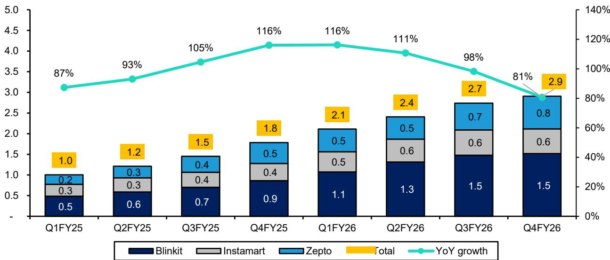  
*Zepto NOV is calculated as Zepto NRV (Net Receivables Value) minus ad and subscription income to arrive at a like-to-like comparison with Blinkit and Instamart  
** YoY growth %-age taken in INR terms  
Source: Company reports, Zepto DRHP, Bernstein analysis

EXHIBIT 2: Our methodology for QC SAM estimation using Supply Side economics of dark stores  
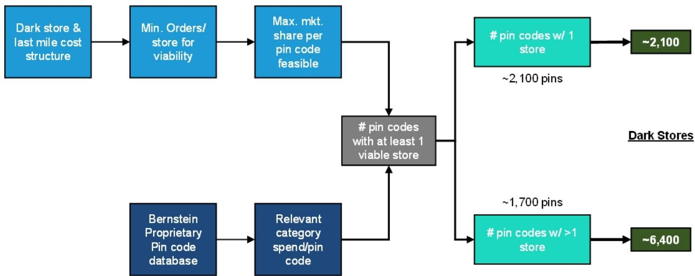  
Source: Company websites, Bernstein store database, Bernstein estimates and analysis

EXHIBIT 3: Our supply side analysis gives us a potential for ~8.5k profitable dark stores in ~3.8k pincodes of India resulting in $35 bn as profitable market size by F30.

# Eligible Pin Codes by tier and corresponding # Dark Stores

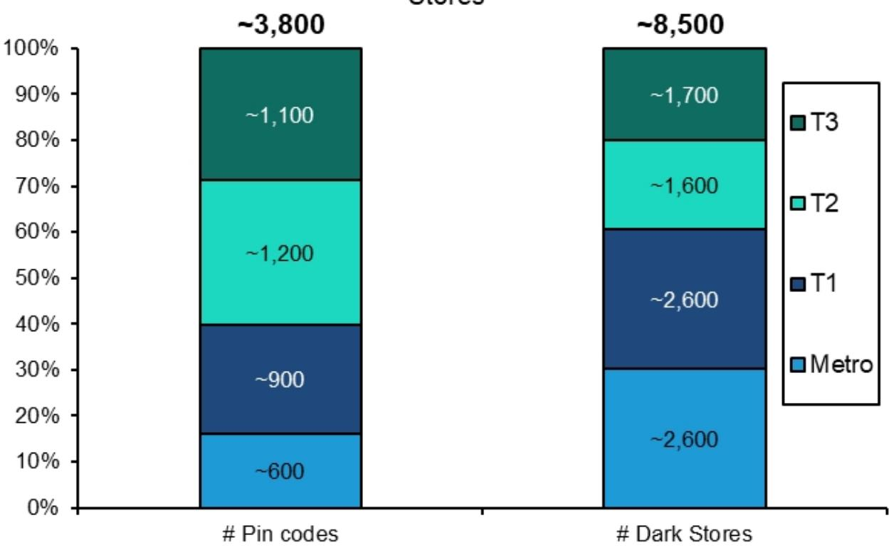

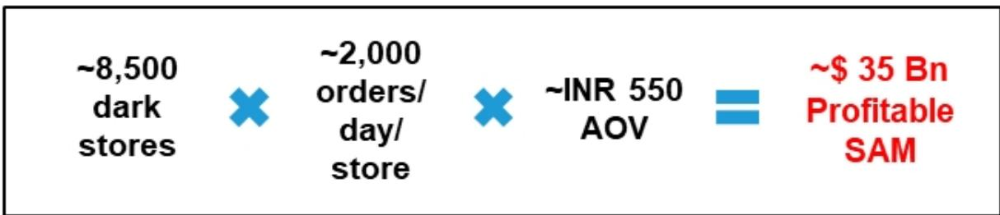  
Source: Company websites, Bernstein store database, Bernstein estimates and analysis

EXHIBIT 4: NOV growth trajectory has been reducing gradually across players  
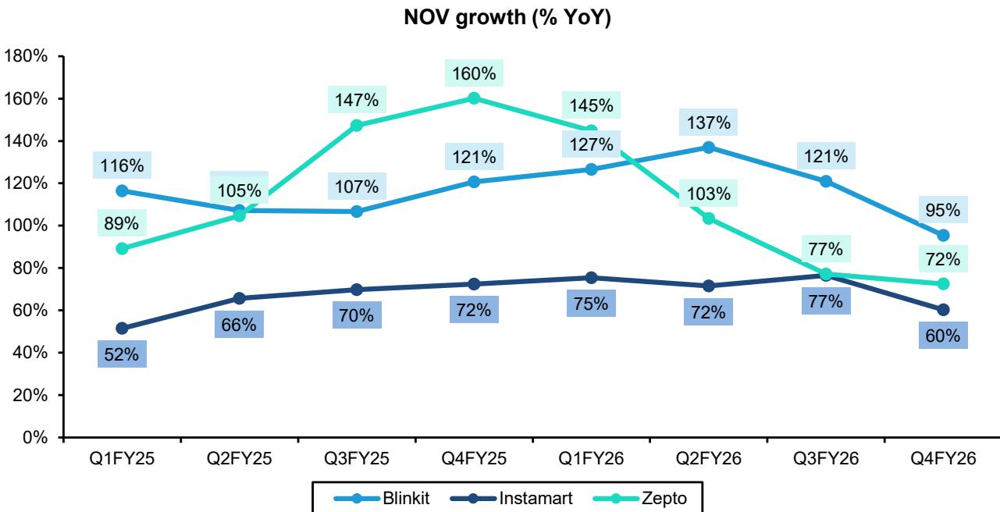  
Source: Company reports, Zepto DRHP, Bernstein analysis

EXHIBIT 5: QoQ growth has been volatile across players with Zepto clearly pulling ahead in the last 2 quarters  
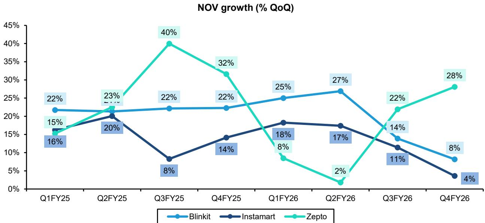  
Source: Company reports, Zepto DRHP, Bernstein analysis

EXHIBIT 6: Zepto's MAU has stayed flat at ~59 Mn while Blinkit continues to climb, crossing 83 Mn. We expect new customer addition to be slower for the industry.

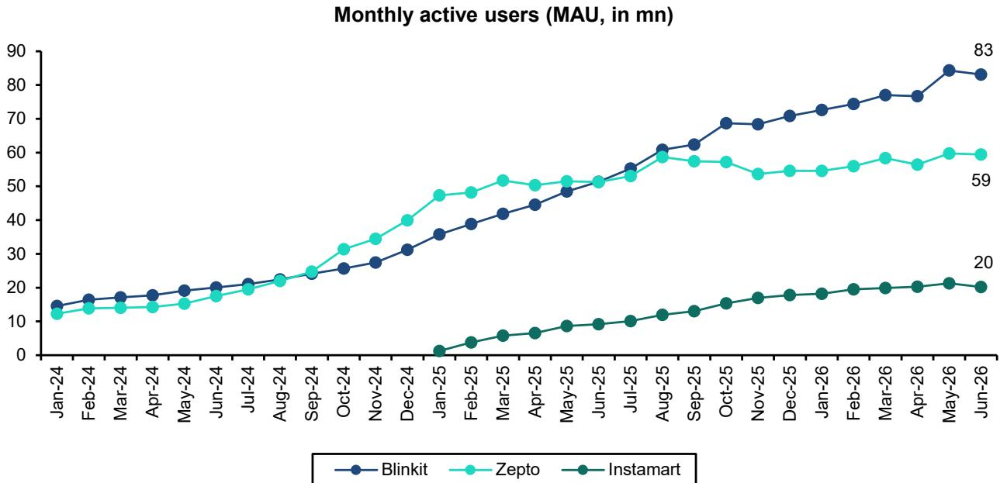  
Source: Sensor Tower, Bernstein analysis

## NETWORK BUILD-OUT IS STILL ACCELERATING, LEADING TO AN OVER-CROWDED MARKET.

The five players Blinkit-Instamart-Zepto-Flipkart Minutes-Amazon Now together operate ~6,500 dark stores between them as per our proprietary database (Exhibit 7). They added ~900 stores in the last quarter alone which is the fastest pace of network addition we have seen so far. These stores serve ~2,700 pincodes and our organized retail database suggests QC now covers ~68% of all organized retail locations in India. Our supply side model estimates a potential of ~8,500 profitable stores by F30.

The acceleration is primarily coming from the challengers while Blinkit is maintaining pace. We estimate that Blinkit added ~270 stores during the quarter, while Flipkart expanded by around 260 stores—a 35% sequential increase in its network. Amazon Now also significantly scaled up operations, adding ~250 stores and doubling its serviceable pincodes over the same period.

The part that should be noted is where these stores are going. The five players added ~900 stores during the quarter but the number of unique serviceable pincodes rose by only ~150 (Exhibit 9). In other words, 9 out of 10 new stores opened in a pincode which already had quick commerce. Metro cities now have 4,300 stores against our estimated profitable-store potential of ~3,600 stores which means the network is at ~120% potential. Every incremental metro store is now serving the same customer base. The crowding is most visible in Metros where the share of pincodes served by all 5 players has jumped from 26% to 44% and only 9% of Metro pincodes now have a single player (Exhibit 14). The city level picture says the same thing with every Top-8 city adding stores in the quarter (Exhibit 13).

Within this the strategies are diverging in an interesting way. 75% of Blinkit's new stores in 1Q27 were outside Metros with T2 and T3 towns taking a growing share (Exhibit 15). Blinkit is using its profitability headroom to test smaller towns. Blinkit and Instamart operate at ~9 stores per city and are going wider while Zepto and Amazon who are metro heavy have ~20 stores per city (Exhibit 10, Exhibit 11). As Amazon extends its network to new cities, we expect this number to fall, while Zepto's ratio should sustain as it is a strategic call by the company to operate in highly dense urban areas.

The conclusion is hard to avoid. New stores are increasingly duplicating existing coverage and serving the same customer base. We believe store network rationalization in Metros is a matter of when and not if. Till then the over crowding will keep per store metrics and unit economics under observation.

EXHIBIT 7: The five players together operate ~6,500 dark stores (and BigBasket has another ~800) with ~900 stores added in a single quarter as per Bernstein proprietary database  
Number of dark stores  
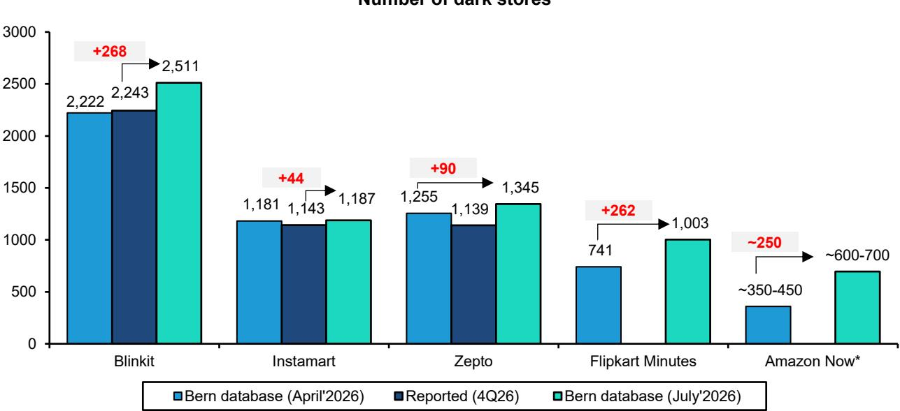  
*For Amazon Now, we have estimated the range of number of dark stores using the ratio of darkstore per serviceable pincode for others
Source: Company, Bernstein store database & analysis  
Quarterly dark store additions

EXHIBIT 8: Blinkit has been the consistent expander of store network.

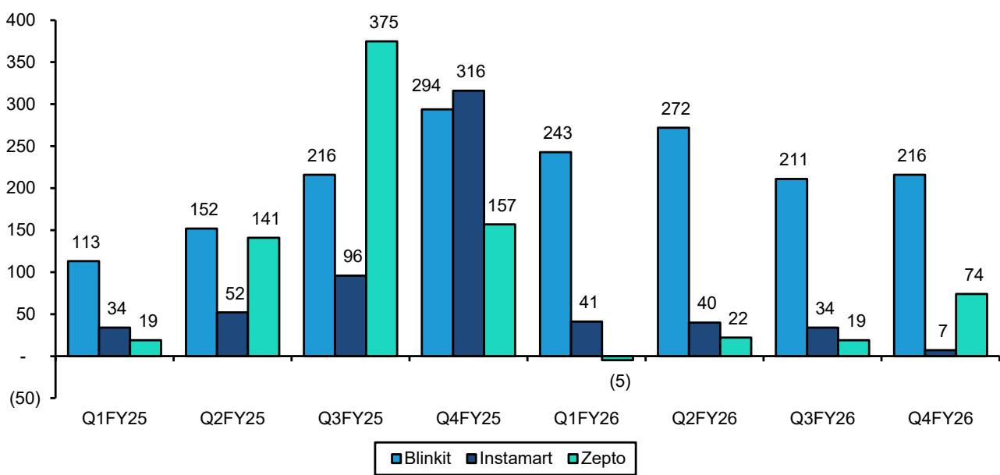  
Source: Company reports, Zepto DRHP, Bernstein analysis

Number of dark stores per city

EXHIBIT 9: Unique serviceable pincodes rose by only ~150 in the quarter to 2,722 - new stores are largely going into already serviced areas

Our organized retail database estimates total coverage of ~4000 pincodes indicating that QC is already covering ~68% of all organized retail locations

Number of serviceable pincodes

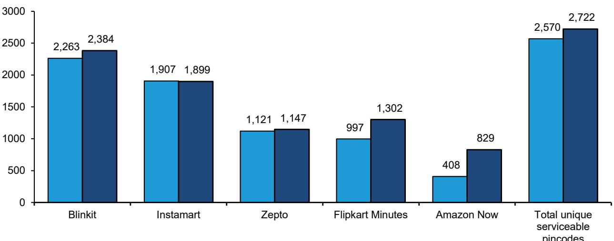

April'26 July'26

Source: Company, Bernstein store database & analysis

EXHIBIT 10: Amazon Now has expanded its city coverage, while the others are largely consistent  
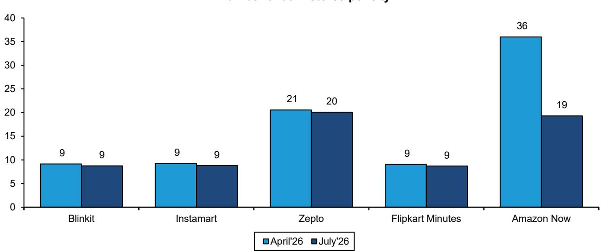  
Source: Company, Bernstein store database & analysis

EXHIBIT 11: Across the board, share of stores in Metro cities has nearly stayed constant  
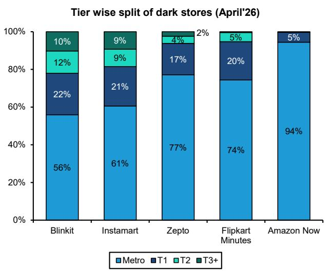  
Source: Company, Bernstein store database & analysis

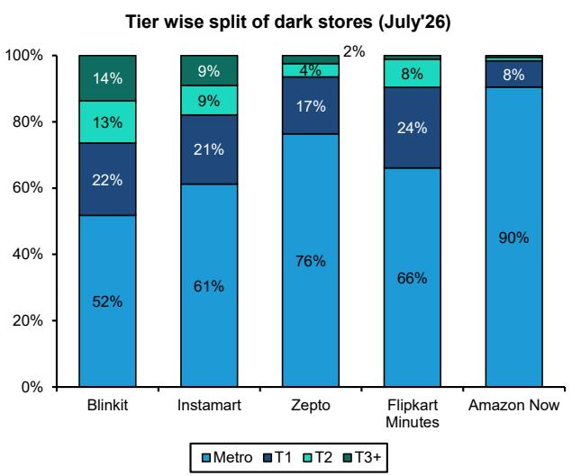  
EXHIBIT 12: Metro cities now have ~4300 dark stores against our estimated profitable store potential of ~3,600  
Number of darkstores by tier across 5 players (April'26)

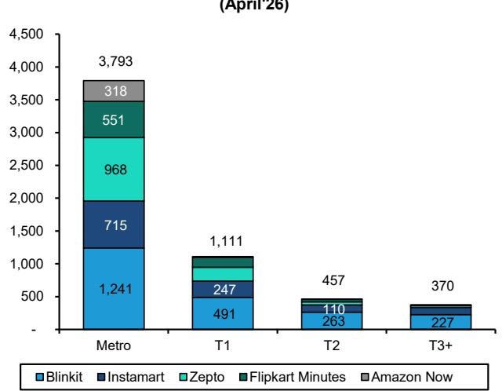  
Source: Company, Bernstein store database & analysis  
Number of darkstores by tier across 5 players (July'26)

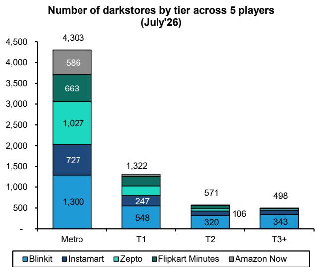

EXHIBIT 13: Every Top-8 city added stores in the quarter.  
Number of darkstores by top 8 cities (April'26)  
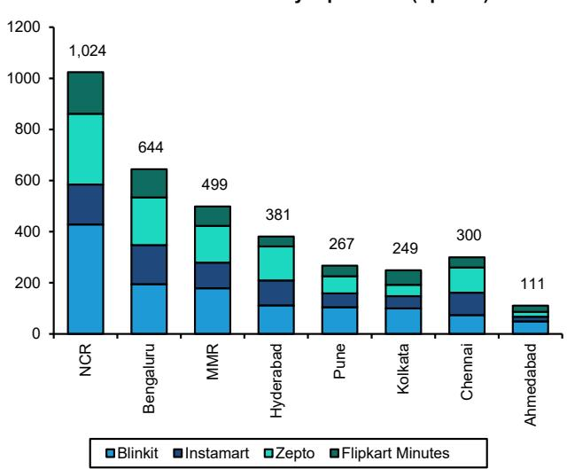  
Number of darkstores by top 8 cities (July'26)

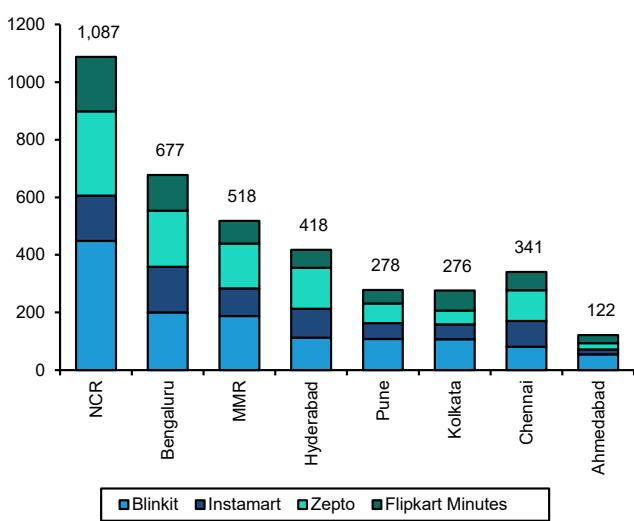  
- Blinkit
- Instamart
- Zepto
- Flipkart Minutes

Source: Company, Bernstein store database & analysis  
EXHIBIT 14: Share of Metro pincodes served by all 5 players jumped from 26% to 44% in three months  
Pincodes with competition in each city tier (April'26)  
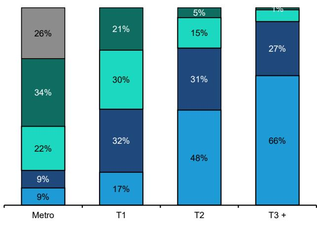  
Only 1 player Any 2 players Any 3 players Any 4 players All 5 players

Pincodes with competition in each city tier (July'26)  
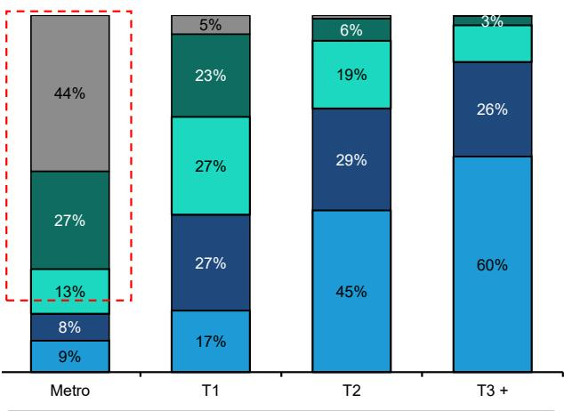  
Only 1 player Any 2 players Any 3 players Any 4 players All 5 players  
Source: Company, Bernstein store database & analysis

EXHIBIT 15: $75\%$ of Blinkit's new stores in 1Q27 were outside Metros while Instamart added $63\%$ of its new stores in Metros  
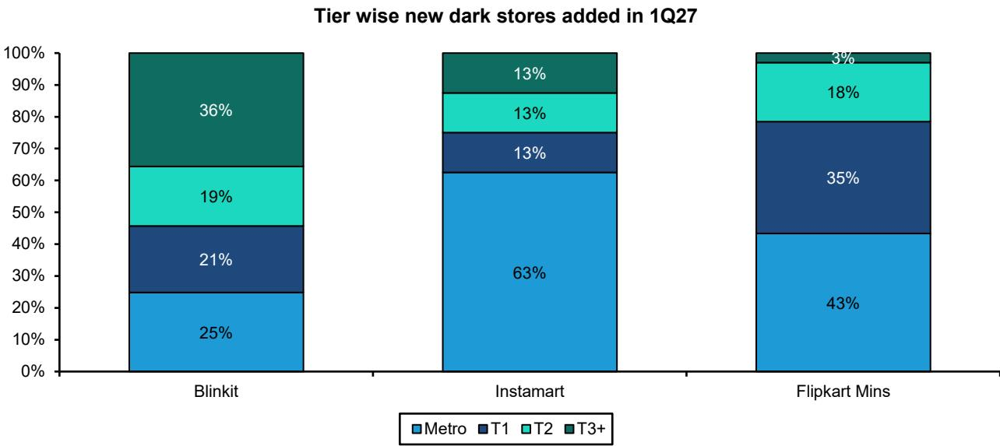  
Source: Company, Bernstein store database & analysis

## SAME CITY. SAME CUSTOMER. SAME SKUS. SLIGHTLY DIFFERENT PLAYBOOKS

The line between e-commerce and quick commerce is blurring fast. Blinkit in their last earnings call mentioned that it now sells 80k + SKUs in NCR and 50k+ in the next-7 metros while Instamart and Zepto also offer ~50k SKUs. When we fetched the assortment data from company websites in February 2026, Instamart offered ~44k SKUs and Blinkit ~35k in Bangalore with Flipkart Minutes at just ~10K (Exhibit 16). The assortment expansion in just a few months has been rapid. The non-grocery push is not accidental. As we detailed in our note on assortment (link), QC is a retail business with high variable cost and a cost floor of ~INR 95-100. Grocery alone cannot cover this cost as average order value is low. Non-grocery items carry higher prices and higher margins which means better AOVs and better take-rates for the platform. Non-grocery items already make up ~65% of listed SKUs across platforms (Exhibit 17) but only ~30% of NOV. The largest categories in the non-grocery segment are Home & Kitchen, Beauty & Personal care and Fashion (Exhibit 18).

QC players have clearly encroached on e-commerce territory and a part of future QC NOV growth could simply be a channel shift from e-commerce to quick commerce. We believe this positioning with customers is what has pushed Flipkart and Amazon to amp up their own QC efforts. The result is that product is no longer a differentiator. Every player now has SKUs across all major subcategories (Exhibit 19) and a customer, especially in a metro pincode sees similar products no matter which app the person opens (Exhibit 20). With similar products on offer the focus has shifted to creating new consumption occasions. QC apps see clear DAU spikes around occasion days like Valentine's Day, Rakhi, Diwali and New Year (Exhibit 21). Occasion days bring higher order frequency and a higher share of customer's wallet.

Pricing is where the strategies begin to diverge. Our discounting tracker of 30 national brand SKUs shows overall discounts still running at ~20-25%. Zepto, Amazon and Flipkart continue to deep-discount to acquire customers while Blinkit and Instamart are striving for better economics (Exhibit 22).

Dark stores are where the strategies differ most. A wider non-grocery assortment is a different warehousing problem as these SKUs are seasonal and slower moving with longer inventory cycles. Blinkit's answer is to split its assortment across multiple nearby stores serving the same pincode with some stores focused on grocery and others carrying the non-grocery and long-tail range (Exhibit 23). Instamart's answer is to consolidate everything into fewer and larger stores (Exhibit 24). The first approach keeps individual stores lean but adds routing complexity while the second comes with a higher cost structure. Amazon and Flipkart may go wide with fewer stores per city while Zepto stays dense. It is too early to declare a winner as these operators are optimizing for different combinations of market share, capital efficiency and profitability.

EXHIBIT 16: Instamart offers the highest SKU range (in a particular pincode) per our database with Blinkit close behind; Flipkart Minutes still appears to be ramping up its range

Max number of SKUs available (in '000)  
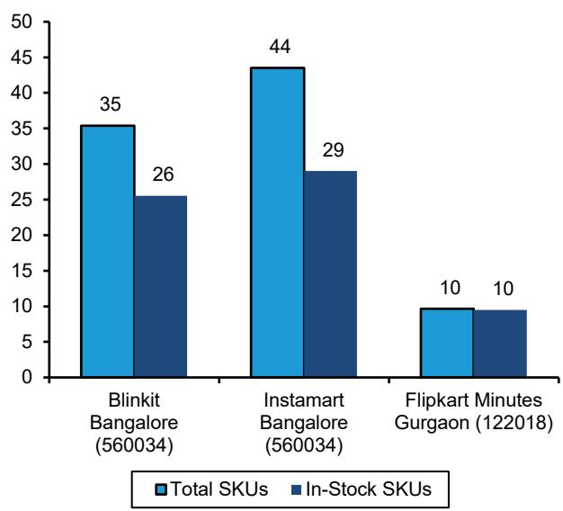  
EXHIBIT 17: Non-grocery SKUs represent ~65% of SKUs available across platforms, even Flipkart which has a smaller SKU assortment

Source: Company websites, Bernstein analysis  
Share of Grocery vs Non-Grocery SKUs  
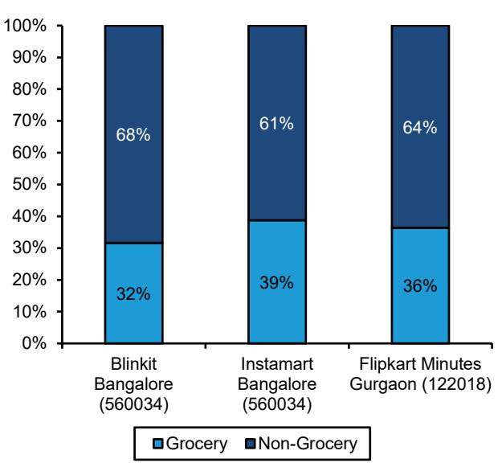  
Source: Company websites, Bernstein analysis

EXHIBIT 18: Blinkit: Home & Kitchen, BPC and Fashion are largest non-grocery categories; Staples, Snacks and Desserts are largest grocery categories  
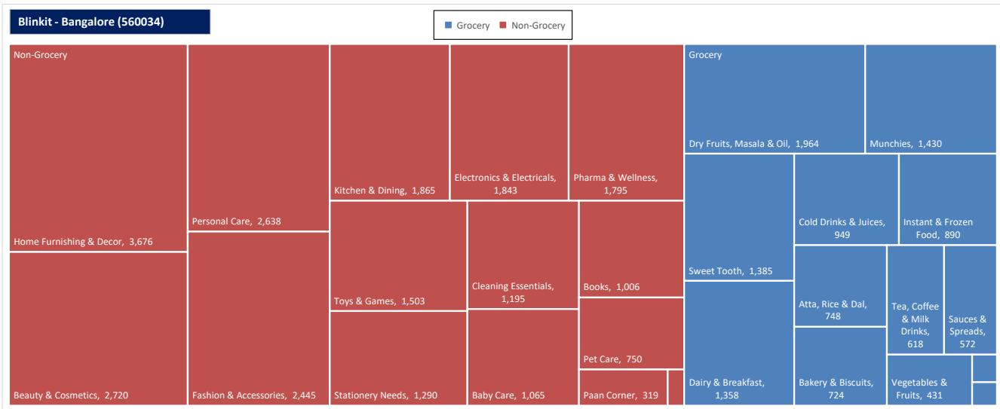  
Source: Company websites, Bernstein analysis

EXHIBIT 19: All players have SKUs available across all major subcategories as well

<table><tr><td>Category</td><td>Subcategory</td><td>Blinkit</td><td>Instamart</td><td>Zepto</td><td>Flipkart</td><td>Amazon</td><td>BigBasket</td></tr><tr><td rowspan="4">Fresh Items</td><td>Fresh Vegetables</td><td>√</td><td>√</td><td>√</td><td>√</td><td>√</td><td>√</td></tr><tr><td>Fresh Fruits</td><td>√</td><td>√</td><td>√</td><td>√</td><td>√</td><td>√</td></tr><tr><td>Dairy, Bread &amp; Eggs</td><td>√</td><td>√</td><td>√</td><td>√</td><td>√</td><td>√</td></tr><tr><td>Meat and Seafood</td><td>√</td><td>√</td><td>√</td><td>√</td><td>√</td><td>√</td></tr><tr><td rowspan="4">Grocery &amp; Kitchen</td><td>Atta, Rice &amp; Dal</td><td>√</td><td>√</td><td>√</td><td>√</td><td>√</td><td>√</td></tr><tr><td>Masalas</td><td>√</td><td>√</td><td>√</td><td>√</td><td>√</td><td>√</td></tr><tr><td>Oils and Ghee</td><td>√</td><td>√</td><td>√</td><td>√</td><td>√</td><td>√</td></tr><tr><td>Cereals and Breakfast</td><td>√</td><td>√</td><td>√</td><td>√</td><td>√</td><td>√</td></tr><tr><td rowspan="12">Snacks &amp; Drinks</td><td>Cold Drinks and Juices</td><td>√</td><td>√</td><td>√</td><td>√</td><td>√</td><td>√</td></tr><tr><td>Ice Creams and Frozen Desserts</td><td>√</td><td>√</td><td>√</td><td>√</td><td>√</td><td>√</td></tr><tr><td>Chips &amp; Namkeen</td><td>√</td><td>√</td><td>√</td><td>√</td><td>√</td><td>√</td></tr><tr><td>Chocolates</td><td>√</td><td>√</td><td>√</td><td>√</td><td>√</td><td>√</td></tr><tr><td>Biscuits and Cakes</td><td>√</td><td>√</td><td>√</td><td>√</td><td>√</td><td>√</td></tr><tr><td>Tea, Coffee &amp; Milk Drinks</td><td>√</td><td>√</td><td>√</td><td>√</td><td>√</td><td>√</td></tr><tr><td>Sauces &amp; Spreads</td><td>√</td><td>√</td><td>√</td><td>√</td><td>√</td><td>√</td></tr><tr><td>Sweet Corner</td><td>√</td><td>√</td><td>√</td><td>√</td><td>√</td><td>√</td></tr><tr><td>Noodles, Pasta, Vermicelli</td><td>√</td><td>√</td><td>√</td><td>√</td><td>√</td><td>√</td></tr><tr><td>Frozen Food</td><td>√</td><td>√</td><td>√</td><td>√</td><td>√</td><td>√</td></tr><tr><td>Dry Fruits and Seeds Mix</td><td>√</td><td>√</td><td>√</td><td>√</td><td>√</td><td>√</td></tr><tr><td>Paan Corner</td><td>√</td><td>√</td><td>√</td><td>√</td><td>√</td><td>√</td></tr><tr><td rowspan="9">Beauty &amp; Wellness</td><td>Bath &amp; Body</td><td>√</td><td>√</td><td>√</td><td>√</td><td>√</td><td>√</td></tr><tr><td>Hair</td><td>√</td><td>√</td><td>√</td><td>√</td><td>√</td><td>√</td></tr><tr><td>Skin &amp; Face</td><td>√</td><td>√</td><td>√</td><td>√</td><td>√</td><td>√</td></tr><tr><td>Makeup</td><td>√</td><td>√</td><td>√</td><td>√</td><td>√</td><td>√</td></tr><tr><td>Feminine Hygiene</td><td>√</td><td>√</td><td>√</td><td>√</td><td>√</td><td>√</td></tr><tr><td>Baby Care</td><td>√</td><td>√</td><td>√</td><td>√</td><td>√</td><td>√</td></tr><tr><td>Health &amp; Pharma</td><td>√</td><td>√</td><td>√</td><td>√</td><td>√</td><td>√</td></tr><tr><td>Sexual Wellness</td><td>√</td><td>√</td><td>√</td><td>√</td><td>√</td><td>√</td></tr><tr><td>Protein &amp; Nutrition</td><td>√</td><td>√</td><td>√</td><td>√</td><td>√</td><td>√</td></tr><tr><td rowspan="10">Household &amp; Lifestyle</td><td>Home and Kitchen</td><td>√</td><td>√</td><td>√</td><td>√</td><td>√</td><td>√</td></tr><tr><td>Cleaners &amp; Repellents</td><td>√</td><td>√
