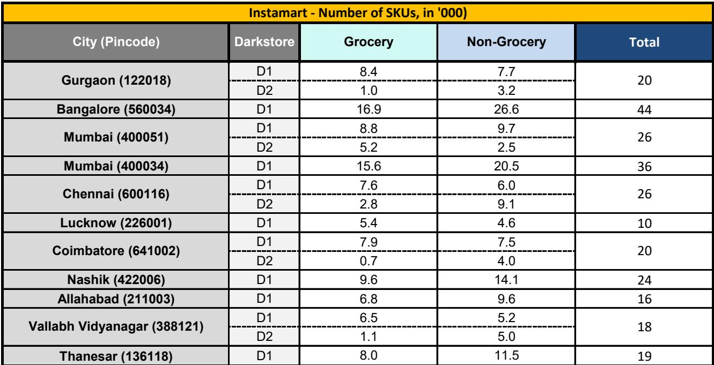
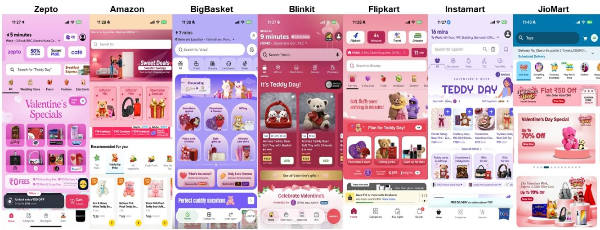
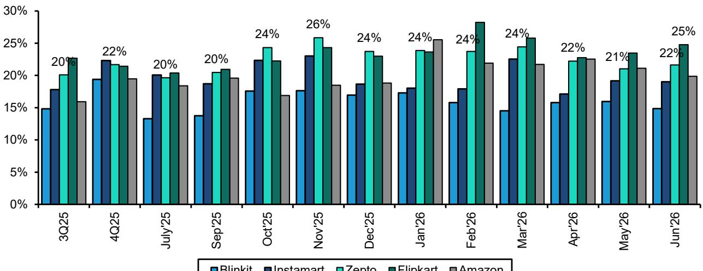

# Bernstein：印度新兴消费-即时零售，从淘金热到长期收获

印度即时零售行业年化交易额在2026财年末已达到约140亿美元，但Bernstein这份最新研报传递的核心信号是：行业弹性较高增长的时代已经结束。报告基于其覆盖约1.9万个邮政编码的专有数据库，从供给端推算出印度即时零售的盈利性可寻址市场在2030财年约为350亿美元——但行业目前已经走到这个数字的40%。更关键的是，过去一个季度新增的约900家暗店中，每10家就有9家开在已有即时零售覆盖的区域。这意味着，增量竞争正在从“抢地盘”转向“抢同一批顾客的钱包”。

## 1. 网络密度已超过盈利性均衡点，但扩张仍在加速

Bernstein的数据显示，五大玩家（Blinkit、Instamart、Zepto、Flipkart Minutes、Amazon Now）目前运营约6500家暗店，过去一个季度新增约900家，是报告追踪以来最快的季度扩张速度。但同期新增的独有服务邮政编码仅约150个。换句话说，90%的新店开在了已经有人服务的区域。

报告特别指出，一线城市目前已有约4300家暗店，而模型估算的盈利性潜力约为3600家——实际密度已超出约20%。一线城市中，同时被五大玩家覆盖的邮政编码占比从26%跃升至44%，仅由单一玩家服务的邮政编码已降至9%。这意味着，在一线城市，每新增一家店都在摊薄现有门店的订单密度。

> **KC评论：** 报告用“120%的密度”这个数字点明了问题的核心。暗店不是越多越好，当密度超过盈利性均衡点，每单的固定成本分摊反而会出现变化。读者需要关注的不是门店数量，而是单店订单量是否在下降。

## 2. 玩家策略正在分化：Blinkit下沉，Zepto坚守密度

虽然整体市场在拥挤，但头部玩家的扩张路径已经出现明显分化。Blinkit在1Q27新增的约270家门店中，75%开在一线城市以外，二三线城市在其新店中的占比持续上升。报告认为，Blinkit正在利用其接近盈亏平衡的盈利能力，在更小的城市测试需求。

Zepto和Amazon Now则维持了更高的城市内密度，每城市约20家店，而Blinkit和Instamart约为9家。Amazon Now在过去一个季度将服务城市从约10个扩展到约35个，但每城市的门店数预计会随着网络铺开而下降。Zepto的密度策略则是一个主动选择——聚焦高密度城区，而非追求地理覆盖。

这种分化意味着，不同玩家对“单位宏观环境模型”的容忍度不同。Blinkit选择用下沉换取增量，而Zepto选择在存量市场里做深。两种策略的成败，将取决于哪一条路径能更快实现单店盈利。

## 3. 补贴退坡可能比预期来得更快，但单位宏观环境有结构性下限

报告估算，即时零售行业目前年化亏损约25亿美元，EBITDA利润率在-10%到-12%之间。Blinkit的约60亿美元年化交易额已接近盈亏平衡，这意味着其余约80亿美元的交易额亏损更深。

Bernstein认为，补贴和折扣的强度可能在2026年下半年开始缓和，比此前的预期更早。原因在于，直接成本（履约、包装、仓储）存在结构性下限，约每单95-100印度卢比，运营杠杆的空间有限。当获客成本无法通过规模效应进一步压缩时，改善单位宏观环境只能靠提高每单收入——即更高的客单价、更少的折扣和更好的品类组合。

报告观察到，Blinkit已减少折扣，Instamart在主动削减低客单价订单，Zepto将最低订单金额提高至149卢比并尝试了雨天附加费。这些信号表明，行业正在从“烧钱换规模”转向“优化订单质量”。

> **KC评论：** 报告提到的“结构性下限”值得注意。即时零售的成本大头是最后一公里的履约，这个成本不会因为订单量弹性较高而减半。因此，行业盈利的关键不是订单量，而是每单的毛利能否覆盖固定的履约成本。补贴退坡是必然，但速度取决于竞争烈度。

## 4. 未来增长靠钱包份额，而非新客获取

报告指出，头部玩家的月活跃用户增长曲线已经趋平。Blinkit的MAU约8300万，Instamart独立应用约2000万，Zepto约5900万。新客获取的边际成本在上升，而增量贡献在下降。

因此，报告认为未来增长的主要来源是现有顾客的钱包份额提升——即更高的购买频次和更高的客单价。这需要品类扩张，尤其是向非食品、非日用品类延伸。目前Blinkit在德里首都区已提供超过8万个SKU，Instamart约5万个。即时零售已经明显侵入传统电商的领地。

但这也意味着，即时零售的增长可能部分来自对传统电商的渠道替代，而非纯粹的新增消费。报告提到，Flipkart和Amazon加大即时零售投入，部分原因正是看到了这种替代不确定性。

---

For informational purposes only. Portions may be generated,translated,summarized,or edited with AI assistance based on source materials and may contain omissions or errors. Please verify independently. This is not investment,legal,tax,accounting,or other professional advice.

For informational purposes only. Portions may be generated,translated,summarized,or edited with AI assistance based on source materials and may contain omissions or errors. Please verify independently. This is not investment,legal,tax,accounting,or other professional advice.

