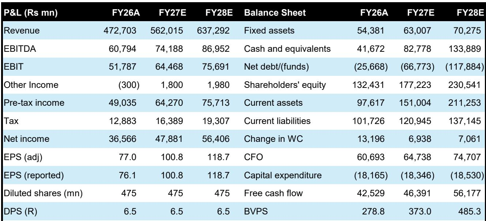
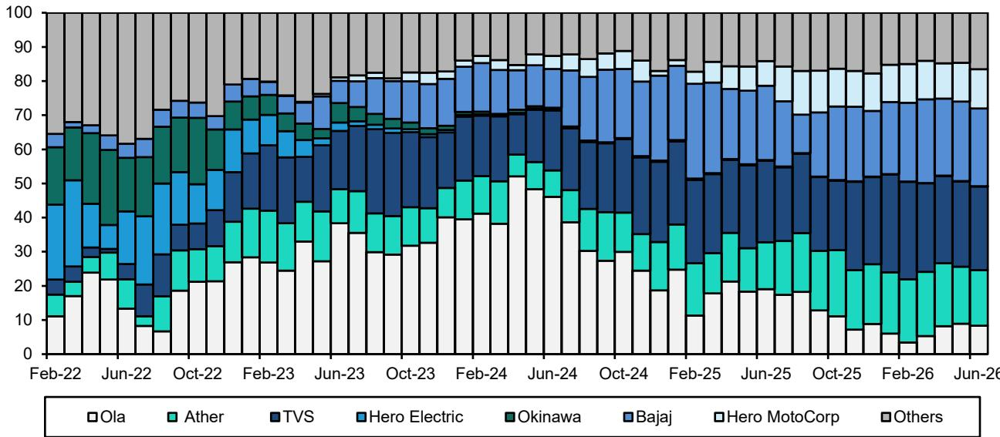
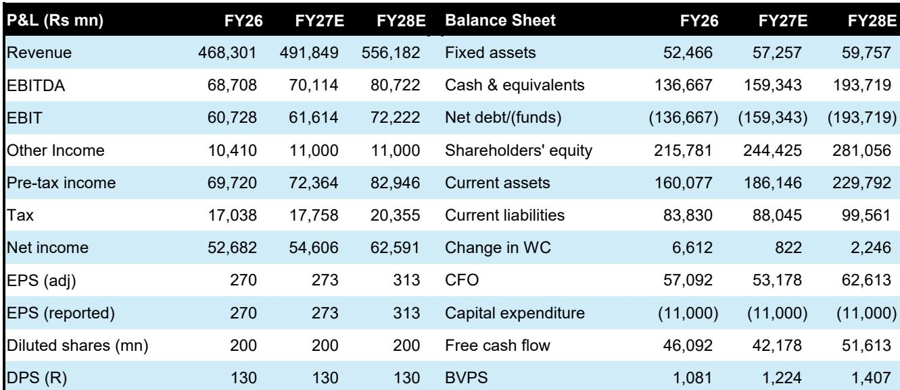

# Bernstein：印度两轮车电动化-市场结构问题与ICE经验

印度两轮车电动化正在加速，两轮电动车渗透率持续攀升，新车型密集上市。但Bernstein这份报告提出了一个反直觉的判断：电动化不会从根本上改变印度两轮车市场的竞争结构。决定胜负的，依然是在燃油车时代就已确立的底层逻辑——规模、成本、分销网络和生态护城河。报告的核心贡献，是将印度两轮车市场拆解为两个截然不同的竞争场域，并逐一推演电动化对各自格局的影响。

## 1. 大众市场赢在成本和规模，电动化不会改变这一规则

印度两轮车年销量超过2000万辆，涉及约80个品牌，但前十名品牌占据三分之二销量，前三名拥有约40%份额。这种高度集中的格局已稳定数十年。原因在于消费决策逻辑：对多数家庭而言，摩托车或踏板车是创收工具或主要出行方式，购买时优先考虑可靠性、转售价值、服务覆盖和低使用成本，而非新颖性。

一旦某款车型达到规模，其存量用户基础就形成强大的竞争壁垒。更大的保有量支撑更密集的服务网络、更强的转售价值、更高的维修人员熟悉度和更强的买家信心，进而巩固未来需求。成功会随时间自我强化，少数车型成为市场默认选择。

Bernstein以Hero在入门级通勤摩托车市场的统治地位为例：Hero凭借规模、精益工程、强大的供应商议价能力和覆盖小城镇的低成本服务网络，形成了“规模降低成本、成本增强竞争力、竞争力保护规模”的自我强化循环。即使本田拥有更平顺、更耐用的发动机，也用了约15年才在通勤摩托车市场达到约四分之一份额，至今仍未超越Hero。

> **KC评论：** 这一分析的关键在于，它否定了“技术更优就能快速颠覆”的直觉。在大众市场，电动化只是动力系统的替换，竞争的基本要素——成本、规模、服务网络——并未改变。真正需要关注的，是出现一个在电池成本上拥有结构性优势、且现有厂商无法复制的参与者。

## 2. 特许品类由生态护城河定义，复制产品不等于复制成功

报告区分了“大众市场”与“特许品类”两种竞争逻辑。特许品类不是通过更好或更便宜的产品赢得现有市场，而是创造了一个此前未被充分满足的客户需求，改变了用户行为，并构建了自我强化的生态系统——包括转售价值、服务熟悉度、融资便利、社群认同和品牌力。

Bajaj的Pulsar定义了运动通勤摩托，本田的Activa创造了现代家庭踏板车，Royal Enfield开创了休闲生活方式摩托车。竞争对手可以复制产品，甚至拥有同等优秀的工程能力和资源，但复制产品不等于赢得品类。因为这些特许品类的护城河不在产品本身，而在围绕产品建立的整个生态系统。

报告认为，在电动化时代，特许品类的竞争逻辑同样不会改变。高端电动两轮车市场将迎来大量新车型，但赢家将是那些能够建立品牌、社群和用户身份认同的厂商，而非仅仅推出技术参数更优的产品。

## 3. 电动化可能带来更碎片化的格局，但赢家路径依然清晰

Bernstein指出，电动车降低了进入门槛。更短的产品开发周期和可外包的电池、电机等核心部件，将导致比燃油车时代多得多的新车型上市。因此，大众市场可能比燃油车时代更加碎片化，多个厂商共享领导地位，而非单一主导者胜出。

但报告同时强调，如果某家厂商能够在电池电芯、电机等关键成本部件上建立起结构性成本优势，同时确保产品质量和服务网络，它仍有可能大幅领先。在高端电动两轮车领域，预计将出现更多细分市场的赢家，但每个细分市场的销量规模可能更小。

报告对四家覆盖公司的分析也体现了这一框架：Bajaj被认为在三个关键领域——大众市场、电动品牌Chetak、以及通过Triumph和KTM布局的高端电动市场——均有布局，且燃油车业务持续产生现金流，为其电动化研究提供财务灵活性。Hero的挑战则在于，其竞争优势集中在入门级大众市场，而该市场在行业价值创造中的占比正在逐步转移。

印度两轮车电动化的终局，可能不是技术颠覆者的狂欢，而是既有竞争逻辑在新技术载体上的延续。谁能在成本、规模和生态护城河上同时建立优势，谁就更有可能在电动化时代守住或赢得位置。

For informational purposes only. Portions may be generated,translated,summarized,or edited with AI assistance based on source materials and may contain omissions or errors. Please verify independently. This is not investment,legal,tax,accounting,or other professional advice.

For informational purposes only. Portions may be generated,translated,summarized,or edited with AI assistance based on source materials and may contain omissions or errors. Please verify independently. This is not investment,legal,tax,accounting,or other professional advice.

