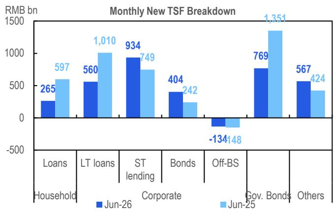
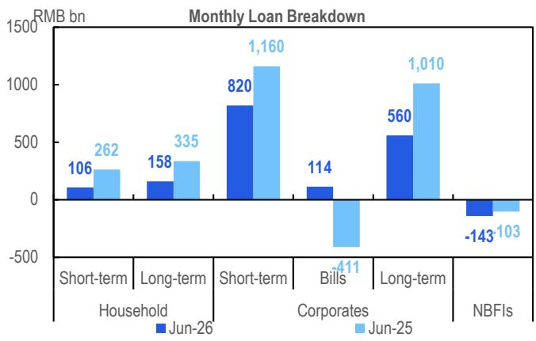
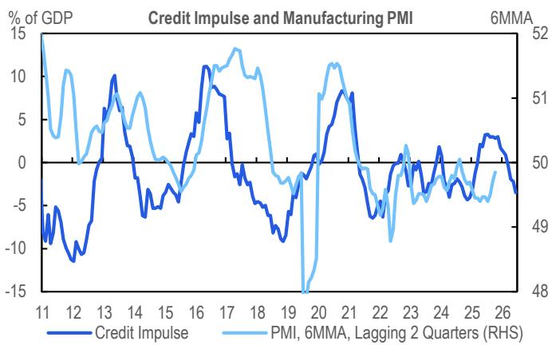

# Citi：中国宏观，信贷数据与市场预期存在差异

6月信贷数据与市场预期存在一定差距——同日公布的GDP和研究数据已提前释放了信号。Citi这份研报的核心判断是：增量政策会来，但信用数据能否随之变化，需要更谨慎的预期。

新增人民币贷款1.61万亿元，低于市场预期的1.95万亿元；社融增量3.36万亿元，同样不及预期的3.70万亿元。更值得关注的是结构：企业中长期贷款同比少增约4580亿元，居民端无论是短期还是长期贷款，均低于去年同期水平。政府债券融资7690亿元，为年内最低读数。

Citi认为，货币政策方面最早7月可能看到LPR下调10个基点，央行在7月15日发布会上已给出最明确的增量政策指引——必要时扩大结构性政策工具规模。但财政端才是下半年社融最确定的驱动力。

## 1. 政府债券是下半年社融最确定的增量，但不足以改变整体节奏

剩余政府债券额度约7.45万亿元，相比去年下半年实际发行的6.18万亿元，可带来约1.3万亿元的增量。这笔资金落地后，社融增速的变化节奏会有所调整，但不会出现方向性转变。

真正的不确定性来自内生信贷需求的仍在调整。Citi统计，今年上半年居民贷款与企业中长期贷款及债券融资合计，比去年同期少了约2.2万亿元。报告没有看到短期内有催化剂能扭转这一局面。

> **KC评论：** 这里的关键不是政府发债能补多少，而是“补”和“缺”之间的量级差距。1.3万亿的增量，面对2.2万亿的内生缺口，信用脉冲在下半年大概率仍为负值。

## 2. M1增速回落，PPI再通胀的支撑正在减弱

6月M1同比增速降至4.0%，为一年来低点，且受高基数影响，年内可能继续走低。M1与M2的剪刀差进一步扩大，这一组合通常意味着企业活期存款减少、资金活化程度下降。

Citi指出，M1增速的持续变化，对PPI通胀的后续走势不是积极信号。PPI同比读数可能在年内见顶或出现节奏变化，这对依赖价格修复来改善企业利润的行业，意味着支撑正在减弱。

## 3. 居民不确定性偏好的修复，仍停留在季节性层面

6月居民贷款出现季节性反弹，但相对量远低于去年同期。短期贷款1060亿元、中长期贷款1580亿元，分别只有去年同期的40%和47%。

Citi在图表中展示了一个值得关注的细节：居民存款再配置的节奏保持稳定，但资金并未大规模流向消费或研究，而是更多停留在定期存款或资金规划类资产中。不确定性偏好的修复，目前仍停留在季节性层面，尚未形成趋势性改善。

## 4. 观察框架：信用脉冲能否转正，取决于三个变量的合力

Citi的分析提供了一个可复用的观察框架：信用脉冲 = 政府债券增量 + 内生信贷需求 - 到期偿还不确定性。下半年，政府债券是相对少见确定的正贡献项，内生信贷需求缺乏催化剂，而到期偿还不确定性在利率变化环境中可能边际减轻，但不足以改变整体方向。

对于关注宏观环境的读者，可以持续跟踪两个先行指标：一是企业中长期贷款同比变化，它反映的是企业对未来回报表现的真实判断；二是M1增速走势，它与PPI的关联性，决定了工业部门盈利修复的持续性。

For informational purposes only. Portions may be generated,translated,summarized,or edited with AI assistance based on source materials and may contain omissions or errors. Please verify independently. This is not investment,legal,tax,accounting,or other professional advice.

For informational purposes only. Portions may be generated,translated,summarized,or edited with AI assistance based on source materials and may contain omissions or errors. Please verify independently. This is not investment,legal,tax,accounting,or other professional advice.

