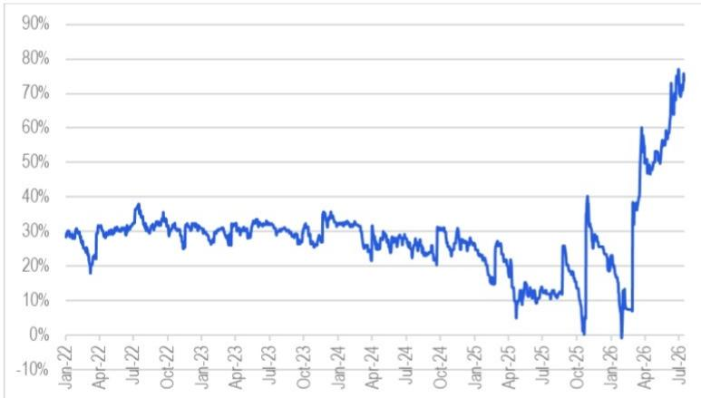
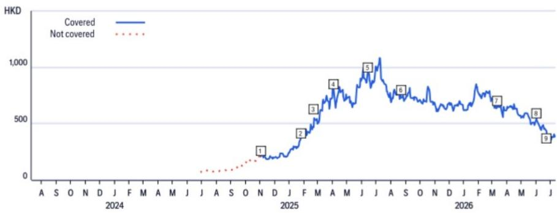
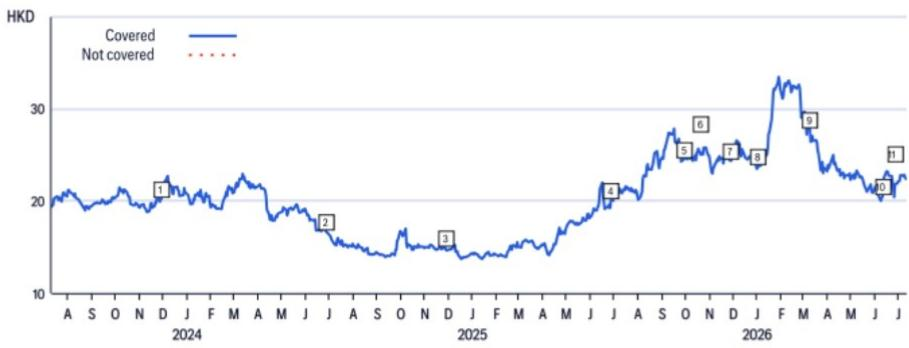
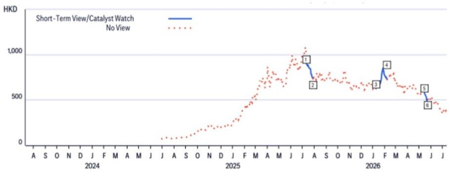
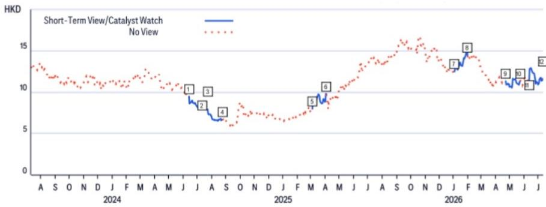
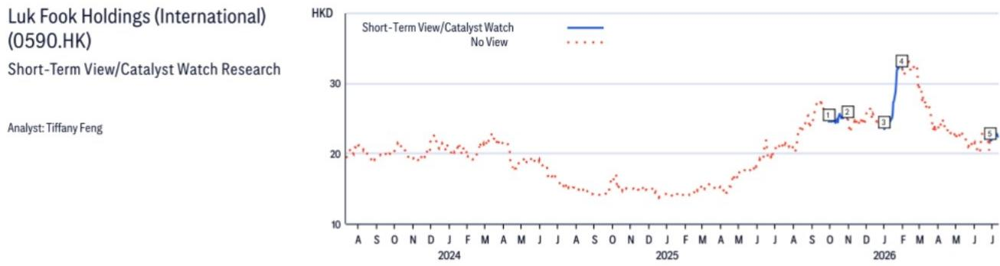

15 Jul 2026 06:26:53 ET | 12 pages

# 中国消费市场观察 - 珠宝行业

## 6月及二季度呈现K型分化，伴随金价回调

## 核心观点

根据国家统计局数据，2026年6月中国珠宝零售额同比降幅收窄至3.4%，而4月和5月分别为21.3%和8.9%。研究认为，6月金价环比下跌11%（4月和5月均为-3%），更深度的回调释放了被压抑的按克计价黄金珠宝产品需求（该类产品贡献了行业大部分销售额），而定价类黄金珠宝产品仍面临挑战。在覆盖的黄金珠宝公司中，预计老铺黄金2026年上半年业绩预览存在下行空间，而周大福和六福集团在2027财年第一季度更新中预计将保持稳健运营。在中国珠宝板块的排序为：周大福 > 老铺黄金 > 六福集团。

**对老铺黄金的影响** – 由于老铺黄金产品采用定价模式，6月金价进一步回调使其产品价格相对于传统按克计价黄金珠宝产品的溢价扩大至74%（图1和图2）。因此，预计此前对2026年上半年的业绩预览存在下行空间，该预览假设营收同比增长77%至219亿元人民币（一季度175亿元，二季度44亿元），净利润同比增长114%至48.5亿元（一季度38亿元，二季度10.5亿元）。同时认为二季度销售/盈利已触底，近期金价回调后该股估值具有吸引力，对应2027年预期市盈率8.7倍和股息率8.6%（正常化盈利）。参见6月22日报告：老铺黄金（6181.HK）– 2026年二季度运营趋势及2026年上半年业绩预览。

**对周大福的影响** – 研究认为，按克计价黄金珠宝产品的复苏对周大福有利。2026年4-5月，其中国大陆同店销售恢复增长20%（定价类珠宝/按克计价黄金珠宝分别+3%/+35%），而2026财年四季度为持平；香港及澳门同店销售增长势头强劲，达+41%（定价类珠宝/按克计价黄金珠宝分别+20%/+57%）。预计这一势头在6月得以延续。如果管理层能在品牌转型中实现目标净利润率扩张，则存在估值重估空间（参见6月12日报告：周大福珠宝集团（1929.HK）– 指引好于预期；品牌转型初见成效）。周大福也是中国消费团队识别出的10只超卖大盘消费股之一，估值具有吸引力。参见7月2日报告：中国消费市场观察 – 10只估值具吸引力的大盘消费股。

**对六福集团的影响** – 研究认为，按克计价黄金珠宝产品的复苏同样利好六福集团。2027财年第一季度至今（4月1日至6月21日），中国大陆同店销售增速加快至超过20%（2026财年四季度约为10%）；香港/澳门同店销售增速超过40%（2026财年四季度为39%），受益于人民币升值带来的更具吸引力的定价。参见6月26日报告：六福集团（国际）（0590.HK）– 2027财年增长目标强于预期。

图1. 老铺黄金与主要传统金店价格对比

© 2026 Citi Inc. 未经Citi书面许可不得转载。
来源：Citi，Wind

图2. 老铺黄金相对于主要传统金店的价格溢价

来源：Citi
© 2026 Citi Inc. 未经Citi书面许可不得转载。

## 周大福珠宝集团

（1929.HK；11.82港元；1；2026年7月15日；16:10）

## 估值

目标价15.4港元（此前为16.7港元），基于2027财年预期市盈率15倍（此前为18倍远期市盈率，因市场情绪偏弱），与老铺黄金的目标倍数一致。

## 风险

可能阻碍股价达到目标价的下行风险包括：1）金价波动；2）消费情绪受经济复苏节奏、贸易摩擦及人民币汇率变动影响；3）香港租金成本上升及经营杠杆效应减弱；4）资本支出增加及股息减少。

## 老铺黄金

（6181.HK；375.0港元；1；2026年7月15日；16:10）

## 估值

目标价659港元，基于2027年预期市盈率15倍（正常化盈利），而全球奢侈品同业2026年预期市盈率为22倍。对老铺黄金适用约30%的估值折价，以反映其在奢侈品行业较短的品牌历史和业绩记录。隐含的2026年预期市盈率13倍，处于全球奢侈品同业低端。

## 风险

可能阻碍股价达到目标价的关键下行风险包括：1）金价波动；2）激烈竞争；3）消费者品味和偏好的变化；4）消费降级；5）扩张期间的自由现金流为负。

## 六福集团（国际）

（0590.HK；22.98港元；1；2026年7月15日；16:10）

## 估值

六福目标价31.8港元，基于现金流折现模型，假设加权平均资本成本14.1%，长期增长率2.0%。加权平均资本成本基于100%股权和0%净债务的资本结构、14.1%的股权成本以及1.0%的税后债务成本。

## 风险

可能阻碍股价达到目标价的下行风险包括：（1）金价大幅上涨抑制黄金珠宝需求，表现不及预期；（2）中国大陆赴港游客数量加速下滑导致销售不及预期；（3）金价大幅下跌导致黄金毛利率不及预期；（4）香港租金成本降幅不及预期。可能推动股价超过目标价的上行风险包括：（1）同店销售增长好于预期；（2）毛利率强于预期；（3）租金成本降幅高于预期。

如果您有视觉障碍并希望就本文档中图形的详细信息与Citi代表沟通，请致电美国1-888-500-5008（TTY：711），或从美国境外拨打+1-210-677-3788。

## 附录A-1

## 分析师认证

主要负责本研究报告准备和内容的研究分析师要么在作者栏中以“AC”标识，要么以粗体列出并附有该分析师负责的内容。如果作者栏中指定了多位AC分析师，每位分析师仅就整个研究报告（不包括（a）以粗体列出的另一位AC认证分析师负责的内容，以及（b）仅针对特定发行人的观点，这些观点归因于下方价格图表或评级历史表中该发行人的另一位AC认证分析师）进行认证。每位分析师就其负责的报告部分认证：（1）其中表达的观点准确反映了其个人对每个提及的发行人和证券的看法，并以独立方式准备，包括对Citi Global Markets Inc.及其关联公司；（2）研究分析师的薪酬的任何部分过去、现在或将来都不直接或间接与该研究分析师在本报告中表达的具体建议或观点相关。

## 重要披露

周大福珠宝集团（1929.HK）

评级与目标价历史
基础研究

分析师：Tiffany Feng

<table><tr><td></td><td>日期</td><td>评级</td><td>目标价</td><td>收盘价</td></tr><tr><td>1</td><td>2023-10-12 10:11:50</td><td>1</td><td>*16.70</td><td>11.56</td></tr><tr><td>2</td><td>2023-11-24 03:59:11</td><td>1</td><td>*15.00</td><td>10.74</td></tr><tr><td>3</td><td>2024-03-20 04:18:30</td><td>1</td><td>*14.20</td><td>12.08</td></tr><tr><td>4</td><td>2024-07-23 12:39:42</td><td>1</td><td>*11.40</td><td>7.91</td></tr><tr><td>5</td><td>2024-11-26 11:39:53</td><td>1</td><td>*9.40</td><td>6.86</td></tr></table>

\*表示变更

<table><tr><td colspan="2">日期</td><td>评级</td><td>目标价</td><td>收盘价</td></tr><tr><td>6</td><td>2024-11-27 11:17:22</td><td>1</td><td>*9.90</td><td>7.33</td></tr><tr><td>7</td><td>2025-04-27 20:26:58</td><td>1</td><td>*10.20</td><td>9.23</td></tr><tr><td>8</td><td>2025-06-12 11:51:09</td><td>1</td><td>*14.00</td><td>12.28</td></tr><tr><td>9</td><td>2025-07-22 12:25:57</td><td>1</td><td>*15.80</td><td>14.00</td></tr><tr><td>10</td><td>2025-11-25 12:38:26</td><td>1</td><td>*17.00</td><td>15.24</td></tr></table>

<table><tr><td colspan="2">日期</td><td>评级</td><td>目标价</td><td>收盘价</td></tr><tr><td>11</td><td>2026-01-02 05:17:29</td><td>1</td><td>*18.20</td><td>12.47</td></tr><tr><td>12</td><td>2026-03-09 04:33:09</td><td>1</td><td>*16.10</td><td>12.03</td></tr><tr><td>13</td><td>2026-04-22 11:02:58</td><td>1</td><td>*16.70</td><td>11.31</td></tr><tr><td>14</td><td>2026-06-11 12:28:17</td><td>1</td><td>*15.40</td><td>11.12</td></tr></table>

以上评级/目标价变更反映东部时间

## 老铺黄金（6181.HK）

评级与目标价历史
基础研究

分析师：Tiffany Feng

\*表示变更

<table><tr><td colspan="2">日期</td><td>评级</td><td>目标价</td><td>收盘价</td></tr><tr><td>1</td><td>2024-11-01 07:39:40</td><td>1H</td><td>*267.80</td><td>208.80</td></tr><tr><td>2</td><td>2025-01-26 16:08:13</td><td>1H</td><td>*460.20</td><td>367.60</td></tr><tr><td>3</td><td>2025-02-20 12:24:43</td><td>1H</td><td>*574.50</td><td>468.40</td></tr></table>

以上评级/目标价变更反映东部时间

六福集团（国际）（0590.HK）

评级与目标价历史
基础研究

分析师：Tiffany Feng

<table><tr><td></td><td>日期</td><td>评级</td><td>目标价</td><td>收盘价</td></tr><tr><td>1</td><td>2023-11-29 10:22:30</td><td>1</td><td>*27.35</td><td>20.26</td></tr><tr><td>2</td><td>2024-06-28 11:48:51</td><td>1</td><td>*22.20</td><td>16.62</td></tr><tr><td>3</td><td>2024-11-27 09:47:35</td><td>1</td><td>*17.00</td><td>14.86</td></tr><tr><td>4</td><td>2025-06-27 09:53:58</td><td>1</td><td>*25.40</td><td>20.10</td></tr></table>

\*表示变更

<table><tr><td></td><td>日期</td><td>评级</td><td>目标价</td><td>收盘价</td></tr><tr><td>5</td><td>2025-09-29 06:48:43</td><td>1</td><td>*30.80</td><td>24.56</td></tr><tr><td>6</td><td>2025-10-21 12:34:41</td><td>1</td><td>*34.20</td><td>25.16</td></tr><tr><td>7</td><td>2025-11-28 03:54:29</td><td>1</td><td>*34.60</td><td>24.38</td></tr><tr><td>8</td><td>2026-01-02 03:13:24</td><td>1</td><td>*35.20</td><td>23.78</td></tr></table>

<table><tr><td>日期</td><td>评级</td><td>目标价</td><td>收盘价</td></tr><tr><td>9 2026-03-09 06:31:02</td><td>1</td><td>*32.80</td><td>27.78</td></tr><tr><td>10 2026-06-10 09:06:55</td><td>1</td><td>*30.20</td><td>20.50</td></tr><tr><td>11 2026-06-26 06:51:58</td><td>1</td><td>*31.80</td><td>21.82</td></tr></table>

以上评级/目标价变更反映东部时间

短期观点/催化剂观察研究

分析师：Tiffany Feng

<table><tr><td></td><td>日期</td><td>操作</td><td>预期方向</td><td>持续时间</td><td>收盘价</td></tr><tr><td>1</td><td>2025-07-13 14:15:34</td><td>添加CW</td><td>上行</td><td>30天</td><td>900.00</td></tr><tr><td>2</td><td>2025-07-28 04:23:01</td><td>移除CW</td><td>上行</td><td>30天</td><td>733.00</td></tr></table>

CW - 催化剂观察，STV - 短期观点

<table><tr><td></td><td>日期</td><td>操作</td><td>预期方向</td><td>持续时间</td><td>收盘价</td></tr><tr><td>5</td><td>2026-05-14 03:14:50</td><td>添加CW</td><td>上行</td><td>30天</td><td>583.00</td></tr><tr><td>6</td><td>2026-05-22 04:18:29</td><td>移除CW</td><td>上行</td><td>30天</td><td>505.50</td></tr></table>

以上评级/目标价变更反映东部时间

短期观点/催化剂观察研究

分析师：Tiffany Feng

<table><tr><td></td><td>日期</td><td>操作</td><td>预期方向</td><td>持续时间</td><td>收盘价</td></tr><tr><td>1</td><td>2024-06-13 08:59:32</td><td>添加CW</td><td>下行</td><td>30天</td><td>9.46</td></tr><tr><td>2</td><td>2024-07-12 12:04:59</td><td>移除CW</td><td>下行</td><td>30天</td><td>8.64</td></tr><tr><td>3</td><td>2024-07-23 08:39:42</td><td>添加STV</td><td>下行</td><td>30天</td><td>7.91</td></tr><tr><td>4</td><td>2024-08-23 00:11:45</td><td>移除STV</td><td>下行</td><td>30天</td><td>6.64</td></tr></table>

CW - 催化剂观察，STV - 短期观点

<table><tr><td></td><td>日期</td><td>操作</td><td>预期方向</td><td>持续时间</td><td>收盘价</td></tr><tr><td>9</td><td>2026-04-22 07:02:58</td><td>添加STV</td><td>上行</td><td>30天</td><td>11.31</td></tr><tr><td>10</td><td>2026-05-22 14:26:28</td><td>移除STV</td><td>上行</td><td>30天</td><td>11.32</td></tr><tr><td>11</td><td>2026-06-11 08:28:17</td><td>添加STV</td><td>上行</td><td>30天</td><td>11.12</td></tr><tr><td>12</td><td>2026-07-10 14:22:00</td><td>移除STV</td><td>上行</td><td>30天</td><td>11.60</td></tr></table>

以上评级/目标价变更反映东部时间

<table><tr><td colspan="2">日期</td><td>操作</td><td>预期方向</td><td>持续时间</td><td>收盘价</td><td colspan="2">日期</td><td>操作</td><td>预期方向</td><td>持续时间</td><td>收盘价</td><td colspan="2">日期</td><td>操作</td><td>预期方向</td><td>持续时间</td><td>收盘价</td></tr><tr><td>1</td><td>2025-09-29 05:14:34</td><td>添加CW</td><td>上行</td><td>30天</td><td>24.56</td><td>3</td><td>2026-01-01 22:13:24</td><td>添加CW</td><td>上行</td><td>30天</td><td>23.50</td><td>5</td><td>2026-06-26 02:51:58</td><td>添加STV</td><td>上行</td><td>30天</td><td>21.82</td></tr><tr><td>2</td><td>2025-10-30 00:18:45</td><td>移除CW</td><td>上行</td><td>30天</td><td>24.96</td><td>4</td><td>2026-02-01 22:27:45</td><td>移除CW</td><td>上行</td><td>30天</td><td>32.14</td><td></td><td></td><td></td><td></td><td></td><td></td></tr></table>

CW - 催化剂观察，STV - 短期观点
以上评级/目标价变更反映东部时间

<table><tr><td colspan="7">自2025年1月1日起，该公司至少一次在周大福珠宝集团有限公司的公开交易股权证券中做市。</td></tr><tr><td colspan="7">自2025年1月1日起，该公司至少一次在老铺黄金股份有限公司的公开交易股权证券中做市。</td></tr><tr><td colspan="7">Citi Global Markets Inc.或其关联公司在过去12个月内因向老铺黄金提供投资银行服务而获得报酬。</td></tr><tr><td colspan="7">Citi Global Markets Inc.或其关联公司在过去12个月内因向周大福珠宝集团、老铺黄金、六福集团（国际）提供投资银行服务以外的产品和服务而获得报酬。</td></tr><tr><td colspan="7">Citi Global Markets Inc.或其关联公司目前拥有，或在过去12个月内曾拥有以下公司作为投资银行客户：老铺黄金。</td></tr><tr><td colspan="7">Citi Global Markets Inc.或其关联公司目前拥有，或在过去12个月内曾拥有以下公司作为客户，提供的服务为非投资银行、证券相关：周大福珠宝集团、六福集团（国际）。</td></tr><tr><td colspan="7">Citi Global Markets Inc.或其关联公司目前拥有，或在过去12个月内曾拥有以下公司作为客户，提供的服务为非投资银行、非证券相关：周大福珠宝集团、老铺黄金、六福集团（国际）。</td></tr><tr><td colspan="7">分析师的薪酬由Citi管理层和Citi高级管理层决定，并基于旨在惠及Citi Global Markets Inc.及其关联公司（“公司”）读者客户的活动和服务。薪酬不与特定交易或建议挂钩。与所有公司员工一样，分析师的薪酬受到公司整体盈利能力的影响，其中包括投资银行、销售和交易以及本金交易收入。股权研究分析师薪酬的一个因素是安排机构客户与所覆盖公司管理团队之间的企业访问活动。通常，当分析师对公司持积极看法时，公司管理层更有可能参与。</td></tr><tr><td colspan="7">对于产品中推荐的非做市商金融工具，公司是该等金融工具（及任何基础工具）的流动性提供者，并可能在与该等工具的交易中担任主事人。公司是定期发行与产品中可能推荐的证券挂钩的可交易金融工具的机构。公司定期交易产品中讨论的发行人的证券。公司可能以与产品不一致的方式进行证券交易，并将就相关证券以主事人身份向客户买入或卖出。</td></tr><tr><td colspan="7">公司是老铺黄金公开交易股权证券的做市商。</td></tr><tr><td colspan="7">除非另有说明，研究分析师或其团队的任何成员在过去12个月内均未实地考察过已提供投资观点的公司的重大运营情况。</td></tr><tr><td colspan="7">有关本Citi产品（“产品”）所涉公司的重要披露（包括历史披露副本），请联系Citi，地址：388 Greenwich Street, 6th Floor, New York, NY, 10013，收件人：Legal/Compliance [E6WYB6412478]。此外，相同的重要披露（估值和风险评估以及历史披露除外）包含在公司披露网站https://www.citivelocity.com/cvr/eppublic/citi_research_disclosures上。估值和风险评估可在关于标的公司的最新研究笔记/报告的正文中找到。根据市场滥用法规，过去12个月内发布的所有Citi建议的历史记录可通过Citi Velocity（https://www.citivelocity.com/cv2）或您的标准分发门户访问。历史披露（最多过去三年）将应要求提供。</td></tr><tr><td colspan="7">Citi股权评级分布</td></tr><tr><td></td><td colspan="3">12个月评级</td><td colspan="3">催化剂观察</td></tr><tr><td>数据截至2026年7月1日</td><td>买入</td><td>持有</td><td>卖出</td><td>买入</td><td>持有</td><td>卖出</td></tr><tr><td>Citi全球基础覆盖（中性=持有）</td><td>61%</td><td>32%</td><td>7%</td><td>36%</td><td>48%</td><td>16%</td></tr></table>

各评级类别中属于投资银行客户的公司的百分比

Citi基础研究投资评级指南：

Citi股票推荐包括投资评级和可选的风险评级以标示高风险股票。风险评级同时考虑价格波动和基本面标准。股票将没有风险评级或分配高风险评级。

投资评级：Citi投资评级为买入、中性和卖出。评级是分析师对预期总回报和风险的预期函数。预期总回报是未来12个月内预测价格升值（或贬值）加上股息回报表现的总和。目标价基于12个月的时间范围。投资评级定义如下：买入（1）预期总回报为15%或以上，或高风险股票为25%或以上；卖出（3）为负预期总回报。任何未分配买入或卖出的覆盖股票均为中性（2）。对于评级为中性的股票，如果分析师认为缺乏足够的估值驱动因素和/或投资催化剂来形成正面或负面投资观点，经Citi管理层批准，他们可以选择不分配目标价，从而不推导预期总回报。Citi可能因监管和/或内部政策原因暂停其评级和目标价并分配“评级暂停”状态。Citi也可能因其他特殊情况（例如缺乏对分析师论点至关重要的信息、公司证券交易暂停）影响公司和/或公司证券交易而暂停其评级和目标价并分配“审查中”状态。在这两种情况下，评级和目标价将在评级历史价格图表中分别显示为“—”和“-”。在2022年4月11日之前，Citi将两种情况均分配“审查中”状态，而在2020年11月11日之前仅在特殊情况下分配。在实际可行的情况下，分析师将发布重新建立评级和投资论点的笔记。投资评级由覆盖启动、投资和/或风险评级变更或目标价变更时上述范围确定（受有限管理层酌情权限制）。有时，由于市场价格变动和/或其他短期波动或交易模式，预期总回报可能落在此范围之外。此类临时偏差将被允许，但将受到研究管理层的审查。您决定买入或卖出证券应基于您的个人投资目标，并且仅在评估股票的预期表现和风险后进行。

## 催化剂观察/短期观点评级披露：

催化剂观察和短期观点上行/下行判断：Citi还可能包括催化剂观察或短期观点上行或下行判断，以表明分析师预计股价将在指定30天或90天期间内因一个或多个特定近期催化剂或影响公司或市场的事件而相对上涨（下跌）。当分析师对股价将受到影响的信心较高时，将发布催化剂观察；当信心水平中等时，将发布短期观点。催化剂观察或短期观点上行/下行判断将在指定的30/90天期限结束时自动到期。如果股价表现（按市场收盘价计算）超过判断方向的15%，催化剂观察也将自动移除（除非分析师推翻）。分析师也可能在指定期限结束前通过发布的研究笔记移除催化剂观察或短期观点判断。催化剂观察/短期观点上行或下行判断可能不同于且不影响股票的基础股权评级，后者反映长期总相对回报预期。为满足FINRA评级分布披露规则，催化剂观察/短期观点上行判断对应于买入建议，催化剂观察/短期观点下行判断对应于卖出建议。任何未分配催化剂观察上行、催化剂观察下行、短期观点上行或短期观点下行判断的股票被视为催化剂观察/短期观点无观点。为满足FINRA评级分布披露规则，我们在催化剂观察/短期观点上行/下行评级系统的评级分布表中将催化剂观察/短期观点无观点对应于持有。然而，我们重申我们不认为无观点是一种建议。对于所有催化剂观察/短期观点上行/下行判断，存在催化剂和相关股价变动可能不会按预期实现的风险。

## 研究分析师关联/非美国研究分析师披露

本报告作者的雇佣法律实体列示如下（其监管机构进一步列示）。编制本报告的非美国研究分析师（即除被标识为受雇于Citi Global Markets Inc.的分析师外的所有列示分析师）未在FINRA注册/合格为研究分析师。此类研究分析师可能不是成员组织的关联人士（但受雇于成员组织的关联公司），因此可能不受FINRA规则2241关于与标的公司沟通、公开露面以及研究分析师账户持有证券交易的限制。

Citi Global Markets Asia Limited

Brian Cho; Xiaopo Wei, CFA; Tiffany Feng

## 其他披露

建议中提及的任何工具的价格均为前一交易日主要市场该工具的收盘价，除非另有说明。

本研究报告中所作任何建议的完成和首次传播时间为产品顶部显示的东部日期时间。如果产品引用了其他分析师的看法，请参阅价格图表或评级历史表以了解该看法的完成和首次传播的日期/时间。

各司法管辖区的法规要求，如果建议与作者在过去12个月内就同一金融工具或发行人发布的任何先前建议不同，则应指明变更和该先前建议的日期。对于基础覆盖，请参阅本披露附录中的价格图表或评级变更历史，或发行人披露摘要https://www.citivelocity.com/cvr/eppublic/citi_research_disclosures。

Citi已实施用于识别、考虑和管理因发布或分发投资研究而产生的潜在利益冲突的政策。这些政策的描述可在https://www.citivelocity.com/cvr/eppublic/citi_research_disclosures找到。

过去12个月每个季度末所有Citi研究建议中相当于“买入”、“持有”、“卖出”的比例（以及其中在过去12个月内获得Citi投资公司服务的百分比，括号内显示）如下：2026年第一季度买入33%（63%），持有44%（52%），卖出23%（46%），相对价值0.5%（89%）；2025年第四季度买入33%（63%），持有44%（50%），卖出23%（46%），相对价值0.4%（91%）；2025年第三季度买入33%（61%），持有44%（52%），卖出23%（50%），相对价值0.4%（80%）；2025年第二季度买入33%（63%），持有44%（51%），卖出23%（49%），相对价值0.4%（86%）。为披露除股权外的建议（其定义可在相应披露部分找到），“买入”表示正向方向性交易想法；“卖出”表示负向方向性交易想法；“相对价值”表示任何没有明确方向的交易想法。

欧洲法规要求在引用证券过往表现时提供5年价格历史。CitiVelocity的图表工具（https://www.citivelocity.com/cv2/#go/CHARTING_3_Equities）提供创建可定制价格图表的功能，包括五年选项。此工具可在CitiVelocity（https://www.citivelocity.com/）的任何资产类别菜单下的数据与分析部分找到。如需更多信息，请联系CitiVelocity支持（https://www.citivelocity.com/cv2/go/CLIENT_SUPPORT）。所有引用价格的来源，除非另有说明，均为DataCentral，其价格信息来自LSEG Data & Analytics。过往表现并非未来结果的保证或可靠指标。预测并非未来表现的保证或可靠指标。

读者在投资前应始终仔细考虑ETF的投资目标、风险和费用。适用的招股说明书和关键读者信息文件（如适用）应包含有关该ETF的这些信息和其他信息。在投资前仔细阅读任何此类招股说明书非常重要。客户可从适用的分销商或授权参与者、ETF上市的交易所和/或适用的ETF发行人的适用网站获取ETF的招股说明书和关键读者信息文件。研究价值及任何应计收入可能下跌或上涨。任何过往表现、预测或预报均不表示未来或可能的表现。本文包含的任何ETF信息仅供说明之用，不应被视为出售或招揽购买任何ETF单位的要约，无论是明示还是暗示。所表达的意见是作者的意见，不一定反映ETF发行人、其任何代理人或其关联公司的观点。

Citi Global Markets India Private Limited和/或其关联公司可能不时实际或实益拥有标的发行人债务证券的1%或以上。

请注意，根据经修订的第13959号行政命令（“命令”），美国人被禁止投资于美国政府确定为该命令标的的任何公司的证券。本研究不旨在以任何可能导致违反该命令的方式使用或依赖。鼓励读者依靠自己的法律顾问就遵守该命令以及由美国财政部外国资产控制办公室管理和执行的其他经济制裁计划提供建议。

本通讯针对符合以色列《研究交流、投资营销和投资组合管理法》（1995年）（“咨询法”）中定义的“合格客户”的人士。在以色列境内，本通讯不针对零售客户，Citi不会向零售客户或非合格客户提供此类产品或交易。演讲者未获得以色列证券管理局的许可作为投资顾问或投资营销人员，本通讯不构成投资或营销建议。本文包含的信息可能涉及以色列证券管理局未监管的事项。本通讯所涉任何证券不得向任何以色列人士发售或出售，除非根据以色列证券法（1968年）的证券发售豁免及其下的公开发售规则。

Citi广泛并同时通过公司专有的电子分发平台（例如Citi Velocity和各种全球财富平台）向公司的机构和零售客户分发其研究内容。为方便起见，某些（但非全部）研究内容可能通过第三方聚合器分发。客户可在酌情基础上，且仅在此类研究内容已广泛分发后，通过电子邮件接收已发布的研究报告。某些研究仅向机构读者提供以满足监管要求。Citi分析师向客户提供的服务水平和类型可能因多种因素而异，例如客户对与分析师沟通频率和方式的个人偏好、客户的风险状况和投资重点及视角（例如全市场、特定行业、长期、短期等）、与公司的整体客户关系的规模和范围以及法律和监管限制。

根据Comissão de Valores Mobiliários Resolução 20和ASIC Regulatory Guide 264，Citi需要披露Citi关联公司或业务是否与标的公司有商业关系。鉴于Citi在全世界100多个国家经营多项业务，Citi很可能与标的公司有商业关系。

公司推荐、提供或销售的证券：（i）不受联邦存款保险公司保险；（ii）不是任何受保存款机构（包括Citibank）的存款或其他义务；以及（iii）受投资风险影响，包括可能损失本金投资金额。产品仅供参考，不构成购买或出售证券的要约或招揽。任何购买产品中提及的证券的决定必须考虑有关该证券的现有公开信息或任何注册招股说明书。尽管信息来自并基于公司认为可靠的来源，但我们不保证其准确性，且信息可能不完整和经过压缩。但请注意，公司已采取一切合理措施确定产品重要披露部分中披露的准确性和完整性。公司的研究部门已获得本产品中提及的标的公司的协助，包括但不限于与标的公司管理层的讨论。公司政策禁止研究分析师向标的公司发送研究草案。但应假定产品的作者已与标的公司进行讨论以确保发布前的事实准确性。关于ESG（环境、社会、治理）因素的陈述和观点通常基于受影响公司的公开声明或其他公开新闻，作者可能未独立核实。ESG因素是读者在做出投资决策时可能选择考虑的一个因素。所有意见、预测和估计构成作者截至产品日期的判断，这些以及
