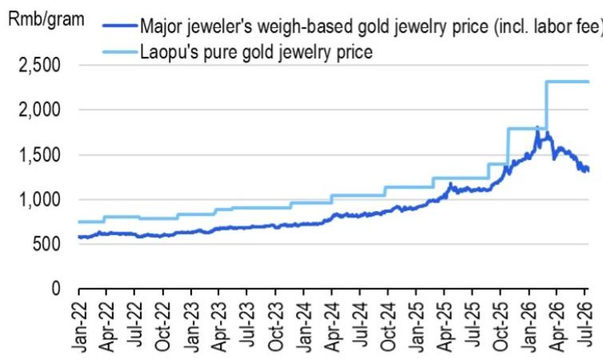
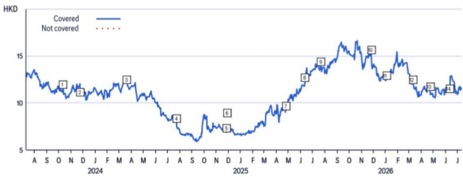

# Citi：中国珠宝零售金价调整下的K型6月与2Q26

中国珠宝零售在6月迎来一个微妙转折。国家统计局数据显示，6月金银珠宝零售额同比降幅收窄至3.4%，相比4月的-21.3%和5月的-8.9%明显改善。但这份Citi研报指出，改善并非全面回暖，而是被压抑的克重黄金需求集中释放的结果——6月金价环比下跌11%，跌幅远超前两个月的3%，这恰恰触发了消费者对按克计价产品的“底部观察”式购买。

与此同时，定价模式不同的品牌正在经历截然相反的处境。按克计价的周大福和六福在内地同店销售增速重回20%以上，而采用固定定价的老铺黄金，其产品相对于传统克重黄金的溢价在6月扩大至74%，反而面临更大的销售不确定性。Citi认为，老铺黄金二季度业绩存在节奏变化不确定性，但该季度也可能是其销售和盈利的底部。

> **KC评论：** 金价下跌对不同定价模式的影响并非线性。克重产品受益于“金价便宜了”的心理，固定定价产品则因溢价被动扩大而承压。这张图（图1和图2）直观展示了老铺黄金溢价率从约50%跳升至74%的过程，是理解本轮分化的关键。

## 1. 克重黄金的“报复性消费”背后是定价模式的结构性优势

4月和5月金价仅小幅回调时，消费者持币观望。6月金价加速下跌至月环比-11%，压抑了两个月的克重黄金需求集中释放。Citi认为，这一现象说明克重黄金产品在中国珠宝消费中仍占据主导地位——消费者对金价敏感，且倾向于在金价低点入场。

周大福的数据提供了佐证：4-5月内地同店销售增长20%，其中克重黄金增长35%，固定定价产品仅增长3%。香港和澳门市场同样呈现这一特征，克重黄金增速达57%，远超固定定价产品的20%。六福的1QFY27至今（4月1日至6月21日）内地同店销售增速也超过20%，高于4QFY26的约10%。

这意味着，在金价波动期，克重定价模式本身就是一个竞争壁垒。品牌能否将规模转化为对上游的议价能力、能否在终端维持合理的克重加价率，决定了其能否在这一轮需求释放中最大化收益。

## 2. 老铺黄金的溢价扩大至74%，短期承压但估值已反映悲观预期

老铺黄金的固定定价模式在6月金价加速下跌中面临独特挑战。Citi测算，其产品相对于传统克重黄金的溢价已从年初的约50%扩大至74%。溢价越高，消费者越容易产生“不划算”的感知，从而抑制购买意愿。

Citi因此下调了老铺黄金1H26E的收入和净利润预期，预计二季度收入约44亿元、净利润约10.5亿元，均低于此前预期。但报告同时强调，二季度可能是底部——老铺黄金当前估值对应2027年预期市盈率约8.7倍、股息率约8.6%，已计入较多悲观预期。

> **KC评论：** 老铺黄金的溢价扩大是金价下跌的直接结果，而非品牌主动提价。一旦金价企稳或回升，溢价率将自然收窄。Citi对其估值采用15倍2027年预期市盈率，较全球奢侈品同行22倍打了约30%折扣，理由是品牌历史和运营记录较短。这个折扣是否充分，取决于市场如何评估其长期品牌价值。

## 3. 周大福和六福受益于克重需求，但品牌转型才是估值重估的关键

周大福和六福是克重黄金需求复苏的直接受益者。周大福内地同店销售在4-5月恢复增长，香港和澳门增速更高。六福同样受益于人民币升值带来的更具吸引力的定价。

但Citi对周大福的关注点不止于短期销售。报告指出，如果管理层能在品牌转型中实现净利润率扩张目标，公司存在估值重估空间。周大福也是Citi中国消费团队筛选出的10只超跌大盘消费股之一。

对于六福，Citi认为其1QFY27至今的增速已超过4QFY26，且增长目标强于预期。两家公司共同的观察框架是：在金价波动期，克重定价模式提供了天然缓冲，但长期竞争力仍取决于品牌升级和运营效率。

## 4. 一个可复用的观察框架：金价方向决定定价模式优劣，但估值需考虑品牌溢价

这份报告提供了一个简洁但有效的分析框架：金价下跌时，克重定价品牌受益于需求释放；金价上涨时，固定定价品牌受益于库存升值和溢价收窄。读者需要判断的是金价的中期方向，以及不同品牌在各自定价模式下的运营效率。

Citi对中国珠宝品牌的排序是周大福优先于老铺黄金、再优先于六福。这一排序背后隐含的判断是：在当前金价波动环境下，克重定价的规模优势和品牌转型确定性，比固定定价的品牌溢价更具可预测性。

但报告也提醒，所有品牌都面临共同不确定性：金价剧烈波动、消费情绪受宏观环境影响、以及竞争格局的变化。这些因素决定了行业整体估值的天花板。

For informational purposes only. Portions may be generated,translated,summarized,or edited with AI assistance based on source materials and may contain omissions or errors. Please verify independently. This is not investment,legal,tax,accounting,or other professional advice.

For informational purposes only. Portions may be generated,translated,summarized,or edited with AI assistance based on source materials and may contain omissions or errors. Please verify independently. This is not investment,legal,tax,accounting,or other professional advice.

