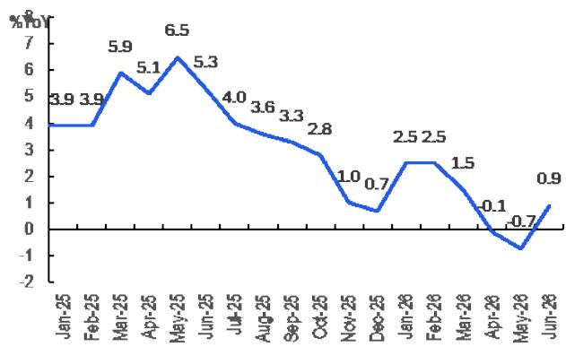

# 中国消费行业观察

## 核心观点

6月中国零售数据环比改善，对部分消费类公司保持短期积极观察

## 研究要点

我们观察到6月中国零售数据呈现环比改善趋势（社会消费品零售总额同比+1.0%；商品零售同比+0.9%；餐饮收入同比+1.2%，见图1），相较于5月数据（社会消费品零售总额同比-0.6%；商品零售同比-0.7%；餐饮收入同比+0.6%），市场对消费领域的关注度有所提升。尤其是在近期政策层面推出促消费相关措施后，部分资金开始重新关注消费板块。

研究团队近期对海底捞和李宁两家公司开启了短期积极观察。在消费类公司中，研究覆盖的10家大型消费公司包括：美的、安踏、李宁、周大福、蒙牛、海底捞、青岛啤酒、波司登、华润啤酒、万洲国际。

**关于李宁的短期观察**——自7月1日发布李宁二季度零售数据前瞻以来，通过与市场沟通，我们注意到市场对李宁下半年展望的预期已有所调整。积极的一面是，近期部分资金开始关注消费类公司。我们预计，随着促消费政策的推进，运动服饰板块的关注度有望提升。李宁是研究覆盖的10家大型消费公司之一。同时，从耐克最新季度数据来看，对李宁的影响偏中性至正面。目前研究团队对李宁的盈利预测低于市场一致预期。在运动服饰板块中，研究团队相对更偏好安踏。

**关于海底捞的短期观察**——受益于前四个月较好的翻台率表现，预计上半年翻台率同比小幅提升，好于市场此前预期的持平。6月整体翻台率同比略有下降，与多数零售公司的数据趋势一致。考虑到百胜中国二季度数据可能较为稳健，预计市场对餐饮板块的关注度将有所提升。海底捞也是研究覆盖的10家大型消费公司之一。

---

**图1. 中国餐饮收入同比变化**

© 2026 Citi Inc. 未经书面许可不得转载
*1-2月数据为合并公布
数据来源：国家统计局

**图2. 中国商品零售额同比变化**

© 2026 Citi Inc. 未经书面许可不得转载
*1-2月数据为合并公布
数据来源：国家统计局

**图3. 中国各类别零售额同比变化**

| %同比 | 2026年1-2月 | 2026年3月 | 2026年4月 | 2026年5月 | 2026年6月 |
|-------|-----------|----------|----------|----------|----------|
| 社会消费品零售总额 | 2.8 | 1.7 | 0.2 | (0.6) | 1.0 |
| 餐饮收入 | 4.8 | 2.9 | 2.2 | 0.6 | 1.2 |
| - 限额以上 | 2.5 | 1.2 | (4.9) | (5.2) | (2.2) |
| 商品零售 | 2.5 | 1.5 | (0.1) | (0.7) | 0.9 |
| - 饮料 | 6.0 | 8.2 | 3.6 | 6.1 | 5.8 |
| - 服装鞋帽 | 10.4 | 7.0 | 3.6 | 3.8 | 3.9 |
| - 金银珠宝 | 13.0 | 11.7 | (21.3) | (8.9) | (3.4) |
| - 家用电器 | 3.3 | (5.0) | (15.1) | (15.6) | (8.7) |
| - 化妆品 | 4.5 | 8.3 | 4.7 | 2.5 | 12.6 |
| - 烟酒 | 19.1 | 7.7 | 11.7 | 4.8 | 12.1 |
| - 日用品 | 6.6 | 4.6 | 3.5 | 1.6 | 3.9 |
| - 汽车 | (7.3) | (11.8) | (15.3) | (16.1) | (16.1) |
| - 粮油食品 | 10.2 | 9.5 | 4.1 | 1.9 | 7.9 |
| - 通讯器材 | 17.8 | 27.3 | 6.2 | 0.7 | 16.5 |
| - 家具 | 8.8 | (8.7) | (10.4) | (8.7) | (6.6) |
| - 文化办公用品 | 5.8 | 15.0 | (6.9) | (1.5) | 12.7 |
| - 石油及制品 | (9.7) | 0.1 | (6.5) | (3.2) | (5.1) |
| - 体育娱乐用品 | 4.1 | (2.0) | (8.0) | (8.0) | (2.2) |
| - 建筑及装潢材料 | (2.2) | (9.0) | (13.8) | (13.6) | (10.5) |

© 2026 Citi Inc. 未经书面许可不得转载
数据来源：国家统计局

---

## 文中提及公司

安踏体育(2020.HK) | 波司登(3998.HK) | 华润啤酒(0291.HK) | 周大福(1929.HK) | 海底捞(6862.HK) | 李宁(2331.HK) | 蒙牛(2319.HK) | 美的集团(000333.SZ) | 青岛啤酒(0168.HK) | 万洲国际(0288.HK) | 百胜中国(YUMC.N)
