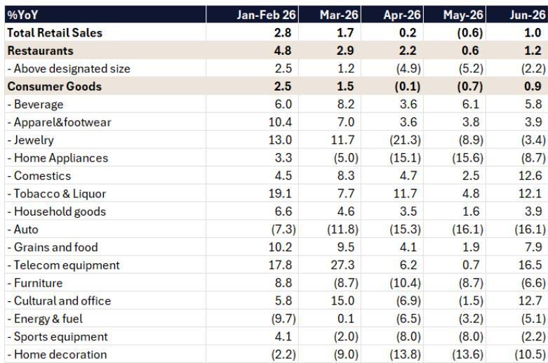
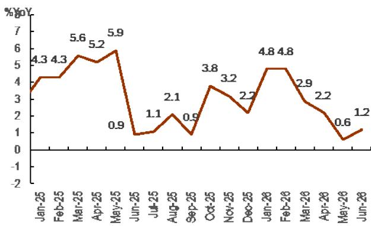

# Citi：Citi中国消费，6月零售环比改善，重申李宁海底捞短期正面

中国6月零售数据可能给市场带来一个短暂的喘息窗口。Citi在最新报告中预计，6月社会消费品零售总额同比增速将从5月的-0.6%回升至+1.0%，餐饮收入从+0.6%升至+1.2%，消费品零售从-0.7%升至+0.9%。这些数字本身并不惊艳，但方向性变化叠加近期促消费政策获批，正在推动资金在消费板块内重新布局。

这份报告的核心判断不是“消费复苏”，而是“预期差修复”。Citi认为，市场对部分消费公司的悲观预期已经过度反映在报价中，而6月数据改善和政策信号，可能触发一轮针对特定标的的短期情绪修复。报告为此新开了对李宁和海底捞的短期正面观察。

## 1. 李宁的悲观预期已经充分定价，边际变化可能被放大

Citi观察到，自7月1日发布李宁二季度零售销售预览以来，读者对该公司2026年下半年展望的预期已显著下调，包括管理层可能下调全年收入指引。这种预期下修本身，反而为后续超预期创造了空间。

报告指出，李宁的净利润预测目前比Visible Alpha的共识预期低8%至10%。这意味着市场已经消化了相当程度的谨慎信息。与此同时，耐克2026财年四季度业绩对李宁构成中性偏正的影响，而读者近期正在消费可选板块中寻找价值，包括百胜中国等标的。

Citi将李宁列入其10大首选消费大盘股名单，理由是估值具有吸引力，且市场情绪可能因政策催化而改善。关键在于，市场对李宁的定价已经反映了最差情景，任何边际改善都可能触发重新定价。

> **KC评论：** 这里容易被忽略的是，Citi对李宁的盈利预测本身就低于市场共识。这意味着该机构认为当前市场对李宁的盈利预期可能仍然偏高，但报价已经跌到了更低的位置。预期差的方向，比相对数字更重要。

## 2. 海底捞的翻台率改善是短期情绪修复的核心锚点

海底捞的短期正面观察，建立在更具体的运营数据之上。Citi预计，海底捞2026年上半年整体翻台率将实现低个位数的同比增长，好于市场此前预期的持平。这一判断基于4月至5月翻台率同比增长中个位数，以及6月虽然同比下滑1%至2%，但整体趋势仍优于多数中国零售商。

报告特别提到，百胜中国即将于7月30日发布的二季度业绩可能表现强劲，这有望带动整个餐饮板块的情绪回暖。海底捞作为Citi10大首选消费股之一，其估值同样被列为具有吸引力。

翻台率是餐饮行业最核心的运营指标，它直接反映门店客流和产能利用率。海底捞能在行业整体承压的背景下实现翻台率同比改善，说明其品牌力和运营效率仍具韧性。Citi选择在此时开仓短期正面观察，赌的是数据改善叠加板块轮动带来的共振。

## 3. 消费板块内部正在发生资金轮动，政策是催化剂而非基本面拐点

报告反复提及一个背景：读者近期正在消费可选板块中寻找价值。这与7月13日批复的“十五五”促消费规划形成呼应。Citi认为，这一政策信号虽然不改变消费的基本面斜率，但足以成为资金重新配置的触发点。

从Citi列出的10大首选消费大盘股来看，覆盖了家电（美的）、运动服饰（安踏、李宁）、珠宝（周大福）、乳业（蒙牛）、餐饮（海底捞）、啤酒（青岛、华润）、羽绒服（波司登）和肉制品（万洲国际）。这个组合说明，Citi认为消费板块的机会不是整体性的，而是集中在那些估值已充分调整、品牌力强、且能受益于政策边际放松的头部公司。

值得注意的是，报告对运动服饰板块的内部排序仍然是安踏优于李宁。这意味着即便对李宁开了短期正面观察，Citi在中期维度上仍更看好安踏的基本面。短期情绪修复和中期基本面排序，是两套不同的逻辑。

## 4. 数据改善的可持续性仍需验证，但方向比幅度重要

6月零售数据环比改善，但相对增速仍然偏低。从Citi提供的细分品类数据看，服装鞋帽同比增长3.9%，化妆品增长12.6%，烟酒增长12.1%，这些可选品类表现相对亮眼。但汽车零售同比下降16.1%，家电下降8.7%，家具下降6.6%，这些耐用品类依然承压。

这种分化说明，消费的改善并非全面开花，而是集中在高频、低客单价、有品牌溢价的品类。餐饮收入的改善幅度（+1.2%）虽然不大，但考虑到5月仅增长0.6%，方向性变化对市场情绪的边际影响可能超过数字本身。

Citi的策略是：在数据改善和政策催化共振的窗口期，选择那些预期已经充分下修、估值有安全边际的公司，做短期情绪修复的交易。这不是对消费基本面的全面看多，而是在悲观定价中寻找定价错误。

> **KC评论：** 消费板块的研究逻辑正在从“总量判断”转向“公司博弈”。6月数据改善的幅度不足以支撑行业整体反转，但足以让那些被过度抛售的公司获得喘息。Citi的框架提醒我们：当市场对某只公司的预期已经低到不能再低时，任何不坏的消息都可能是好消息。

For informational purposes only. Portions may be generated,translated,summarized,or edited with AI assistance based on source materials and may contain omissions or errors. Please verify independently. This is not investment,legal,tax,accounting,or other professional advice.

For informational purposes only. Portions may be generated,translated,summarized,or edited with AI assistance based on source materials and may contain omissions or errors. Please verify independently. This is not investment,legal,tax,accounting,or other professional advice.

