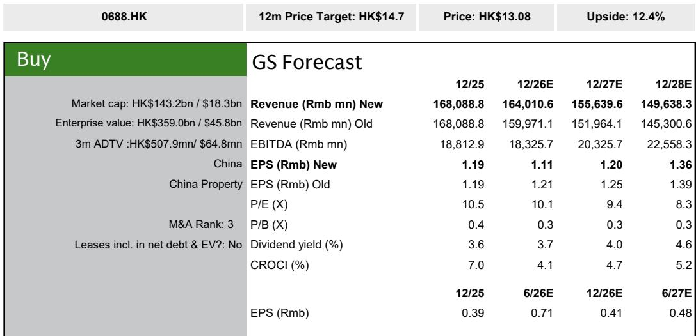
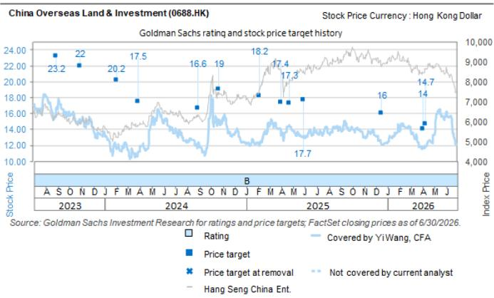

# China Overseas Land & Investment: Margin Compression Is Real, but the Market Is Overpricing the Impairment Risk

China Overseas Land & Investment (COLI) delivered a first-half 2026 contract sales increase of 12 percent year on year to RMB 134 billion, outperforming the flattish average among its state-owned enterprise peers. Yet the company's share price trades at a 17 percent discount to end-2026 net asset value and at 0.4 times 2026 estimated price-to-book, a valuation that embeds expectations of impairment losses more severe than any SOE developer in its coverage group. That discount is unjustified. COLI holds the highest-quality landbank among its peers, with over 80 percent exposure to tier-1 and tier-2 cities and the lowest aged inventory ratio in the coverage universe. The market is pricing in a worst-case scenario that the company's asset quality does not support.

The tension is straightforward. On one side, the company's development property gross margin is expected to compress to approximately 14 percent in 2026, down roughly one percentage point year on year, as pricing weakness persists outside top-tier cities. On the other side, COLI's cumulative inventory write-downs as a share of total inventory balance rank the lowest among SOE developers covered by a global investment bank. The market appears to conflate sector-wide margin pressure with company-specific impairment risk. The two are not the same. Margin compression is a cyclical headwind that affects all developers. Impairment risk is a function of landbank quality, inventory age, and acquisition discipline. On all three metrics, COLI is the strongest in its peer group.

The investment case rests on a simple proposition: the valuation already discounts the worst of the margin cycle, while the company's structural advantages—prime-location landbank, disciplined land acquisition, and sector-leading sales momentum—are being ignored. For investors willing to look through the next twelve months of earnings pressure, the risk-reward is asymmetric.

## COLI's First-Half 2026 Sales Performance Proves Its Landbank Strategy Is Working

The 12 percent year-on-year growth in first-half 2026 contract sales was not a function of broad market recovery. It was driven by concentrated strength in high-end and luxury projects with prime locations in tier-1 cities. This is not a coincidence. COLI has deliberately built its landbank around the most resilient demand segments in China's property market: luxury residential in Shanghai, Beijing, Guangzhou, and Shenzhen. These projects sell through at higher prices and faster rates than mass-market developments in lower-tier cities, where price weakness is most acute.

The sales result matters for two reasons. First, it demonstrates that COLI's asset allocation strategy is delivering tangible market share gains. While the broader SOE developer coverage group saw flat sales, COLI grew. That divergence is likely to persist. As liquidity pressure continues to weigh on privately owned developers, COLI's balance sheet strength allows it to capture market share from weaker competitors. Second, the composition of sales matters for future revenue recognition. Luxury projects carry higher margins. Even as the blended development property gross margin declines to 14 percent in 2026, the margin on recently acquired tier-1 projects is estimated at approximately 29 percent at the project level, five percentage points above the tracked developer average. As these projects move through the revenue recognition pipeline, they will provide a natural margin stabilizer.

The implication is clear: COLI's sales momentum is not a cyclical fluke. It is the output of a landbank strategy that positions the company in the most defensible segments of the market. Investors who focus only on the headline margin decline miss the compositional shift that is already underway.

## The Margin Compression Story Is Real but Concentrated Outside Tier-1 Cities

Development property gross margin is expected to decline to approximately 14 percent in 2026, closer to the midpoint of management's beginning-of-year guidance range of 13 to 15 percent. This represents roughly a one-percentage-point year-on-year decline. The driver is not margin deterioration in COLI's core tier-1 projects. It is the continued pricing weakness in tier-2 and tier-3 cities, where COLI also has exposure.

The nuance matters. COLI's tier-1 projects, particularly the luxury segment, are holding pricing power. The pressure is coming from the remainder of the portfolio. This is a margin mix problem, not a company-wide impairment signal. The distinction is critical for valuation. If the market treats the entire margin decline as evidence of generalized asset quality deterioration, it will overestimate impairment risk. COLI's cumulative write-down ratio, the lowest among SOE peers, suggests that management has been conservative in its accounting but that actual realized impairments have been limited.

The earnings trajectory reflects this. Core earnings per share for 2026 are expected to decline by approximately 6 percent, followed by a recovery from 2027 as margins stabilize. The one-year earnings dip is a function of timing: lower-margin projects from the 2022-2023 acquisition cycle are being recognized in revenue, while higher-margin tier-1 projects from more recent acquisitions have not yet entered the revenue recognition pipeline. This is a mechanical, predictable pattern. It is not a structural deterioration.

For investors, the question is whether they are willing to accept a transitory earnings decline in exchange for a recovery that is already visible in the project-level margin data. The answer depends on their time horizon, but the data supports the view that the trough is near.

## Land Acquisition Discipline Creates a Natural Hedge Against Overpaying for Growth

COLI's first-half 2026 land investment accounted for only a high-single-digit percentage of contract sales, well below the approximately 50 percent level in fiscal 2025 and the 40 percent estimate for full-year 2026. At first glance, this appears concerning. A developer that does not replenish its landbank risks running out of saleable inventory in future years.

The concern is valid but overstated. COLI's land acquisition pace in the first half was deliberately conservative, not forced. The company is not capital-constrained. Its balance sheet is among the strongest in the sector. The decision to slow land purchases reflects a strategic choice to wait for better risk-adjusted opportunities, not an inability to transact. The project-level gross margin on new land acquisitions in the first half was approximately 29 percent, five percentage points above the tracked developer average. This is not a company that is being priced out of the market. It is a company that is exercising discipline in a market where many developers are overpaying for subprime locations.

The second-half outlook for land acquisition is likely to re-accelerate. The company has the balance sheet capacity, and management has signaled that it will deploy capital when it sees appropriate risk-return profiles. The key catalyst to watch is whether COLI re-enters the land market at scale in the second half of 2026. If it does, it will signal confidence in the margin outlook for new projects. If it does not, it will signal that management sees further downside risk in land prices. Either way, the company is positioned to act from a position of strength, not weakness.

The implication for investors is that land acquisition discipline, combined with strong sales momentum, creates a natural hedge. COLI is not forced to grow for growth's sake. It can wait for the right opportunities. This is a luxury that most developers in the sector do not have.

## A Decision Framework for Evaluating COLI's Risk-Reward Profile

For institutional investors evaluating COLI, the decision framework should center on three variables: the trajectory of tier-1 city pricing, the pace of land acquisition in the second half of 2026, and the outcome of the upcoming first-half 2026 earnings call regarding inventory impairment guidance.

First, tier-1 city pricing is the single most important determinant of COLI's margin trajectory. If luxury residential prices in Shanghai and Beijing stabilize or appreciate, COLI's blended gross margin will stabilize faster than current estimates suggest. If they weaken, the margin trough will be deeper and longer. The first-half sales data, which showed strong sell-through of high-end projects, supports the view that tier-1 pricing is resilient. But this is not a given. Investors should monitor monthly sales data for COLI's flagship projects, particularly the Yujinlu project in Shanghai, as a real-time indicator of pricing power.

Second, the pace of land acquisition in the second half of 2026 will signal management's view on the margin cycle. If COLI re-accelerates land purchases, it will indicate that management sees current land prices as attractive relative to long-term margin expectations. If it remains conservative, it will suggest that management expects further margin compression before the cycle turns. Either outcome is informative. The current expectation of 40 percent land investment relative to contract sales for full-year 2026 suggests a material acceleration from the first-half pace, but this is an estimate, not a commitment.

Third, the first-half 2026 earnings call will be the most important event for near-term sentiment. Management's guidance on inventory impairment and profitability will either confirm or refute the market's worst-case assumptions. Given that COLI's cumulative write-down ratio is the lowest among SOE peers, any indication that management sees limited need for further impairment would be a powerful catalyst. Conversely, if management signals a more cautious outlook, the stock's valuation discount may widen further before it narrows.

The framework is simple: if tier-1 pricing holds, COLI re-accelerates land acquisition, and management provides constructive impairment guidance, the current valuation discount is likely to narrow. If any of these three variables disappoints, the stock may remain range-bound until the margin recovery becomes visible in reported earnings.

## The Valuation Discount Creates a Margin of Safety That Few Peers Offer

COLI trades at a 17 percent discount to end-2026 net asset value, compared to an SOE developer coverage average of 34 percent. It trades at 0.4 times 2026 estimated price-to-book, versus the peer average of 0.5 times. Its average dividend yield of 4 percent for 2026 through 2028 is double the SOE coverage average of 2 percent. These are not distressed valuations. They are valuations that price in a significant impairment scenario that the company's asset quality does not support.

The key risk to the investment case is that sales and margin miss current estimates, or that lower-than-expected land banking scale hampers longer-term growth. Both risks are real. The margin miss risk is the more immediate concern, given the ongoing pricing weakness outside tier-1 cities. But the land banking risk is mitigated by COLI's balance sheet strength and its demonstrated ability to re-accelerate acquisition when management chooses to do so.

The more important risk is the one the market is overweighting: impairment. COLI's low cumulative write-down ratio, combined with its high-quality landbank, suggests that the market is extrapolating sector-wide distress onto a company that is structurally less exposed to it. As the margin cycle turns and earnings recover from 2027 onward, the valuation discount is likely to narrow.

For investors with a twelve-month horizon, the entry point is attractive. The stock offers a 12.4 percent dividend yield and a balance sheet that allows management to be patient. The margin cycle will eventually turn. When it does, COLI is positioned to benefit more than any of its SOE peers.

*For informational purposes only. Portions may be generated, translated, summarized, or edited with AI assistance based on source materials and may contain omissions or errors. Please verify independently. This is not investment, legal, tax, accounting, or other professional advice.*

For informational purposes only. Portions may be generated, translated, summarized, or edited with AI assistance based on source materials and may contain omissions or errors. Please verify independently. This is not investment, legal, tax, accounting, or other professional advice.

