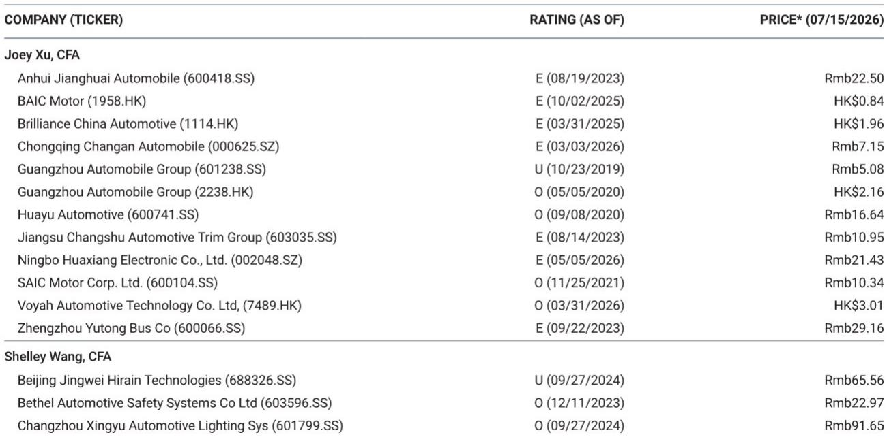

# MS：中国汽车共享出行-社保从严征缴，重估隐藏成本

2026年7月起，社保征收全面移交税务部门，长三角汽车零部件企业首当其冲。MS最新研究认为，这一政策变化对汽车行业的影响可能被市场低估——它不只是企业端的成本不确定性，还会通过压低居民可支配收入，间接影响大众市场汽车消费。

报告的核心判断是：社保从严征缴将从两个方向同时影响汽车行业——企业利润和家庭购买力。而市场目前只关注了前者。

## 1. 长三角才是真正的不确定性测试区，不是东北

市场普遍将社保产品不确定性与东北地区挂钩，但MS指出，对汽车行业而言，长三角才是今年最需要关注的区域。这里是汽车零部件的产业腹地，也是社保从严征缴最先落地的地区之一。

报告通过渠道调研发现，从2026年7月起，长三角企业将被要求按员工实际工资缴纳社保，而非此前的最低基数。这意味着，那些过去按最低基数缴纳的企业，将面临劳动力成本的一次性抬升。

关键变量在于“缴费基数缺口”——即实际工资与当地社保缴费下限之间的差距。上海缴费下限为每月7500元，平均工资约12400元，差距相对有限。但江苏下限约4800元，浙江约5000元，与一线工人实际工资的差距更大。报告估算，这一缺口可能导致雇主劳动力成本上升约25%，员工到手收入减少约10%。

> **KC评论：** 长三角汽车零部件企业密集，且过去不少企业按最低基数缴纳。政策一旦严格执行，成本冲击的集中度可能远超市场预期。读者需要关注的不是政策本身，而是各地执行节奏和基数差异带来的结构性分化。

## 2. 经销商和劳动密集型零部件商最脆弱，芯片和软件相对免疫

报告对汽车产业链各环节的冲击做了分层。最脆弱的环节是汽车经销商——净利率仅1-2%，新车销售已处于亏损状态，利润完全依赖售后和资金服务。经销商员工底薪低、佣金高、人数多，社保从严将直接侵蚀本已微薄的利润。

零部件领域，线束、内饰、座椅、冲压件等劳动密集型环节受影响最大。这些环节用工量大，且大量使用第三方劳务派遣，派遣成本本就比直接雇佣高30-40%。相比之下，芯片、域控制器、ADAS软件等自动化程度高、人均营收高的环节，受影响相对有限。

报告还提到一个容易被忽视的细节：税务部门已建立三套数据的交叉核验机制——员工人数与税务申报、缴费基数与申报工资、企业所得税工资总额与个税和社保总额。从7月起，这一核验已从年度抽样转为实时比对。这意味着，过去“钻空子”的空间正在消失。

## 3. 大众市场汽车消费可能承压，但长期有对冲机制

社保从严征缴对汽车需求的间接影响，可能比直接成本冲击更值得关注。报告指出，受影响最集中的是月收入5000-10000元的蓝领工人，他们恰恰是大众市场车型的核心购买群体。汽车作为高弹性可选消费品，对可支配收入变化最为敏感。

但报告也指出一个长期对冲因素：社保缴纳增加意味着未来养老金和医疗保障的提升，理论上会降低预防性储蓄动机。不过，这一传导链条需要时间，短期内难以对冲消费调整的不确定性。

对汽车行业而言，2026年下半年到年底可能是不确定性逐步显现的阶段。报告认为，三季度起成本将逐步浮出水面，年底在严格执行的省份可能迎来另一个不确定性高点。部分企业从二季度起已开始提前确认增量社保费用，说明行业对这一变化的准备比市场预期的更早、更充分。

For informational purposes only. Portions may be generated,translated,summarized,or edited with AI assistance based on source materials and may contain omissions or errors. Please verify independently. This is not investment,legal,tax,accounting,or other professional advice.

For informational purposes only. Portions may be generated,translated,summarized,or edited with AI assistance based on source materials and may contain omissions or errors. Please verify independently. This is not investment,legal,tax,accounting,or other professional advice.

