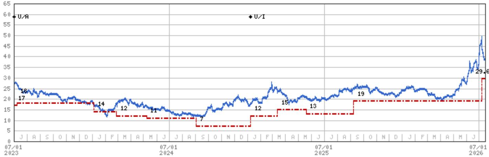
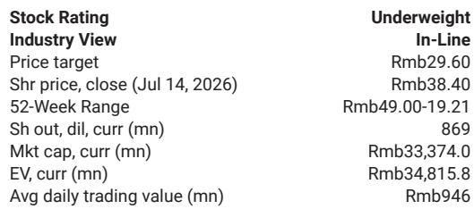
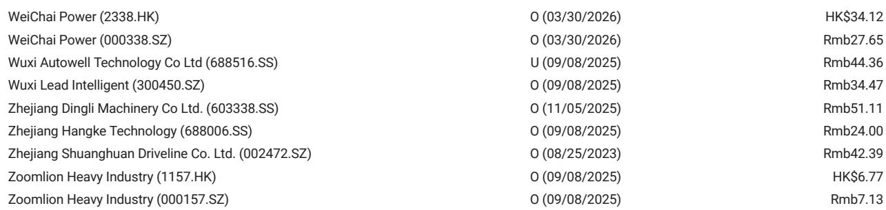

# MS：埃斯顿自动化2Q26初步业绩超预期但低于MS预测

这份MS关于埃斯顿自动化（002747.SZ）的初步业绩点评，表面上是一个“超预期”的故事。公司预告2026年上半年净利润1.5亿至1.8亿元，较去年同期的700万元大幅扭亏。但细读报告会发现，真正值得关注的不是数字本身，而是盈利的构成和可持续性。

报告明确指出，二季度净利润中位数约6700万元，虽然高于市场一致预期，却低于MS自己的预测。更关键的是，增长驱动因素并非来自核心业务的量价齐升，而是产品结构改善带来的毛利率提升，以及一笔来自南京化纤重组的公允价值收益。后者是一次性项目，并不反映经营常态。

这份业绩预告并没有改变分析师对基本面的判断。市场需要区分“报表盈利”和“经营盈利”。

## 1. 扣非利润转正，但相对值仍处低位

报告披露了更接近经营实质的数据：2026年上半年扣非净利润预计6000万至7500万元，中位数对应二季度约4800万元，同比扭亏，环比增长149%。这个数字虽然方向正确，但放在公司近900亿元的市值体量下，盈利规模仍然偏薄。

MS在估值方法中，对核心业务采用了50倍2027年预期市盈率，低于公司历史两年远期平均65倍。理由是利润率偏低，且人形机器人业务需要单独估值。这意味着，即便业绩改善，市场给予的估值倍数也在调整。

> **KC评论：** 扣非利润转正是一个积极信号，但读者需要关注的是盈利的相对水平和增速是否足以支撑当前估值。报告隐含的逻辑是，当前报价已经包含了较多乐观预期。

## 2. 人形机器人业务是估值分歧的核心

报告将人形机器人业务单独估值，采用15倍2028年预期销售收入，对应约6.8亿元收入预测。这个倍数低于领先人形机器人代工厂商约20倍的平均水平，理由是埃斯顿规模较小、市场份额有限。

这一估值安排揭示了一个关键矛盾：市场对埃斯顿的想象空间很大程度上来自人形机器人，但MS认为，公司在产业链中的位置和竞争实力，尚不足以支撑更高的估值溢价。如果人形机器人业务进展慢于预期，或者竞争格局出现变化，当前报价的支撑将变得脆弱。

## 3. 不确定性清单指向行业周期与竞争不确定性

报告列出的节奏变化不确定性包括：中国工业机器人市场仍在调整、价格竞争加剧、先进制造业资本开支减速。这些都不是公司层面的偶发因素，而是行业结构性挑战。

埃斯顿的产品结构正在向大负载工业机器人倾斜，这有助于提升毛利率，但也意味着客户集中度和项目制不确定性可能上升。在整体工业机器人市场增速节奏变化的背景下，市场份额的扩张能否持续，是判断公司中期盈利能力的关键变量。

**一份业绩预告超预期，本身就说明问题。** 对于关注工业自动化和机器人赛道的读者，这份报告提供了一个观察框架：区分一次性收益与经常性盈利，区分市场想象与估值纪律，区分行业趋势与公司个体表现。这些维度，比单季度的利润数字更能决定长期回报。

For informational purposes only. Portions may be generated,translated,summarized,or edited with AI assistance based on source materials and may contain omissions or errors. Please verify independently. This is not investment,legal,tax,accounting,or other professional advice.

