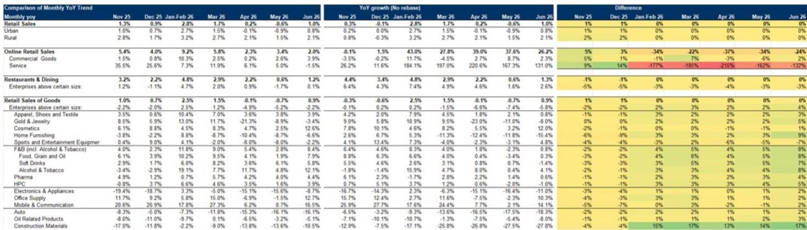
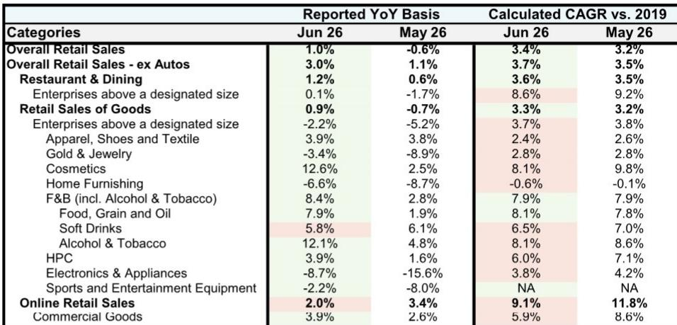
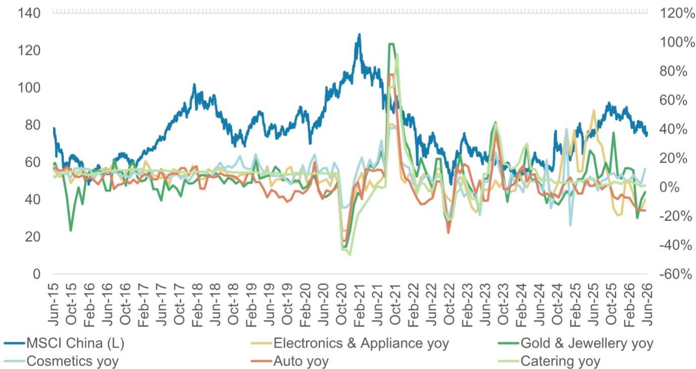

# MS：中国香港消费-中国零售销售-6月动能仍不均

6月零售数据超预期转正，但MS这份报告真正想传递的信号，藏在数字的“形状”里。整体零售同比增速从5月的-0.6%回升至1.0%，高于市场预期的-0.1%。如果只看这个数字，很容易得出“消费正在加速修复”的结论。但报告用更细致的拆解提醒：修复是真实的，但路径并不平坦，结构分化才是当前阶段的核心特征。

端午假期错位和低基数贡献了部分改善，剔除汽车后的零售增速为3.0%，以2019年为基准的年复合增速仅从3.2%微升至3.4%。消费的“温度”在回升，但“力度”仍有限。报告同时指出，7月暑期出行和天气扰动将成为新的观察变量。

## 1. 化妆品和烟酒是6月最亮眼的两个“意外”，但驱动逻辑完全不同

化妆品零售同比增速从5月的2.5%跳升至12.6%，成为所有品类中改善幅度最大的。报告明确归因于补贴效应和618购物节促销活动的叠加。烟酒类同样录得12.1%的同比增长，显著高于5月的4.8%，但背后是去年同期的低基数——去年6月对公务娱乐活动管控收紧，形成了较低的对比基准。

这两个品类的“高增长”指向不同的观察框架：化妆品更多反映短期政策推动和电商节奏的集中释放，烟酒则更多是基数效应下的技术性反弹。两者都不宜直接外推为消费意愿的系统性回升。

> **KC评论：** 化妆品的高增速尤其值得关注，因为它同时叠加了“补贴”和“618”两个一次性因素。如果剔除这些，真实的消费动能可能比表面数字温和。报告没有直接给出“剔除补贴后的增速”，但读者在解读后续月份数据时，需要留意这种“脉冲式增长”的可持续性。

## 2. 必选消费全面改善，但可选消费的“跌幅收窄”才是更关键的信号

食品饮料类增速从2.8%回升至8.4%，其中粮油食品从1.9%升至7.9%，日用品从1.6%升至3.9%。必选消费的改善覆盖面广且幅度均匀，说明基础性消费需求并未出现变化。

更值得关注的是可选消费的表现。黄金珠宝从-8.9%收窄至-3.4%，家电音像从-15.6%收窄至-8.7%，家具从-8.7%收窄至-6.6%，体育娱乐用品从-8.0%收窄至-2.2%。所有可选品类都在改善，但无一转正。这种“跌幅收窄但未翻正”的状态，报告认为部分受益于去年高基数效应的消退，尤其是补贴退坡后的对比基数变化。

可选消费的“集体收窄”是一个积极信号，但它更多反映的是“最差的时候可能已经过去”，而非“需求正在强劲反弹”。对于依赖可选消费的行业和公司而言，判断拐点是否到来，还需要观察7-8月数据能否延续这一改善趋势。

## 3. 线上增速节奏变化，618的“虹吸效应”正在改变月度节奏

线上零售增速从5月的3.4%降至2.0%，与整体零售的改善形成反差。报告给出的解释是：今年618购物节启动更早，部分需求被提前至5月释放。这意味着5月的线上高增速和6月的节奏变化，本质上是一个“时间错配”问题，而非线上消费动能的实质性衰减。

这一现象对零售企业的运营节奏有直接影响。如果618的促销周期持续前移，那么“6月数据”作为消费旺季的代表性正在减弱，5-6月的合并数据可能比单月数据更有参考价值。报告没有直接给出这一判断，但从其提供的同比和环比数据对比中可以清晰看到这种节奏变化。

## 4. 消费修复的“形状”比“方向”更重要

综合来看，MS这份报告的核心判断是：消费在修复，但修复是渐进且颠簸的。报告引用的最新消费者调查显示，消费情绪仍然偏软。这意味着，当前的数据改善更多来自政策推动、节日效应和基数调整等“外生力量”，而非消费者信心的内生修复。

对于产业决策者而言，真正需要关注的不是“6月是否转正”，而是“哪些品类的改善具有可持续性”。化妆品和烟酒的高增长需要谨慎解读，必选消费的稳定是基本盘，可选消费的跌幅收窄是观察窗口。而线上消费的节奏变化，则提示市场需要调整对月度数据的解读框架。

报告在最后给出了具体的关注方向：质量价值股、有公司自身驱动因素的转折机会、以及供给再平衡与需求改善的组合。这些选择背后隐含的判断是：在整体消费修复路径不平坦的环境下，公司和细分赛道的分化将比宏观数字更具研究参考意义。

For informational purposes only. Portions may be generated,translated,summarized,or edited with AI assistance based on source materials and may contain omissions or errors. Please verify independently. This is not investment,legal,tax,accounting,or other professional advice.

For informational purposes only. Portions may be generated,translated,summarized,or edited with AI assistance based on source materials and may contain omissions or errors. Please verify independently. This is not investment,legal,tax,accounting,or other professional advice.

