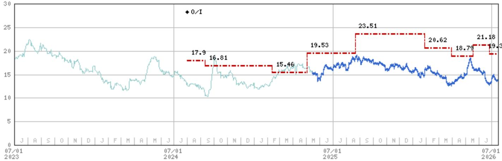
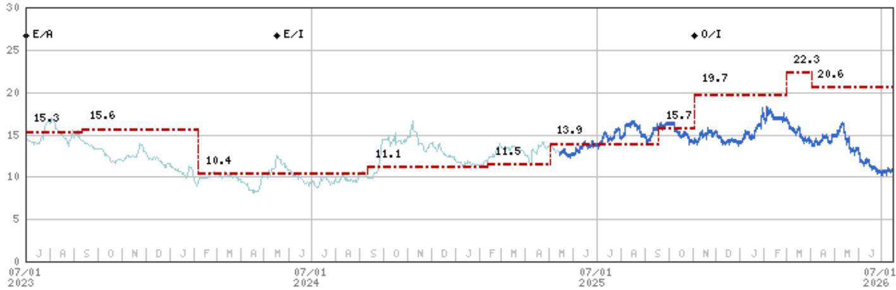

July 15, 2026 04:03 AM GMT

China Property | Asia Pacific

# Property Data Showed Broad Moderation in June

Home sales continued to moderate in June, following a reversal of the earlier trend since May, amid softer home prices and construction activity. We expect the ongoing adjustment in secondary home sales to contribute to a gradual price adjustment in 3Q, while developers' cautious approach to landbanking may influence real estate investment.

Sales moderation deepened in June, in line with our expectations. Rebased national sales fell 13.9% year-on-year by value and 14.3% year-on-year by volume (May: -9.3% and -13.2%), bringing 6M26 year-to-date sales declines to 13.6% by value and 11.6% by volume. The NBS 70-city home price index continued to edge lower at a steady pace, with primary market prices down 0.2% month-on-month and secondary market prices down 0.3% month-on-month in June. Tier-1 cities recorded milder home price changes, +0.1% in primary and +0.3% in secondary (May: +0.2 and +0.4%) amid softening secondary sales.

Construction activity moderated further: New starts fell 26% year-on-year and completions fell 25% year-on-year in June, widening the 6M26 declines to 23% and 24%, respectively. Combined with the smaller construction scale, the decline in real estate investment deepened to 18.0% year-on-year in 6M26 (5M26: -16.2%). We expect construction activity to remain subdued in 2H, as developers remain cautious on landbanking (land purchase by the top 100 developers fell ~40% year-on-year in 6M26), posing downside risk to our full-year forecasts.

Weaker home sales likely in 3Q: Real-time secondary home sales in higher-tier cities remain soft, reaching MSD% year-on-year in the latest week (May: 26%; June: 10%). Given still-muted home purchase intentions, fading policy effect/pent-up demand, and reduced pipeline of saleable inventory, we expect secondary home sales to turn negative year-on-year, and primary home sales to decline further year-on-year in 3Q despite a low base. This could prolong the K-shaped home price trend, with prices continuing to adjust month-on-month across most markets, potentially at a faster pace in 3Q, while some Tier-1 cities may sustain modest price gains given better demand/supply dynamics.

Stay selective: Considering the near-term headwinds, limited policy upside from July's Politburo meeting, and continued fund flow disruption, we recommend staying prudent, and continue to favor quality players with credible self-help alpha. We think CR Land (1109.HK), C&D (1908.HK), and Seazen (601155.SS/1030.HK) offer more attractive risk-reward at current valuations.

Exhibit 1: Rebased NBS 6M26 property data summary

<table><tr><td></td><td>Unit</td><td>YTD 2026</td><td>YTD 2025</td><td>YoY</td><td>2026-06</td><td>2025-06</td><td>MoM</td><td>YoY</td><td>2026-05</td><td>2025-05</td><td>YoY</td></tr><tr><td>Total sales value</td><td>(Rmb bn)</td><td>3,795</td><td>4,392</td><td>-13.6%</td><td>858</td><td>997</td><td>34.8%</td><td>-13.9%</td><td>637</td><td>702</td><td>-9.3%</td></tr><tr><td>Residential sales value</td><td>(Rmb bn)</td><td>3,327</td><td>3,855</td><td>-13.7%</td><td>749</td><td>854</td><td>31.0%</td><td>-12.3%</td><td>572</td><td>621</td><td>-8.0%</td></tr><tr><td>Total GFA sold</td><td>(mn sqm)</td><td>401</td><td>454</td><td>-11.6%</td><td>88</td><td>103</td><td>45.5%</td><td>-14.3%</td><td>61</td><td>70</td><td>-13.2%</td></tr><tr><td>Residential GFA sold</td><td>(mn sqm)</td><td>333</td><td>380</td><td>-12.4%</td><td>73</td><td>84</td><td>41.2%</td><td>-13.5%</td><td>52</td><td>58</td><td>-11.7%</td></tr><tr><td>Total RE investment</td><td>(Rmb bn)</td><td>3,807</td><td>4,643</td><td>-18.0%</td><td>772</td><td>1,021</td><td>20.8%</td><td>-24.4%</td><td>639</td><td>845</td><td>-24.4%</td></tr><tr><td>Residential RE investment</td><td>(Rmb bn)</td><td>2,930</td><td>3,564</td><td>-17.8%</td><td>587</td><td>789</td><td>18.4%</td><td>-25.5%</td><td>496</td><td>651</td><td>-23.8%</td></tr><tr><td>Total GFA started</td><td>(mn sqm)</td><td>232</td><td>303</td><td>-23.4%</td><td>53</td><td>72</td><td>31.8%</td><td>-26.0%</td><td>40</td><td>53</td><td>-24.6%</td></tr><tr><td>Residential GFA started</td><td>(mn sqm)</td><td>169</td><td>223</td><td>-24.1%</td><td>38</td><td>52</td><td>26.1%</td><td>-26.4%</td><td>30</td><td>39</td><td>-22.7%</td></tr><tr><td>Total GFA completion</td><td>(mn sqm)</td><td>172</td><td>226</td><td>-23.7%</td><td>31</td><td>42</td><td>42.4%</td><td>-25.0%</td><td>22</td><td>28</td><td>-20.0%</td></tr><tr><td>Residential GFA completion</td><td>(mn sqm)</td><td>121</td><td>163</td><td>-25.3%</td><td>21</td><td>29</td><td>40.8%</td><td>-26.7%</td><td>15</td><td>19</td><td>-20.2%</td></tr></table>

Source: NBS, CEIC, MS

MS ASIA LIMITED+

Stephen Cheung, CFA
Equity Analyst
Stephen.Cheung@morganstanley.com

+852 3963-0385

Cara Zhu
Equity Analyst
Cara.Zhu@morganstanley.com +852 2848-7117

Asia Summer School 2026

## CHINA PROPERTY

Asia Pacific
Industry View In-Line

## Related reports:

1. An Inflection or Another False Start? (18 May 2026)

2. Weakening Indicators may Lead to Faster Home Price Declines (1 July 2026)

3. Our Thoughts after Recent Industry Underperformance (25 June 2026)

4. Managed Housing Downcycle to Last Another Two Years (25 January 2026)

5. 2026 Outlook: Physical Market Stays Challenging; Diverging Outperformance of Alpha Plays (10 December 2025)

MS does and seeks to do business with companies covered in MS. As a result, investors should be aware that the firm may have a conflict of interest that could affect the objectivity of MS. Investors should consider MS as only a single factor in making their investment decision.

## For analyst certification and other important disclosures, refer to the Disclosure Section, located at the end of this report.

+= Analysts employed by non-U.S. affiliates are not registered with FINRA, may not be associated persons of the member and may not be subject to FINRA restrictions on communications with a subject company, public appearances and trading securities held by a research analyst account.

## Valuation Methodology and Risks

## Seazen Group Ltd (1030.HK)

Our HK\$4.80/share 2026e NAV comprises HK\$3.75 of development properties (DCF, 9.0% WACC), HK\$8.93 of investment properties (cap rate 6-9%) and HK\$7.88 of net debt. To this we apply a 40% discount based on our developers' scorecard, comprising landbank (with a 5/10 score), execution (7), scale (6), growth (5), profitability (6), financing (7) and leverage (7). We use 30-45% discounts in our coverage.

## Risks to Upside

■ Stronger-than-expected contracted sales

■ Stronger-than-expected new IP launches and IP operation

■ Faster-than-expected land acquisition

## Risks to Downside

■ Weaker-than-expected contracted sales growth

■ Faster-than-expected margin compression

■ Weaker rental growth

## China Resources Land Ltd. (1109.HK)

Our HK\$60.88/share 2026e NAV comprises HK\$15.62 of development properties (DCF, 8.0% WACC), HK\$55.22 of investment properties (cap rate 5-8%) and HK\$9.96 of net debt. To this we apply a 30% discount based on our developers' scorecard, comprising landbank (with a 8/10 score), execution (8), scale (9), growth (8), profitability (8), financing (10) and leverage (10). We use 30-45% discounts in our coverage.

## Risks to Upside

■ Stronger-than-expected contracted sales.

■ Accelerated openings of new malls.

## Risks to Downside

■ Weaker-than-expected contracted sales.

■ Slower-than-expected openings of new shopping malls.

## C&D International Investment Group Ltd (1908.HK)

Our HK\$29.69/share 2026e NAV comprises HK\$32.49/share of development properties (DCF, 8.2% WACC), HK\$0.93/share of other business and HK\$3.73/share of net debt. To this we apply a 35% discount based on our developers' scorecard, comprising landbank (with a 8/10 score), execution (8), scale (8), growth (8), profitability (7), financing (9), and leverage (8). We use 30-45% discounts in our coverage.

## Risks to Upside

■ Stronger-than-expected contracted sales.

■ Stronger-than-expected gross margin.

## Risks to Downside

■ Weaker-than-expected gross margin.

■ Slower-than-expected land acquisitions.

## Seazen Holdings Company Ltd. (601155.SS)

Our Rmb35.84/share 2026e NAV comprises Rmb15.70 of development properties (DCF, 9.2% WACC), Rmb39.45 of investment properties (cap rate 6-8%) and Rmb20.86 of net debt. To this we apply a 40% discount based on our developers' scorecard, comprising landbank (with a 5/10 score), execution (7), scale (6), growth (5), profitability (6), financing (7), and leverage (7). We use 30-45% discounts in our coverage.

## Risks to Upside

■ Stronger-than-expected contract sales

■ Stronger-than-expected new IP launching and IP operation

■ Faster-than-expected land acquisition

## Risks to Downside

■ Faster-than-expected compression of development margin

■ Weaker-than-expected growth of recurring income

■ Slower-than-expected divestment of shopping malls into private REITs

## Disclosure Section

The information and opinions in MS were prepared or are disseminated by MS Asia Limited (which accepts the responsibility for its contents) and/or MS Asia (Singapore) Pte. (Registration number 199206298Z) and/or MS Asia (Singapore) Securities Pte Ltd (Registration number 200008434H), regulated by the Monetary Authority of Singapore (which accepts legal responsibility for its contents and should be contacted with respect to any matters arising from, or in connection with, MS), and/or MS Taiwan Limited and/or MS & Co International plc, Seoul Branch, and/or MS Australia Limited (A.B.N. 67 003 734 576, holder of Australian financial services license No. 233742, which accepts responsibility for its contents), and/or MS Wealth Management Australia Pty Ltd (A.B.N. 19 009 145 555, holder of Australian financial services license No. 240813, which accepts responsibility for its contents), and/or MS India Company Private Limited having Corporate Identification No (CIN) U22990MH1998PTC115305, regulated by the Securities and Exchange Board of India ("SEBI") and holder of licenses as a Research Analyst (SEBI Registration No. INH000001105); Stock Broker (SEBI Stock Broker Registration No. INZ000244438), Merchant Banker (SEBI Registration No. INM000011203), and depository participant with National Securities Depository Limited (SEBI Registration No. IN-DP-NSDL-567-2021) having registered office at Altimus, Level 39 & 40, Pandurang Budhkar Marg, Worli, Mumbai 400018, India; Telephone no. +91-22-61181000; Compliance Officer Details: Mr. Tejarshi Hardas, Tel. No.: +91-22-61181000 or Email: tejarshi.hardas@morganstanley.com; Grievance officer details: Mr. Tejarshi Hardas, Tel. No.: +91-22-61181000 or Email: msic-compliance@morganstanley.com which accepts the responsibility for its contents and should be contacted with respect to any matters arising from, or in connection with, MS, and their affiliates (collectively, "MS"). MS India Company Private Limited (MSICPL) may use AI tools in providing research services. All recommendations contained herein are made by the duly qualified research analysts.

For important disclosures, stock price charts and equity rating histories regarding companies that are the subject of this report, please see the MS Disclosure Website at www.morganstanley.com/eqr/disclosures/webapp/generalresearch, or contact your investment representative or MS at 1585 Broadway, (Attention: Research Management), New York, NY, 10036 USA.

For valuation methodology and risks associated with any recommendation, rating or price target referenced in this research report, please contact the Client Support Team as follows: US/Canada +1 800 303-2495; Hong Kong +852 2848-5999; Latin America +1 718 754-5444 (U.S.); London +44 (0)20-7425-8169; Singapore +65 6834-6860; Sydney +61 (0)2-9770-1505; Tokyo +81 (0)3-6836-9000. Alternatively you may contact your investment representative or MS at 1585 Broadway, (Attention: Research Management), New York, NY 10036 USA.

## Analyst Certification

The following analysts hereby certify that their views about the companies and their securities discussed in this report are accurately expressed and that they have not received and will not receive direct or indirect compensation in exchange for expressing specific recommendations or views in this report: Stephen Cheung, CFA; Cara Zhu.

## Global Research Conflict Management Policy

MS has been published in accordance with our conflict management policy, which is available at www.morganstanley.com/institutional/research/conflictpolicies. A Portuguese version of the policy can be found at www.morganstanley.com.br

## Important Regulatory Disclosures on Subject Companies

In the next 3 months, MS expects to receive or intends to seek compensation for investment banking services from China Jinmao Holdings Group Ltd, China Overseas Land & Investment Ltd., China Resources Land Ltd., China Vanke Company Ltd., Longfor Group Holdings Ltd., Yuexiu Property Co Ltd.

Within the last 12 months, MS has received compensation for products and services other than investment banking services from China Jinmao Holdings Group Ltd, Greentown China Holdings, Longfor Group Holdings Ltd..

Within the last 12 months, MS has provided or is providing investment banking services to, or has an investment banking client relationship with, the following company: China Jinmao Holdings Group Ltd, China Overseas Land & Investment Ltd., China Resources Land Ltd., China Vanke Company Ltd., Longfor Group Holdings Ltd., Yuexiu Property Co Ltd.

Within the last 12 months, MS has either provided or is providing non-investment banking, securities-related services to and/or in the past has entered into an agreement to provide services or has a client relationship with the following company: China Jinmao Holdings Group Ltd, China Resources Land Ltd., China Vanke Company Ltd., Greentown China Holdings, Longfor Group Holdings Ltd..

The equity research analysts or strategists principally responsible for the preparation of MS have received compensation based upon various factors, including quality of research, investor client feedback, stock picking, competitive factors, firm revenues and overall investment banking revenues. Equity Research analysts' or strategists' compensation is not linked to investment banking or capital markets transactions performed by MS or the profitability or revenues of particular trading desks.

MS and its affiliates do business that relates to companies/instruments covered in MS, including market making, providing liquidity, fund management, commercial banking, extension of credit, investment services and investment banking. MS sells to and buys from customers the securities/instruments of companies covered in MS on a principal basis. MS may have a position in the debt of the Company or instruments discussed in this report. MS trades or may trade as principal in the debt securities (or in related derivatives) that are the subject of the debt research report.

Certain disclosures listed above are also for compliance with applicable regulations in non-US jurisdictions.

## STOCK RATINGS

MS uses a relative rating system using terms such as Overweight, Equal-weight, Not-Rated or Underweight (see definitions below). MS does not assign ratings of Buy, Hold or Sell to the stocks we cover. Overweight, Equal-weight, Not-Rated and Underweight are not the equivalent of buy, hold and sell. Investors should carefully read the definitions of all ratings used in MS. In addition, since MS contains more complete information concerning the analyst's views, investors should carefully read MS, in its entirety, and not infer the contents from the rating alone. In any case, ratings (or research) should not be used or relied upon as investment advice. An investor's decision to buy or sell a stock should depend on individual circumstances (such as the investor's existing holdings) and other considerations.

## Global Stock Ratings Distribution

## (as of June 30, 2026)

The Stock Ratings described below apply to MS's Fundamental Equity Research and do not apply to Debt Research produced by the Firm.

For disclosure purposes only (in accordance with FINRA requirements), we include the category headings of Buy, Hold, and Sell alongside our ratings of Overweight, Equal-weight, Not-Rated and Underweight. MS does not assign ratings of Buy, Hold or Sell to the stocks we cover. Overweight, Equal-weight, Not-Rated and Underweight are not the equivalent of buy, hold, and sell but represent recommended relative weightings (see definitions below). To satisfy regulatory requirements, we correspond Overweight, our most positive stock rating, with a buy recommendation; we correspond Equal-weight and Not-Rated to hold and Underweight to sell recommendations, respectively.

<table><tr><td></td><td colspan="2">Coverage Universe</td><td colspan="3">Investment Banking Clients (IBC)</td><td colspan="2">Other Material Investment ServicesClients (MISC)</td></tr><tr><td>Stock RatingCategory</td><td>Count</td><td>% of Total</td><td>Count</td><td>% of Total IBC</td><td>% of RatingCategory</td><td>Count</td><td>% of Total OtherMISC</td></tr><tr><td>Overweight/Buy</td><td>1544</td><td>42%</td><td>453</td><td>49%</td><td>29%</td><td>757</td><td>44%</td></tr><tr><td>Equal-weight/Hold</td><td>1577</td><td>43%</td><td>390</td><td>42%</td><td>25%</td><td>769</td><td>44%</td></tr><tr><td>Not-Rated/Hold</td><td>3</td><td>0%</td><td>1</td><td>0%</td><td>33%</td><td>1</td><td>0%</td></tr><tr><td>Underweight/Sell</td><td>544</td><td>15%</td><td>89</td><td>10%</td><td>16%</td><td>204</td><td>12%</td></tr><tr><td>Total</td><td>3,668</td><td></td><td>933</td><td></td><td></td><td>1731</td><td></td></tr></table>

Data include common stock and ADRs currently assigned ratings. Investment Banking Clients are companies from whom MS received investment banking compensation in the last 12 months. Due to rounding off of decimals, the percentages provided in the "% of total" column may not add up to exactly 100 percent.

## Analyst Stock Ratings

Overweight (O). The stock's total return is expected to exceed the average total return of the analyst's industry (or industry team's) coverage universe, on a risk-adjusted basis, over the next 12-18 months.

Equal-weight (E). The stock's total return is expected to be in line with the average total return of the analyst's industry (or industry team's) coverage universe, on a risk-adjusted basis, over the next 12-18 months.

Not-Rated (NR). Currently the analyst does not have adequate conviction about the stock's total return relative to the average total return of the analyst's industry (or industry team's) coverage universe, on a risk-adjusted basis, over the next 12-18 months.

Underweight (U). The stock's total return is expected to be below the average total return of the analyst's industry (or industry team's) coverage universe, on a risk-adjusted basis, over the next 12-18 months.

Unless otherwise specified, the time frame for price targets included in MS is 12 to 18 months.

## Analyst Industry Views

Attractive (A): The analyst expects the performance of his or her industry coverage universe over the next 12-18 months to be attractive vs. the relevant broad market benchmark, as indicated below.

In-Line (I): The analyst expects the performance of his or her industry coverage universe over the next 12-18 months to be in line with the relevant broad market benchmark, as indicated below. Cautious (C): The analyst views the performance of his or her industry coverage universe over the next 12-18 months with caution vs. the relevant broad market benchmark, as indicated below. Benchmarks for each region are as follows: North America - S&P 500; Latin America - relevant MSCI country index or MSCI Latin America Index; Europe - MSCI Europe; Japan - TOPIX; Asia - relevant MSCI country index or MSCI sub-regional index or MSCI AC Asia Pacific ex Japan Index.

## Stock Price, Price Target and Rating History (See Rating Definitions)

C&D International Investment Group Ltd (1908.HK) - As of 07/15/26 GMT in HKD  
Industry : China Property  
  
Stock Rating History: 8/1/24 : 0/I  
Price Target History: 8/1/24 : 17.9; 9/10/24 : 16.61; 2/11/25 : 15.46; 5/2/25 : 19.53; 8/21/25 : 23.51; 1/28/26 : 20.62; 3/30/26 : 18.79; 5/19/26 : 21.18; 6/26/26 : 19.3  
Source: MS Date Format: MM/DD/YY Price Target No Price Target Assigned (NA)  
Stock Price (Not Covered by Current Analyst) — Stock Price (Covered by Current Analyst)  
Stock and Industry Ratings (abbreviations below) appear as ♦ Stock Rating/Industry View  
Stock Ratings: Overweight (O) Equal-weight (E) Underweight (U) Not-Rated (NR) No Rating Available (NA)  
Industry View: Attractive (A) In-line (I) Cautious (C) No Rating (NR)  
Effective January 13, 2014, the stocks covered by MS Asia Pacific will be rated relative to the analyst's industry (or industry team's) coverage.  
Effective January 13, 2014, the industry view benchmarks for MS Asia Pacific are as follows: relevant MSCI country index or MSCI sub-regional index or MSCI AC Asia Pacific ex Japan Index.

China Resources Land Ltd. (1109.HK) - As of 07/15/26 GMT in HKD  
Industry : China Property  
  
Stock Rating History: 7/1/21 : 0/A; 7/2/21 : 0/I; 10/11/21 : 0/A; 10/10/22 : 0/I; 12/21/22 : 0/A; 5/17/24 : 0/I  
Price Target History: 5/6/21 : 50.79; 7/2/21 : 44.81; 9/15/21 : 41.53; 10/11/21 : 44.49; 12/7/21 : 47.46; 5/27/22 : 45.19;  
10/10/22 : 38.98; 11/7/22 : 35.4; 11/30/22 : 41.3; 12/21/22 : 46.3; 1/16/23 : 47.6; 3/29/23 : 48.6; 9/11/23 : 44.1; 2/6/24 : 35.2;  
3/31/26 : 39.3; 5/8/26 : 42.6  
Stock Price (Not Covered by Current Analyst) — Stock Price (Covered by Current Analyst)  
Stock and Industry Ratings (abbreviations below) appear as ♦ Stock Rating/Industry View  
Stock Ratings: Overweight (O) Equal-weight (E) Underweight (U) Not-Rated (NR) No Rating Available (NA)  
Industry View: Attractive (A) In-line (I) Cautious (C) No Rating (NR)  
Effective January 13, 2014, the stocks covered by MS Asia Pacific will be rated relative to the analyst's industry (or industry team's) coverage.  
Effective January 13, 2014, the industry view benchmarks for MS Asia Pacific are as follows: relevant MSCI country index or MSCI sub-regional index or MSCI AC Asia Pacific ex Japan Index.

Seazen Group Ltd (1030.HK) - As of 07/15/26 GMT in HKD
Industry : China Property  
  
Stock Rating History: 7/1/21 : E/A; 7/2/21 : E/I; 10/11/21 : E/A; 10/10/22 : E/I; 12/13/22 : 0/I; 12/21/22 : 0/A; 5/17/24 : 0/I; 2/11/25 : E/I; 1/28/26 : 0/I  
Price Target History: 5/6/21 : 9.36; 7/2/21 : 8.42; 9/15/21 : 7.49; 12/7/21 : 6.55; 5/27/22 : 3.92; 10/10/22 : 2.1; 11/30/22 : 3.01; 12/13/22 : 5.24; 9/11/23 : 2.04; 2/6/24 : 1.39; 9/10/24 : 1.63; 2/11/25 : 1.77; 5/2/25 : 1.97; 9/23/25 : 2.22; 11/4/25 : 2.51; 1/28/26 : 2.81; 2/5/26 : 2.77; 3/2/26 : 3.17; 4/5/26 : 2.88  
Source: MS Date Format : MM/DD/YY Price Target = No Price Target Assigned (NA)  
Stock Price (Not Covered by Current Analyst) — Stock Price (Covered by Current Analyst)  
Stock and Industry Ratings (abbreviations below) appear as ♦ Stock Rating/Industry View  
Stock Ratings: Overweight (O) Equal-weight (E) Underweight (U) Not-Rated (NR) No Rating Available (NA)  
Industry View: Attractive (A) In-line (I) Cautious (C) No Rating (NR)  
Effective January 13, 2014, the stocks covered by MS Asia Pacific will be rated relative to the analyst's industry (or industry team's) coverage.  
Effective January 13, 2014, the industry view benchmarks for MS Asia Pacific are as follows: relevant MSCI country index or MSCI sub-regional index or MSCI AC Asia Pacific ex Japan Index.

Seazen Holdings Company Ltd. (601155.SS) - As of 07/15/26 GMT in CNY  
Industry : China Property  
  
Stock Rating History: 7/1/21 : U/A; 7/2/21 : U/I; 10/11/21 : U/A; 10/10/22 : E/I; 12/21/22 : E/A; 5/17/24 : E/I; 11/3/25 : O/I
Price Target History: 5/6/21 : 34.38; 7/2/21 : 30.94; 12/7/21 : 27.5; 5/27/22 : 23.51; 10/10/22 : 18.55; 11/30/22 : 23.2;
12/21/22 : 27.2; 5/3/23 : 15.3; 9/11/23 : 15.6; 2/6/24 : 10.4; 9/10/24 : 11.1; 2/11/25 : 11.5; 5/2/25 : 13.9; 9/19/25 : 15.7;
11/3/25 : 19.7; 3/2/26 : 22.3; 4/2/26 : 20.6  
Stock Price (Not Covered by Current Analyst) — Stock Price (Covered by Current Analyst)  
Stock and Industry Ratings (abbreviations below) appear as ♦ Stock Rating/Industry View  
Stock Ratings: Overweight (O) Equal-weight (E) Underweight (U) Not-Rated (NR) No Rating Available (NA)  
Industry View: Attractive (A) In-line (I) Cautious (C) No Rating (NR)  
Effective January 13, 2014, the stocks covered by MS Asia Pacific will be rated relative to the analyst's industry (or industry team's) coverage.  
Effective January 13, 2014, the industry view benchmarks for MS Asia Pacific are as follows: relevant MSCI country index or MSCI sub-regional index or MSCI AC Asia Pacific ex Japan Index.

## Important Disclosures for MS Smith Barney LLC Customers

Important disclosures regarding any material conflict of interest that can reasonably be expected to have influenced MS Smith Barney LLC's choice of a third-party research provider or the subject company of a third-party research report, are available on the MS Wealth Management disclosure website at www.morganstanley.com/online/researchdisclosures. For MS specific disclosures, you may refer to https://www.morganstanley.com/eqr/disclosures/webapp/generalresearch.

Each MS report is reviewed and approved on behalf of MS Smith Barney LLC. This review and approval is conducted by the same person who reviews the research report on behalf of MS. This could create a conflict of interest.

## Other Important Disclosures

MS policy is to update research reports as and when the Research Analyst and Research Management deem appropriate, based on developments with the issuer, the sector, or the market that may have a material impact on the research views or opinions stated therein. In addition, certain Research publications are intended to be updated on a regular periodic basis (weekly/monthly/quarterly/annual) and will ordinarily be updated with that frequency, unless the Research Analyst and Research Management determine that a different publication schedule is appropriate based on current conditions.

MS is not acting as a municipal advisor and the opinions or views contained herein are not intended to be, and do not constitute, advice within the meaning of Section 975 of the Dodd-Frank Wall Street Reform and Consumer Protection Act.

MS produces an equity research product called a "Tactical Idea." Views contained in a "Tactical Idea" on a particular stock may be contrary to the recommendations or views expressed in research on the same stock. This may be the result of differing time horizons, methodologies, market events, or other factors. For all research available on a particular stock, please contact your sales representative or go to Matrix at http://www.morganstanley.com/matrix.

MS is provided to our clients through our proprietary research portal on Matrix and also distributed electronically by MS to clients. Certain, but not all, MS products are also made available to clients through third-party vendors or redistributed to clients through alternate electronic means as a convenience. For access to all available MS, please contact your sales representative or go to Matrix at http://www.morganstanley.com/matrix.

Any access and/or use of MS is subject to MS's Terms of Use (http://www.morganstanley.com/terms.html). By accessing and/or using MS, you are indicating that you have read and agree to be bound by our Terms of Use (http://www.morganstanley.com/terms.html). In addition you consent to MS processing your personal data and using cookies in accordance with our Privacy Policy and our Global Cookies Policy (http://www.morganstanley.com/privacy\_pledge.html), including for the purposes of setting your preferences and to collect readership data so that we can deliver better and more personalized service and products to you. To find out more information about how MS processes personal data, how we use cookies and how to reject cookies see our Privacy Policy and our Global Cookies Policy (http://www.morganstanley.com/privacy\_pledge.html). Please use the provided link to review the Terms and Conditions and Most Important Terms and Conditions for MS India Company Private Limited (https://www.morganstanley.com/assets/pdfs/about-us-global-offices/india/Terms\_and\_conditions.pdf) and the following link to review the audit report (https://ny.matrix.ms.com/eqr/research/webapp/researchdocs/MSICPL\_Morgan\_Stanley\_Research\_Audit\_Report.pdf).

If you do not
