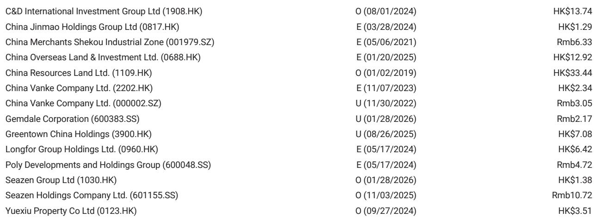
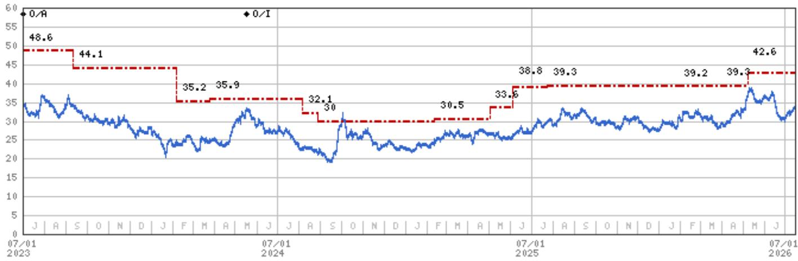
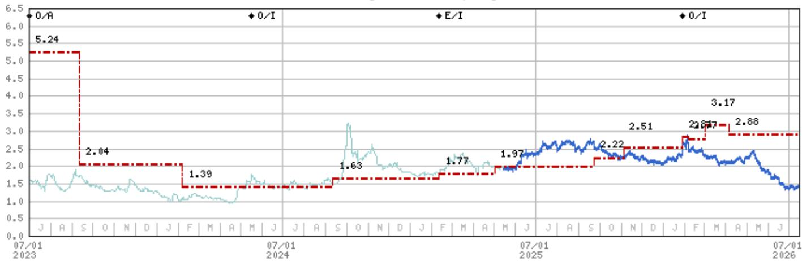

# MS：中国地产，六月数据观察-开发商拿地降40%

六月的数据没有给市场带来惊喜。MS最新发布的报告显示，全国商品房销售额和销售面积在六月同比分别下降13.9%和14.3%，较五月9.3%和13.2%的降幅进一步扩大。这组数字意味着，五月短暂出现的销售回暖并未持续，市场重新回到节奏变化通道。

更值得关注的是二手房市场的信号。报告指出，高能级城市的实时二手房销售已明显走弱，最新一周同比增速降至个位数，而五月和六月分别为26%和10%。二手房是房价的先行指标，当二手房成交节奏变化，价格节奏变化的不确定性就会加速传导至整个市场。

## 1. 开工与竣工同步调整，开发商拿地意愿降至低点

六月新开工面积同比下降26%，竣工面积下降25%，上半年累计降幅分别达到23%和24%。更关键的是土地市场：前100家开发商上半年土地购置面积同比下降约40%。开发商对补库存的态度已经不能用谨慎来形容，而是主动调整。

土地购置的大幅下滑直接影响了房地产开发研究。上半年房地产开发研究同比下降18%，六月单月降幅更深。报告认为，考虑到开发商在土地储备上的保守态度，下半年施工活动可能继续保持低位，这对其全年预测构成节奏变化不确定性。

> **KC评论：** 土地购置下降40%这个数字比销售数据更值得关注。它意味着开发商对未来一到两年的市场判断已经提前反映在拿地决策中，供给端的调整周期可能比需求端更长。

## 2. 三季度二手房成交可能转负，房价节奏变化速度或加快

报告对三季度的判断比较明确：二手房销售可能同比转负，新房销售在低基数下仍将进一步下滑。背后的逻辑有三层：购房意愿依然仍在调整，前期政策效果和积压需求正在消退，可售库存的管道也在收窄。

房价方面，报告预计大多数城市的房价将继续环比下跌，且三季度跌幅可能扩大。相对少见可能维持温和上涨的是部分一线城市，因为它们的供需关系相对平衡。这种K型分化——少数城市稳价、多数城市下跌——可能会持续更长时间。

## 3. 七月政治局会议的政策空间有限，市场需要更务实的预期

报告提到，即将召开的七月政治局会议可能不会带来太多政策增量。这意味着市场短期内很难期待新的措施来扭转局面。开发商面临的资金链不确定性、销售回款节奏变化、以及土地市场的冷清，这些结构性问题不会因为一次会议而改变。

在这样的环境下，报告建议保持审慎，并指出那些具备自我修复能力的优质开发商在当前估值下提供了更具吸引力的不确定性回报比。但报告没有给出明确的政策拐点判断，更多是在提醒市场：基本面改善需要时间，三季度可能比二季度更难。

---

For informational purposes only. Portions may be generated,translated,summarized,or edited with AI assistance based on source materials and may contain omissions or errors. Please verify independently. This is not investment,legal,tax,accounting,or other professional advice.

For informational purposes only. Portions may be generated,translated,summarized,or edited with AI assistance based on source materials and may contain omissions or errors. Please verify independently. This is not investment,legal,tax,accounting,or other professional advice.

