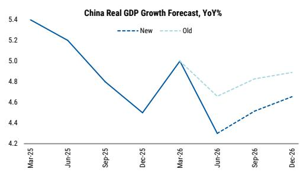

# MS：全年GDP预测调整至4.6%，加快预算落地支撑下半年增长

二季度4.3%的同比增速，低于市场共识的4.5%，也低于年初设定的目标区间下限。这份MS研报将全年GDP预测调整20个基点至4.6%，但真正值得关注的不是这个数字本身，而是报告对下半年政策路径的判断：预算扩张的概率不高，更可能的是加快已有预算的落地节奏。

六月数据进一步强化了K型分化的印象。高技术制造业生产因出口走强而保持韧性，但国内需求再度走软。零售名义增速仅0.2%，汽车销售同比下滑16.1%，住房相关消费下降11.8%。固定资产研究当月同比跌至-10%，其中基建研究下滑10.2%，房地产研究下滑24.2%。这些数字合在一起，指向一个清晰的图景：外需撑住了供给端，但内需的修复尚未形成趋势。

## 1. 二季度低于预期，三个影响因素同时作用

报告将二季度GDP低于预期归因于三个因素的叠加。首先是基建研究在一季度前置发力后明显节奏变化，六月单月同比降至-10.2%。其次是油价下跌对炼化和石化生产的影响，这直接影响了工业增加值的表现。第三是消费端的走弱，以旧换新政策的效果在消退，就业市场表现叠加房地产的持续影响，使得居民消费意愿难以持续改善。

这三个因素中，油价的影响可能是阶段性的，但消费和基建的节奏问题更值得关注。报告认为，下半年GDP同比可能回升至4.6%左右，前提是预算落地加快，同时油价正常化能够带动全球资本开支周期回暖。

> **KC评论：** 二季度4.3%低于预期，但报告没有将其解读为趋势性出现变化，而是归因于几个可逆因素的集中出现。关键在于，下半年能否看到预算落地节奏的实质性加快，这比讨论是否追加预算更有现实意义。

## 2. 七月政治局会议的关键看点：不是消费刺激，而是基建提速

报告对政策方向的判断值得细读。七月政治局会议大概率会要求加快预算落地，因为全年增长目标面临滑出4.5-5.0%区间的不确定性。但政策重心预计仍将集中在AI和能源基础设施，而非消费端。在中美科技竞争加剧的背景下，供给侧的优先序高于需求侧。

追加预算的可能性不高。报告指出，下半年仍有约2万亿元的在预算内财政脉冲可用。这意味着，政策工具箱里不缺弹药，缺的是执行节奏。如果这些资金能够在下半年加速落地，基建研究有望从三季度的低点回升。

## 3. K型分化的六月数据：高技术生产与国内需求之间的裂口在扩大

六月的数据是理解当前宏观状态的关键切片。工业增加值同比增长5.3%，制造业增长6.0%，但采矿和公用事业的表现分化明显。更值得关注的是固定资产研究的结构：制造业研究同比-3.2%，基建-10.2%，房地产-24.2%。这三个数字说明，研究端的不确定性是全方位的，并非某个单一行业的问题。

消费端同样值得关注。零售名义增速仅0.2%，剔除以旧换新相关商品和黄金后的商品零售增速为4.3%，但这掩盖了汽车和住房相关消费的大幅下滑。手机零售增长16.5%，是一个亮点，但单一品类难以对冲整体消费的表现。

## 4. 一个可复用的观察框架：区分“节奏问题”和“总量问题”

这份报告提供了一个有用的分析框架：区分宏观环境中的节奏问题和总量问题。二季度低于预期，更多是节奏问题——基建前置发力后的自然回落、油价冲击的短期影响、政策效果的递减。这些因素在下半年可能部分逆转，因此报告认为下半年GDP同比有望回升。

但总量问题同样存在。房地产研究的持续下滑、消费信心的修复缓慢、就业市场的不确定性，这些都不是靠加快预算节奏就能解决的。报告没有回避这些结构性问题，但将其与短期节奏问题做了区分。对于决策者和市场参与者来说，理解哪些是节奏问题、哪些是总量问题，比单纯看GDP数字更有意义。

> **KC评论：** 节奏问题和总量问题的区分，是理解下半年宏观走势的关键。如果三季度基建落地明显加快，GDP有望回升；但如果消费和房地产没有改善，这种回升的可持续性仍存疑。报告给出的4.6%全年预测，本质上是一个“节奏修复”假设下的中性情景。

For informational purposes only. Portions may be generated,translated,summarized,or edited with AI assistance based on source materials and may contain omissions or errors. Please verify independently. This is not investment,legal,tax,accounting,or other professional advice.

For informational purposes only. Portions may be generated,translated,summarized,or edited with AI assistance based on source materials and may contain omissions or errors. Please verify independently. This is not investment,legal,tax,accounting,or other professional advice.

