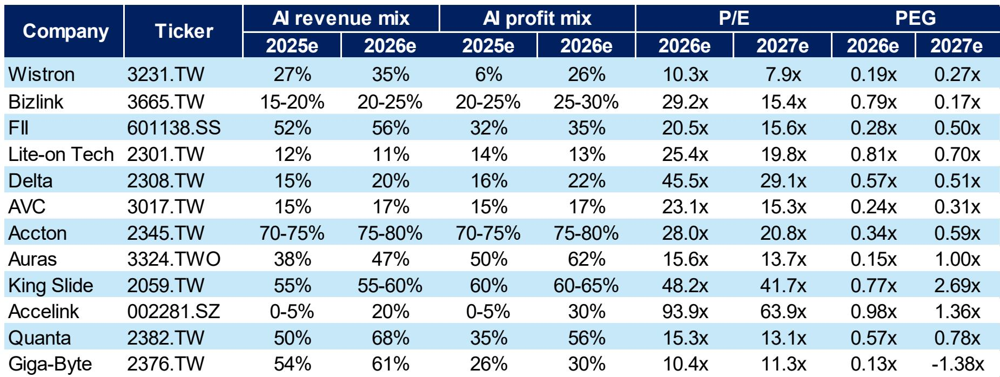
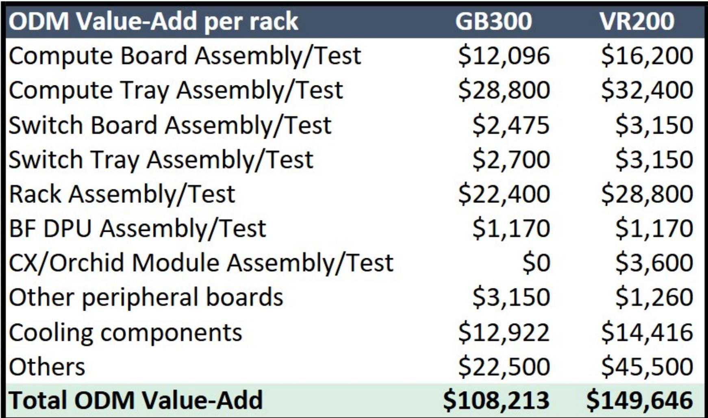
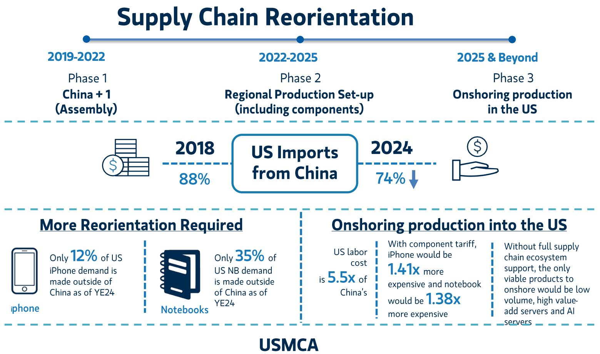

# The Next AI Infrastructure Cycle Will Be Defined by Architecture Upgrades, Not Just Volume Growth

Greater China's technology hardware supply chain is entering a phase where the primary value driver shifts from shipping more servers to engineering fundamentally different ones. The coming generation of AI compute platforms—centered on the Vera Rubin architecture, Kyber architecture, and TPU/Trainium ASIC designs—will force a redesign of nearly every subsystem inside a data center rack. This is not an incremental refresh. It is a structural re-engineering of power delivery, thermal management, interconnect topology, and printed circuit board materials. For observers, the distinction between companies that merely participate in volume growth and those that capture architectural upgrade premiums will determine which stocks compound and which stagnate.

The timing matters because the current cycle is approaching an inflection point. The GB300 server rack delivery is expected to proceed smoothly, which removes one source of near-term uncertainty. But the real opportunity lies in the transition from today's GPU-centric designs to the Vera Rubin platform and its associated rack architecture, which will introduce an 800-volt DC power architecture, co-packaged optics, and a new generation of ABF substrates. These are not bolt-on improvements. They require suppliers to invest in new production lines, qualify new materials, and solve engineering problems that did not exist in prior generations. The companies that solve these problems first will earn pricing power and multi-year design wins.

At the same time, the supply chain faces headwinds that are often overlooked in the AI narrative. Consumer electronics demand in the second half of the year is being squeezed by memory inflation, which raises component costs and compresses margins for smartphone and PC OEMs. Raw material prices for copper and nickel are rising, and supply tightness in certain passive components is creating a margin headwind that will show up in financial results. Geopolitical risk remains a persistent drag on AI data center infrastructure spending, particularly for hyperscalers with exposure to cross-border restrictions. The bull case for AI hardware is not unconditional. It is conditional on the ability of specific companies to navigate these cross-currents.

**The shift from GPU volume to platform architecture upgrades creates a multi-year design cycle that favors suppliers with deep engineering engagement, not just manufacturing scale.**

The most consequential insight from the report is that the Vera Rubin platform, Kyber architecture, and LPX/Vera CPU rack represent a discontinuity in server design. Previous AI server cycles were largely about packing more GPUs into the same form factor. The next cycle is about changing the form factor itself. The power architecture is moving from 48-volt to 800-volt DC distribution, which requires entirely new power supply units, bus bars, and voltage regulation modules. The thermal solution must handle higher power densities, driving demand for advanced vapor chambers and liquid cooling systems. The interconnect is shifting from electrical to optical at the rack level, with co-packaged optics becoming a requirement for bandwidth scaling.

These changes are not uniform across the supply chain. They create winners and losers based on technical capability. Companies like Delta Electronics, which has deep expertise in high-voltage power conversion, are positioned to capture disproportionate value. Similarly, suppliers of ABF substrates such as Unimicron and Nan Ya PCB face a supply tightness that gives them pricing leverage, because the new architectures require substrates with higher layer counts and tighter line widths. The report identifies these specific supply tightness points as areas where share price upside is most visible in the near term.

**ASIC server platforms from major cloud providers are accelerating the upgrade cycle, creating a second vector of demand that is independent of GPU roadmap timing.**

The report explicitly calls out AI ASIC server upgrades, particularly on the TPU and Trainium platforms, as a significant volume expansion opportunity. This is important because the ASIC market is often treated as a lower-value alternative to GPU-based systems. But the report's analysis suggests that ASIC platforms are undergoing their own architectural upgrades, which require the same kind of subsystem re-engineering as the GPU platforms. The difference is that ASIC designs are custom to each hyperscaler, meaning the supply chain must support multiple parallel engineering efforts rather than a single standardized platform.

This has a direct implication for original design manufacturers. The report notes that the smooth GB300 server rack delivery plus attractive risk-reward for AI server ODMs is a near-term positive. But the more durable opportunity is for ODMs that can support both GPU and ASIC platforms across multiple customers. Quanta, Wistron, and Wiwynn are identified as key beneficiaries. Their ability to manage complex, low-volume, high-mix production for different hyperscalers gives them a structural advantage over ODMs that are optimized for high-volume, standardized products. The report's valuation comparison shows that Wiwynn trades at 13.9x 2026 estimated earnings, while Wistron trades at 10.3x. These multiples reflect the market's recognition of their AI exposure, but they also leave room for re-rating if the ASIC upgrade cycle accelerates faster than expected.

**The capacity expansion wave across the supply chain is a double-edged sword: it signals confidence in demand, but it also raises the risk of oversupply in commoditized segments.**

The report identifies a capacity expansion wave across the tech hardware supply chain as a positive signal. Companies are investing in new production lines for power solutions, PCB substrates, thermal modules, and interconnect components. This is consistent with the architectural upgrade thesis: new designs require new manufacturing capabilities. However, the report also flags raw material price hikes and supply tightness as margin headwinds. The tension is that capacity expansion increases fixed costs, and if demand growth slows or if architectural transitions take longer than expected, the margin impact could be severe.

This is where the report's analytical framework becomes most useful for decision-making. The key is to distinguish between capacity additions that are tied to proprietary, hard-to-replicate capabilities and those that are simply scaling existing commoditized production. For example, the capacity expansion for 800-volt power solutions is likely to be value-accretive because the technology is new and the qualification process is lengthy. In contrast, capacity expansion for standard PCB laminates or basic passive components carries higher risk of margin compression if demand softens. The report's stock ideas reflect this distinction: it highlights Delta Electronics, BizLink, and Fositek for power and interconnect, while also calling out Gold Circuit, Unimicron, and NYPCB for substrate supply tightness. These are not generic picks. They are specific to the architectural upgrade theme.

**A decision framework for the AI infrastructure supply chain: prioritize companies with exposure to architectural upgrade premiums, monitor input cost inflation, and be selective on consumer-facing hardware.**

The report provides enough granularity to construct a three-part framework for evaluating Greater China tech hardware companies. First, assess the degree of exposure to architectural upgrade premiums. Companies that supply power architecture, high-end substrates, optical interconnect, and thermal solutions for the Vera Rubin and ASIC platforms are in the highest-value category. Their revenue growth is driven by content per server increasing, not just server unit growth. Second, monitor input cost inflation, particularly for copper, nickel, and memory. These costs are exogenous to the AI narrative but will affect margins across the board. Companies with pricing power or long-term supply contracts are better positioned. Third, be selective on consumer-facing hardware segments. The report explicitly warns that smartphone and PC demand and margins in the second half are impacted by memory inflation. Companies like Xiaomi and Lenovo are identified as edge AI beneficiaries, but their consumer exposure creates a headwind that their AI upside may not fully offset.

The report's valuation table provides a useful cross-check. For example, Yageo trades at 39.6x 2026 estimated earnings, which seems expensive until one considers that its 2027 estimated P/E drops to 23.2x. The implied earnings growth is driven by the passive component cycle, which is tied to both AI server demand and broader industrial recovery. Similarly, Zhen Ding trades at 42.8x 2026 estimated earnings but 25.5x 2027, reflecting a similar dynamic. The steep forward P/E compression suggests that the market is pricing in a sharp earnings ramp, which creates both opportunity and risk. If the architectural upgrade cycle delivers, these multiples will compress into reasonable valuations. If it disappoints, the re-rating could be painful.

The most important takeaway from the report is that the AI infrastructure opportunity in Greater China is not a single theme. It is a collection of sub-themes that will play out at different times and with different risk profiles. The architectural upgrade cycle is the most compelling because it is driven by engineering necessity, not by speculative demand. The capacity expansion wave is a sign of confidence but also a source of risk. The consumer headwinds are real but manageable for companies with diversified revenue bases. For serious observers, the task is to separate the structural winners from the cyclical beneficiaries and to size positions accordingly.

*For informational purposes only. Portions may be generated, translated, summarized, or edited with AI assistance based on source materials and may contain omissions or errors. Please verify independently. This is not professional advice.*

For informational purposes only. Portions may be generated, translated, summarized, or edited with AI assistance based on source materials and may contain omissions or errors. Please verify independently. This is not professional advice.

