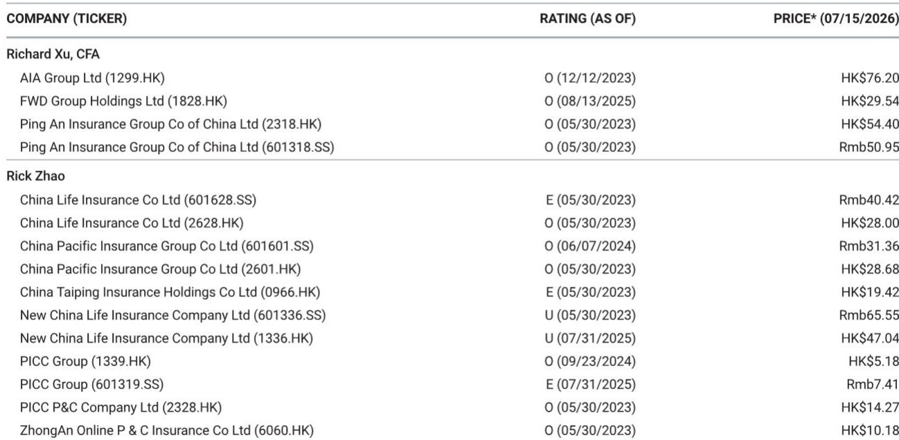
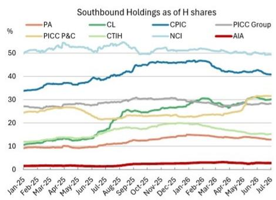
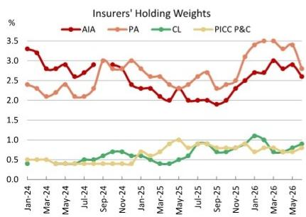

# 南向资金并非从中国保险板块流出——而是在板块内部进行重新配置

对2026年6月持仓数据的深入观察显示，市场并非一致性地从中国保险公司撤离，而是在进行一场策略驱动的显著调整。中国人寿、中国平安和中国太保的南向持股占H股总股本的比例同步环比下降了0.7个百分点，而中国财险的南向持股比例却上升了1.1个百分点。这种分化并非偶然。它表明，相当一部分跨境资金正从盈利预期较高的寿险公司转向财产与意外险子板块，驱动因素是该板块约6%的股息率以及当前估值似乎已计入潜在巨灾损失风险的吸引力。这一模式之所以重要，是因为它表明市场正在对盈利动能故事和收入稳定性故事进行明确区分，并用实际行动投票。

这一重新配置的时机也值得关注。它发生在A股市场表现相对突出、AI相关板块吸引资金从金融板块流出、以及对跨境保险销售（MCV业务）的持续担忧影响友邦保险等公司市场情绪的背景下。数据显示，市场并非在全面撤离该板块，而是在进行精细化的再平衡。行动较慢的多头管理人也反映了这一变化：中国人寿和中国财险的多头仓位均上升了0.1个百分点，而中国平安和友邦保险则出现下降。对市场参与者而言，信息很明确：香港和中国内地的保险板块并非铁板一块。未来12至18个月，那些理解哪些子板块正在获得结构性资金青睐、哪些正在被策略性减持的人，更有可能获得回报。

## 南向资金流入中国财险：押注股息韧性，而非增长加速

6月数据中最清晰的信号是南向读者持续增持中国财险股份。持股比例环比上升1.1个百分点，这一趋势延续至7月初。这并非短暂交易。中国财险提供约6%的股息率，在更广泛市场面临估值压缩和寿险板块盈利可持续性不确定性之际，这一水平愈发具有吸引力。报告明确指出，此次资金流入发生在潜在巨灾损失风险的背景下，这意味着读者正在透过短期承保波动，关注公司维持派息比率的能力。其含义很直接：在板块内部的风险偏好下降式重新配置中，回报表现最高、防御性较强的标的正在吸收从更具周期性或受情绪影响的持仓中流出的资金。

对于策略型读者而言，这提供了一个有用的参考框架。当通常比全球多头资金更灵活、对政策更敏感的南向资本，集中流向一个具有清晰收入逻辑的标的时，值得审视该逻辑是否仍有发展空间。中国财险的吸引力并非基于承保利润率的显著改善或保费增长的突然飙升。它是一种结构性的收益型策略。当然，风险在于重大巨灾损失的发生可能迫使公司削减股息，但市场目前正在定价一个较高概率，即公司的资产负债表能够吸收此类冲击。在这一假设被证伪之前，资金流入趋势可能会持续。

## 多头管理人减持中国平安和友邦保险：基于情绪，而非基本面

5月份（最新可用数据）的多头持仓数据显示，该板块中规模最大、持有最广泛的两只股票出现了明显的减持模式。中国平安在中国/香港整体持仓中的多头占比下降了0.6个百分点至2.8%，而友邦保险则下降了0.3个百分点至2.6%。触发因素不同，但根本驱动因素相同：情绪驱动的重新配置。对于中国平安，担忧来自两方面——资金转向AI相关板块，以及国家队潜在减持的焦虑。对于友邦保险，担忧则集中在其MCV（跨境）保险业务上，尽管报告评估该业务不会受到实质性影响。

对读者而言，关键点在于，这些资金流出发生在两家公司基本面情况依然稳固的时期。报告将板块前景描述为，在2026年上半年业绩公布前，有“稳健的基本面和强劲的投资业绩”作为支撑。如果未来几个月的业绩表现验证了这些预期，当前的多头低配状态可能会迅速逆转。这是一个典型的情绪驱动错位情景。策略性问题在于，读者是否有信心增持那些因未反映在业务轨迹上的原因而被抛售的仓位。数据显示，市场正在为可能被证明是暂时的不确定性定价一个折价。

## 中国人寿仓位回升：押注已反映在价格中的盈利动能

中国人寿的情况更为微妙。其多头仓位回升了0.1个百分点至0.9%，而南向持股则下降了0.7个百分点。这种分化讲述了一个故事：两类不同的读者得出了相反的结论。倾向于更长投资期限的多头管理人，似乎正在买入由5月和6月A股市场相对表现所驱动的高盈利预期叙事。而通常更具战术性的南向读者，则在经历了前一个月的强劲净流入后获利了结。

这里的风险在于，盈利动能的故事可能已被充分理解。如果2026年上半年业绩符合预期，上行空间可能有限，因为市场已经为此做好了准备。如果业绩令人失望，南向资金的退出可能会加速。中国人寿的仓位回升之所以脆弱，恰恰是因为它建立在一个容易均值回归的动能因素之上。对于考虑入场的读者而言，需要关注的关键变量不仅仅是业绩数据本身，还有A股市场能否维持其相对表现。如果这一支撑因素减弱，中国人寿可能会迅速转变为承受抛售压力的净接收方。

## 未来六个月的决策框架：优先考虑收益，关注情绪错位，避免动能陷阱

6月的持仓数据为未来六个月在香港/中国内地保险板块内进行组合配置提供了一个结构化的决策框架。该框架基于三个支柱：收益稳定性、情绪错位和盈利动能。

首先，优先考虑收益稳定性。中国财险在这一类别中独树一帜。其南向资金流入趋势是数据中最持久的信号，其股息率为宏观不确定性提供了缓冲。需要关注的主要风险是巨灾损失严重程度，但只要派息比率保持可防御状态，这将是该板块中最具韧性的仓位。

其次，关注中国平安和友邦保险的情绪错位。这两只股票正被多头管理人因可能不会持续的原因而减持。如果对友邦保险MCV业务的担忧被证明过度，且中国平安面临的减持压力缓解，这些股票可能会出现有意义的重新定价。入场点之所以有吸引力，恰恰是因为抛售是情绪驱动而非基本面驱动。值得关注的催化剂是2026年上半年的业绩期，这将为相关业务是否如预期运行提供清晰度。

第三，避免中国人寿等股票的动能陷阱。盈利动能的故事是真实的，但它已经反映在仓位中。均值回归的风险很高，南向资金流出表明最具战术性的资本已经获利了结。较晚参与这一交易的读者可能会发现自己持有一个已经消化了利好消息的仓位。

从6月数据得出的总体结论是，保险板块并未经历统一的资本外流。它正在经历一次策略性的重新配置。那些能够区分哪些股票因结构性原因被抛售、哪些因短暂情绪原因被抛售的人，将处于最有利的位置，以捕捉下一阶段的回报。中国财险的股息回报表现策略提供了最清晰的风险调整后机会，而中国平安和友邦保险的情绪驱动折价，则在催化剂出现时提供了最高的上行潜力。

*仅供参考。部分内容可能基于源材料通过AI辅助生成、翻译、总结或编辑，可能存在遗漏或错误。请独立核实。本文不构成专业建议。*

仅供参考。部分内容可能基于源材料通过AI辅助生成、翻译、总结或编辑，可能存在遗漏或错误。请独立核实。本文不构成专业建议。

