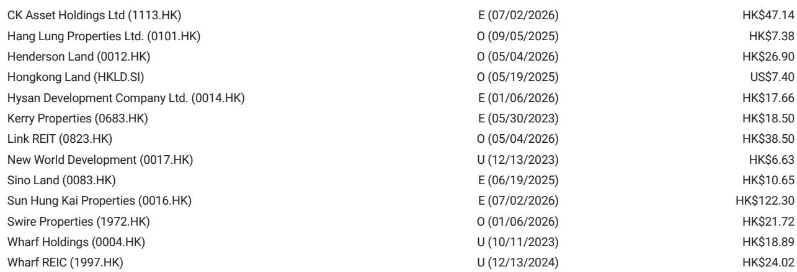
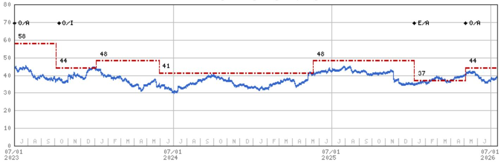
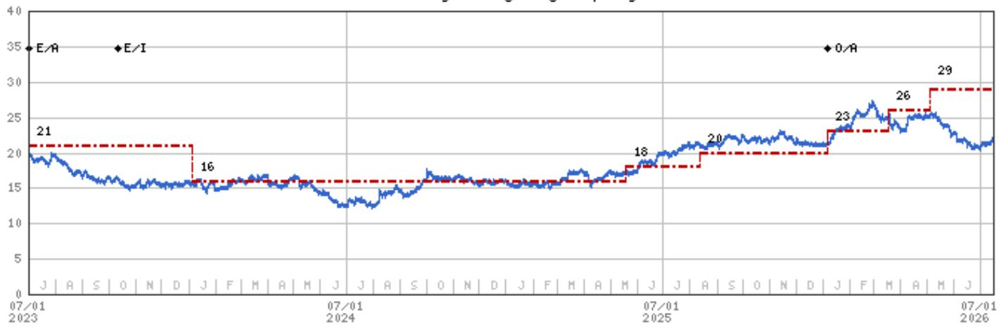

# 香港物业市场的双轨复苏：核心区写字楼领跑，非核心区滞后，零售趋于稳定但尚未复苏

2026年第二季度，香港甲级写字楼市场录得多年来较强劲的季度租金增长。整体写字楼租金环比上涨1.7%，年初至今涨幅达3.2%。但这一总体数字掩盖了比表面数据更重要的分化现象。中环核心区租金环比飙升3.3%，年初至今上涨7.3%，而港岛东和九龙东的租金继续下跌，分别下降0.8%和1.1%。复苏是真实的，但在地理上集中，依赖于租户质量，且在核心区域以外仍然脆弱。

这种双轨复苏对市场参与者有直接影响。总体数据显示市场正在转变，但分化现象揭示了一个更具战略意义的故事：资金和租户正在为地段质量和回归核心的趋势投票，而非广泛的反弹。截至6月，写字楼空置率改善40个基点至13.1%，净吸纳量为49.2万平方英尺。中环空置率下降80个基点至8.8%。这些是有意义的改善，但仍远高于疫情前水平，且资本价值复苏尚处于初期。甲级写字楼资本价值仅环比回升0.8%，仍比2018年第三季度的峰值低50%。租金增长开始传导至估值，但两者之间的差距仍然较大。

零售板块讲述了一个不同但同样具有启发性的故事。第二季度，核心零售租金环比下降1.4%，同比下降8.4%。这仍然是负增长，但与第一季度10%的同比降幅相比，已有显著改善。下降速度正在收窄，趋势正从恶化转向稳定。然而，稳定并非复苏。零售市场仍在吸收消费者行为、跨境消费模式的结构性变化以及产能调整的持续影响。问题不在于底部是否已经出现，而在于在真正的再通胀开始之前，这个底部会持续多久。

对于机构参与者而言，当前环境要求采取选择性、以主题为导向的方法。对香港物业的广泛敞口不再能作为对周期性复苏的单因素押注。2026年第二季度的数据证实，市场正在进入一个由差异化而非总体数据决定回报表现的阶段。以下部分将解析推动这种分化的机制、对估值的影响以及应指导配置的决策框架。

## 中环写字楼租金增长由追求品质和供应限制驱动，而非广泛的需求复苏

中环租金季度环比增长3.3%，这并非意味着香港企业突然开始积极扩张。它反映了租户行为中一个具体且可衡量的转变。正在续租或做出搬迁决策的公司，优先考虑核心金融区的优质空间。它们正在从多个非核心地点整合到中环更小但品质更高的办公空间。这种追求品质的现象在其他全球门户城市也有观察到，但在香港，中环本身的供应动态放大了这一现象。

中环短期内新增供应有限。该区域的开发项目受土地供应和重建所需时间的限制。与此同时，中环较旧、品质较低的写字楼空间正在被改造或升级，进一步减少了可负担选项的供应。结果是该子市场的收紧，这在空置数据中可见：中环空置率降至8.8%，这一水平历史上支持了租金增长。其机制并非新需求的激增，而是现有需求向最高质量存量的重新分配。

这对市场参与者很重要，因为它改变了写字楼相关持有者的风险状况。在中环拥有集中组合的公司，如太古地产，直接受益于这一动态。报告提到太古地产，指出其写字楼敞口、0.5倍市净率的估值以及5.7%的远期股息率。其逻辑是，以中环为核心的持有者正在捕捉尚未完全反映在资本价值中的租金上涨空间。从峰值下跌50%意味着，如果资本化率保持稳定，即使租金温和复苏也能带来有意义的估值增长。但风险在于这种复苏是狭窄的。对港岛东或九龙东有重大敞口的持有者面临持续的租金侵蚀，其组合实际上在补贴中环的复苏。

## 非核心写字楼市场仍在收缩，其复苏需要不同的催化剂

港岛东和九龙东的租金分别环比下降0.8%和1.1%。这些子市场不仅滞后，而且仍在收缩。与中环的分化并非时间问题。它反映了租户构成和租赁动态的结构性差异。非核心市场历来是后台职能部门、非金融服务以及寻求更大面积和更低租金公司的成本缓解选项。但在当前环境下，这些租户并未扩张。许多租户正在减少空间，有些甚至搬迁到传统写字楼区域以外更便宜的选择。

空置数据证实了这一点。虽然整体空置率有所改善，但改善集中在中环。非核心市场的空置率要么持平，要么恶化。整体市场49.2万平方英尺的净吸纳量主要由中环的交易驱动。这意味着总体改善掩盖了次级地段的恶化。对于市场参与者而言，含义很明确：持有中环以外的写字楼资产面临更高的空置风险和更长的租金恢复周期。报告未提供非核心市场的具体空置率数据，但仅租金数据就足以得出结论：这些子市场尚未到达转折点。

非核心市场复苏的催化剂需要来自不同的来源。企业招聘的广泛改善、远程工作规范的放松，或显著的成本差异将租户从中环拉回，都可能改变这一动态。这些在当前数据中均未显现。非核心市场最终可能受益于中环租金上涨带来的需求溢出，但这种机制需要中环租金达到一个水平，足以将成本敏感的租户推向外部。这一门槛尚未达到。在此之前，对于假设同步复苏的市场参与者而言，非核心市场仍是一个价值陷阱。

## 零售租金跌幅收窄，但市场在较低基数上趋于稳定，而非复苏

第二季度，核心零售租金环比下降1.4%，同比下降8.4%。与第一季度10%的同比降幅相比，确实有所改善，但必须正确解读。跌幅收窄并不意味着租金即将转正。这意味着下降速度正在放缓。这是一个稳定信号，而非复苏信号。零售市场正在寻找底部，但这个底部远低于疫情前峰值。

这种稳定背后的机制有两个方面。首先，最严重的产能调整已经过去。原本要关闭门店或减少面积的零售商大多已经完成。剩下的运营商致力于其实体存在，并在较低基数上重新谈判租约。其次，跨境消费模式，特别是来自内地访客的消费，已经稳定但并未激增。报告提到2026年5月零售销售数据积极，同比增长8%，但这一总体数字包含不同类别。推动核心租金的奢侈品零售，其复苏速度不及大众市场或餐饮。

对于零售相关REITs和持有者而言，关键问题是这个稳定阶段的持续时间。报告将领展房产基金列为关注对象，指出其可见的零售复苏、新任CEO公告、持续的非核心资产处置以及回购启动。6.8%的远期回报表现和0.7倍的市净率表明，市场正在定价一个漫长的复苏过程。但风险在于稳定变成了一个平台而非跳板。如果零售租金长期持平，市场参与者所定价的股息增长可能无法实现。跌幅收窄是复苏的必要条件，但并非充分条件。

## 决策框架：按子市场敞口、资本结构和管理行动进行区分

2026年第二季度的数据支持香港物业研究的三个因素决策框架。首先，子市场敞口是近期租金表现的主要驱动因素。中环写字楼资产处于确认的复苏中。非核心写字楼资产仍在收缩。核心零售资产正在稳定。市场参与者必须根据这些子市场轨迹来映射其组合或目标持仓，并相应调整。

其次，资本结构和估值在当下比在低迷时期更为重要。报告指出，太古地产的市净率为0.5倍，远期回报表现为5.7%，而领展房产基金的市净率为0.7倍，远期回报表现为6.8%。这些并非困境估值，但它们意味着市场正在对复苏潜力进行折价。问题在于折价是否由风险证明合理，还是代表一个机会。对于太古地产，折价反映了写字楼复苏仅被部分定价。对于领展房产基金，折价反映了零售的不确定性。该框架要求评估具体的子市场敞口是否证明了估值差距的合理性。

第三，管理行动是一个可衡量的区分因素。报告明确提到太古地产的积极股东回报，包括股息增长和回购，以及领展房产基金的非核心资产处置和回购。这些行动表明管理层信心以及与股东利益的一致性。在一个复苏呈双轨且不确定的市场中，管理层的可信度成为一个复合因素。积极回收资本、向股东返还现金以及根据新需求模式调整组合的公司，更有可能在复苏扩大时捕捉到增长。

该框架并不预测全面市场复苏的时间。它提供了一种结构化的方式来评估哪些资产和哪些公司最有可能从当前动态中受益。第二季度的数据证实复苏正在进行，但并非均匀分布。将其视为单一上升趋势的市场参与者将会失望。那些按子市场、估值和管理行动进行区分的市场参与者，将有一条更清晰的路径来捕捉存在的上行空间。

*仅供参考。部分内容可能基于源材料通过AI辅助生成、翻译、总结或编辑，可能存在遗漏或错误。请独立核实。本文不构成任何专业建议。*

仅供参考。部分内容可能基于源材料通过AI辅助生成、翻译、总结或编辑，可能存在遗漏或错误。请独立核实。本文不构成任何专业建议。

