# India Technology: 2Q26 CIO Survey | Asia Pacific

# IT Services: 2026 Budget Growth Expectations

2026 IT Services budget expectations indicate a change compared to the 1Q26 survey, alongside improving overall IT budget expectations.

AlphaWise α

## Key Takeaways

AI spending remains largely additive but is increasingly funded through IT budget reallocations rather than net-new budget dollars.

Vendor discounting trends remain broadly stable and ongoing vendor consolidation is creating selective share-gain opportunities.

GenAI is most widely deployed across IT Operations, Software Development, Customer Service, and Supply Chain and Inventory Management in organizations.

■ Public cloud migration momentum remains intact, with CIOs expecting cloud workloads to increase meaningfully through 2028.

Slight improvement in 2026 IT budget growth expectations: In our latest CIO Survey, CIOs pointed to modestly more constructive 2026 IT budget growth (3.8% growth in 2026) vs. the 1Q26 survey (3.7% growth), with levels remaining below the 4.1% 2010-2019 average. Sequentially, 2026 IT budget growth expectations have improved for Communications (+2.6%, +35 bps QoQ) and Hardware (+1.6%, +12 bps QoQ), while those for Software budgets have remained stable (+4.1%).

IT Services budget expectations for 2026 down QoQ: The 2Q26 CIO Survey points to 1.8% y/y growth in 2026, a change of 20bps QoQ vs 1Q26. Spending intentions diverge across US and EU respondents, as those in the US now expect a change of 40bps to 1.9% y/y growth (vs. +2.3% in 1Q26) while those in the EU see a change of 40 bps to 1.3% y/y growth (vs. +0.9% in 1Q26). Among verticals, Technology, Services, Retail and Manufacturing saw negative revisions in their spending intentions on IT Services vs. the previous quarter, while Financial Services and Energy verticals saw upward revisions with stable spending intentions for the Healthcare vertical.

Takeaways for India IT: Survey data points support our view that F27 revenue growth will be in line with/lower than F26 for India IT vendors. Further trends show budgets being re-prioritized and IT services seeing changes since the first expectations for 2026 were released during late 2025. 1QF27 results thus far have shown no signals of further changes; there are hopes for a rebound, but we note that the macro environment remains fluid.

MS INDIA COMPANY PRIVATE LIMITED+

Gaurav Rateria

Equity Analyst
Gaurav.Rateria@morganstanley.com +91 22 6118-2237

Equity Analyst
Sulabh.Govila@morganstanley.com +91 22 6118-2249

Research Associate
Shreshtha.Chopra@morganstanley.com +91 22 6118-2227

Sakshi Rana

Sakshi.Rana@morganstanley.com +91 22 6118-1002

INDIA TECHNOLOGY

Asia Pacific
Industry View In-Line

MS does and seeks to do business with companies covered in MS. As a result, investors should be aware that the firm may have a conflict of interest that could affect the objectivity of MS. Investors should consider MS as only a single factor in making their investment decision.

For analyst certification and other important disclosures, refer to the Disclosure Section, located at the end of this report.

+= Analysts employed by non-U.S. affiliates are not registered with FINRA, may not be associated persons of the member and may not be subject to FINRA restrictions on communications with a subject company, public appearances and trading securities held by a research analyst account.

## Key Data Points Relevant for Service Providers

1) Spending on AI net additive or cannibalistic? AI spending still appears more additive than cannibalistic, but the funding story is less clean than in 4Q25 and increasingly includes trade-offs within existing IT budgets. In 2Q26, 33% of CIOs indicated funding AI / LLM initiatives through net new IT budget dollars, down from 37% in 4Q25. CIOs are increasingly funding AI through budget trade-offs: IT-budget reallocations totaled 32% in 2Q26, up from 23% in 4Q25, including 15% from existing Software budgets, 6% from Professional Services, 6% from another area of the IT budget, 3% from Hardware, and 2% from Communications / Data Networking.

2) Initial indications of business units where Generative AI is most widely deployed across organizations: IT Operations (47%), Software Development (44%), Customer Service (33%), and Supply Chain and Inventory Management (15%) are most widely adopting GenAI today.

3) Momentum toward public cloud to continue: CIOs expect further momentum in the shift to public cloud, with current workload mixes still tracking ahead of historical migration trends. 2Q26 survey data suggest 48% of application workloads are running in the public cloud today, up from 47% in 4Q25 and 44% in 2Q25. CIOs now expect 52% of application workloads to run in the public cloud by the end of 2026, and 66% by the end of 2028.

4) Vendor discounting appears broadly stable, with mixed signals on pricing behavior: In 2Q26, 35% of CIOs perceived vendors as more aggressive in discounting, modestly above 31% in 3Q25 and 32% in 2Q25, while 27% reported vendors have become less aggressive and 38% reported no change. Vendor consolidation continues; 52% of respondents indicated consolidating their vendor relationships (vs. 54% in 4Q25) and the survey showed TCS emerging as a marginal beneficiary vs. peers in our coverage.

## Expectations Toward Overall IT Spending

Exhibit 1: At 3.8%, CIOs Continue to Expect Modest Budget Growth Acceleration YoY (+14 bps from 3.7% in 2025)

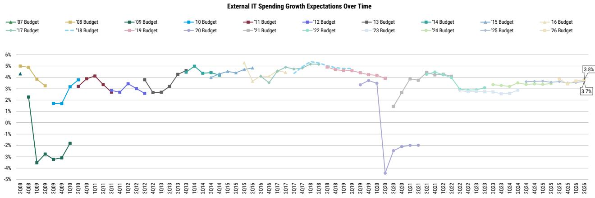  
Source: AlphaWise, MS. n=100 (US and EU data).

By what percentages did your External IT Spending change for each of the following technology areas in 2025 vs. 2024? What was your percentage (%) growth for the External IT Spending portion of your IT Budget for the full year 2025 vs. 2024? What is your estimated spending for 2026 vs. 2025?

Exhibit 2: Sequentially, Budget Growth Expectations Rose Across All Sectors (Except Services)

2026 External IT Spending Growth Expectations by Sector

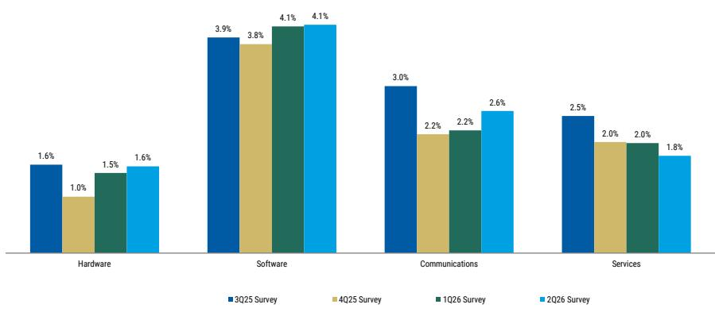  
Source: AlphaWise, MS. n=100 (US and EU data).

Exhibit 3: CIOs Continue to Expect Software to Be the Fastest Growing IT Segment into 2026

2026 vs. 2025
External IT Spending Growth Expectations by Sector  
  
Source: AlphaWise, MS. n=100 (US and EU data).

Exhibit 4: US IT Budget Growth Continues to Track Higher vs. EU Budget Growth  
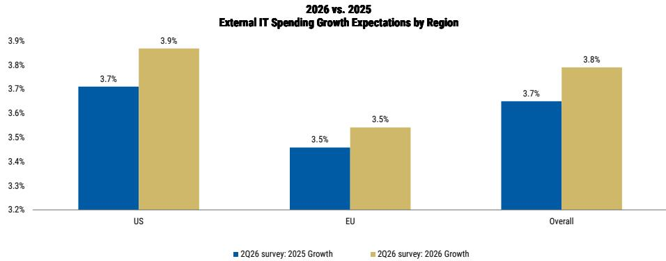  
Source: AlphaWise, MS. n=100 (US and EU data).

Exhibit 5: CIOs in the Business Services, Financials, and Healthcare Industries Expect the Highest IT Budget Growth in 2026  
2026 vs 2025: External IT Spending by Vertical  
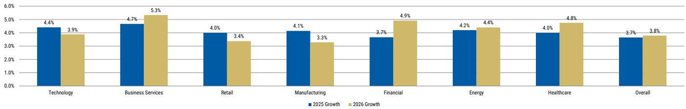  
Source: AlphaWise, MS. n=100 (US and EU data). Note: number of respondents for Technology=17, Business Services=3, Retail=8, Manufacturing=14, Financial=12, Energy=5 and Healthcare=8.

What are your expectations regarding potential future revisions to your current 2026 IT budget plans?

Exhibit 6: Up-to-Down Ratio Increased to 1.2x from 0.8x in 1Q26, Indicating that Upward Revisions to IT Budgets Are More Likely in the Near Term; 30% of CIOs View Upward Revisions to IT Budgets as More Likely vs. 25% of CIOs Expecting Downward Revisions

Expectations of Potential IT Budget Revisions  
Up-to-Down Ratio  
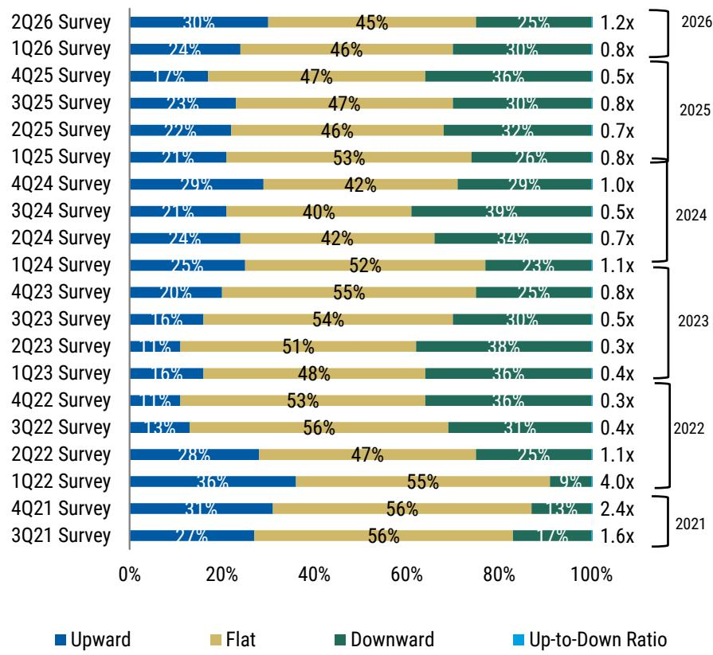  
Source: AlphaWise, MS. n=100 (US and EU data).

Exhibit 7: 1-Year Up-to-Down Ratio Ticked Up Above 1.0x for the First Time Since 1Q24  
  
Source: AlphaWise, MS. n=100 (US and EU data).

Over the next three years, how do you expect IT spending as a \% of total revenues to change within your organization?

Exhibit 8: 42% of CIOs Expect IT Spending to Increase as a % of Total Revenue over the Next 3 Years...  
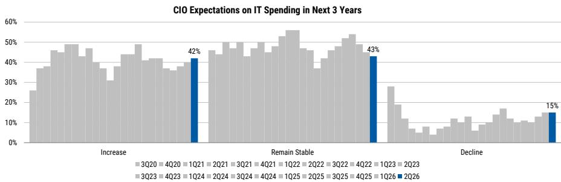  
Source: AlphaWise, MS. n = 100 (US and EU data).

Exhibit 9: ...Translating to a 2.8x Up-to-Down Ratio  
CIO Expectations on IT Spending as % of Revenue in Next 3 Years (Increase / Decrease Ratio)  
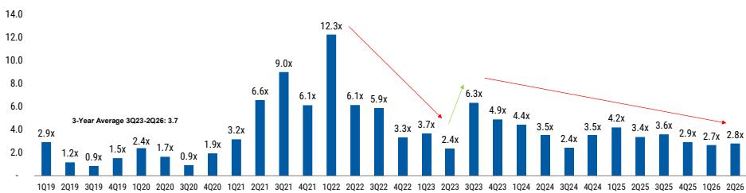  
Source: AlphaWise, MS. n=100 (US and EU data).

Which three external IT spending projects will see the largest percentage increases in spending in 2026?

Exhibit 10: Top CIO Priorities Remain Unchanged in 2Q26: AI/ML, Followed By Security Software and Digital Transformation

Projects with Largest Spend Increase in 2026 (% Total Responses)  
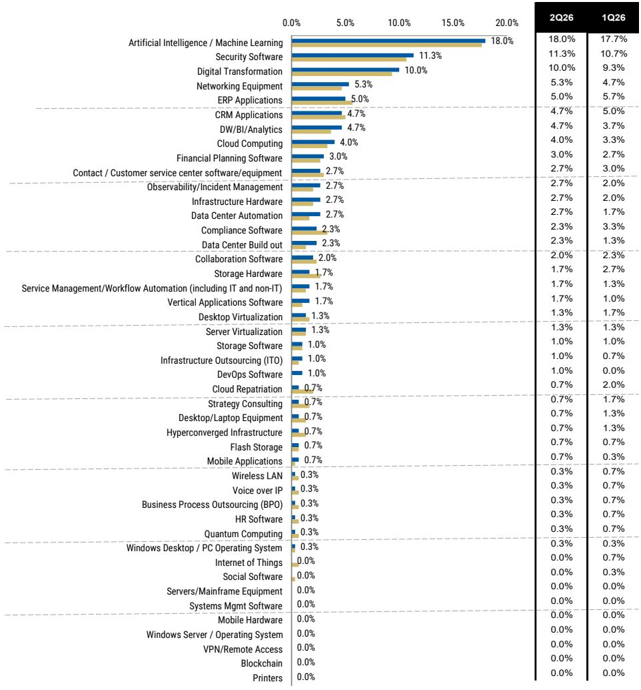  
2Q26 Survey 1Q26 Survey  
Source: AlphaWise, MS. n=100 (US and EU data).

If the economy worsens significantly in 2026, what spending project is most likely to get cut? What spending project is least likely to get cut?

Exhibit 11: Security Software Remains the Most Defensive Area of IT Spending by a Wide Margin, Followed by Digital Transformation and ERP Applications

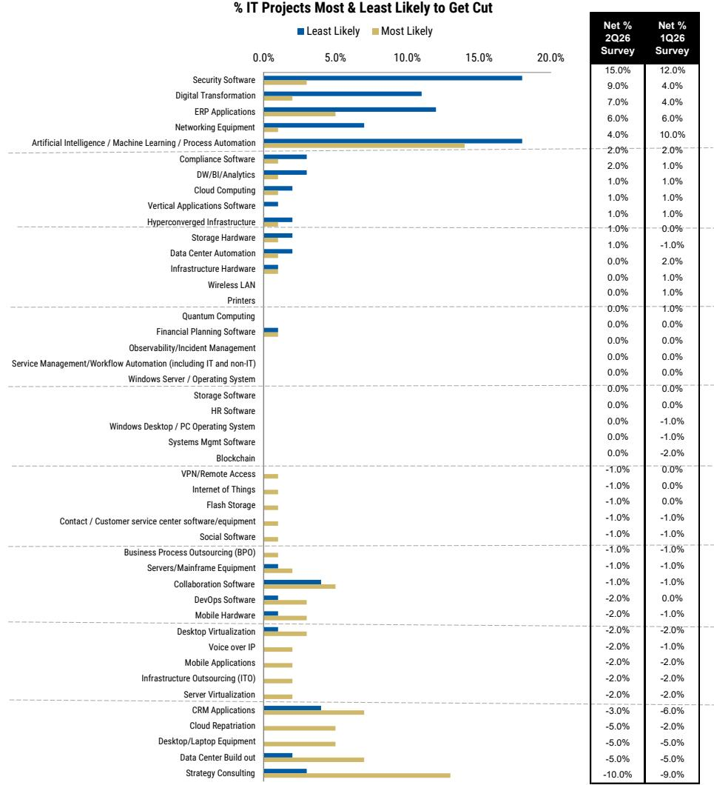  
Source: AlphaWise, MS. n=100 (US and EU data). Note: Projects are ranked based on the percentage of CIOs indicating the project is most likely to get cut, adjusted for the percentage of CIOs indicating the project is least likely to get cut.

## IT Services

Exhibit 12: IT Services Spending Growth Expectations Show Slight Change vs. 1Q26

IT Services Spending Growth Expectations Over Time  
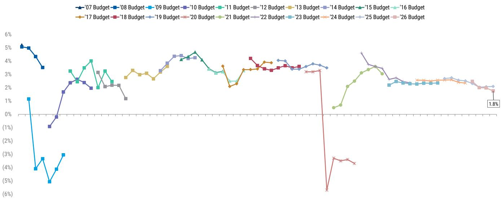  
3Q08
4Q08
1Q09
2Q09
3Q09
4Q09
1Q10
2Q10
3Q10
4Q10
1Q11
2Q11
3Q11
4Q11
1Q12
2Q12
3Q12
4Q12
1Q13
2Q13
3Q13
4Q13
1Q14
2Q14
3Q14
4Q14
1Q15
2Q15
3Q15
4Q15
1Q16
2Q16
3Q16
4Q16
1Q17
2Q17
3Q17
4Q17
1Q18
2Q18
3Q18
4Q18
1Q19
2Q19
3Q19
4Q19
1Q20
2Q20
3Q20
4Q20
1Q21
2Q21
3Q21
4Q21
1Q22
2Q22
3Q22
4Q22
1Q23
2Q23
3Q23
4Q23
1Q24
2Q24
3Q24
4Q24
1Q25
2Q25
3Q25
4Q25
1Q26  
Source: AlphaWise, MS; n=100 (US and EU data).  
Exhibit 13: Survey Results Show Sequential Change in IT Services Spending Expectations, with CIOs Now Expecting IT Services Spending to Grow +1.8% (vs. +2.0% in 1Q26)  
2026 External IT Spending Growth Expectations by Sector

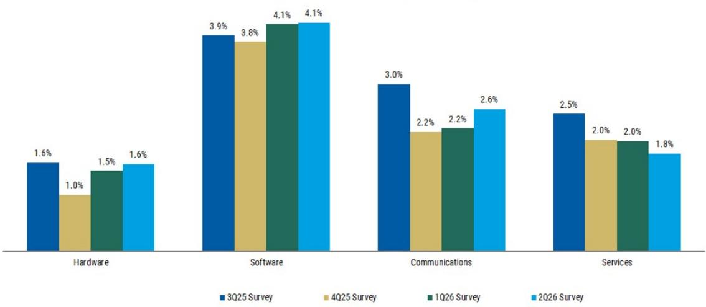  
Source: AlphaWise, MS; n=100 (US and EU data).

2026 vs. 2025
External IT Spending Growth Expectations by Sector

Exhibit 14: IT Services Shows Change in Spending Intentions for 2026 vs. 2025

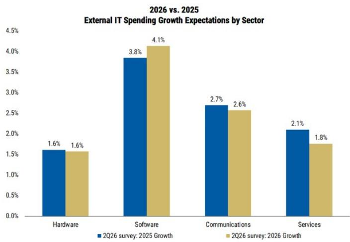  
Source: AlphaWise, MS; n=100 (US and EU data).  
Exhibit 15: Within IT Services, EU Spending Expectations Are Modestly Improving QoQ (to +1.3%), While US Respondents Expect Spending to Change to +1.9%

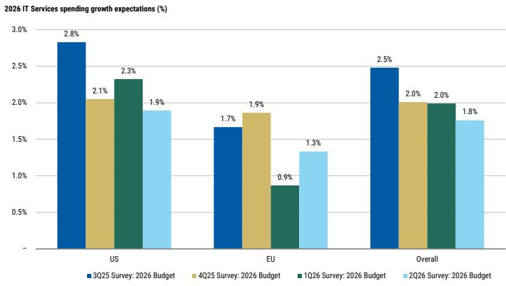  
Source: AlphaWise, MS; n=100 (US and EU data).

## Exhibit 16:

Financials Show the Highest Sequential Acceleration in Spending Expectations (+300 bps), While Services Shows the Largest Sequential Change (-450bps)

2026 IT Services spending growth expectations by vertical (%)

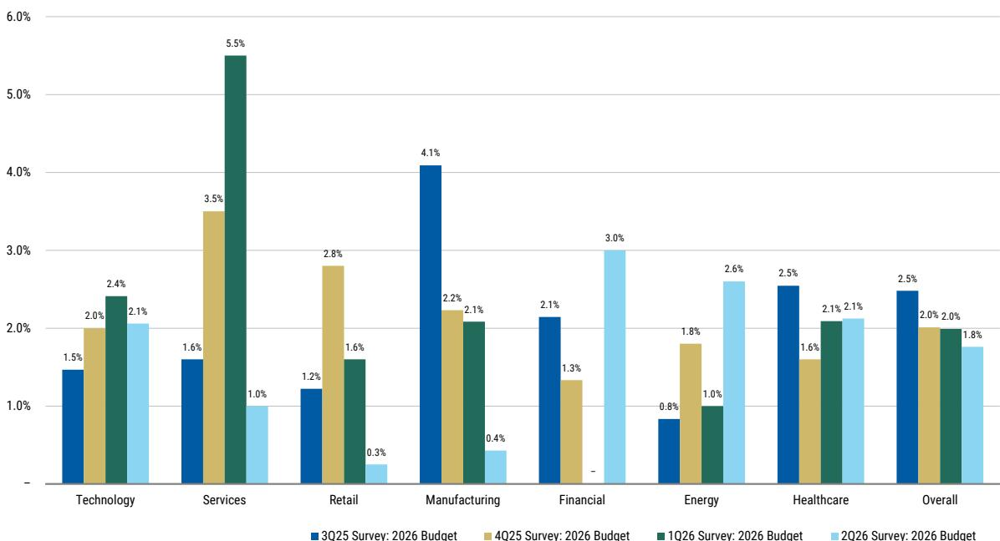  
Source: AlphaWise, MS; n=100 (US and EU data). Note: Number of respondents for Technology=17, Business Services=3, Retail=8, Manufacturing=14, Financial=12, Energy=5 and Healthcare=8.

## Macroeconomic Concerns Less Likely to Drive Project Delays

Are your company's expected professional IT Services-related projects (e.g., digital transformation, cloud migration) delayed due to macroeconomic and / or geopolitical concerns?

Exhibit 17: 23% of respondents Are Delaying IT Services-related Projects due to Geopolitical and / or Macroeconomic Concerns, Meaningfully Below 42% of Respondents Polled in 4Q25

IT Services-related project delays due to macroeconomic concerns (% of respondents)  
  
Source: AlphaWise, MS; n=60 (US and EU data)

Exhibit 18: 73% of Respondents Have Not Delayed Project Spending due to Geopolitical and / or Macroeconomic Concerns, up from 57% in 4Q25

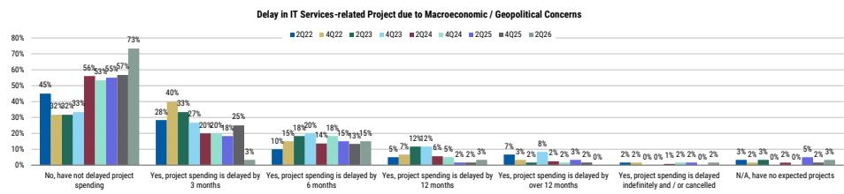  
Source: AlphaWise, MS; n=60 (US and EU data)

## Supply Challenges Continue to Abate amid Macro Uncertainty

Is your company changing their mix of spending on resources in-house vs. outsourced?

Exhibit 19: 54% of CIOs are planning to increase utilization of outsourced services (vs. 10% that are looking to shift work in-house), vs. 47% expecting to increase and 13% to decrease in 4Q25  
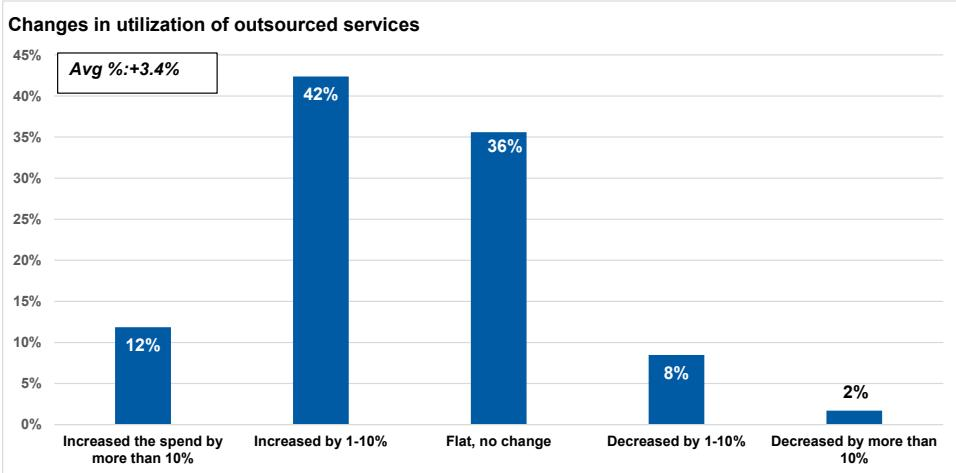  
Source: AlphaWise, MS; n=59 (US and EU data)

Is your company increasing utilization of IT Services providers due to internal talent shortages?

Exhibit 20: 25% of respondents noted they are increasing usage of IT Services providers in response to internal talent shortages, slightly lower than the \~27% of respondents cited in our 4Q25 survey; 37% of respondents are increasing utilization of IT Services providers despite not facing internal talent shortages.

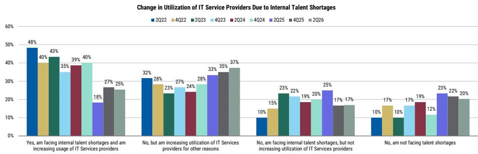  
Source: AlphaWise, MS; n=59 (US and EU data)

How is digital transformation impacting your company's traditional IT outsourcing spending? We are defining IT outsourcing as BPO, application maintenance, IT outsourcing & infrastructure maintenance.

Exhibit 21: 63% of respondents expect digital transformation to drive increased IT outsourcing spending by at least 1%  
Digital transformation impact on expected traditional IT Outsourcing spend (%)  
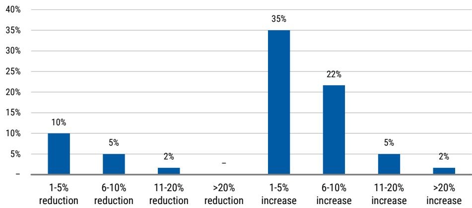  
Source: AlphaWise, MS; n=60 (US and EU data)

How is Gen AI affecting your company's traditional IT outsourcing spending (consider the impact specifically attributable to Gen AI, separate from broader digital transformation initiatives)?

Exhibit 22: 59% of respondents expect to increase traditional IT outsourcing spending as a result of Gen AI, while 19% plan to reduce

Impact of Gen AI on Traditional IT Outsourcing Spend  
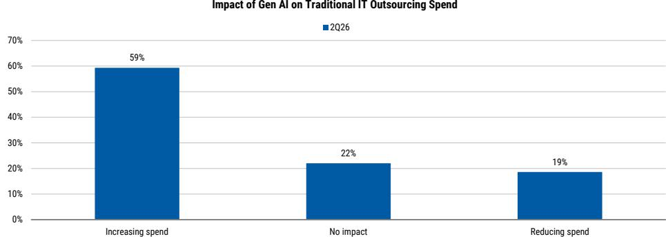  
Source: AlphaWise, MS, n=59 (US and EU data)

## Continued Discounting Across IT Services Vendors

Compared to last year, how would you describe the following vendors' willingness to discount pricing over the past 12 months?

Exhibit 23: Incrementally more discounting seen across the space
Vendor willingness to discount in last 12 months (%)  
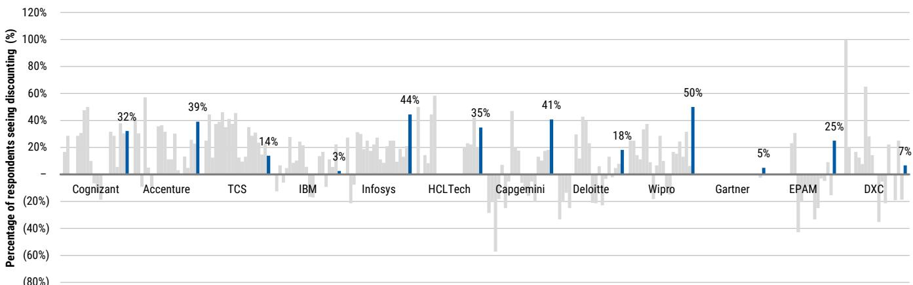  
Source: AlphaWise, MS; n=60 (US and EU data)

## 52% of Respondents Consolidating Vendor Relationships

Has your organization undergone vendor consolidation with respect to professional IT Services providers over the last year? If so, which professional IT Services vendor was the largest share gainer and which was the largest share donor?

Exhibit 24: Of respondents undertaking vendor consolidation, ACN and Deloitte screened as the largest share gainers...

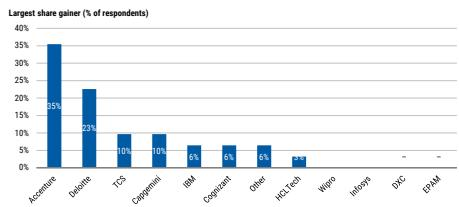  
Exhibit 25 ...while Other, IBM, and ACN screened as the largest share donors

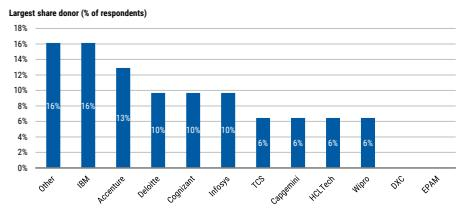  
Source: AlphaWise, MS; n=60 (US and EU data)  
Source: AlphaWise, MS; n=60 (US and EU data)

## Exhibit 26

All told, ACN screened as the greatest beneficiary of vendor consolidation

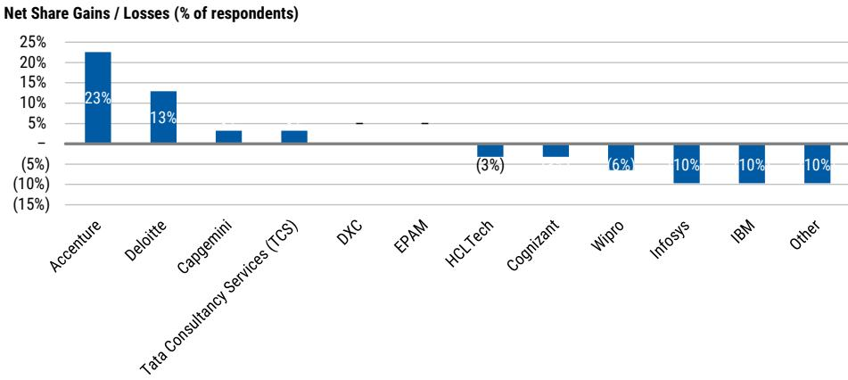  
Source: AlphaWise, MS; n=60 (US and EU data)

# Public Cloud Migration Continues, with Co-Location / Managed Hosting Newly Broken Out as a Stable Workload Location

What percentage of your application workloads resides in each of the following four areas today? What percentage do you expect to reside in each of these four areas by the end of 2026 and 2028?

Exhibit 27 CIOs Estimate 48% of Application Workloads to Reside in the Public Cloud at the Time of the 2Q26 Survey

Location of Application Workloads (% of Total Workloads)

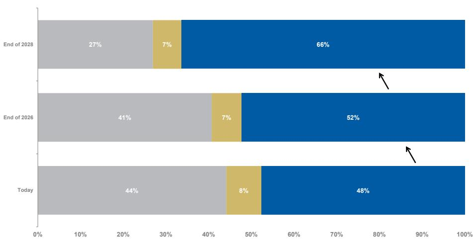  
■ On premise (Non Cloud & Private Cloud) ■ Co-Location/Managed Hosting ■ Public Cloud Total  
Source: AlphaWise, MS. n=100 (US and EU data)

## Artificial Intelligence/Machine Learning

If evaluating or using recent innovations in Artificial Intelligence around Large Language Models (e.g., GPT-5) or Generative Design (e.g., Dall-e), which of the following best describes how these initiatives are funded?

Exhibit 28 33% of CIOs Indicate Funding AI Ventures Through Net New IT Budget Dollars, a Downtick vs 39% in 2Q25; 21% Cite Usage of Net New Budget Outside of IT, Followed by Reallocation from Existing Software Budget

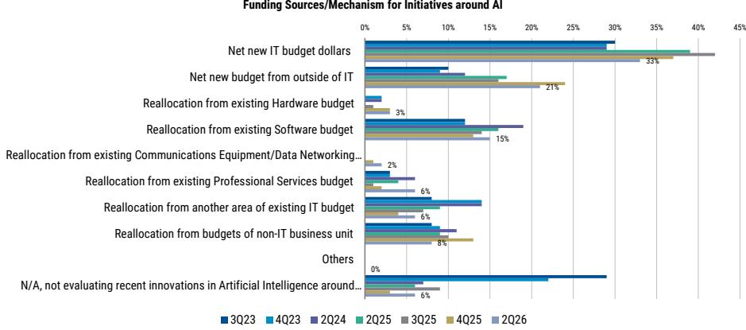  
Source: AlphaWise, MS, n=100 (US and EU data)

What change in the respective cost base have you seen from Generative AI/LLM usage over the last 12 months within the two business units where Generative AI/LLMs are deployed most materially across your organization?

Exhibit 29 From a Business Unit Perspective, CIOs Note GenAI Is Most Widely Deployed Across IT Operations, Software Development, & Customer Service

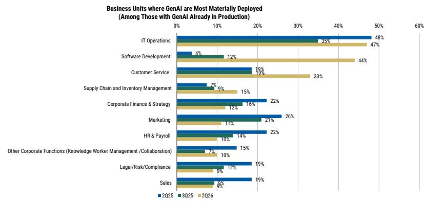  
Source: AlphaWise, MS. n=9 to 47, depending on the category (US and EU data)

# MS CIO Macro Survey Demographics

This report contains the results of our CIO Macro Survey. The survey was conducted by our legacy vendor through telephone and online interviews with 100 decision makers, representing 100 enterprise Information Technology organizations, from May 8th to June 8th, 2026. 76 respondents are from the US and 24 from Europe. Survey respondents hold responsibility for purchasing, integrating and maintaining technology. Their responses represent enterprise customer adoption and purchasing behaviors for Q2 2026.

I. IT Services Domain: We conducted online interviews with 60 respondents (45 US / 15 EU) through a new vendor we started engaging since the first half of 2024, representing enterprise Information Technology organizations. Survey respondents hold responsibility for purchasing, integrating and maintaining IT Services based strategies. Interviews were conducted from May 6th to May 27th, 2026.

II. Software Domain: We conducted online interviews with 60 respondents (45 US / 15 EU) through a new vendor we started engaging since the first half of 2024, representing enterprise Information Technology organizations. Survey respondents hold responsibility for purchasing, integrating and maintaining software strategies. Interviews were conducted from May 7th to May 24th, 2026.

III. Networking VARs: We conducted telephone and online interviews with 30 Networking Resellers (all from the US) through a new vendor we started engaging since the first half of 2024, representing individuals who have decision-making responsibility including customer interactions, operations, sales, and partner relationships, along with visibility to company-wide enterprise networking technology strategies. Interviews were collected during May 13th to June 2nd, 2026.

Exhibit 30 By Revenue

<table><tr><td colspan="3">Revenue</td></tr><tr><td colspan="3">Total Respondents = 100</td></tr><tr><td>$500 Million - $1 Billion</td><td>16</td><td>16%</td></tr><tr><td>$1-5 Billion</td><td>48</td><td>48%</td></tr><tr><td>$5-10 Billion</td><td>13</td><td>13%</td></tr><tr><td>$10-15 Billion</td><td>3</td><td>3%</td></tr><tr><td>$15-20 Billion</td><td>7</td><td>7%</td></tr><tr><td>&gt;$20 Billion</td><td>13</td><td>13%</td></tr></table>

Source: AlphaWise, MS

Exhibit 31 By Industry Vertical

<table><tr><td colspan="3">Vertical</td></tr><tr><td colspan="3">Total Respondents = 100</td></tr><tr><td>Aerospace / Defense</td><td>0</td><td>0%</td></tr><tr><td>Business services</td><td>3</td><td>3%</td></tr><tr><td>Communications</td><td>7</td><td>7%</td></tr><tr><td>Consumer Goods</td><td>3</td><td>3%</td></tr><tr><td>Education</td><td>4</td><td>4%</td></tr><tr><td>Energy</td><td>5</td><td>5%</td></tr><tr><td>Financial</td><td>12</td><td>12%</td></tr><tr><td>Healthcare</td><td>8</td><td>8%</td></tr><tr><td>Legal</td><td>2</td><td>2%</td></tr><tr><td>Manufacturing</td><td>14</td><td>14%</td></tr><tr><td>Pharmaceuticals</td><td>5</td><td>5%</td></tr><tr><td>Retail</td><td>8</td><td>8%</td></tr><tr><td>Services</td><td>6</td><td>6%</td></tr><tr><td>Technology</td><td>17</td><td>17%</td></tr><tr><td>Transportation</td><td>3</td><td>3%</td></tr><tr><td>Wholesale / Distribution</td><td>3</td><td>3%</td></tr></table>

Source: AlphaWise, MS

## Disclosure Section

The information and opinions in MS were prepared or are disseminated by MS Asia Limited (which accepts the responsibility for its contents) and/or MS Asia (Singapore) Pte. (Registration number 199206298Z) and/or MS Asia (Singapore) Securities Pte Ltd (Registration number 200008434H), regulated by the Monetary Authority of Singapore (which accepts legal responsibility for its contents and should be contacted with respect to any matters arising from, or in connection with, MS), and/or MS Taiwan Limited and/or MS & Co International plc, Seoul Branch, and/or MS Australia Limited (A.B.N. 67 003 734 576, holder of Australian financial services license No. 233742, which accepts responsibility for its contents), and/or MS Wealth Management Australia Pty Ltd (A.B.N. 19 009 145 555, holder of Australian financial services license No. 240813, which accepts responsibility for its contents), and/or MS India Company Private Limited having Corporate Identification No (CIN) U22990MH1998PTC115305, regulated by the Securities and Exchange Board of India ("SEBI") and holder of licenses as a Research Analyst (SEBI Registration No. INH000001105); Stock Broker (SEBI Stock Broker Registration No. INZ000244438), Merchant Banker (SEBI Registration No. INM000011203), and depository participant with National Securities Depository Limited (SEBI Registration No. IN-DP-NSDL-567-2021) having registered office at Altimus, Level 39 & 40, Pandurang Budhkar Marg, Worli, Mumbai 400018, India; Telephone no. +91-22-61181000; Compliance Officer Details: Mr. Tejarshi Hardas, Tel. No.: +91-22-61181000 or Email: tejarshi.hardas@morganstanley.com; Grievance officer details: Mr. Tejarshi Hardas, Tel. No.: +91-22-61181000 or Email: msic-compliance@morganstanley.com which accepts the responsibility for its contents and should be contacted with respect to any matters arising from, or in connection with, MS, and their affiliates (collectively, "MS"). MS India Company Private Limited (MSICPL) may use AI tools in providing research services. All recommendations contained herein are made by the duly qualified research analysts.

For important disclosures, stock price charts and equity rating histories regarding companies that are the subject of this report, please see the MS Disclosure Website at www.morganstanley.com/eqr/disclosures/webapp/generalresearch, or contact your investment representative or MS at 1585 Broadway, (Attention: Research Management), New York, NY, 10036 USA.

For valuation methodology and risks associated with any recommendation, rating or price target referenced in this research report, please contact the Client Support Team as follows: US/Canada +1 800 303-2495; Hong Kong +852 2848-5999; Latin America +1 718 754-5444 (U.S.); London +44 (0)20-7425-8169; Singapore +65 6834-6860; Sydney +61 (0)2-9770-1505; Tokyo +81 (0)3-6836-9000. Alternatively you may contact your investment representative or MS at 1585 Broadway, (Attention: Research Management), New York, NY 10036 USA.

## Analyst Certification

The following analysts hereby certify that their views about the companies and their securities discussed in this report are accurately expressed and that they have not received and will not receive direct or indirect compensation in exchange for expressing specific recommendations or views in this report: Sulabh Govila, CFA; Gaurav Rateria.

## Global Research Conflict Management Policy

MS has been published in accordance with our conflict management policy, which is available at www.morganstanley.com/institutional/research/conflictpolicies. A Portuguese version of the policy can be found at www.morganstanley.com.br

## Important Regulatory Disclosures on Subject Companies

The analyst or strategist (or a household member) identified below owns the following securities (or related derivatives): Sakshi Rana - Tata Consultancy Services(common or preferred stock), Tech Mahindra Limited(common or preferred stock); Gaurav Rateria - LTM Limited(common or preferred stock), Wipro Ltd.(common or preferred stock).

As of June 30, 2026, MS beneficially owned 1% or more of a class of common equity securities of the following companies covered in MS: Infosys Limited, MakeMyTrip Limited.

Within the last 12 months, MS managed or co-managed a public offering (or 144A offering) of securities of Eternal Ltd., Fractal Analytics Limited, Meesho Limited, Pine Labs Ltd, Shadowfax Technologies Limited, Urban Co Limited.

Within the last 12 months, MS has received compensation for investment banking services from Fractal Analytics Limited, Meesho Limited, Pine Labs Ltd, Shadowfax Technologies Limited, Urban Co Limited.

In the next 3 months, MS expects to receive or intends to seek compensation for investment banking services from Blackbuck Ltd, Coforge Ltd, Cyient Ltd, Delhivery Ltd, Eternal Ltd., Fractal Analytics Limited, Infosys Limited, MakeMyTrip Limited, Meesho Limited, MphasiS Limited, Pine Labs Ltd, Shadowfax Technologies Limited, Tata Consultancy Services, Urban Co Limited, Wipro Ltd..

Within the last 12 months, MS has received compensation for products and services other than investment banking services from MakeMyTrip Limited, Wipro Ltd..

Within the last 12 months, MS has provided or is providing investment banking services to, or has an investment banking client relationship with, the following company: Blackbuck Ltd, Coforge Ltd, Cyient Ltd, Delhivery Ltd, Eternal Ltd., Fractal Analytics Limited, Infosys Limited, MakeMyTrip Limited, Meesho Limited, MphasiS Limited, Pine Labs Ltd, Shadowfax Technologies Limited, Tata Consultancy Services, Urban Co Limited, Wipro Ltd..

Within the last 12 months, MS has either provided or is providing non-investment banking, securities-related services to and/or in the past has entered into an agreement to provide services or has a client relationship with the following company: Infosys Limited, MakeMyTrip Limited, Tech Mahindra Limited, Wipro Ltd..

An employee, director or consultant of MS is a director of L&T Technology Services Ltd. This person is not a research analyst or a member of a research analyst's household.

The equity research analysts or strategists principally responsible for the preparation of MS have received compensation based upon various factors, including quality of research, investor client feedback, stock picking, competitive factors, firm revenues and overall investment banking revenues. Equity Research analysts' or strategists' compensation is not linked to investment banking or capital markets transactions performed by MS or the profitability or revenues of particular trading desks.

MS and its affiliates do business that relates to companies/instruments covered in MS, including market making, providing liquidity, fund management, commercial banking, extension of credit, investment services and investment banking. MS sells to and buys from customers the securities/instruments of companies covered in MS on a principal basis. MS may have a position in the debt of the Company or instruments discussed in this report. MS trades or may trade as principal in the debt securities (or in related derivatives) that are the subject of the debt research report.
Certain disclosures listed above are also for compliance with applicable regulations in non-US jurisdictions.

## STOCK RATINGS

MS uses a relative rating system using terms such as Overweight, Equal-weight, Not-Rated or Underweight (see definitions below). MS does not assign ratings of Buy, Hold or Sell to the stocks we cover. Overweight, Equal-weight, Not-Rated and Underweight are not the equivalent of buy, hold and sell. Investors should carefully read the definitions of all ratings used in MS. In addition, since MS contains more complete information concerning the analyst's views, investors should carefully read MS, in its entirety, and not infer the contents from the rating alone. In any case, ratings (or research) should not be used or relied upon as investment advice. An investor's decision to buy or sell a stock should depend on individual circumstances (such as the investor's existing holdings) and other considerations.

## Global Stock Ratings Distribution

(as of June 30, 2026)

The Stock Ratings described below apply to MS's Fundamental Equity Research and do not apply to Debt Research produced by the Firm.

For disclosure purposes only (in accordance with FINRA requirements), we include the category headings of Buy, Hold, and Sell alongside our ratings of Overweight, Equal-weight, Not-Rated and Underweight. MS does not assign ratings of Buy, Hold or Sell to the stocks we cover. Overweight, Equal-weight, Not-Rated and Underweight are not the equivalent of buy, hold, and sell but represent recommended relative weightings (see definitions below). To satisfy regulatory requirements, we correspond Overweight, our most positive stock rating, with a buy recommendation; we correspond Equal-weight and Not-Rated to hold and Underweight to sell recommendations, respectively.

<table><tr><td></td><td colspan="2">Coverage Universe</td><td colspan="3">Investment Banking Clients (IBC)</td><td colspan="2
