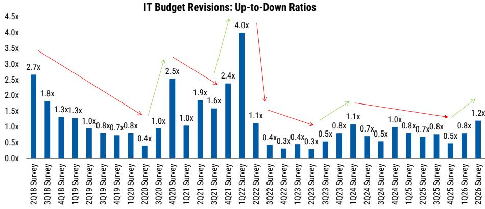
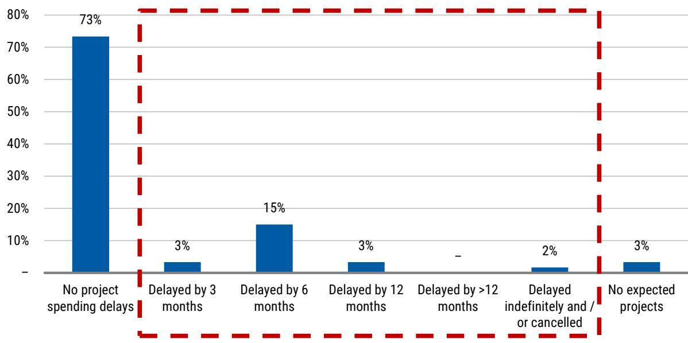

# IT Services Budget Growth Is Slowing, but the Real Story Is How AI Is Being Funded and Who Wins From Consolidation

The latest CIO survey from a major global research institution delivers a deceptively simple headline: 2026 IT services budget expectations have slipped to 1.8% year-over-year growth, down 20 basis points from the prior quarter. That modest deceleration, however, masks a far more consequential shift in how enterprises are allocating technology dollars. The survey of 100 CIOs across the US and EU reveals that the era of AI as a purely additive budget line item is ending. AI spending remains net positive for overall IT budgets, but the funding mechanism has shifted decisively toward reallocation from existing software, hardware, and professional services budgets. For India IT vendors and their global competitors, this change transforms the growth equation from a question of "how big is the pie" to "which pieces get redistributed."

Three structural dynamics demand attention. First, the composition of IT budget growth is diverging sharply between segments: software continues to lead at 4.1% growth, while IT services trails at just 1.8%. Second, the geography of services spending is splitting, with US CIOs cutting expectations more aggressively than their EU counterparts. Third, vendor consolidation is accelerating, creating concentrated winners and losers. The survey data points to an environment where top-line growth for India IT service providers will be in line with or below fiscal 2026 levels in fiscal 2027, but where share gain opportunities from consolidation and AI deployment could offset broader headwinds for well-positioned players.

## The Funding of AI Has Shifted from Net-New Budgets to Active Reallocation, Pressuring Traditional IT Services Revenue

The most important single data point in the survey is not the headline budget growth number. It is the funding source for AI initiatives. In the fourth quarter of 2025, 37% of CIOs reported funding AI and large language model initiatives through net-new IT budget dollars. By the second quarter of 2026, that figure had fallen to 33%. Over the same period, the share of CIOs funding AI through IT budget reallocations jumped from 23% to 32%. This is not a marginal shift; it is a structural change in how enterprises view AI investments.

The reallocation is not random. Of the 32% of CIOs reallocating budgets, 15% are pulling from existing software budgets, 6% from professional services, 6% from other areas of IT, 3% from hardware, and 2% from communications and data networking. The implication is direct: AI is increasingly funded by cannibalizing the very categories that have historically driven IT services revenue growth. Software budget reallocation pressures license and maintenance spending, which in turn reduces the consulting and integration work tied to those platforms. Professional services reallocation hits the heart of IT services revenue streams.

This funding shift explains why IT services budget expectations are decelerating even as overall IT budget expectations have improved modestly from 3.7% to 3.8% growth. The overall pie is growing slightly, but the slices allocated to services are shrinking relative to AI and software. For India IT vendors, this means that growth in fiscal 2027 will depend less on winning a share of expanding client budgets and more on positioning services as integral to AI deployment rather than as a competing spend category.

## US and EU CIOs Are Moving in Opposite Directions on IT Services, Creating a Divergent Demand Landscape

The survey reveals a notable geographic divergence in IT services spending intentions. US CIOs now expect IT services growth of just 1.9% in 2026, a deceleration of 40 basis points from the 2.3% they projected in the first quarter. EU CIOs, by contrast, expect acceleration of 40 basis points to 1.3% growth, up from 0.9% in the prior survey. The US slowdown is more severe in absolute terms and in the rate of change, but the EU numbers remain structurally lower.

This divergence matters for two reasons. First, it suggests that the macroeconomic and policy environment is affecting enterprise spending decisions differently on either side of the Atlantic. US CIOs may be responding to interest rate uncertainty, regulatory shifts around AI, or sector-specific pressures in technology and retail, both of which showed negative revisions in their services spending intentions. EU CIOs, while still cautious, appear to be working through a delayed recovery cycle rather than a new downturn.

Second, the divergence creates a strategic challenge for global IT services firms. Companies with heavy US exposure face a more immediate headwind, while those with diversified European portfolios may see relative stability. The survey also shows that within Europe, the acceleration is from a lower base, meaning absolute growth remains modest. For India IT vendors, which derive a significant share of revenue from US clients, the US deceleration is the more relevant signal. The survey's conclusion that fiscal 2027 revenue growth for India IT will be in line with or lower than fiscal 2026 is consistent with this US-led softening.

## Vendor Consolidation Is Creating Clear Winners, and TCS Emerges as a Marginal Beneficiary in the Survey

While top-line growth is slowing, the survey offers a countervailing dynamic: vendor consolidation is accelerating, and it is creating concentrated share gain opportunities. Fifty-two percent of CIOs reported consolidating their vendor relationships, only slightly below the 54% figure from the fourth quarter of 2025. Among respondents undertaking consolidation, TCS screened as a marginal beneficiary relative to peers in the survey coverage universe.

The consolidation trend is not new, but its persistence at elevated levels is significant. In a low-growth environment, vendor consolidation becomes a primary lever for enterprise CIOs to reduce complexity, standardize platforms, and extract better pricing. The survey confirms that discounting remains broadly stable, with 35% of CIOs perceiving vendors as more aggressive in discounting, up modestly from 31% in the third quarter of 2025. This suggests that pricing pressure is real but not escalating, and that scale and relationship depth are becoming the decisive competitive advantages.

For India IT vendors, the consolidation dynamic creates a bifurcated outlook. Tier-one players with broad service portfolios, strong client relationships, and the ability to absorb margin pressure are positioned to gain share. Smaller or more specialized vendors face the risk of being consolidated out of accounts. The survey's finding that TCS is a marginal beneficiary is consistent with this pattern, but the broader implication is that the Indian IT sector's growth will become increasingly concentrated among the largest players.

## A Decision Framework for IT Services Strategy in a Reallocation-Driven Market

The survey data can be translated into a practical decision framework for IT services firms navigating the current environment. The framework rests on three axes: funding source, deployment priority, and consolidation position.

First, on funding source: the shift from net-new to reallocated AI funding means that IT services firms must demonstrate how their offerings reduce or replace existing software and services spend, not just how they add value. Value propositions that position services as a substitute for legacy software maintenance, or as a way to optimize existing cloud and infrastructure investments, will resonate more than pitches for net-new transformation programs. The survey shows that 15% of reallocated AI funding comes from software budgets; services firms should target that specific pool by offering AI-driven automation of software management and integration.

Second, on deployment priority: the survey identifies IT operations, software development, customer service, and supply chain management as the four areas where generative AI is most widely deployed. IT services firms should align their go-to-market strategy around these four domains, building packaged AI solutions for each that can be deployed within existing client relationships. The fact that 47% of CIOs report AI deployment in IT operations and 44% in software development indicates that these are mature enough for scaled offerings, not experimental pilots.

Third, on consolidation position: with 52% of CIOs consolidating vendors, the strategic imperative is to be on the winning side of consolidation. This means investing in the breadth of service capabilities that make a vendor a natural consolidator rather than a target for consolidation. It also means being willing to compete on price selectively in accounts where long-term share gain is achievable. The survey's stable discounting data suggests that price competition is a feature of the market, not a temporary disruption, and that winners will be those who can combine competitive pricing with superior delivery.

## Public Cloud Migration Remains a Structural Tailwind, but Its Impact on IT Services Is Becoming More Nuanced

One area where the survey provides unambiguous positive data is public cloud migration. CIOs report that 48% of application workloads currently run in the public cloud, up from 47% in the fourth quarter of 2025 and 44% in the second quarter of 2025. They expect this figure to reach 52% by the end of 2026 and 66% by the end of 2028. The migration trajectory remains intact and is tracking ahead of historical trends.

The nuance lies in how cloud migration translates into IT services revenue. In earlier cycles, cloud migration drove significant consulting, systems integration, and managed services revenue. As the migration matures, the services mix is shifting. The survey shows that 63% of CIOs expect digital transformation to drive increased IT outsourcing spending by at least 1%, and 59% expect generative AI to increase traditional IT outsourcing spending. However, these increases are being funded through the reallocation mechanisms discussed earlier, not through net-new budget dollars.

The implication is that cloud migration remains a positive driver for IT services, but the growth it generates will be incremental and contested rather than expansive and automatic. Services firms that can link cloud migration to AI deployment and cost optimization will capture more of the available spend. Those that treat cloud migration as a standalone opportunity will find themselves competing for a smaller pool of reallocated dollars.

## The Macro Risk Has Receded, but the Structural Challenge Has Intensified

The survey contains one genuinely encouraging data point: the share of CIOs delaying IT services projects due to macroeconomic or geopolitical concerns has fallen to 23%, down from 42% in the fourth quarter of 2025. Seventy-three percent of respondents report no project delays, up from 57% in the prior survey. This suggests that the macro environment is no longer the primary constraint on IT services spending.

That does not mean the outlook is benign. The structural challenge of AI funding reallocation, the geographic divergence between US and EU spending, and the intensifying vendor consolidation dynamic all point to a market where growth is harder to come by and where competitive differentiation matters more than it has in years. The survey's data supports the view that fiscal 2027 will be a year of revenue growth in line with or below fiscal 2026 for India IT vendors, with the caveat that first-quarter fiscal 2027 results have shown no further deterioration. The hope for a rebound is tempered by the reality that the macro environment remains fluid and that the underlying funding dynamics are shifting against traditional IT services business models.

*For informational purposes only. Portions may be generated, translated, summarized, or edited with AI assistance based on source materials and may contain omissions or errors. Please verify independently. This is not professional advice.*

For informational purposes only. Portions may be generated, translated, summarized, or edited with AI assistance based on source materials and may contain omissions or errors. Please verify independently. This is not professional advice.

